# Stage 5 Image Event Candidate Review

> Generated file. Candidate mappings are not approved data and must not be imported or displayed directly.

## Summary

- Stage1 lesson records: 47
- Lessons with image records: 43
- Total image JSON records: 348
- Valid local image files: 342
- Invalid records: 6
- Missing files: 0
- Single-candidate images: 37
- Ambiguous images: 187
- Unresolved images: 118
- Invalid images: 6
- Duplicate physical image groups: 1
- Total valid image size: 47.0989 MiB

## Candidate Review

### Grade 10

#### Lesson 12122: Bài 1: Hiện Thực Lịch Sử Và Nhận Thức Lịch Sử

##### grade_10:12122:img_01

- Status: `ambiguous`
- Source src: `images/grade_10/12122/img_01.png`
- Source image: `crawData/stage1_crawl/images/grade_10/12122/img_01.png`
- Image order: 1
- File size: 356.8 KiB
- Content hash: `1454195c1f6b82f8`
- Caption: * ** Hình 1. ** Cầu Long Biên (Hà Nội) *
- Alt: _empty_
- Validation issues: `empty_alt`

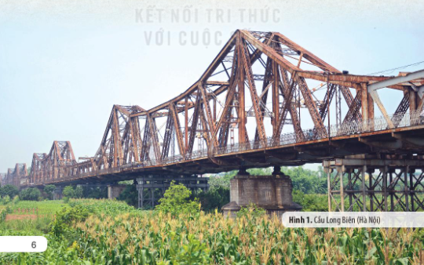

Candidate events:
- `ho-chi-minh-cong-bo-tuyen-ngon-doc-lap` - Chủ tịch Hồ Chí Minh công bố Tuyên ngôn Độc lập (Ngày 2 – 9 – 1945); reason: `lesson_id_match`
- `xay-dung-cau-long-bien` - Xây dựng cầu Long Biên (1898 – 1902); reason: `lesson_id_match`

##### grade_10:12122:img_02

- Status: `ambiguous`
- Source src: `images/grade_10/12122/img_02.png`
- Source image: `crawData/stage1_crawl/images/grade_10/12122/img_02.png`
- Image order: 2
- File size: 349.4 KiB
- Content hash: `3633ffbbb5ecb1a6`
- Caption: _missing_
- Alt: _empty_
- Validation issues: `empty_alt`, `missing_caption`

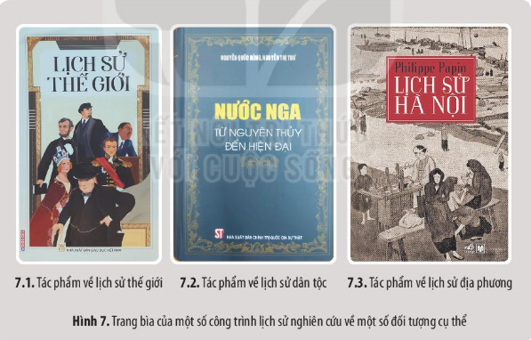

Candidate events:
- `ho-chi-minh-cong-bo-tuyen-ngon-doc-lap` - Chủ tịch Hồ Chí Minh công bố Tuyên ngôn Độc lập (Ngày 2 – 9 – 1945); reason: `lesson_id_match`
- `xay-dung-cau-long-bien` - Xây dựng cầu Long Biên (1898 – 1902); reason: `lesson_id_match`

##### grade_10:12122:img_03

- Status: `ambiguous`
- Source src: `images/grade_10/12122/img_03.png`
- Source image: `crawData/stage1_crawl/images/grade_10/12122/img_03.png`
- Image order: 3
- File size: 42.9 KiB
- Content hash: `8dd79533d742152d`
- Caption: * ** Hình 10. ** Lá để trang trí hình rồng gắn trên ngôi úp nóc ở Hoàng thành Thăng Long (Hà Nội) *
- Alt: _empty_
- Validation issues: `empty_alt`

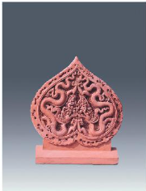

Candidate events:
- `ho-chi-minh-cong-bo-tuyen-ngon-doc-lap` - Chủ tịch Hồ Chí Minh công bố Tuyên ngôn Độc lập (Ngày 2 – 9 – 1945); reason: `lesson_id_match`
- `xay-dung-cau-long-bien` - Xây dựng cầu Long Biên (1898 – 1902); reason: `lesson_id_match`

##### grade_10:12122:img_04

- Status: `ambiguous`
- Source src: `images/grade_10/12122/img_04.png`
- Source image: `crawData/stage1_crawl/images/grade_10/12122/img_04.png`
- Image order: 4
- File size: 78.0 KiB
- Content hash: `0478ba0841e9701c`
- Caption: * ** Hình 11. ** Trang đầu bản Tuyên ngôn Độc lập do Chủ tịch Hồ Chí Minh soạn thảo và công bố ngày 2 – 9 – 1945 *
- Alt: _empty_
- Validation issues: `empty_alt`

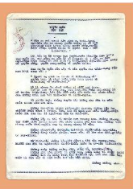

Candidate events:
- `ho-chi-minh-cong-bo-tuyen-ngon-doc-lap` - Chủ tịch Hồ Chí Minh công bố Tuyên ngôn Độc lập (Ngày 2 – 9 – 1945); reason: `lesson_id_match`
- `xay-dung-cau-long-bien` - Xây dựng cầu Long Biên (1898 – 1902); reason: `lesson_id_match`

##### grade_10:12122:img_05

- Status: `ambiguous`
- Source src: `images/grade_10/12122/img_05.png`
- Source image: `crawData/stage1_crawl/images/grade_10/12122/img_05.png`
- Image order: 5
- File size: 130.5 KiB
- Content hash: `5a5a3eb1ba103239`
- Caption: * ** Hình 12. ** Hình ảnh một tờ tiền của Việt Nam *
- Alt: _empty_
- Validation issues: `empty_alt`

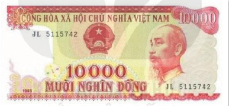

Candidate events:
- `ho-chi-minh-cong-bo-tuyen-ngon-doc-lap` - Chủ tịch Hồ Chí Minh công bố Tuyên ngôn Độc lập (Ngày 2 – 9 – 1945); reason: `lesson_id_match`
- `xay-dung-cau-long-bien` - Xây dựng cầu Long Biên (1898 – 1902); reason: `lesson_id_match`

##### grade_10:12122:img_06

- Status: `ambiguous`
- Source src: `images/grade_10/12122/img_06.png`
- Source image: `crawData/stage1_crawl/images/grade_10/12122/img_06.png`
- Image order: 6
- File size: 207.4 KiB
- Content hash: `76dc1b3ee9e63cb6`
- Caption: _missing_
- Alt: _empty_
- Validation issues: `empty_alt`, `missing_caption`

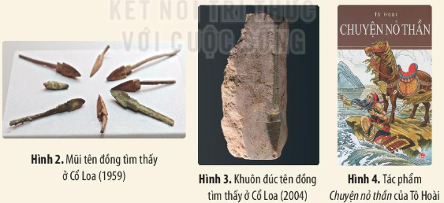

Candidate events:
- `ho-chi-minh-cong-bo-tuyen-ngon-doc-lap` - Chủ tịch Hồ Chí Minh công bố Tuyên ngôn Độc lập (Ngày 2 – 9 – 1945); reason: `lesson_id_match`
- `xay-dung-cau-long-bien` - Xây dựng cầu Long Biên (1898 – 1902); reason: `lesson_id_match`

##### grade_10:12122:img_07

- Status: `ambiguous`
- Source src: `images/grade_10/12122/img_07.png`
- Source image: `crawData/stage1_crawl/images/grade_10/12122/img_07.png`
- Image order: 7
- File size: 106.7 KiB
- Content hash: `8835ab1fb745b517`
- Caption: _missing_
- Alt: _empty_
- Validation issues: `empty_alt`, `missing_caption`

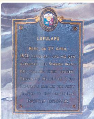

Candidate events:
- `ho-chi-minh-cong-bo-tuyen-ngon-doc-lap` - Chủ tịch Hồ Chí Minh công bố Tuyên ngôn Độc lập (Ngày 2 – 9 – 1945); reason: `lesson_id_match`
- `xay-dung-cau-long-bien` - Xây dựng cầu Long Biên (1898 – 1902); reason: `lesson_id_match`

##### grade_10:12122:img_08

- Status: `ambiguous`
- Source src: `images/grade_10/12122/img_08.png`
- Source image: `crawData/stage1_crawl/images/grade_10/12122/img_08.png`
- Image order: 8
- File size: 99.2 KiB
- Content hash: `5ddf8e935a48443a`
- Caption: _missing_
- Alt: _empty_
- Validation issues: `empty_alt`, `missing_caption`

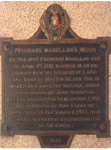

Candidate events:
- `ho-chi-minh-cong-bo-tuyen-ngon-doc-lap` - Chủ tịch Hồ Chí Minh công bố Tuyên ngôn Độc lập (Ngày 2 – 9 – 1945); reason: `lesson_id_match`
- `xay-dung-cau-long-bien` - Xây dựng cầu Long Biên (1898 – 1902); reason: `lesson_id_match`

#### Lesson 12126: Bài 2: Tri Thức Lịch Sử Và Cuộc Sống

##### grade_10:12126:img_01

- Status: `unresolved`
- Source src: `images/grade_10/12126/img_01.png`
- Source image: `crawData/stage1_crawl/images/grade_10/12126/img_01.png`
- Image order: 1
- File size: 28.0 KiB
- Content hash: `72cb7a9c5d7dea0f`
- Caption: _missing_
- Alt: _empty_
- Validation issues: `empty_alt`, `lesson_id_not_referenced_by_core_events`, `missing_caption`

Candidate events:
- none

##### grade_10:12126:img_02

- Status: `unresolved`
- Source src: `images/grade_10/12126/img_02.png`
- Source image: `crawData/stage1_crawl/images/grade_10/12126/img_02.png`
- Image order: 2
- File size: 158.2 KiB
- Content hash: `dadbfd8985ed8e8c`
- Caption: ** Hình 1. ** Một bức vẽ trên vách hang Ma-gu-ra (Bun-ga-ri) mô tả hoạt động săn bắn của người nguyên thuỷ, niên đại khoảng 8.000 đến 4.000 năm cách ngày nay
- Alt: _empty_
- Validation issues: `empty_alt`, `lesson_id_not_referenced_by_core_events`

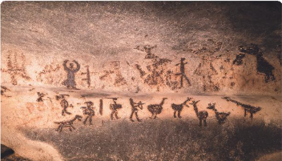

Candidate events:
- none

##### grade_10:12126:img_03

- Status: `unresolved`
- Source src: `images/grade_10/12126/img_03.png`
- Source image: `crawData/stage1_crawl/images/grade_10/12126/img_03.png`
- Image order: 3
- File size: 65.6 KiB
- Content hash: `24b37ccbb6fbda3a`
- Caption: ** Hình 2. ** Bìa sách * Đại Việt sử ký toàn thư * (bản dịch, xuất bản năm 1998)
- Alt: _empty_
- Validation issues: `empty_alt`, `lesson_id_not_referenced_by_core_events`

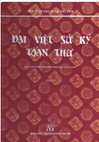

Candidate events:
- none

##### grade_10:12126:img_04

- Status: `unresolved`
- Source src: `images/grade_10/12126/img_04.png`
- Source image: `crawData/stage1_crawl/images/grade_10/12126/img_04.png`
- Image order: 4
- File size: 100.8 KiB
- Content hash: `c247b55e48f94a52`
- Caption: ** Hình 3. ** Trang bìa của một bộ sách về lịch sử Việt Nam
- Alt: _empty_
- Validation issues: `empty_alt`, `lesson_id_not_referenced_by_core_events`

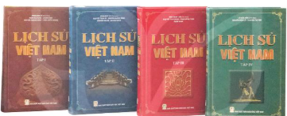

Candidate events:
- none

##### grade_10:12126:img_05

- Status: `unresolved`
- Source src: `images/grade_10/12126/img_05.png`
- Source image: `crawData/stage1_crawl/images/grade_10/12126/img_05.png`
- Image order: 5
- File size: 96.9 KiB
- Content hash: `8ade5abc7a6ff03a`
- Caption: ** Hình 4. ** Lễ hội truyền thống tại Ta-lin (Ét-tô-ni-a)
- Alt: _empty_
- Validation issues: `empty_alt`, `lesson_id_not_referenced_by_core_events`

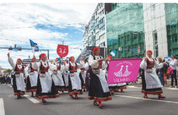

Candidate events:
- none

#### Lesson 12128: Bài 3: Sử Học Với Các Lĩnh Vực Khoa Học

##### grade_10:12128:img_01

- Status: `ambiguous`
- Source src: `images/grade_10/12128/img_01.png`
- Source image: `crawData/stage1_crawl/images/grade_10/12128/img_01.png`
- Image order: 1
- File size: 536.4 KiB
- Content hash: `91a9be7b5d22d74a`
- Caption: ** Hình 1. ** Một góc quần thể danh thắng Tràng An (Ninh Bình)
- Alt: _empty_
- Validation issues: `empty_alt`

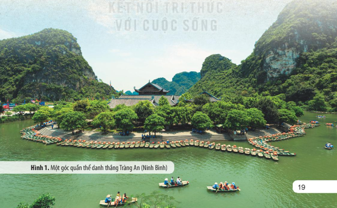

Candidate events:
- `khang-chien-chong-quan-thanh-1789` - Kháng chiến chống quân Thanh (Năm 1789); reason: `lesson_id_match`
- `khoi-nghia-lam-son` - Khởi nghĩa Lam Sơn (1418-1427); reason: `lesson_id_match`
- `trang-an-duoc-ghi-danh-di-san-the-gioi` - Quần thể danh thắng Tràng An được ghi danh là Di sản văn hoá và thiên nhiên thế giới (Không rõ năm cụ thể trong bài); reason: `lesson_id_match`

##### grade_10:12128:img_02

- Status: `ambiguous`
- Source src: `images/grade_10/12128/img_02.png`
- Source image: `crawData/stage1_crawl/images/grade_10/12128/img_02.png`
- Image order: 2
- File size: 256.4 KiB
- Content hash: `f1d2eb671018dba4`
- Caption: ** Hình 3. ** Một trang trong sách Hoàng Việt văn tuyển khắc in lại tác phẩm * Bình Ngô đại cáo * của Nguyễn Trãi, tổng kết về cuộc khởi nghĩa chống quân Minh của Đại Việt (đầu thế kỉ XV)
- Alt: _empty_
- Validation issues: `empty_alt`

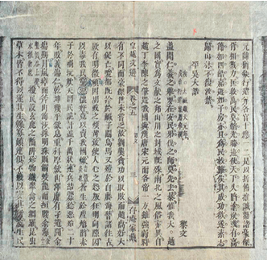

Candidate events:
- `khang-chien-chong-quan-thanh-1789` - Kháng chiến chống quân Thanh (Năm 1789); reason: `lesson_id_match`
- `khoi-nghia-lam-son` - Khởi nghĩa Lam Sơn (1418-1427); reason: `lesson_id_match`
- `trang-an-duoc-ghi-danh-di-san-the-gioi` - Quần thể danh thắng Tràng An được ghi danh là Di sản văn hoá và thiên nhiên thế giới (Không rõ năm cụ thể trong bài); reason: `lesson_id_match`

##### grade_10:12128:img_03

- Status: `ambiguous`
- Source src: `images/grade_10/12128/img_03.png`
- Source image: `crawData/stage1_crawl/images/grade_10/12128/img_03.png`
- Image order: 3
- File size: 277.0 KiB
- Content hash: `b1a549a332d6a313`
- Caption: ** Hình 4. ** Trang bìa một số tác phẩm của các ngành khoa học tự nhiên
- Alt: _empty_
- Validation issues: `empty_alt`

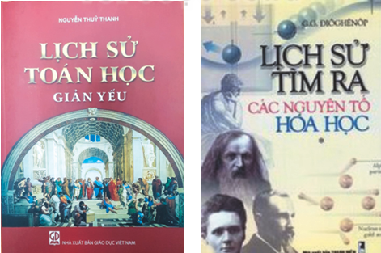

Candidate events:
- `khang-chien-chong-quan-thanh-1789` - Kháng chiến chống quân Thanh (Năm 1789); reason: `lesson_id_match`
- `khoi-nghia-lam-son` - Khởi nghĩa Lam Sơn (1418-1427); reason: `lesson_id_match`
- `trang-an-duoc-ghi-danh-di-san-the-gioi` - Quần thể danh thắng Tràng An được ghi danh là Di sản văn hoá và thiên nhiên thế giới (Không rõ năm cụ thể trong bài); reason: `lesson_id_match`

##### grade_10:12128:img_04

- Status: `ambiguous`
- Source src: `images/grade_10/12128/img_04.png`
- Source image: `crawData/stage1_crawl/images/grade_10/12128/img_04.png`
- Image order: 4
- File size: 305.8 KiB
- Content hash: `ffecd2aa0593cc77`
- Caption: ** Hình 5. ** Bảo tàng ảo 3D (chuyên đề Bảo vật quốc gia) tại Bảo tàng Lịch sử quốc gia
- Alt: _empty_
- Validation issues: `empty_alt`

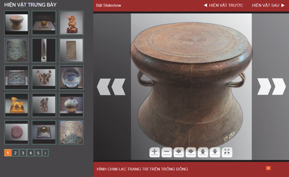

Candidate events:
- `khang-chien-chong-quan-thanh-1789` - Kháng chiến chống quân Thanh (Năm 1789); reason: `lesson_id_match`
- `khoi-nghia-lam-son` - Khởi nghĩa Lam Sơn (1418-1427); reason: `lesson_id_match`
- `trang-an-duoc-ghi-danh-di-san-the-gioi` - Quần thể danh thắng Tràng An được ghi danh là Di sản văn hoá và thiên nhiên thế giới (Không rõ năm cụ thể trong bài); reason: `lesson_id_match`

##### grade_10:12128:img_05

- Status: `ambiguous`
- Source src: `images/grade_10/12128/img_05.png`
- Source image: `crawData/stage1_crawl/images/grade_10/12128/img_05.png`
- Image order: 5
- File size: 132.9 KiB
- Content hash: `fd66056ca3092b0f`
- Caption: _missing_
- Alt: _empty_
- Validation issues: `empty_alt`, `missing_caption`

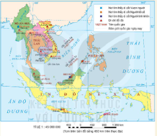

Candidate events:
- `khang-chien-chong-quan-thanh-1789` - Kháng chiến chống quân Thanh (Năm 1789); reason: `lesson_id_match`
- `khoi-nghia-lam-son` - Khởi nghĩa Lam Sơn (1418-1427); reason: `lesson_id_match`
- `trang-an-duoc-ghi-danh-di-san-the-gioi` - Quần thể danh thắng Tràng An được ghi danh là Di sản văn hoá và thiên nhiên thế giới (Không rõ năm cụ thể trong bài); reason: `lesson_id_match`

#### Lesson 12137: Bài 4: Sử Học Với Một Số Lĩnh Vực, Nghành Nghề Hiện Đại

##### grade_10:12137:img_01

- Status: `single_candidate`
- Source src: `images/grade_10/12137/img_01.png`
- Source image: `crawData/stage1_crawl/images/grade_10/12137/img_01.png`
- Image order: 1
- File size: 132.1 KiB
- Content hash: `c185616c22708dd1`
- Caption: ** Hình 1. ** Cung điện Véc-xây (Pháp) — Di sản văn hoá thế giới
- Alt: _empty_
- Validation issues: `empty_alt`

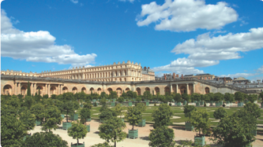

Candidate events:
- `phe-duyet-chien-luoc-phat-trien-cong-nghiep-van-hoa-viet-nam` - Phê duyệt Chiến lược phát triển các ngành công nghiệp văn hoá đến năm 2020, tầm nhìn đến năm 2030 (Ngày 8 – 9 – 2016); reason: `lesson_id_match`

##### grade_10:12137:img_02

- Status: `single_candidate`
- Source src: `images/grade_10/12137/img_02.png`
- Source image: `crawData/stage1_crawl/images/grade_10/12137/img_02.png`
- Image order: 2
- File size: 112.4 KiB
- Content hash: `2299b9b04368b13a`
- Caption: ** Hình 2. ** Quần thể di tích Cố đô Huế – Di sản văn hoá thế giới
- Alt: _empty_
- Validation issues: `empty_alt`

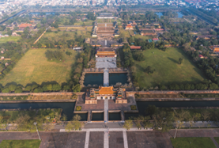

Candidate events:
- `phe-duyet-chien-luoc-phat-trien-cong-nghiep-van-hoa-viet-nam` - Phê duyệt Chiến lược phát triển các ngành công nghiệp văn hoá đến năm 2020, tầm nhìn đến năm 2030 (Ngày 8 – 9 – 2016); reason: `lesson_id_match`

##### grade_10:12137:img_03

- Status: `single_candidate`
- Source src: `images/grade_10/12137/img_03.png`
- Source image: `crawData/stage1_crawl/images/grade_10/12137/img_03.png`
- Image order: 3
- File size: 237.5 KiB
- Content hash: `e0ff3cdbe7f5dfa0`
- Caption: ** Hình 3. ** Vịnh Hạ Long (Quảng Ninh) – Di sản thiên nhiên thế giới
- Alt: _empty_
- Validation issues: `empty_alt`

Candidate events:
- `phe-duyet-chien-luoc-phat-trien-cong-nghiep-van-hoa-viet-nam` - Phê duyệt Chiến lược phát triển các ngành công nghiệp văn hoá đến năm 2020, tầm nhìn đến năm 2030 (Ngày 8 – 9 – 2016); reason: `lesson_id_match`

##### grade_10:12137:img_04

- Status: `single_candidate`
- Source src: `images/grade_10/12137/img_04.png`
- Source image: `crawData/stage1_crawl/images/grade_10/12137/img_04.png`
- Image order: 4
- File size: 151.4 KiB
- Content hash: `d851c44a25c05877`
- Caption: ** Hình 4. ** Nghệ nhân các phường Xoan (Phú Thọ) giao lưu Hát Xoan – Di sản văn hoá phi vật thể đại diện của nhân loại có sự tham gia của học sinh
- Alt: _empty_
- Validation issues: `empty_alt`

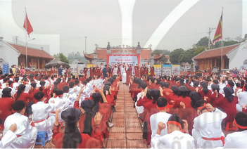

Candidate events:
- `phe-duyet-chien-luoc-phat-trien-cong-nghiep-van-hoa-viet-nam` - Phê duyệt Chiến lược phát triển các ngành công nghiệp văn hoá đến năm 2020, tầm nhìn đến năm 2030 (Ngày 8 – 9 – 2016); reason: `lesson_id_match`

##### grade_10:12137:img_05

- Status: `single_candidate`
- Source src: `images/grade_10/12137/img_05.png`
- Source image: `crawData/stage1_crawl/images/grade_10/12137/img_05.png`
- Image order: 5
- File size: 190.8 KiB
- Content hash: `e915f8f511e6e4d5`
- Caption: ** Hình 5. ** Hang Sơn Đoòng thuộc Vườn quốc gia Phong Nha – Kẻ Bàng (Quảng Bình) – Di sản thiên nhiên thế giới với hai lần được ghi danh
- Alt: _empty_
- Validation issues: `empty_alt`

Candidate events:
- `phe-duyet-chien-luoc-phat-trien-cong-nghiep-van-hoa-viet-nam` - Phê duyệt Chiến lược phát triển các ngành công nghiệp văn hoá đến năm 2020, tầm nhìn đến năm 2030 (Ngày 8 – 9 – 2016); reason: `lesson_id_match`

##### grade_10:12137:img_06

- Status: `single_candidate`
- Source src: `images/grade_10/12137/img_06.png`
- Source image: `crawData/stage1_crawl/images/grade_10/12137/img_06.png`
- Image order: 6
- File size: 124.4 KiB
- Content hash: `227068fedb813537`
- Caption: ** Hình 7. ** Biểu diễn nhạc cụ dân tộc trong lễ hội đầu xuân (tại Ninh Bình)
- Alt: _empty_
- Validation issues: `empty_alt`

Candidate events:
- `phe-duyet-chien-luoc-phat-trien-cong-nghiep-van-hoa-viet-nam` - Phê duyệt Chiến lược phát triển các ngành công nghiệp văn hoá đến năm 2020, tầm nhìn đến năm 2030 (Ngày 8 – 9 – 2016); reason: `lesson_id_match`

##### grade_10:12137:img_07

- Status: `single_candidate`
- Source src: `images/grade_10/12137/img_07.png`
- Source image: `crawData/stage1_crawl/images/grade_10/12137/img_07.png`
- Image order: 7
- File size: 107.2 KiB
- Content hash: `af2cbe3dca30be87`
- Caption: _missing_
- Alt: _empty_
- Validation issues: `empty_alt`, `missing_caption`

Candidate events:
- `phe-duyet-chien-luoc-phat-trien-cong-nghiep-van-hoa-viet-nam` - Phê duyệt Chiến lược phát triển các ngành công nghiệp văn hoá đến năm 2020, tầm nhìn đến năm 2030 (Ngày 8 – 9 – 2016); reason: `lesson_id_match`

##### grade_10:12137:img_08

- Status: `single_candidate`
- Source src: `images/grade_10/12137/img_08.png`
- Source image: `crawData/stage1_crawl/images/grade_10/12137/img_08.png`
- Image order: 8
- File size: 121.7 KiB
- Content hash: `06c4a435ff3ed080`
- Caption: _missing_
- Alt: _empty_
- Validation issues: `empty_alt`, `missing_caption`

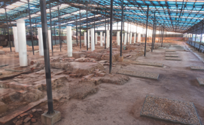

Candidate events:
- `phe-duyet-chien-luoc-phat-trien-cong-nghiep-van-hoa-viet-nam` - Phê duyệt Chiến lược phát triển các ngành công nghiệp văn hoá đến năm 2020, tầm nhìn đến năm 2030 (Ngày 8 – 9 – 2016); reason: `lesson_id_match`

#### Lesson 12138: Bài 5: Khái Niệm Văn Minh. Một Số Nền Văn Minh Phương Đông Thời Kì Cổ - Trung Đại

##### grade_10:12138:img_01

- Status: `unresolved`
- Source src: `images/grade_10/12138/img_01.png`
- Source image: `crawData/stage1_crawl/images/grade_10/12138/img_01.png`
- Image order: 1
- File size: 47.8 KiB
- Content hash: `cd7192e7bb69a2df`
- Caption: ** Hình 1. ** Tấm bia đá Nam-mơ mô tả về chiến thắng của vua Nam-mơ trong cuộc chiến tranh thống nhất Ai Cập
- Alt: _empty_
- Validation issues: `empty_alt`, `lesson_id_not_referenced_by_core_events`

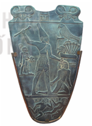

Candidate events:
- none

##### grade_10:12138:img_02

- Status: `unresolved`
- Source src: `images/grade_10/12138/img_02.png`
- Source image: `crawData/stage1_crawl/images/grade_10/12138/img_02.png`
- Image order: 2
- File size: 423.4 KiB
- Content hash: `396f4ed93504f71d`
- Caption: ** Hình 2. ** Một hình ảnh trong Sách của người chết của Ai Cập cổ đại
- Alt: _empty_
- Validation issues: `empty_alt`, `lesson_id_not_referenced_by_core_events`

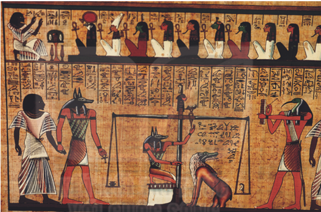

Candidate events:
- none

##### grade_10:12138:img_03

- Status: `unresolved`
- Source src: `images/grade_10/12138/img_03.png`
- Source image: `crawData/stage1_crawl/images/grade_10/12138/img_03.png`
- Image order: 3
- File size: 158.0 KiB
- Content hash: `bb61f311650fdcac`
- Caption: ** Hình 3. ** Bia đá Rô-sét-ta (niên đại 196 TCN) được phát hiện ở Mem-phít, hiện lưu giữ tại Bảo tàng quốc gia Anh • Kiến trúc và điêu khắc
- Alt: _empty_
- Validation issues: `empty_alt`, `lesson_id_not_referenced_by_core_events`

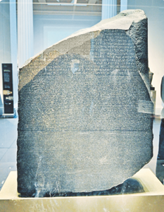

Candidate events:
- none

##### grade_10:12138:img_04

- Status: `unresolved`
- Source src: `images/grade_10/12138/img_04.png`
- Source image: `crawData/stage1_crawl/images/grade_10/12138/img_04.png`
- Image order: 4
- File size: 305.6 KiB
- Content hash: `4d6b38b5b4bb6c3f`
- Caption: ** Hình 4. ** Tượng Nhân sư và quần thể kim tự tháp ở Ghi-da
- Alt: _empty_
- Validation issues: `empty_alt`, `lesson_id_not_referenced_by_core_events`

Candidate events:
- none

##### grade_10:12138:img_05

- Status: `unresolved`
- Source src: `images/grade_10/12138/img_05.png`
- Source image: `crawData/stage1_crawl/images/grade_10/12138/img_05.png`
- Image order: 5
- File size: 199.2 KiB
- Content hash: `9333a16f3f13ccae`
- Caption: ** Hình 5. ** Nắp quan tài bằng vàng của pha-ra-ông Tu-tan-kha-môn
- Alt: _empty_
- Validation issues: `empty_alt`, `lesson_id_not_referenced_by_core_events`

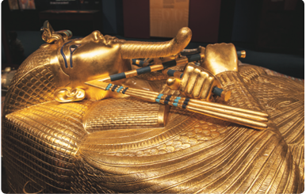

Candidate events:
- none

##### grade_10:12138:img_06

- Status: `unresolved`
- Source src: `images/grade_10/12138/img_06.png`
- Source image: `crawData/stage1_crawl/images/grade_10/12138/img_06.png`
- Image order: 6
- File size: 152.0 KiB
- Content hash: `f94719cd2b5958f5`
- Caption: ** Hình 6. ** Đến Ma-ha-bô-đi ở Bi-ha
- Alt: _empty_
- Validation issues: `empty_alt`, `lesson_id_not_referenced_by_core_events`

Candidate events:
- none

##### grade_10:12138:img_07

- Status: `unresolved`
- Source src: `images/grade_10/12138/img_07.png`
- Source image: `crawData/stage1_crawl/images/grade_10/12138/img_07.png`
- Image order: 7
- File size: 114.6 KiB
- Content hash: `0c69a35ef2d7c7e2`
- Caption: ** Hình 7. ** Kí tự trên con dấu bằng đất nung được phát hiện trong di chỉ thuộc văn minh sông Ấn
- Alt: _empty_
- Validation issues: `empty_alt`, `lesson_id_not_referenced_by_core_events`

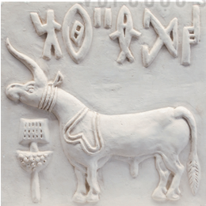

Candidate events:
- none

##### grade_10:12138:img_08

- Status: `unresolved`
- Source src: `images/grade_10/12138/img_08.png`
- Source image: `crawData/stage1_crawl/images/grade_10/12138/img_08.png`
- Image order: 8
- File size: 126.8 KiB
- Content hash: `35f9fc1d8f6f1ece`
- Caption: ** Hình 8. ** Chùa hang trong quần thể A-gian-ta
- Alt: _empty_
- Validation issues: `empty_alt`, `lesson_id_not_referenced_by_core_events`

Candidate events:
- none

##### grade_10:12138:img_09

- Status: `unresolved`
- Source src: `images/grade_10/12138/img_09.png`
- Source image: `crawData/stage1_crawl/images/grade_10/12138/img_09.png`
- Image order: 9
- File size: 96.0 KiB
- Content hash: `660227148869fd76`
- Caption: ** Hình 9. ** Lăng Ta-giơ Ma-han ở A-gra
- Alt: _empty_
- Validation issues: `empty_alt`, `lesson_id_not_referenced_by_core_events`

Candidate events:
- none

##### grade_10:12138:img_10

- Status: `unresolved`
- Source src: `images/grade_10/12138/img_10.png`
- Source image: `crawData/stage1_crawl/images/grade_10/12138/img_10.png`
- Image order: 10
- File size: 111.6 KiB
- Content hash: `cc6366ba664ab944`
- Caption: ** Hình 10. ** Chữ giáp cốt (nguồn gốc của chữ Hán ngày nay)
- Alt: _empty_
- Validation issues: `empty_alt`, `lesson_id_not_referenced_by_core_events`

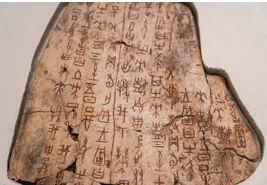

Candidate events:
- none

##### grade_10:12138:img_11

- Status: `unresolved`
- Source src: `images/grade_10/12138/img_11.png`
- Source image: `crawData/stage1_crawl/images/grade_10/12138/img_11.png`
- Image order: 11
- File size: 274.9 KiB
- Content hash: `66294d97c898e277`
- Caption: ** Hình 11. ** Một đoạn của Vạn Lý Trường Thành
- Alt: _empty_
- Validation issues: `empty_alt`, `lesson_id_not_referenced_by_core_events`

Candidate events:
- none

##### grade_10:12138:img_12

- Status: `unresolved`
- Source src: `images/grade_10/12138/img_12.png`
- Source image: `crawData/stage1_crawl/images/grade_10/12138/img_12.png`
- Image order: 12
- File size: 312.9 KiB
- Content hash: `62c308d4e1a350e9`
- Caption: ** Hình 12. ** Tượng binh sĩ bằng đất nung trong lăng mộ Tần Thuỷ Hoàng (tỉnh Thiểm Tây)
- Alt: _empty_
- Validation issues: `empty_alt`, `lesson_id_not_referenced_by_core_events`

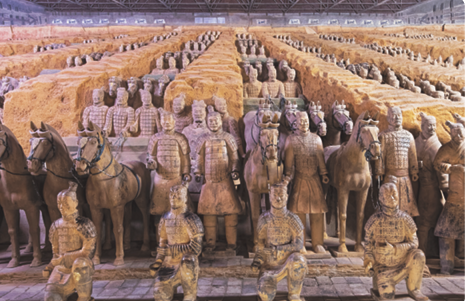

Candidate events:
- none

#### Lesson 12141: Bài 6: Một Số Nền Văn Minh Phương Tây Thời Kì Cổ – Trung Đại

##### grade_10:12141:img_01

- Status: `unresolved`
- Source src: `images/grade_10/12141/img_01.png`
- Source image: `crawData/stage1_crawl/images/grade_10/12141/img_01.png`
- Image order: 1
- File size: 70.4 KiB
- Content hash: `7ca58f7851eb6db6`
- Caption: ** Hình 1. ** Bảo tàng Ô-lim-pic Nhật Bản
- Alt: _empty_
- Validation issues: `empty_alt`, `lesson_id_not_referenced_by_core_events`

Candidate events:
- none

##### grade_10:12141:img_02

- Status: `unresolved`
- Source src: `images/grade_10/12141/img_02.png`
- Source image: `crawData/stage1_crawl/images/grade_10/12141/img_02.png`
- Image order: 2
- File size: 48.3 KiB
- Content hash: `89d7f613556d5c1e`
- Caption: ** Hình 2. ** Tượng Ốc-ta-vi-út – người mở đầu thời kì đế chế La Mã (cuối thế kỉ I TCN)
- Alt: _empty_
- Validation issues: `empty_alt`, `lesson_id_not_referenced_by_core_events`

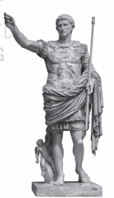

Candidate events:
- none

##### grade_10:12141:img_03

- Status: `unresolved`
- Source src: `images/grade_10/12141/img_03.png`
- Source image: `crawData/stage1_crawl/images/grade_10/12141/img_03.png`
- Image order: 3
- File size: 90.8 KiB
- Content hash: `1dd30a22e6f3d379`
- Caption: ** Hình 3. ** Bảng chữ số La Mã
- Alt: _empty_
- Validation issues: `empty_alt`, `lesson_id_not_referenced_by_core_events`

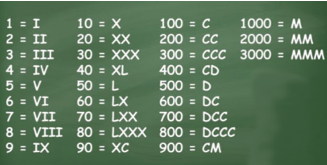

Candidate events:
- none

##### grade_10:12141:img_04

- Status: `unresolved`
- Source src: `images/grade_10/12141/img_04.png`
- Source image: `crawData/stage1_crawl/images/grade_10/12141/img_04.png`
- Image order: 4
- File size: 215.3 KiB
- Content hash: `3ae40927ab180968`
- Caption: ** Hình 4. ** Đền Pác-tê-nông xây dựng vào thế kỉV TCN trên đồi Ác-cô-pô-lit (A-ten)
- Alt: _empty_
- Validation issues: `empty_alt`, `lesson_id_not_referenced_by_core_events`

Candidate events:
- none

##### grade_10:12141:img_05

- Status: `unresolved`
- Source src: `images/grade_10/12141/img_05.png`
- Source image: `crawData/stage1_crawl/images/grade_10/12141/img_05.png`
- Image order: 5
- File size: 26.9 KiB
- Content hash: `f27f74c7d0fe32c8`
- Caption: ** Hình 5. ** Tượng thần Vệ Nữ hiện được trưng bày tại Bảo tàng Lu-vơ-rơ (Pháp)
- Alt: _empty_
- Validation issues: `empty_alt`, `lesson_id_not_referenced_by_core_events`

Candidate events:
- none

##### grade_10:12141:img_06

- Status: `unresolved`
- Source src: `images/grade_10/12141/img_06.png`
- Source image: `crawData/stage1_crawl/images/grade_10/12141/img_06.png`
- Image order: 6
- File size: 89.0 KiB
- Content hash: `403d6ba65d5c57c6`
- Caption: ** Hình 6. ** Bình gốm Hy Lạp có trang trí hình vẽ một cảnh trong thần thoại
- Alt: _empty_
- Validation issues: `empty_alt`, `lesson_id_not_referenced_by_core_events`

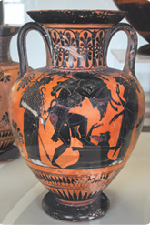

Candidate events:
- none

##### grade_10:12141:img_07

- Status: `unresolved`
- Source src: `images/grade_10/12141/img_07.png`
- Source image: `crawData/stage1_crawl/images/grade_10/12141/img_07.png`
- Image order: 7
- File size: 52.6 KiB
- Content hash: `037bbc3b69781692`
- Caption: ** Hình 7. ** Tượng Pi-ta-go và mô phỏng định lí do ông
- Alt: _empty_
- Validation issues: `empty_alt`, `lesson_id_not_referenced_by_core_events`

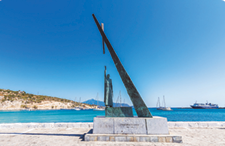

Candidate events:
- none

##### grade_10:12141:img_08

- Status: `unresolved`
- Source src: `images/grade_10/12141/img_08.png`
- Source image: `crawData/stage1_crawl/images/grade_10/12141/img_08.png`
- Image order: 8
- File size: 25.5 KiB
- Content hash: `8f5cc0ee4a3b5f5b`
- Caption: ** Hình 8. ** Mô hình mô phỏng máy bắn đá của người Hy Lạp cổ đại phát minh ra được dựng trên đảo Xa-mốt (Hy Lạp)
- Alt: _empty_
- Validation issues: `empty_alt`, `lesson_id_not_referenced_by_core_events`

Candidate events:
- none

##### grade_10:12141:img_09

- Status: `unresolved`
- Source src: `images/grade_10/12141/img_09.png`
- Source image: `crawData/stage1_crawl/images/grade_10/12141/img_09.png`
- Image order: 9
- File size: 75.2 KiB
- Content hash: `82a25ad535bcdb36`
- Caption: ** Hình 9. ** Tượng Đức Mẹ sau bi của Mi-ken-lăng-giơ
- Alt: _empty_
- Validation issues: `empty_alt`, `lesson_id_not_referenced_by_core_events`

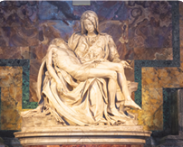

Candidate events:
- none

##### grade_10:12141:img_10

- Status: `unresolved`
- Source src: `images/grade_10/12141/img_10.png`
- Source image: `crawData/stage1_crawl/images/grade_10/12141/img_10.png`
- Image order: 10
- File size: 102.7 KiB
- Content hash: `b9a30d21c1754e13`
- Caption: ** Hình 10. ** Bức tranh Trường học A-ten của Ra-pha-en, trong đó có sự hiện diện của các học giả Hy Lạp cổ đại
- Alt: _empty_
- Validation issues: `empty_alt`, `lesson_id_not_referenced_by_core_events`

Candidate events:
- none

##### grade_10:12141:img_11

- Status: `unresolved`
- Source src: `images/grade_10/12141/img_11.png`
- Source image: `crawData/stage1_crawl/images/grade_10/12141/img_11.png`
- Image order: 11
- File size: 95.2 KiB
- Content hash: `3f74764ecf266c80`
- Caption: ** Hình 11. ** Vương cung Thánh đường Thánh Phê-rô (I-ta-li-a)
- Alt: _empty_
- Validation issues: `empty_alt`, `lesson_id_not_referenced_by_core_events`

Candidate events:
- none

#### Lesson 12143: Bài 7: Các Cuộc Cách Mạng Công Nghiệp Thời Kì Cận Đại

##### grade_10:12143:img_01

- Status: `unresolved`
- Source src: `images/grade_10/12143/img_01.png`
- Source image: `crawData/stage1_crawl/images/grade_10/12143/img_01.png`
- Image order: 1
- File size: 236.2 KiB
- Content hash: `940cece4b0beff59`
- Caption: ** Hình 1. ** Máy bay đang cất cánh
- Alt: _empty_
- Validation issues: `empty_alt`, `lesson_id_not_referenced_by_core_events`

Candidate events:
- none

##### grade_10:12143:img_02

- Status: `unresolved`
- Source src: `images/grade_10/12143/img_02.png`
- Source image: `crawData/stage1_crawl/images/grade_10/12143/img_02.png`
- Image order: 2
- File size: 65.6 KiB
- Content hash: `39bf6c43506c0fed`
- Caption: ** Hình 2. ** Lược đồ các tài nguyên khoáng sản chính của nước Anh thế kỉ XVIII
- Alt: _empty_
- Validation issues: `empty_alt`, `lesson_id_not_referenced_by_core_events`

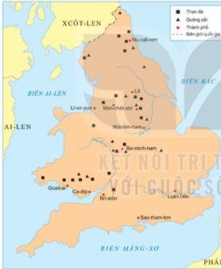

Candidate events:
- none

##### grade_10:12143:img_03

- Status: `unresolved`
- Source src: `images/grade_10/12143/img_03.png`
- Source image: `crawData/stage1_crawl/images/grade_10/12143/img_03.png`
- Image order: 3
- File size: 45.3 KiB
- Content hash: `dac8f6e5eeb0c93d`
- Caption: ** Hình 3. ** Tàu buôn nô lệ của thực dân Anh ở Tây Phi (tranh vẽ)
- Alt: _empty_
- Validation issues: `empty_alt`, `lesson_id_not_referenced_by_core_events`

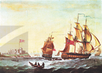

Candidate events:
- none

##### grade_10:12143:img_04

- Status: `unresolved`
- Source src: `images/grade_10/12143/img_04.png`
- Source image: `crawData/stage1_crawl/images/grade_10/12143/img_04.png`
- Image order: 4
- File size: 42.1 KiB
- Content hash: `b9ad8ddef6f53d12`
- Caption: ** Hình 4. ** Hiện tượng “rào đất cướp ruộng để chăn nuôi cừu ở Anh (tranh vẽ)
- Alt: _empty_
- Validation issues: `empty_alt`, `lesson_id_not_referenced_by_core_events`

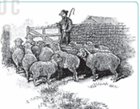

Candidate events:
- none

##### grade_10:12143:img_05

- Status: `unresolved`
- Source src: `images/grade_10/12143/img_05.png`
- Source image: `crawData/stage1_crawl/images/grade_10/12143/img_05.png`
- Image order: 5
- File size: 185.7 KiB
- Content hash: `e14179c93319acad`
- Caption: _missing_
- Alt: _empty_
- Validation issues: `empty_alt`, `lesson_id_not_referenced_by_core_events`, `missing_caption`

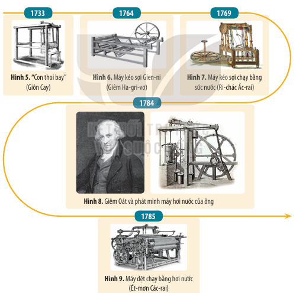

Candidate events:
- none

##### grade_10:12143:img_06

- Status: `unresolved`
- Source src: `images/grade_10/12143/img_06.png`
- Source image: `crawData/stage1_crawl/images/grade_10/12143/img_06.png`
- Image order: 6
- File size: 64.2 KiB
- Content hash: `a80cbbd51a674bb8`
- Caption: _missing_
- Alt: _empty_
- Validation issues: `empty_alt`, `lesson_id_not_referenced_by_core_events`, `missing_caption`

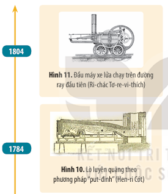

Candidate events:
- none

##### grade_10:12143:img_07

- Status: `unresolved`
- Source src: `images/grade_10/12143/img_07.png`
- Source image: `crawData/stage1_crawl/images/grade_10/12143/img_07.png`
- Image order: 7
- File size: 40.4 KiB
- Content hash: `fd5bc3536a452166`
- Caption: ** Hình 12. ** Quá trình luyện thép theo phương pháp lò cao (Hen-ri Bê-sê-mo, 1856)
- Alt: _empty_
- Validation issues: `empty_alt`, `lesson_id_not_referenced_by_core_events`

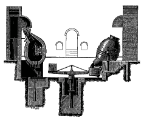

Candidate events:
- none

##### grade_10:12143:img_08

- Status: `unresolved`
- Source src: `images/grade_10/12143/img_08.png`
- Source image: `crawData/stage1_crawl/images/grade_10/12143/img_08.png`
- Image order: 8
- File size: 131.6 KiB
- Content hash: `5b1a42fbef46248c`
- Caption: ** Hình 13. ** Điện thoại (A-lếch-xan Gra-ham Beo, 1876)
- Alt: _empty_
- Validation issues: `empty_alt`, `lesson_id_not_referenced_by_core_events`

Candidate events:
- none

##### grade_10:12143:img_09

- Status: `unresolved`
- Source src: `images/grade_10/12143/img_09.png`
- Source image: `crawData/stage1_crawl/images/grade_10/12143/img_09.png`
- Image order: 9
- File size: 126.6 KiB
- Content hash: `0c1e6467a92a6c9a`
- Caption: ** Hình 14. ** Chân dung Tô-mát Ê-đi-xơn và phát minh của ông (1879) được in trên một con tem bưu chính ở I-ta-li-a
- Alt: _empty_
- Validation issues: `empty_alt`, `lesson_id_not_referenced_by_core_events`

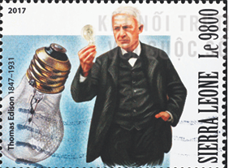

Candidate events:
- none

##### grade_10:12143:img_10

- Status: `unresolved`
- Source src: `images/grade_10/12143/img_10.png`
- Source image: `crawData/stage1_crawl/images/grade_10/12143/img_10.png`
- Image order: 10
- File size: 143.2 KiB
- Content hash: `492ebef723eecb8c`
- Caption: ** Hình 15. ** Máy vô tuyến điện (Gu-li-ê-li-nô Mác-cô-ni, 1897)
- Alt: _empty_
- Validation issues: `empty_alt`, `lesson_id_not_referenced_by_core_events`

Candidate events:
- none

##### grade_10:12143:img_11

- Status: `unresolved`
- Source src: `images/grade_10/12143/img_11.png`
- Source image: `crawData/stage1_crawl/images/grade_10/12143/img_11.png`
- Image order: 11
- File size: 120.5 KiB
- Content hash: `1b7c3d15f96d4f38`
- Caption: ** Hình 16. ** Xe hơi Mô-đen T (Công ti Pho Mô-tô, 1908)
- Alt: _empty_
- Validation issues: `empty_alt`, `lesson_id_not_referenced_by_core_events`

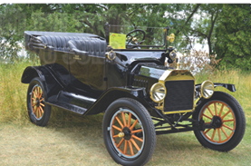

Candidate events:
- none

##### grade_10:12143:img_12

- Status: `unresolved`
- Source src: `images/grade_10/12143/img_12.png`
- Source image: `crawData/stage1_crawl/images/grade_10/12143/img_12.png`
- Image order: 12
- File size: 67.6 KiB
- Content hash: `3323284079e4516a`
- Caption: ** Hình 17. ** Máy bay của anh em nhà Rai thực hiện chuyến bay thử nghiệm (1903)
- Alt: _empty_
- Validation issues: `empty_alt`, `lesson_id_not_referenced_by_core_events`

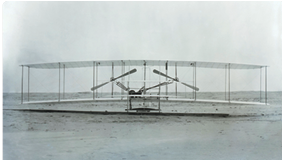

Candidate events:
- none

##### grade_10:12143:img_13

- Status: `unresolved`
- Source src: `images/grade_10/12143/img_13.png`
- Source image: `crawData/stage1_crawl/images/grade_10/12143/img_13.png`
- Image order: 13
- File size: 264.3 KiB
- Content hash: `41a653330c740309`
- Caption: ** Hình 18. ** Đường sắt nối hai thành phố Li-vơ-pun và Man-chét-xtơ của Anh (1831, tranh vẽ)
- Alt: _empty_
- Validation issues: `empty_alt`, `lesson_id_not_referenced_by_core_events`

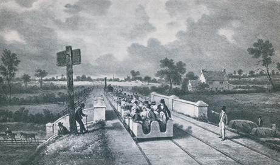

Candidate events:
- none

##### grade_10:12143:img_14

- Status: `unresolved`
- Source src: `images/grade_10/12143/img_14.png`
- Source image: `crawData/stage1_crawl/images/grade_10/12143/img_14.png`
- Image order: 14
- File size: 53.6 KiB
- Content hash: `fc88096c9e15955e`
- Caption: ** Hình 19. ** Tàu chiến của Anh (1896)
- Alt: _empty_
- Validation issues: `empty_alt`, `lesson_id_not_referenced_by_core_events`

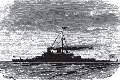

Candidate events:
- none

##### grade_10:12143:img_15

- Status: `unresolved`
- Source src: `images/grade_10/12143/img_15.png`
- Source image: `crawData/stage1_crawl/images/grade_10/12143/img_15.png`
- Image order: 15
- File size: 79.4 KiB
- Content hash: `ea43d0ff90c93981`
- Caption: ** Hình 20. ** Phụ nữ làm việc tại nhà máy dệt ở Bô-xtơn – Mỹ (1910)
- Alt: _empty_
- Validation issues: `empty_alt`, `lesson_id_not_referenced_by_core_events`

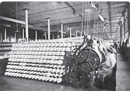

Candidate events:
- none

#### Lesson 12145: Bài 8: Các Cuộc Cách Mạng Công Nghiệp Thời Kì Hiện Đại

##### grade_10:12145:img_01

- Status: `single_candidate`
- Source src: `images/grade_10/12145/img_01.png`
- Source image: `crawData/stage1_crawl/images/grade_10/12145/img_01.png`
- Image order: 1
- File size: 55.4 KiB
- Content hash: `358c8ce16143ce42`
- Caption: _missing_
- Alt: _empty_
- Validation issues: `empty_alt`, `missing_caption`

Candidate events:
- `ro-bot-xophia-duoc-cap-quyen-cong-dan` - Rô-bốt Xô-phi-a được Chính phủ A-rập Xê-út cấp quyền Công dân (25 - 10 - 2017); reason: `lesson_id_match`

##### grade_10:12145:img_02

- Status: `single_candidate`
- Source src: `images/grade_10/12145/img_02.png`
- Source image: `crawData/stage1_crawl/images/grade_10/12145/img_02.png`
- Image order: 2
- File size: 116.8 KiB
- Content hash: `5d36d56b2482ae7f`
- Caption: ** Hình 2. ** Tượng An-be Anh-xtanh ở Bảo tàng I-xtan-bun (Thổ Nhĩ Kỳ)
- Alt: _empty_
- Validation issues: `empty_alt`

Candidate events:
- `ro-bot-xophia-duoc-cap-quyen-cong-dan` - Rô-bốt Xô-phi-a được Chính phủ A-rập Xê-út cấp quyền Công dân (25 - 10 - 2017); reason: `lesson_id_match`

##### grade_10:12145:img_03

- Status: `single_candidate`
- Source src: `images/grade_10/12145/img_03.png`
- Source image: `crawData/stage1_crawl/images/grade_10/12145/img_03.png`
- Image order: 3
- File size: 50.7 KiB
- Content hash: `dc7d1d9b5403786c`
- Caption: ** Hình 5. ** Máy tính Mắc-xin-tốt – máy tính đầu tiên của hãng Áp-pổ (do Stip Giúp giới thiệu, 1984)
- Alt: _empty_
- Validation issues: `empty_alt`

Candidate events:
- `ro-bot-xophia-duoc-cap-quyen-cong-dan` - Rô-bốt Xô-phi-a được Chính phủ A-rập Xê-út cấp quyền Công dân (25 - 10 - 2017); reason: `lesson_id_match`

##### grade_10:12145:img_04

- Status: `single_candidate`
- Source src: `images/grade_10/12145/img_04.png`
- Source image: `crawData/stage1_crawl/images/grade_10/12145/img_04.png`
- Image order: 4
- File size: 77.1 KiB
- Content hash: `7856679ce4e1c685`
- Caption: ** Hình 6. ** Con tem có hình ảnh Tim Béc-nơ và phát minh Mạng lưới toàn cầu (World Wide Web) của ông (1990)
- Alt: _empty_
- Validation issues: `empty_alt`

Candidate events:
- `ro-bot-xophia-duoc-cap-quyen-cong-dan` - Rô-bốt Xô-phi-a được Chính phủ A-rập Xê-út cấp quyền Công dân (25 - 10 - 2017); reason: `lesson_id_match`

##### grade_10:12145:img_05

- Status: `single_candidate`
- Source src: `images/grade_10/12145/img_05.png`
- Source image: `crawData/stage1_crawl/images/grade_10/12145/img_05.png`
- Image order: 5
- File size: 51.2 KiB
- Content hash: `c9bd0b0fac2b9528`
- Caption: ** Hình 7. ** Kết nối các thiết bị qua mạng không dây (wifi) – phát minh của một nhóm các nhà khoa học và công nghệ do Giôn Su-li-van đứng đầu và được cấp bằng sáng chế (1996)
- Alt: _empty_
- Validation issues: `empty_alt`

Candidate events:
- `ro-bot-xophia-duoc-cap-quyen-cong-dan` - Rô-bốt Xô-phi-a được Chính phủ A-rập Xê-út cấp quyền Công dân (25 - 10 - 2017); reason: `lesson_id_match`

##### grade_10:12145:img_06

- Status: `single_candidate`
- Source src: `images/grade_10/12145/img_06.png`
- Source image: `crawData/stage1_crawl/images/grade_10/12145/img_06.png`
- Image order: 6
- File size: 126.7 KiB
- Content hash: `b3f082a6d1d8834b`
- Caption: ** Hình 8. ** Các cánh tay rô-bốt đang làm việc trong dây chuyển sản xuất, lắp ráp ô tô
- Alt: _empty_
- Validation issues: `empty_alt`

Candidate events:
- `ro-bot-xophia-duoc-cap-quyen-cong-dan` - Rô-bốt Xô-phi-a được Chính phủ A-rập Xê-út cấp quyền Công dân (25 - 10 - 2017); reason: `lesson_id_match`

##### grade_10:12145:img_07

- Status: `single_candidate`
- Source src: `images/grade_10/12145/img_07.png`
- Source image: `crawData/stage1_crawl/images/grade_10/12145/img_07.png`
- Image order: 7
- File size: 28.6 KiB
- Content hash: `27371147860d00da`
- Caption: ** Hình ** ** 9. ** Rô-bốt ASIMO do công tỉ Hon-đã chế tạo (2000)
- Alt: _empty_
- Validation issues: `empty_alt`

Candidate events:
- `ro-bot-xophia-duoc-cap-quyen-cong-dan` - Rô-bốt Xô-phi-a được Chính phủ A-rập Xê-út cấp quyền Công dân (25 - 10 - 2017); reason: `lesson_id_match`

##### grade_10:12145:img_08

- Status: `single_candidate`
- Source src: `images/grade_10/12145/img_08.png`
- Source image: `crawData/stage1_crawl/images/grade_10/12145/img_08.png`
- Image order: 8
- File size: 43.8 KiB
- Content hash: `9fbdad2e42942f06`
- Caption: ** Hình 10. ** Vệ tinh nhân tạo Xpút-ních 1 do Liên Xô phóng lên quỹ đạo (1957)
- Alt: _empty_
- Validation issues: `empty_alt`

Candidate events:
- `ro-bot-xophia-duoc-cap-quyen-cong-dan` - Rô-bốt Xô-phi-a được Chính phủ A-rập Xê-út cấp quyền Công dân (25 - 10 - 2017); reason: `lesson_id_match`

##### grade_10:12145:img_09

- Status: `single_candidate`
- Source src: `images/grade_10/12145/img_09.png`
- Source image: `crawData/stage1_crawl/images/grade_10/12145/img_09.png`
- Image order: 9
- File size: 79.5 KiB
- Content hash: `56c690f34b7717a5`
- Caption: ** Hình 11. ** Nhà du hành không gian Neo Am-strong (Mỹ) – người đầu tiên đặt chân lên Mặt Trăng (1969)
- Alt: _empty_
- Validation issues: `empty_alt`

Candidate events:
- `ro-bot-xophia-duoc-cap-quyen-cong-dan` - Rô-bốt Xô-phi-a được Chính phủ A-rập Xê-út cấp quyền Công dân (25 - 10 - 2017); reason: `lesson_id_match`

##### grade_10:12145:img_10

- Status: `single_candidate`
- Source src: `images/grade_10/12145/img_10.png`
- Source image: `crawData/stage1_crawl/images/grade_10/12145/img_10.png`
- Image order: 10
- File size: 69.1 KiB
- Content hash: `410759681364db1e`
- Caption: ** Hình 12. ** “Kết nối vạn vật” thông qua internet
- Alt: _empty_
- Validation issues: `empty_alt`

Candidate events:
- `ro-bot-xophia-duoc-cap-quyen-cong-dan` - Rô-bốt Xô-phi-a được Chính phủ A-rập Xê-út cấp quyền Công dân (25 - 10 - 2017); reason: `lesson_id_match`

##### grade_10:12145:img_11

- Status: `single_candidate`
- Source src: `images/grade_10/12145/img_11.png`
- Source image: `crawData/stage1_crawl/images/grade_10/12145/img_11.png`
- Image order: 11
- File size: 72.0 KiB
- Content hash: `986bfdf08949397d`
- Caption: ** Hình 13. ** Rô-bốt có gắn “trí tuệ nhân tạo”
- Alt: _empty_
- Validation issues: `empty_alt`

Candidate events:
- `ro-bot-xophia-duoc-cap-quyen-cong-dan` - Rô-bốt Xô-phi-a được Chính phủ A-rập Xê-út cấp quyền Công dân (25 - 10 - 2017); reason: `lesson_id_match`

##### grade_10:12145:img_12

- Status: `single_candidate`
- Source src: `images/grade_10/12145/img_12.png`
- Source image: `crawData/stage1_crawl/images/grade_10/12145/img_12.png`
- Image order: 12
- File size: 85.3 KiB
- Content hash: `098e7327d86f5ef3`
- Caption: ** Hình 14. ** Một phần toà nhà ở Đu-bai (Các Tiểu vương quốc A-rập Thống nhất) được xây dựng bởi máy in 3D
- Alt: _empty_
- Validation issues: `empty_alt`

Candidate events:
- `ro-bot-xophia-duoc-cap-quyen-cong-dan` - Rô-bốt Xô-phi-a được Chính phủ A-rập Xê-út cấp quyền Công dân (25 - 10 - 2017); reason: `lesson_id_match`

#### Lesson 12146: Bài 9: Cơ Sở Hình Thành Văn Minh Đông Nam Á Thời Kì Cổ – Trung Đại

##### grade_10:12146:img_01

- Status: `ambiguous`
- Source src: `images/grade_10/12146/img_01.png`
- Source image: `crawData/stage1_crawl/images/grade_10/12146/img_01.png`
- Image order: 1
- File size: 253.0 KiB
- Content hash: `abd75eca9d45ffc8`
- Caption: ** Hình 1. ** Lược đồ Đông Nam Á ngày nay
- Alt: _empty_
- Validation issues: `empty_alt`

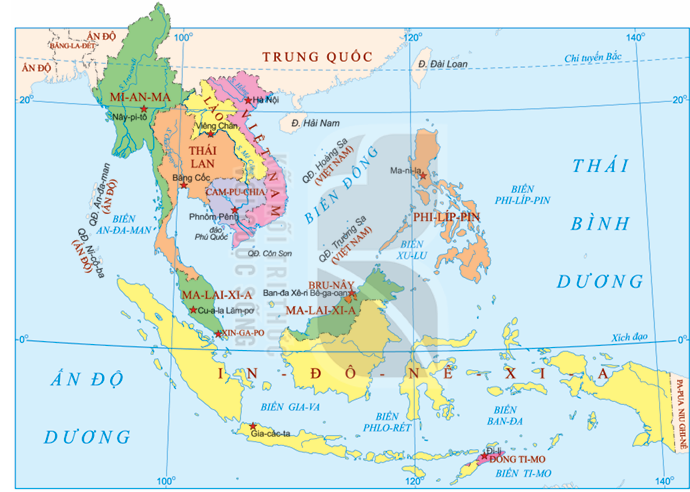

Candidate events:
- `nha-ly-to-chuc-khoa-thi-nho-hoc-dau-tien` - Nhà Lý tổ chức khoa thi Nho học đầu tiên (Thời nhà Lý); reason: `lesson_id_match`
- `nha-ly-xay-dung-van-mieu` - Nhà Lý xây dựng Văn Miếu (Thời nhà Lý); reason: `lesson_id_match`
- `nho-giao-du-nhap-viet-nam` - Nho giáo du nhập vào Việt Nam (Thời Bắc thuộc); reason: `lesson_id_match`

##### grade_10:12146:img_02

- Status: `ambiguous`
- Source src: `images/grade_10/12146/img_02.png`
- Source image: `crawData/stage1_crawl/images/grade_10/12146/img_02.png`
- Image order: 2
- File size: 87.1 KiB
- Content hash: `6041ad467db4933d`
- Caption: ** Hình 2. ** Sông Mê Công – đoạn chảy qua tỉnh Nong Khai (Thái Lan)
- Alt: _empty_
- Validation issues: `empty_alt`

Candidate events:
- `nha-ly-to-chuc-khoa-thi-nho-hoc-dau-tien` - Nhà Lý tổ chức khoa thi Nho học đầu tiên (Thời nhà Lý); reason: `lesson_id_match`
- `nha-ly-xay-dung-van-mieu` - Nhà Lý xây dựng Văn Miếu (Thời nhà Lý); reason: `lesson_id_match`
- `nho-giao-du-nhap-viet-nam` - Nho giáo du nhập vào Việt Nam (Thời Bắc thuộc); reason: `lesson_id_match`

##### grade_10:12146:img_03

- Status: `ambiguous`
- Source src: `images/grade_10/12146/img_03.png`
- Source image: `crawData/stage1_crawl/images/grade_10/12146/img_03.png`
- Image order: 3
- File size: 103.7 KiB
- Content hash: `9190527690f5e6f3`
- Caption: ** Hình 3. ** Nông dân cấy lúa trên cánh đồng ở Việt Nam
- Alt: _empty_
- Validation issues: `empty_alt`

Candidate events:
- `nha-ly-to-chuc-khoa-thi-nho-hoc-dau-tien` - Nhà Lý tổ chức khoa thi Nho học đầu tiên (Thời nhà Lý); reason: `lesson_id_match`
- `nha-ly-xay-dung-van-mieu` - Nhà Lý xây dựng Văn Miếu (Thời nhà Lý); reason: `lesson_id_match`
- `nho-giao-du-nhap-viet-nam` - Nho giáo du nhập vào Việt Nam (Thời Bắc thuộc); reason: `lesson_id_match`

##### grade_10:12146:img_04

- Status: `ambiguous`
- Source src: `images/grade_10/12146/img_04.png`
- Source image: `crawData/stage1_crawl/images/grade_10/12146/img_04.png`
- Image order: 4
- File size: 112.2 KiB
- Content hash: `396fb86fa7bac6ae`
- Caption: ** Hình 4. ** Nông dân cấy lúa trên cánh đồng ở Thái Lan
- Alt: _empty_
- Validation issues: `empty_alt`

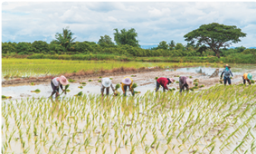

Candidate events:
- `nha-ly-to-chuc-khoa-thi-nho-hoc-dau-tien` - Nhà Lý tổ chức khoa thi Nho học đầu tiên (Thời nhà Lý); reason: `lesson_id_match`
- `nha-ly-xay-dung-van-mieu` - Nhà Lý xây dựng Văn Miếu (Thời nhà Lý); reason: `lesson_id_match`
- `nho-giao-du-nhap-viet-nam` - Nho giáo du nhập vào Việt Nam (Thời Bắc thuộc); reason: `lesson_id_match`

##### grade_10:12146:img_05

- Status: `ambiguous`
- Source src: `images/grade_10/12146/img_05.png`
- Source image: `crawData/stage1_crawl/images/grade_10/12146/img_05.png`
- Image order: 5
- File size: 64.9 KiB
- Content hash: `124ec16510155f56`
- Caption: ** Hình 5. ** Hoạ tiết hình thuyền trên trống đồng Đông Sơn (Việt Nam),  niên đại khoảng thế kỉ VII đến thế kỉ I TCN
- Alt: _empty_
- Validation issues: `empty_alt`

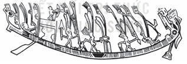

Candidate events:
- `nha-ly-to-chuc-khoa-thi-nho-hoc-dau-tien` - Nhà Lý tổ chức khoa thi Nho học đầu tiên (Thời nhà Lý); reason: `lesson_id_match`
- `nha-ly-xay-dung-van-mieu` - Nhà Lý xây dựng Văn Miếu (Thời nhà Lý); reason: `lesson_id_match`
- `nho-giao-du-nhap-viet-nam` - Nho giáo du nhập vào Việt Nam (Thời Bắc thuộc); reason: `lesson_id_match`

##### grade_10:12146:img_06

- Status: `ambiguous`
- Source src: `images/grade_10/12146/img_06.png`
- Source image: `crawData/stage1_crawl/images/grade_10/12146/img_06.png`
- Image order: 6
- File size: 93.7 KiB
- Content hash: `85e7221b276827d7`
- Caption: ** Hình 6. ** Sơ đồ các ngữ hệ và nhóm ngôn ngữ ở Đông Nam Á ngày nay
- Alt: _empty_
- Validation issues: `empty_alt`

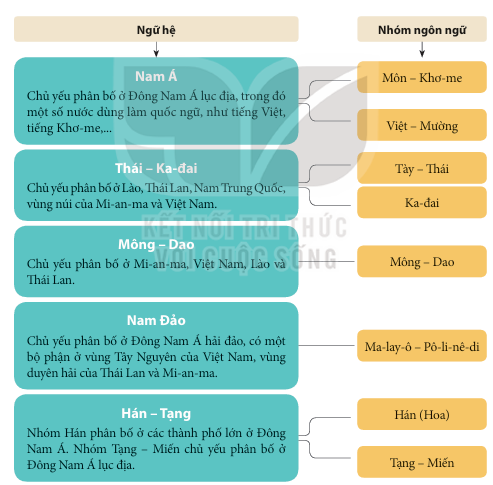

Candidate events:
- `nha-ly-to-chuc-khoa-thi-nho-hoc-dau-tien` - Nhà Lý tổ chức khoa thi Nho học đầu tiên (Thời nhà Lý); reason: `lesson_id_match`
- `nha-ly-xay-dung-van-mieu` - Nhà Lý xây dựng Văn Miếu (Thời nhà Lý); reason: `lesson_id_match`
- `nho-giao-du-nhap-viet-nam` - Nho giáo du nhập vào Việt Nam (Thời Bắc thuộc); reason: `lesson_id_match`

##### grade_10:12146:img_07

- Status: `ambiguous`
- Source src: `images/grade_10/12146/img_07.png`
- Source image: `crawData/stage1_crawl/images/grade_10/12146/img_07.png`
- Image order: 7
- File size: 138.4 KiB
- Content hash: `99d17456708f33d3`
- Caption: ** Hình 7. ** Một nghi thức trong lễ Phật đản tại chùa Vát Su-thát (Thái Lan)
- Alt: _empty_
- Validation issues: `empty_alt`

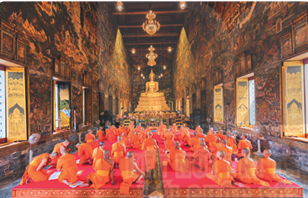

Candidate events:
- `nha-ly-to-chuc-khoa-thi-nho-hoc-dau-tien` - Nhà Lý tổ chức khoa thi Nho học đầu tiên (Thời nhà Lý); reason: `lesson_id_match`
- `nha-ly-xay-dung-van-mieu` - Nhà Lý xây dựng Văn Miếu (Thời nhà Lý); reason: `lesson_id_match`
- `nho-giao-du-nhap-viet-nam` - Nho giáo du nhập vào Việt Nam (Thời Bắc thuộc); reason: `lesson_id_match`

##### grade_10:12146:img_08

- Status: `ambiguous`
- Source src: `images/grade_10/12146/img_08.png`
- Source image: `crawData/stage1_crawl/images/grade_10/12146/img_08.png`
- Image order: 8
- File size: 72.5 KiB
- Content hash: `ae15a8ab8f2f2da2`
- Caption: ** Hình 8. ** Bia Vô Cạnh – bia chữ Phạn cổ nhất Đông Nam Á (thế kỉ III — IV) được tìm thấy ở Việt Nam
- Alt: _empty_
- Validation issues: `empty_alt`

Candidate events:
- `nha-ly-to-chuc-khoa-thi-nho-hoc-dau-tien` - Nhà Lý tổ chức khoa thi Nho học đầu tiên (Thời nhà Lý); reason: `lesson_id_match`
- `nha-ly-xay-dung-van-mieu` - Nhà Lý xây dựng Văn Miếu (Thời nhà Lý); reason: `lesson_id_match`
- `nho-giao-du-nhap-viet-nam` - Nho giáo du nhập vào Việt Nam (Thời Bắc thuộc); reason: `lesson_id_match`

##### grade_10:12146:img_09

- Status: `ambiguous`
- Source src: `images/grade_10/12146/img_09.png`
- Source image: `crawData/stage1_crawl/images/grade_10/12146/img_09.png`
- Image order: 9
- File size: 190.2 KiB
- Content hash: `2838e1e481a74de9`
- Caption: ** Hình 9. ** Khu đền thờ Pram-ba-nan – công trình kiến trúc Hin-đu giáo nổi tiếng ở In-đô-nê-xi-a (thế kỉ VIII)
- Alt: _empty_
- Validation issues: `empty_alt`

Candidate events:
- `nha-ly-to-chuc-khoa-thi-nho-hoc-dau-tien` - Nhà Lý tổ chức khoa thi Nho học đầu tiên (Thời nhà Lý); reason: `lesson_id_match`
- `nha-ly-xay-dung-van-mieu` - Nhà Lý xây dựng Văn Miếu (Thời nhà Lý); reason: `lesson_id_match`
- `nho-giao-du-nhap-viet-nam` - Nho giáo du nhập vào Việt Nam (Thời Bắc thuộc); reason: `lesson_id_match`

##### grade_10:12146:img_10

- Status: `ambiguous`
- Source src: `images/grade_10/12146/img_10.png`
- Source image: `crawData/stage1_crawl/images/grade_10/12146/img_10.png`
- Image order: 10
- File size: 120.2 KiB
- Content hash: `2d71be30b17c2557`
- Caption: ** Hình 10. ** Khuê Văn Các trong Văn Miếu – Quốc Tử Giám Hà Nội (Việt Nam)
- Alt: _empty_
- Validation issues: `empty_alt`

Candidate events:
- `nha-ly-to-chuc-khoa-thi-nho-hoc-dau-tien` - Nhà Lý tổ chức khoa thi Nho học đầu tiên (Thời nhà Lý); reason: `lesson_id_match`
- `nha-ly-xay-dung-van-mieu` - Nhà Lý xây dựng Văn Miếu (Thời nhà Lý); reason: `lesson_id_match`
- `nho-giao-du-nhap-viet-nam` - Nho giáo du nhập vào Việt Nam (Thời Bắc thuộc); reason: `lesson_id_match`

##### grade_10:12146:img_11

- Status: `ambiguous`
- Source src: `images/grade_10/12146/img_11.png`
- Source image: `crawData/stage1_crawl/images/grade_10/12146/img_11.png`
- Image order: 11
- File size: 103.3 KiB
- Content hash: `d8b7c664583be6f0`
- Caption: ** Hình 11. ** Đền Cheng Hun Teng ở Ma-lắc-ca (Ma-lai-xi-a)
- Alt: _empty_
- Validation issues: `empty_alt`

Candidate events:
- `nha-ly-to-chuc-khoa-thi-nho-hoc-dau-tien` - Nhà Lý tổ chức khoa thi Nho học đầu tiên (Thời nhà Lý); reason: `lesson_id_match`
- `nha-ly-xay-dung-van-mieu` - Nhà Lý xây dựng Văn Miếu (Thời nhà Lý); reason: `lesson_id_match`
- `nho-giao-du-nhap-viet-nam` - Nho giáo du nhập vào Việt Nam (Thời Bắc thuộc); reason: `lesson_id_match`

##### grade_10:12146:img_12

- Status: `ambiguous`
- Source src: `images/grade_10/12146/img_12.png`
- Source image: `crawData/stage1_crawl/images/grade_10/12146/img_12.png`
- Image order: 12
- File size: 16.2 KiB
- Content hash: `d223ceb772a35501`
- Caption: _missing_
- Alt: _empty_
- Validation issues: `empty_alt`, `missing_caption`

Candidate events:
- `nha-ly-to-chuc-khoa-thi-nho-hoc-dau-tien` - Nhà Lý tổ chức khoa thi Nho học đầu tiên (Thời nhà Lý); reason: `lesson_id_match`
- `nha-ly-xay-dung-van-mieu` - Nhà Lý xây dựng Văn Miếu (Thời nhà Lý); reason: `lesson_id_match`
- `nho-giao-du-nhap-viet-nam` - Nho giáo du nhập vào Việt Nam (Thời Bắc thuộc); reason: `lesson_id_match`

#### Lesson 12147: Bài 10: Hành Trình Phát Triển Và Thành Tựu Của Văn Minh Đông Nam Á (Thời Kì Cổ – Trung Đại)

##### grade_10:12147:img_01

- Status: `unresolved`
- Source src: `images/grade_10/12147/img_01.png`
- Source image: `crawData/stage1_crawl/images/grade_10/12147/img_01.png`
- Image order: 1
- File size: 446.8 KiB
- Content hash: `34e23485db721d4a`
- Caption: ** Hình 1. ** Đền Bô-rô-bu-đua (In-đô-nê-xi-a)
- Alt: _empty_
- Validation issues: `empty_alt`, `lesson_id_not_referenced_by_core_events`

Candidate events:
- none

##### grade_10:12147:img_02

- Status: `unresolved`
- Source src: `images/grade_10/12147/img_02.png`
- Source image: `crawData/stage1_crawl/images/grade_10/12147/img_02.png`
- Image order: 2
- File size: 141.1 KiB
- Content hash: `56185131851ca73c`
- Caption: ** Hình 2. ** Sơ đồ quá trình hình thành và phát triển của văn minh Đông Nam Á
- Alt: _empty_
- Validation issues: `empty_alt`, `lesson_id_not_referenced_by_core_events`

Candidate events:
- none

##### grade_10:12147:img_03

- Status: `unresolved`
- Source src: `images/grade_10/12147/img_03.png`
- Source image: `crawData/stage1_crawl/images/grade_10/12147/img_03.png`
- Image order: 3
- File size: 54.1 KiB
- Content hash: `0bbf9f48ef61bb73`
- Caption: ** Hình 4. ** Tượng Phật ở chùa Ki-a-pun ở Ba-gô (Mi-an-ma)
- Alt: _empty_
- Validation issues: `empty_alt`, `lesson_id_not_referenced_by_core_events`

Candidate events:
- none

##### grade_10:12147:img_04

- Status: `unresolved`
- Source src: `images/grade_10/12147/img_04.png`
- Source image: `crawData/stage1_crawl/images/grade_10/12147/img_04.png`
- Image order: 4
- File size: 64.6 KiB
- Content hash: `3eac57d4840f322f`
- Caption: ** Hình 5. ** Nhà thờ Hồi giáo Bai-tu-ra-man (In-đô-nê-xi-a)
- Alt: _empty_
- Validation issues: `empty_alt`, `lesson_id_not_referenced_by_core_events`

Candidate events:
- none

##### grade_10:12147:img_05

- Status: `unresolved`
- Source src: `images/grade_10/12147/img_05.png`
- Source image: `crawData/stage1_crawl/images/grade_10/12147/img_05.png`
- Image order: 5
- File size: 123.7 KiB
- Content hash: `0351685ea5985e54`
- Caption: ** Hình 6. ** Nhà thờ Ba-si-li-ca đờ Xan Mác-tin đờ Tua ở Ba-tan-gát (Phi-líp-pin)
- Alt: _empty_
- Validation issues: `empty_alt`, `lesson_id_not_referenced_by_core_events`

Candidate events:
- none

##### grade_10:12147:img_06

- Status: `unresolved`
- Source src: `images/grade_10/12147/img_06.png`
- Source image: `crawData/stage1_crawl/images/grade_10/12147/img_06.png`
- Image order: 6
- File size: 65.9 KiB
- Content hash: `cd5ff250440aa33f`
- Caption: ** Hình 7. ** Bia khắc chữ Khơ-me cổ Phra Chon Bu-ri (Thái Lan) Trên cơ sở chữ viết riêng, cư dân các nước Đông Nam Á đã tạo dựng một nền văn học viết đa dạng với nhiều tác phẩm xuất sắc còn được lưu giữ đến ngày nay, như * Truyện Kiều * (Việt Nam), * Riêm Kê * (Cam-pu-chia), * Ra-ma-kiên * (Thái Lan).
- Alt: _empty_
- Validation issues: `empty_alt`, `lesson_id_not_referenced_by_core_events`

Candidate events:
- none

##### grade_10:12147:img_07

- Status: `unresolved`
- Source src: `images/grade_10/12147/img_07.png`
- Source image: `crawData/stage1_crawl/images/grade_10/12147/img_07.png`
- Image order: 7
- File size: 227.6 KiB
- Content hash: `28ebd2ccfa30a689`
- Caption: ** Hình 8. ** Đền Ăng-co Vát (Cam-pu-chia)
- Alt: _empty_
- Validation issues: `empty_alt`, `lesson_id_not_referenced_by_core_events`

Candidate events:
- none

##### grade_10:12147:img_08

- Status: `unresolved`
- Source src: `images/grade_10/12147/img_08.png`
- Source image: `crawData/stage1_crawl/images/grade_10/12147/img_08.png`
- Image order: 8
- File size: 149.4 KiB
- Content hash: `1c95e897ec1dd576`
- Caption: ** Hình 9. ** Tháp Thạt Luổng (Lào)
- Alt: _empty_
- Validation issues: `empty_alt`, `lesson_id_not_referenced_by_core_events`

Candidate events:
- none

##### grade_10:12147:img_09

- Status: `unresolved`
- Source src: `images/grade_10/12147/img_09.png`
- Source image: `crawData/stage1_crawl/images/grade_10/12147/img_09.png`
- Image order: 9
- File size: 65.2 KiB
- Content hash: `caa8f783652fbc6f`
- Caption: ** Hình 10. ** Hoa văn trên thạp đồng Đào Xá thuộc văn hoá Đông Sơn (Việt Nam)
- Alt: _empty_
- Validation issues: `empty_alt`, `lesson_id_not_referenced_by_core_events`

Candidate events:
- none

##### grade_10:12147:img_10

- Status: `unresolved`
- Source src: `images/grade_10/12147/img_10.png`
- Source image: `crawData/stage1_crawl/images/grade_10/12147/img_10.png`
- Image order: 10
- File size: 42.1 KiB
- Content hash: `baa67ee732a2b34a`
- Caption: ** Hình 11. ** Hoa văn trên đồ gốm ở Bản Chiềng (Thái Lan)
- Alt: _empty_
- Validation issues: `empty_alt`, `lesson_id_not_referenced_by_core_events`

Candidate events:
- none

##### grade_10:12147:img_11

- Status: `unresolved`
- Source src: `images/grade_10/12147/img_11.png`
- Source image: `crawData/stage1_crawl/images/grade_10/12147/img_11.png`
- Image order: 11
- File size: 140.0 KiB
- Content hash: `973a22d6bb2a56d1`
- Caption: ** Hình 12. ** Phù điêu trên đài thờ Mỹ Sơn, thế kỉ VII – VIII (Việt Nam)
- Alt: _empty_
- Validation issues: `empty_alt`, `lesson_id_not_referenced_by_core_events`

Candidate events:
- none

#### Lesson 12148: Bài 11: Một Số Nền Văn Minh Cổ Trên Đất Nước Việt Nam

##### grade_10:12148:img_01

- Status: `ambiguous`
- Source src: `images/grade_10/12148/img_01.png`
- Source image: `crawData/stage1_crawl/images/grade_10/12148/img_01.png`
- Image order: 1
- File size: 29.1 KiB
- Content hash: `699d67cc37cc1c61`
- Caption: _missing_
- Alt: _empty_
- Validation issues: `empty_alt`, `missing_caption`

Candidate events:
- `hinh-thanh-phat-trien-van-minh-cham-pa` - Hình thành và phát triển văn minh Chăm-pa (Thế kỉ II đến thế kỉ XV); reason: `lesson_id_match`
- `hinh-thanh-phat-trien-van-minh-phu-nam` - Hình thành và phát triển văn minh Phù Nam (Khoảng đầu Công nguyên); reason: `lesson_id_match`
- `hinh-thanh-phat-trien-van-minh-van-lang-au-lac` - Hình thành và phát triển văn minh Văn Lang – Âu Lạc (Đầu thiên niên kỉ I TCN đến vài thế kỉ đầu Công nguyên); reason: `lesson_id_match`
- `khoi-nghia-khu-lien-lap-nuoc-lam-ap` - Khởi nghĩa Khu Liên lập nước Lâm Ấp (Năm 192); reason: `lesson_id_match`
- `phu-nam-tro-thanh-vuong-quoc-hung-manh` - Phù Nam trở thành vương quốc hùng mạnh (Từ thế kỉ III đến thế kỉ V); reason: `lesson_id_match`
- `su-ra-doi-nha-nuoc-au-lac` - Sự ra đời của Nhà nước Âu Lạc (208 – 179 TCN); reason: `lesson_id_match`
- `su-ra-doi-nha-nuoc-van-lang` - Sự ra đời của Nhà nước Văn Lang (Khoảng 2 700 năm trước đến năm 208 TCN); reason: `lesson_id_match`
- `van-hoa-phung-nguyen` - Văn hoá Phùng Nguyên (Khoảng 4000 năm trước); reason: `lesson_id_match`
- `van-hoa-sa-huynh` - Văn hoá Sa Huỳnh (Khoảng thế kỉ V TCN); reason: `lesson_id_match`
- `van-hoa-tien-oc-eo` - Văn hoá tiền Óc Eo (Cuối thiên niên kỉ I TCN); reason: `lesson_id_match`

##### grade_10:12148:img_02

- Status: `ambiguous`
- Source src: `images/grade_10/12148/img_02.png`
- Source image: `crawData/stage1_crawl/images/grade_10/12148/img_02.png`
- Image order: 2
- File size: 18.7 KiB
- Content hash: `3176d66678679970`
- Caption: ** **
- Alt: _empty_
- Validation issues: `empty_alt`

Candidate events:
- `hinh-thanh-phat-trien-van-minh-cham-pa` - Hình thành và phát triển văn minh Chăm-pa (Thế kỉ II đến thế kỉ XV); reason: `lesson_id_match`
- `hinh-thanh-phat-trien-van-minh-phu-nam` - Hình thành và phát triển văn minh Phù Nam (Khoảng đầu Công nguyên); reason: `lesson_id_match`
- `hinh-thanh-phat-trien-van-minh-van-lang-au-lac` - Hình thành và phát triển văn minh Văn Lang – Âu Lạc (Đầu thiên niên kỉ I TCN đến vài thế kỉ đầu Công nguyên); reason: `lesson_id_match`
- `khoi-nghia-khu-lien-lap-nuoc-lam-ap` - Khởi nghĩa Khu Liên lập nước Lâm Ấp (Năm 192); reason: `lesson_id_match`
- `phu-nam-tro-thanh-vuong-quoc-hung-manh` - Phù Nam trở thành vương quốc hùng mạnh (Từ thế kỉ III đến thế kỉ V); reason: `lesson_id_match`
- `su-ra-doi-nha-nuoc-au-lac` - Sự ra đời của Nhà nước Âu Lạc (208 – 179 TCN); reason: `lesson_id_match`
- `su-ra-doi-nha-nuoc-van-lang` - Sự ra đời của Nhà nước Văn Lang (Khoảng 2 700 năm trước đến năm 208 TCN); reason: `lesson_id_match`
- `van-hoa-phung-nguyen` - Văn hoá Phùng Nguyên (Khoảng 4000 năm trước); reason: `lesson_id_match`
- `van-hoa-sa-huynh` - Văn hoá Sa Huỳnh (Khoảng thế kỉ V TCN); reason: `lesson_id_match`
- `van-hoa-tien-oc-eo` - Văn hoá tiền Óc Eo (Cuối thiên niên kỉ I TCN); reason: `lesson_id_match`

##### grade_10:12148:img_03

- Status: `ambiguous`
- Source src: `images/grade_10/12148/img_03.png`
- Source image: `crawData/stage1_crawl/images/grade_10/12148/img_03.png`
- Image order: 3
- File size: 23.2 KiB
- Content hash: `7e362e0784378bed`
- Caption: ** **
- Alt: _empty_
- Validation issues: `empty_alt`

Candidate events:
- `hinh-thanh-phat-trien-van-minh-cham-pa` - Hình thành và phát triển văn minh Chăm-pa (Thế kỉ II đến thế kỉ XV); reason: `lesson_id_match`
- `hinh-thanh-phat-trien-van-minh-phu-nam` - Hình thành và phát triển văn minh Phù Nam (Khoảng đầu Công nguyên); reason: `lesson_id_match`
- `hinh-thanh-phat-trien-van-minh-van-lang-au-lac` - Hình thành và phát triển văn minh Văn Lang – Âu Lạc (Đầu thiên niên kỉ I TCN đến vài thế kỉ đầu Công nguyên); reason: `lesson_id_match`
- `khoi-nghia-khu-lien-lap-nuoc-lam-ap` - Khởi nghĩa Khu Liên lập nước Lâm Ấp (Năm 192); reason: `lesson_id_match`
- `phu-nam-tro-thanh-vuong-quoc-hung-manh` - Phù Nam trở thành vương quốc hùng mạnh (Từ thế kỉ III đến thế kỉ V); reason: `lesson_id_match`
- `su-ra-doi-nha-nuoc-au-lac` - Sự ra đời của Nhà nước Âu Lạc (208 – 179 TCN); reason: `lesson_id_match`
- `su-ra-doi-nha-nuoc-van-lang` - Sự ra đời của Nhà nước Văn Lang (Khoảng 2 700 năm trước đến năm 208 TCN); reason: `lesson_id_match`
- `van-hoa-phung-nguyen` - Văn hoá Phùng Nguyên (Khoảng 4000 năm trước); reason: `lesson_id_match`
- `van-hoa-sa-huynh` - Văn hoá Sa Huỳnh (Khoảng thế kỉ V TCN); reason: `lesson_id_match`
- `van-hoa-tien-oc-eo` - Văn hoá tiền Óc Eo (Cuối thiên niên kỉ I TCN); reason: `lesson_id_match`

##### grade_10:12148:img_04

- Status: `ambiguous`
- Source src: `images/grade_10/12148/img_04.png`
- Source image: `crawData/stage1_crawl/images/grade_10/12148/img_04.png`
- Image order: 4
- File size: 232.3 KiB
- Content hash: `11983fd5fc335623`
- Caption: ** Hình 2. ** Sông Hồng đoạn chảy qua địa phận thị xã Sơn Tây (Hà Nội) và huyện Vĩnh Tường (Vĩnh Phúc)
- Alt: _empty_
- Validation issues: `empty_alt`

Candidate events:
- `hinh-thanh-phat-trien-van-minh-cham-pa` - Hình thành và phát triển văn minh Chăm-pa (Thế kỉ II đến thế kỉ XV); reason: `lesson_id_match`
- `hinh-thanh-phat-trien-van-minh-phu-nam` - Hình thành và phát triển văn minh Phù Nam (Khoảng đầu Công nguyên); reason: `lesson_id_match`
- `hinh-thanh-phat-trien-van-minh-van-lang-au-lac` - Hình thành và phát triển văn minh Văn Lang – Âu Lạc (Đầu thiên niên kỉ I TCN đến vài thế kỉ đầu Công nguyên); reason: `lesson_id_match`
- `khoi-nghia-khu-lien-lap-nuoc-lam-ap` - Khởi nghĩa Khu Liên lập nước Lâm Ấp (Năm 192); reason: `lesson_id_match`
- `phu-nam-tro-thanh-vuong-quoc-hung-manh` - Phù Nam trở thành vương quốc hùng mạnh (Từ thế kỉ III đến thế kỉ V); reason: `lesson_id_match`
- `su-ra-doi-nha-nuoc-au-lac` - Sự ra đời của Nhà nước Âu Lạc (208 – 179 TCN); reason: `lesson_id_match`
- `su-ra-doi-nha-nuoc-van-lang` - Sự ra đời của Nhà nước Văn Lang (Khoảng 2 700 năm trước đến năm 208 TCN); reason: `lesson_id_match`
- `van-hoa-phung-nguyen` - Văn hoá Phùng Nguyên (Khoảng 4000 năm trước); reason: `lesson_id_match`
- `van-hoa-sa-huynh` - Văn hoá Sa Huỳnh (Khoảng thế kỉ V TCN); reason: `lesson_id_match`
- `van-hoa-tien-oc-eo` - Văn hoá tiền Óc Eo (Cuối thiên niên kỉ I TCN); reason: `lesson_id_match`

##### grade_10:12148:img_05

- Status: `ambiguous`
- Source src: `images/grade_10/12148/img_05.png`
- Source image: `crawData/stage1_crawl/images/grade_10/12148/img_05.png`
- Image order: 5
- File size: 29.4 KiB
- Content hash: `0c2d1c3765067dd9`
- Caption: ** Hình 3. ** So đó tổ chức Nhà nước Văn Lang
- Alt: _empty_
- Validation issues: `empty_alt`

Candidate events:
- `hinh-thanh-phat-trien-van-minh-cham-pa` - Hình thành và phát triển văn minh Chăm-pa (Thế kỉ II đến thế kỉ XV); reason: `lesson_id_match`
- `hinh-thanh-phat-trien-van-minh-phu-nam` - Hình thành và phát triển văn minh Phù Nam (Khoảng đầu Công nguyên); reason: `lesson_id_match`
- `hinh-thanh-phat-trien-van-minh-van-lang-au-lac` - Hình thành và phát triển văn minh Văn Lang – Âu Lạc (Đầu thiên niên kỉ I TCN đến vài thế kỉ đầu Công nguyên); reason: `lesson_id_match`
- `khoi-nghia-khu-lien-lap-nuoc-lam-ap` - Khởi nghĩa Khu Liên lập nước Lâm Ấp (Năm 192); reason: `lesson_id_match`
- `phu-nam-tro-thanh-vuong-quoc-hung-manh` - Phù Nam trở thành vương quốc hùng mạnh (Từ thế kỉ III đến thế kỉ V); reason: `lesson_id_match`
- `su-ra-doi-nha-nuoc-au-lac` - Sự ra đời của Nhà nước Âu Lạc (208 – 179 TCN); reason: `lesson_id_match`
- `su-ra-doi-nha-nuoc-van-lang` - Sự ra đời của Nhà nước Văn Lang (Khoảng 2 700 năm trước đến năm 208 TCN); reason: `lesson_id_match`
- `van-hoa-phung-nguyen` - Văn hoá Phùng Nguyên (Khoảng 4000 năm trước); reason: `lesson_id_match`
- `van-hoa-sa-huynh` - Văn hoá Sa Huỳnh (Khoảng thế kỉ V TCN); reason: `lesson_id_match`
- `van-hoa-tien-oc-eo` - Văn hoá tiền Óc Eo (Cuối thiên niên kỉ I TCN); reason: `lesson_id_match`

##### grade_10:12148:img_06

- Status: `ambiguous`
- Source src: `images/grade_10/12148/img_06.png`
- Source image: `crawData/stage1_crawl/images/grade_10/12148/img_06.png`
- Image order: 6
- File size: 30.6 KiB
- Content hash: `c6362e1e3027ba62`
- Caption: ** Hình 4. ** Muôi đồng Việt Khê (Hải Phòng)
- Alt: _empty_
- Validation issues: `empty_alt`

Candidate events:
- `hinh-thanh-phat-trien-van-minh-cham-pa` - Hình thành và phát triển văn minh Chăm-pa (Thế kỉ II đến thế kỉ XV); reason: `lesson_id_match`
- `hinh-thanh-phat-trien-van-minh-phu-nam` - Hình thành và phát triển văn minh Phù Nam (Khoảng đầu Công nguyên); reason: `lesson_id_match`
- `hinh-thanh-phat-trien-van-minh-van-lang-au-lac` - Hình thành và phát triển văn minh Văn Lang – Âu Lạc (Đầu thiên niên kỉ I TCN đến vài thế kỉ đầu Công nguyên); reason: `lesson_id_match`
- `khoi-nghia-khu-lien-lap-nuoc-lam-ap` - Khởi nghĩa Khu Liên lập nước Lâm Ấp (Năm 192); reason: `lesson_id_match`
- `phu-nam-tro-thanh-vuong-quoc-hung-manh` - Phù Nam trở thành vương quốc hùng mạnh (Từ thế kỉ III đến thế kỉ V); reason: `lesson_id_match`
- `su-ra-doi-nha-nuoc-au-lac` - Sự ra đời của Nhà nước Âu Lạc (208 – 179 TCN); reason: `lesson_id_match`
- `su-ra-doi-nha-nuoc-van-lang` - Sự ra đời của Nhà nước Văn Lang (Khoảng 2 700 năm trước đến năm 208 TCN); reason: `lesson_id_match`
- `van-hoa-phung-nguyen` - Văn hoá Phùng Nguyên (Khoảng 4000 năm trước); reason: `lesson_id_match`
- `van-hoa-sa-huynh` - Văn hoá Sa Huỳnh (Khoảng thế kỉ V TCN); reason: `lesson_id_match`
- `van-hoa-tien-oc-eo` - Văn hoá tiền Óc Eo (Cuối thiên niên kỉ I TCN); reason: `lesson_id_match`

##### grade_10:12148:img_07

- Status: `ambiguous`
- Source src: `images/grade_10/12148/img_07.png`
- Source image: `crawData/stage1_crawl/images/grade_10/12148/img_07.png`
- Image order: 7
- File size: 44.1 KiB
- Content hash: `b7d6a44510a82020`
- Caption: ** Hình 5. ** Lưỡi cày đồng Cổ Loa (Hà Nội)
- Alt: _empty_
- Validation issues: `empty_alt`

Candidate events:
- `hinh-thanh-phat-trien-van-minh-cham-pa` - Hình thành và phát triển văn minh Chăm-pa (Thế kỉ II đến thế kỉ XV); reason: `lesson_id_match`
- `hinh-thanh-phat-trien-van-minh-phu-nam` - Hình thành và phát triển văn minh Phù Nam (Khoảng đầu Công nguyên); reason: `lesson_id_match`
- `hinh-thanh-phat-trien-van-minh-van-lang-au-lac` - Hình thành và phát triển văn minh Văn Lang – Âu Lạc (Đầu thiên niên kỉ I TCN đến vài thế kỉ đầu Công nguyên); reason: `lesson_id_match`
- `khoi-nghia-khu-lien-lap-nuoc-lam-ap` - Khởi nghĩa Khu Liên lập nước Lâm Ấp (Năm 192); reason: `lesson_id_match`
- `phu-nam-tro-thanh-vuong-quoc-hung-manh` - Phù Nam trở thành vương quốc hùng mạnh (Từ thế kỉ III đến thế kỉ V); reason: `lesson_id_match`
- `su-ra-doi-nha-nuoc-au-lac` - Sự ra đời của Nhà nước Âu Lạc (208 – 179 TCN); reason: `lesson_id_match`
- `su-ra-doi-nha-nuoc-van-lang` - Sự ra đời của Nhà nước Văn Lang (Khoảng 2 700 năm trước đến năm 208 TCN); reason: `lesson_id_match`
- `van-hoa-phung-nguyen` - Văn hoá Phùng Nguyên (Khoảng 4000 năm trước); reason: `lesson_id_match`
- `van-hoa-sa-huynh` - Văn hoá Sa Huỳnh (Khoảng thế kỉ V TCN); reason: `lesson_id_match`
- `van-hoa-tien-oc-eo` - Văn hoá tiền Óc Eo (Cuối thiên niên kỉ I TCN); reason: `lesson_id_match`

##### grade_10:12148:img_08

- Status: `ambiguous`
- Source src: `images/grade_10/12148/img_08.png`
- Source image: `crawData/stage1_crawl/images/grade_10/12148/img_08.png`
- Image order: 8
- File size: 59.4 KiB
- Content hash: `706cff1e85ba6649`
- Caption: ** Hình 6. ** Trống đồng Ngọc Lũ (Hà Nam)
- Alt: _empty_
- Validation issues: `empty_alt`

Candidate events:
- `hinh-thanh-phat-trien-van-minh-cham-pa` - Hình thành và phát triển văn minh Chăm-pa (Thế kỉ II đến thế kỉ XV); reason: `lesson_id_match`
- `hinh-thanh-phat-trien-van-minh-phu-nam` - Hình thành và phát triển văn minh Phù Nam (Khoảng đầu Công nguyên); reason: `lesson_id_match`
- `hinh-thanh-phat-trien-van-minh-van-lang-au-lac` - Hình thành và phát triển văn minh Văn Lang – Âu Lạc (Đầu thiên niên kỉ I TCN đến vài thế kỉ đầu Công nguyên); reason: `lesson_id_match`
- `khoi-nghia-khu-lien-lap-nuoc-lam-ap` - Khởi nghĩa Khu Liên lập nước Lâm Ấp (Năm 192); reason: `lesson_id_match`
- `phu-nam-tro-thanh-vuong-quoc-hung-manh` - Phù Nam trở thành vương quốc hùng mạnh (Từ thế kỉ III đến thế kỉ V); reason: `lesson_id_match`
- `su-ra-doi-nha-nuoc-au-lac` - Sự ra đời của Nhà nước Âu Lạc (208 – 179 TCN); reason: `lesson_id_match`
- `su-ra-doi-nha-nuoc-van-lang` - Sự ra đời của Nhà nước Văn Lang (Khoảng 2 700 năm trước đến năm 208 TCN); reason: `lesson_id_match`
- `van-hoa-phung-nguyen` - Văn hoá Phùng Nguyên (Khoảng 4000 năm trước); reason: `lesson_id_match`
- `van-hoa-sa-huynh` - Văn hoá Sa Huỳnh (Khoảng thế kỉ V TCN); reason: `lesson_id_match`
- `van-hoa-tien-oc-eo` - Văn hoá tiền Óc Eo (Cuối thiên niên kỉ I TCN); reason: `lesson_id_match`

##### grade_10:12148:img_09

- Status: `ambiguous`
- Source src: `images/grade_10/12148/img_09.png`
- Source image: `crawData/stage1_crawl/images/grade_10/12148/img_09.png`
- Image order: 9
- File size: 24.4 KiB
- Content hash: `ad991d5e9c947382`
- Caption: ** **
- Alt: _empty_
- Validation issues: `empty_alt`

Candidate events:
- `hinh-thanh-phat-trien-van-minh-cham-pa` - Hình thành và phát triển văn minh Chăm-pa (Thế kỉ II đến thế kỉ XV); reason: `lesson_id_match`
- `hinh-thanh-phat-trien-van-minh-phu-nam` - Hình thành và phát triển văn minh Phù Nam (Khoảng đầu Công nguyên); reason: `lesson_id_match`
- `hinh-thanh-phat-trien-van-minh-van-lang-au-lac` - Hình thành và phát triển văn minh Văn Lang – Âu Lạc (Đầu thiên niên kỉ I TCN đến vài thế kỉ đầu Công nguyên); reason: `lesson_id_match`
- `khoi-nghia-khu-lien-lap-nuoc-lam-ap` - Khởi nghĩa Khu Liên lập nước Lâm Ấp (Năm 192); reason: `lesson_id_match`
- `phu-nam-tro-thanh-vuong-quoc-hung-manh` - Phù Nam trở thành vương quốc hùng mạnh (Từ thế kỉ III đến thế kỉ V); reason: `lesson_id_match`
- `su-ra-doi-nha-nuoc-au-lac` - Sự ra đời của Nhà nước Âu Lạc (208 – 179 TCN); reason: `lesson_id_match`
- `su-ra-doi-nha-nuoc-van-lang` - Sự ra đời của Nhà nước Văn Lang (Khoảng 2 700 năm trước đến năm 208 TCN); reason: `lesson_id_match`
- `van-hoa-phung-nguyen` - Văn hoá Phùng Nguyên (Khoảng 4000 năm trước); reason: `lesson_id_match`
- `van-hoa-sa-huynh` - Văn hoá Sa Huỳnh (Khoảng thế kỉ V TCN); reason: `lesson_id_match`
- `van-hoa-tien-oc-eo` - Văn hoá tiền Óc Eo (Cuối thiên niên kỉ I TCN); reason: `lesson_id_match`

##### grade_10:12148:img_10

- Status: `ambiguous`
- Source src: `images/grade_10/12148/img_10.png`
- Source image: `crawData/stage1_crawl/images/grade_10/12148/img_10.png`
- Image order: 10
- File size: 20.2 KiB
- Content hash: `e5f20c125ed4b182`
- Caption: ** **
- Alt: _empty_
- Validation issues: `empty_alt`

Candidate events:
- `hinh-thanh-phat-trien-van-minh-cham-pa` - Hình thành và phát triển văn minh Chăm-pa (Thế kỉ II đến thế kỉ XV); reason: `lesson_id_match`
- `hinh-thanh-phat-trien-van-minh-phu-nam` - Hình thành và phát triển văn minh Phù Nam (Khoảng đầu Công nguyên); reason: `lesson_id_match`
- `hinh-thanh-phat-trien-van-minh-van-lang-au-lac` - Hình thành và phát triển văn minh Văn Lang – Âu Lạc (Đầu thiên niên kỉ I TCN đến vài thế kỉ đầu Công nguyên); reason: `lesson_id_match`
- `khoi-nghia-khu-lien-lap-nuoc-lam-ap` - Khởi nghĩa Khu Liên lập nước Lâm Ấp (Năm 192); reason: `lesson_id_match`
- `phu-nam-tro-thanh-vuong-quoc-hung-manh` - Phù Nam trở thành vương quốc hùng mạnh (Từ thế kỉ III đến thế kỉ V); reason: `lesson_id_match`
- `su-ra-doi-nha-nuoc-au-lac` - Sự ra đời của Nhà nước Âu Lạc (208 – 179 TCN); reason: `lesson_id_match`
- `su-ra-doi-nha-nuoc-van-lang` - Sự ra đời của Nhà nước Văn Lang (Khoảng 2 700 năm trước đến năm 208 TCN); reason: `lesson_id_match`
- `van-hoa-phung-nguyen` - Văn hoá Phùng Nguyên (Khoảng 4000 năm trước); reason: `lesson_id_match`
- `van-hoa-sa-huynh` - Văn hoá Sa Huỳnh (Khoảng thế kỉ V TCN); reason: `lesson_id_match`
- `van-hoa-tien-oc-eo` - Văn hoá tiền Óc Eo (Cuối thiên niên kỉ I TCN); reason: `lesson_id_match`

##### grade_10:12148:img_11

- Status: `ambiguous`
- Source src: `images/grade_10/12148/img_11.png`
- Source image: `crawData/stage1_crawl/images/grade_10/12148/img_11.png`
- Image order: 11
- File size: 46.1 KiB
- Content hash: `1620c00a989a951d`
- Caption: ** **
- Alt: _empty_
- Validation issues: `empty_alt`

Candidate events:
- `hinh-thanh-phat-trien-van-minh-cham-pa` - Hình thành và phát triển văn minh Chăm-pa (Thế kỉ II đến thế kỉ XV); reason: `lesson_id_match`
- `hinh-thanh-phat-trien-van-minh-phu-nam` - Hình thành và phát triển văn minh Phù Nam (Khoảng đầu Công nguyên); reason: `lesson_id_match`
- `hinh-thanh-phat-trien-van-minh-van-lang-au-lac` - Hình thành và phát triển văn minh Văn Lang – Âu Lạc (Đầu thiên niên kỉ I TCN đến vài thế kỉ đầu Công nguyên); reason: `lesson_id_match`
- `khoi-nghia-khu-lien-lap-nuoc-lam-ap` - Khởi nghĩa Khu Liên lập nước Lâm Ấp (Năm 192); reason: `lesson_id_match`
- `phu-nam-tro-thanh-vuong-quoc-hung-manh` - Phù Nam trở thành vương quốc hùng mạnh (Từ thế kỉ III đến thế kỉ V); reason: `lesson_id_match`
- `su-ra-doi-nha-nuoc-au-lac` - Sự ra đời của Nhà nước Âu Lạc (208 – 179 TCN); reason: `lesson_id_match`
- `su-ra-doi-nha-nuoc-van-lang` - Sự ra đời của Nhà nước Văn Lang (Khoảng 2 700 năm trước đến năm 208 TCN); reason: `lesson_id_match`
- `van-hoa-phung-nguyen` - Văn hoá Phùng Nguyên (Khoảng 4000 năm trước); reason: `lesson_id_match`
- `van-hoa-sa-huynh` - Văn hoá Sa Huỳnh (Khoảng thế kỉ V TCN); reason: `lesson_id_match`
- `van-hoa-tien-oc-eo` - Văn hoá tiền Óc Eo (Cuối thiên niên kỉ I TCN); reason: `lesson_id_match`

##### grade_10:12148:img_12

- Status: `ambiguous`
- Source src: `images/grade_10/12148/img_12.png`
- Source image: `crawData/stage1_crawl/images/grade_10/12148/img_12.png`
- Image order: 12
- File size: 50.3 KiB
- Content hash: `f10fc24949bfb24b`
- Caption: ** **
- Alt: _empty_
- Validation issues: `empty_alt`

Candidate events:
- `hinh-thanh-phat-trien-van-minh-cham-pa` - Hình thành và phát triển văn minh Chăm-pa (Thế kỉ II đến thế kỉ XV); reason: `lesson_id_match`
- `hinh-thanh-phat-trien-van-minh-phu-nam` - Hình thành và phát triển văn minh Phù Nam (Khoảng đầu Công nguyên); reason: `lesson_id_match`
- `hinh-thanh-phat-trien-van-minh-van-lang-au-lac` - Hình thành và phát triển văn minh Văn Lang – Âu Lạc (Đầu thiên niên kỉ I TCN đến vài thế kỉ đầu Công nguyên); reason: `lesson_id_match`
- `khoi-nghia-khu-lien-lap-nuoc-lam-ap` - Khởi nghĩa Khu Liên lập nước Lâm Ấp (Năm 192); reason: `lesson_id_match`
- `phu-nam-tro-thanh-vuong-quoc-hung-manh` - Phù Nam trở thành vương quốc hùng mạnh (Từ thế kỉ III đến thế kỉ V); reason: `lesson_id_match`
- `su-ra-doi-nha-nuoc-au-lac` - Sự ra đời của Nhà nước Âu Lạc (208 – 179 TCN); reason: `lesson_id_match`
- `su-ra-doi-nha-nuoc-van-lang` - Sự ra đời của Nhà nước Văn Lang (Khoảng 2 700 năm trước đến năm 208 TCN); reason: `lesson_id_match`
- `van-hoa-phung-nguyen` - Văn hoá Phùng Nguyên (Khoảng 4000 năm trước); reason: `lesson_id_match`
- `van-hoa-sa-huynh` - Văn hoá Sa Huỳnh (Khoảng thế kỉ V TCN); reason: `lesson_id_match`
- `van-hoa-tien-oc-eo` - Văn hoá tiền Óc Eo (Cuối thiên niên kỉ I TCN); reason: `lesson_id_match`

##### grade_10:12148:img_13

- Status: `ambiguous`
- Source src: `images/grade_10/12148/img_13.png`
- Source image: `crawData/stage1_crawl/images/grade_10/12148/img_13.png`
- Image order: 13
- File size: 43.3 KiB
- Content hash: `3d09aecddb4392fb`
- Caption: ** **
- Alt: _empty_
- Validation issues: `empty_alt`

Candidate events:
- `hinh-thanh-phat-trien-van-minh-cham-pa` - Hình thành và phát triển văn minh Chăm-pa (Thế kỉ II đến thế kỉ XV); reason: `lesson_id_match`
- `hinh-thanh-phat-trien-van-minh-phu-nam` - Hình thành và phát triển văn minh Phù Nam (Khoảng đầu Công nguyên); reason: `lesson_id_match`
- `hinh-thanh-phat-trien-van-minh-van-lang-au-lac` - Hình thành và phát triển văn minh Văn Lang – Âu Lạc (Đầu thiên niên kỉ I TCN đến vài thế kỉ đầu Công nguyên); reason: `lesson_id_match`
- `khoi-nghia-khu-lien-lap-nuoc-lam-ap` - Khởi nghĩa Khu Liên lập nước Lâm Ấp (Năm 192); reason: `lesson_id_match`
- `phu-nam-tro-thanh-vuong-quoc-hung-manh` - Phù Nam trở thành vương quốc hùng mạnh (Từ thế kỉ III đến thế kỉ V); reason: `lesson_id_match`
- `su-ra-doi-nha-nuoc-au-lac` - Sự ra đời của Nhà nước Âu Lạc (208 – 179 TCN); reason: `lesson_id_match`
- `su-ra-doi-nha-nuoc-van-lang` - Sự ra đời của Nhà nước Văn Lang (Khoảng 2 700 năm trước đến năm 208 TCN); reason: `lesson_id_match`
- `van-hoa-phung-nguyen` - Văn hoá Phùng Nguyên (Khoảng 4000 năm trước); reason: `lesson_id_match`
- `van-hoa-sa-huynh` - Văn hoá Sa Huỳnh (Khoảng thế kỉ V TCN); reason: `lesson_id_match`
- `van-hoa-tien-oc-eo` - Văn hoá tiền Óc Eo (Cuối thiên niên kỉ I TCN); reason: `lesson_id_match`

##### grade_10:12148:img_14

- Status: `ambiguous`
- Source src: `images/grade_10/12148/img_14.png`
- Source image: `crawData/stage1_crawl/images/grade_10/12148/img_14.png`
- Image order: 14
- File size: 269.3 KiB
- Content hash: `638a75430df03aea`
- Caption: ** Hình 9. ** Vùng cửa sông Thu Bồn (Quảng Nam)
- Alt: _empty_
- Validation issues: `empty_alt`

Candidate events:
- `hinh-thanh-phat-trien-van-minh-cham-pa` - Hình thành và phát triển văn minh Chăm-pa (Thế kỉ II đến thế kỉ XV); reason: `lesson_id_match`
- `hinh-thanh-phat-trien-van-minh-phu-nam` - Hình thành và phát triển văn minh Phù Nam (Khoảng đầu Công nguyên); reason: `lesson_id_match`
- `hinh-thanh-phat-trien-van-minh-van-lang-au-lac` - Hình thành và phát triển văn minh Văn Lang – Âu Lạc (Đầu thiên niên kỉ I TCN đến vài thế kỉ đầu Công nguyên); reason: `lesson_id_match`
- `khoi-nghia-khu-lien-lap-nuoc-lam-ap` - Khởi nghĩa Khu Liên lập nước Lâm Ấp (Năm 192); reason: `lesson_id_match`
- `phu-nam-tro-thanh-vuong-quoc-hung-manh` - Phù Nam trở thành vương quốc hùng mạnh (Từ thế kỉ III đến thế kỉ V); reason: `lesson_id_match`
- `su-ra-doi-nha-nuoc-au-lac` - Sự ra đời của Nhà nước Âu Lạc (208 – 179 TCN); reason: `lesson_id_match`
- `su-ra-doi-nha-nuoc-van-lang` - Sự ra đời của Nhà nước Văn Lang (Khoảng 2 700 năm trước đến năm 208 TCN); reason: `lesson_id_match`
- `van-hoa-phung-nguyen` - Văn hoá Phùng Nguyên (Khoảng 4000 năm trước); reason: `lesson_id_match`
- `van-hoa-sa-huynh` - Văn hoá Sa Huỳnh (Khoảng thế kỉ V TCN); reason: `lesson_id_match`
- `van-hoa-tien-oc-eo` - Văn hoá tiền Óc Eo (Cuối thiên niên kỉ I TCN); reason: `lesson_id_match`

##### grade_10:12148:img_15

- Status: `ambiguous`
- Source src: `images/grade_10/12148/img_15.png`
- Source image: `crawData/stage1_crawl/images/grade_10/12148/img_15.png`
- Image order: 15
- File size: 109.2 KiB
- Content hash: `074588af032aad80`
- Caption: ** Hình 10. ** Lễ hội Ka-tê được người Chăm theo Hin-đu giáo tổ chức tại tháp Pô Sa Inư (Ninh Thuận)
- Alt: _empty_
- Validation issues: `empty_alt`

Candidate events:
- `hinh-thanh-phat-trien-van-minh-cham-pa` - Hình thành và phát triển văn minh Chăm-pa (Thế kỉ II đến thế kỉ XV); reason: `lesson_id_match`
- `hinh-thanh-phat-trien-van-minh-phu-nam` - Hình thành và phát triển văn minh Phù Nam (Khoảng đầu Công nguyên); reason: `lesson_id_match`
- `hinh-thanh-phat-trien-van-minh-van-lang-au-lac` - Hình thành và phát triển văn minh Văn Lang – Âu Lạc (Đầu thiên niên kỉ I TCN đến vài thế kỉ đầu Công nguyên); reason: `lesson_id_match`
- `khoi-nghia-khu-lien-lap-nuoc-lam-ap` - Khởi nghĩa Khu Liên lập nước Lâm Ấp (Năm 192); reason: `lesson_id_match`
- `phu-nam-tro-thanh-vuong-quoc-hung-manh` - Phù Nam trở thành vương quốc hùng mạnh (Từ thế kỉ III đến thế kỉ V); reason: `lesson_id_match`
- `su-ra-doi-nha-nuoc-au-lac` - Sự ra đời của Nhà nước Âu Lạc (208 – 179 TCN); reason: `lesson_id_match`
- `su-ra-doi-nha-nuoc-van-lang` - Sự ra đời của Nhà nước Văn Lang (Khoảng 2 700 năm trước đến năm 208 TCN); reason: `lesson_id_match`
- `van-hoa-phung-nguyen` - Văn hoá Phùng Nguyên (Khoảng 4000 năm trước); reason: `lesson_id_match`
- `van-hoa-sa-huynh` - Văn hoá Sa Huỳnh (Khoảng thế kỉ V TCN); reason: `lesson_id_match`
- `van-hoa-tien-oc-eo` - Văn hoá tiền Óc Eo (Cuối thiên niên kỉ I TCN); reason: `lesson_id_match`

##### grade_10:12148:img_16

- Status: `ambiguous`
- Source src: `images/grade_10/12148/img_16.png`
- Source image: `crawData/stage1_crawl/images/grade_10/12148/img_16.png`
- Image order: 16
- File size: 93.5 KiB
- Content hash: `8efa51bd74fa658e`
- Caption: ** Hình 11. ** Thánh địa Mỹ Sơn (Quảng Nam)
- Alt: _empty_
- Validation issues: `empty_alt`

Candidate events:
- `hinh-thanh-phat-trien-van-minh-cham-pa` - Hình thành và phát triển văn minh Chăm-pa (Thế kỉ II đến thế kỉ XV); reason: `lesson_id_match`
- `hinh-thanh-phat-trien-van-minh-phu-nam` - Hình thành và phát triển văn minh Phù Nam (Khoảng đầu Công nguyên); reason: `lesson_id_match`
- `hinh-thanh-phat-trien-van-minh-van-lang-au-lac` - Hình thành và phát triển văn minh Văn Lang – Âu Lạc (Đầu thiên niên kỉ I TCN đến vài thế kỉ đầu Công nguyên); reason: `lesson_id_match`
- `khoi-nghia-khu-lien-lap-nuoc-lam-ap` - Khởi nghĩa Khu Liên lập nước Lâm Ấp (Năm 192); reason: `lesson_id_match`
- `phu-nam-tro-thanh-vuong-quoc-hung-manh` - Phù Nam trở thành vương quốc hùng mạnh (Từ thế kỉ III đến thế kỉ V); reason: `lesson_id_match`
- `su-ra-doi-nha-nuoc-au-lac` - Sự ra đời của Nhà nước Âu Lạc (208 – 179 TCN); reason: `lesson_id_match`
- `su-ra-doi-nha-nuoc-van-lang` - Sự ra đời của Nhà nước Văn Lang (Khoảng 2 700 năm trước đến năm 208 TCN); reason: `lesson_id_match`
- `van-hoa-phung-nguyen` - Văn hoá Phùng Nguyên (Khoảng 4000 năm trước); reason: `lesson_id_match`
- `van-hoa-sa-huynh` - Văn hoá Sa Huỳnh (Khoảng thế kỉ V TCN); reason: `lesson_id_match`
- `van-hoa-tien-oc-eo` - Văn hoá tiền Óc Eo (Cuối thiên niên kỉ I TCN); reason: `lesson_id_match`

##### grade_10:12148:img_17

- Status: `ambiguous`
- Source src: `images/grade_10/12148/img_17.png`
- Source image: `crawData/stage1_crawl/images/grade_10/12148/img_17.png`
- Image order: 17
- File size: 126.0 KiB
- Content hash: `6a9f185e36c81185`
- Caption: ** Hình 12. ** Tháp Bà Pô Na-ga ở Nha Trang (Khánh Hoà)
- Alt: _empty_
- Validation issues: `empty_alt`

Candidate events:
- `hinh-thanh-phat-trien-van-minh-cham-pa` - Hình thành và phát triển văn minh Chăm-pa (Thế kỉ II đến thế kỉ XV); reason: `lesson_id_match`
- `hinh-thanh-phat-trien-van-minh-phu-nam` - Hình thành và phát triển văn minh Phù Nam (Khoảng đầu Công nguyên); reason: `lesson_id_match`
- `hinh-thanh-phat-trien-van-minh-van-lang-au-lac` - Hình thành và phát triển văn minh Văn Lang – Âu Lạc (Đầu thiên niên kỉ I TCN đến vài thế kỉ đầu Công nguyên); reason: `lesson_id_match`
- `khoi-nghia-khu-lien-lap-nuoc-lam-ap` - Khởi nghĩa Khu Liên lập nước Lâm Ấp (Năm 192); reason: `lesson_id_match`
- `phu-nam-tro-thanh-vuong-quoc-hung-manh` - Phù Nam trở thành vương quốc hùng mạnh (Từ thế kỉ III đến thế kỉ V); reason: `lesson_id_match`
- `su-ra-doi-nha-nuoc-au-lac` - Sự ra đời của Nhà nước Âu Lạc (208 – 179 TCN); reason: `lesson_id_match`
- `su-ra-doi-nha-nuoc-van-lang` - Sự ra đời của Nhà nước Văn Lang (Khoảng 2 700 năm trước đến năm 208 TCN); reason: `lesson_id_match`
- `van-hoa-phung-nguyen` - Văn hoá Phùng Nguyên (Khoảng 4000 năm trước); reason: `lesson_id_match`
- `van-hoa-sa-huynh` - Văn hoá Sa Huỳnh (Khoảng thế kỉ V TCN); reason: `lesson_id_match`
- `van-hoa-tien-oc-eo` - Văn hoá tiền Óc Eo (Cuối thiên niên kỉ I TCN); reason: `lesson_id_match`

##### grade_10:12148:img_18

- Status: `ambiguous`
- Source src: `images/grade_10/12148/img_18.png`
- Source image: `crawData/stage1_crawl/images/grade_10/12148/img_18.png`
- Image order: 18
- File size: 25.3 KiB
- Content hash: `4c070297f41cacd1`
- Caption: ** Hình 13. ** Tượng Phật Đồng Dương (Quảng Nam)
- Alt: _empty_
- Validation issues: `empty_alt`

Candidate events:
- `hinh-thanh-phat-trien-van-minh-cham-pa` - Hình thành và phát triển văn minh Chăm-pa (Thế kỉ II đến thế kỉ XV); reason: `lesson_id_match`
- `hinh-thanh-phat-trien-van-minh-phu-nam` - Hình thành và phát triển văn minh Phù Nam (Khoảng đầu Công nguyên); reason: `lesson_id_match`
- `hinh-thanh-phat-trien-van-minh-van-lang-au-lac` - Hình thành và phát triển văn minh Văn Lang – Âu Lạc (Đầu thiên niên kỉ I TCN đến vài thế kỉ đầu Công nguyên); reason: `lesson_id_match`
- `khoi-nghia-khu-lien-lap-nuoc-lam-ap` - Khởi nghĩa Khu Liên lập nước Lâm Ấp (Năm 192); reason: `lesson_id_match`
- `phu-nam-tro-thanh-vuong-quoc-hung-manh` - Phù Nam trở thành vương quốc hùng mạnh (Từ thế kỉ III đến thế kỉ V); reason: `lesson_id_match`
- `su-ra-doi-nha-nuoc-au-lac` - Sự ra đời của Nhà nước Âu Lạc (208 – 179 TCN); reason: `lesson_id_match`
- `su-ra-doi-nha-nuoc-van-lang` - Sự ra đời của Nhà nước Văn Lang (Khoảng 2 700 năm trước đến năm 208 TCN); reason: `lesson_id_match`
- `van-hoa-phung-nguyen` - Văn hoá Phùng Nguyên (Khoảng 4000 năm trước); reason: `lesson_id_match`
- `van-hoa-sa-huynh` - Văn hoá Sa Huỳnh (Khoảng thế kỉ V TCN); reason: `lesson_id_match`
- `van-hoa-tien-oc-eo` - Văn hoá tiền Óc Eo (Cuối thiên niên kỉ I TCN); reason: `lesson_id_match`

##### grade_10:12148:img_19

- Status: `ambiguous`
- Source src: `images/grade_10/12148/img_19.png`
- Source image: `crawData/stage1_crawl/images/grade_10/12148/img_19.png`
- Image order: 19
- File size: 78.9 KiB
- Content hash: `cdaf6bfa8a797087`
- Caption: ** Hình 14. ** Phù điêu Krít-ma Go-va-ha-ra Khương Mỹ (Quảng Nam)
- Alt: _empty_
- Validation issues: `empty_alt`

Candidate events:
- `hinh-thanh-phat-trien-van-minh-cham-pa` - Hình thành và phát triển văn minh Chăm-pa (Thế kỉ II đến thế kỉ XV); reason: `lesson_id_match`
- `hinh-thanh-phat-trien-van-minh-phu-nam` - Hình thành và phát triển văn minh Phù Nam (Khoảng đầu Công nguyên); reason: `lesson_id_match`
- `hinh-thanh-phat-trien-van-minh-van-lang-au-lac` - Hình thành và phát triển văn minh Văn Lang – Âu Lạc (Đầu thiên niên kỉ I TCN đến vài thế kỉ đầu Công nguyên); reason: `lesson_id_match`
- `khoi-nghia-khu-lien-lap-nuoc-lam-ap` - Khởi nghĩa Khu Liên lập nước Lâm Ấp (Năm 192); reason: `lesson_id_match`
- `phu-nam-tro-thanh-vuong-quoc-hung-manh` - Phù Nam trở thành vương quốc hùng mạnh (Từ thế kỉ III đến thế kỉ V); reason: `lesson_id_match`
- `su-ra-doi-nha-nuoc-au-lac` - Sự ra đời của Nhà nước Âu Lạc (208 – 179 TCN); reason: `lesson_id_match`
- `su-ra-doi-nha-nuoc-van-lang` - Sự ra đời của Nhà nước Văn Lang (Khoảng 2 700 năm trước đến năm 208 TCN); reason: `lesson_id_match`
- `van-hoa-phung-nguyen` - Văn hoá Phùng Nguyên (Khoảng 4000 năm trước); reason: `lesson_id_match`
- `van-hoa-sa-huynh` - Văn hoá Sa Huỳnh (Khoảng thế kỉ V TCN); reason: `lesson_id_match`
- `van-hoa-tien-oc-eo` - Văn hoá tiền Óc Eo (Cuối thiên niên kỉ I TCN); reason: `lesson_id_match`

##### grade_10:12148:img_20

- Status: `ambiguous`
- Source src: `images/grade_10/12148/img_20.png`
- Source image: `crawData/stage1_crawl/images/grade_10/12148/img_20.png`
- Image order: 20
- File size: 37.2 KiB
- Content hash: `ab3a8993950ba641`
- Caption: ** Hình 15. ** Nổi và cà ràng (bếp đun) bằng đất nung – một trong những hiện vật tiêu biểu của văn hoá tiền Óc Eo
- Alt: _empty_
- Validation issues: `empty_alt`

Candidate events:
- `hinh-thanh-phat-trien-van-minh-cham-pa` - Hình thành và phát triển văn minh Chăm-pa (Thế kỉ II đến thế kỉ XV); reason: `lesson_id_match`
- `hinh-thanh-phat-trien-van-minh-phu-nam` - Hình thành và phát triển văn minh Phù Nam (Khoảng đầu Công nguyên); reason: `lesson_id_match`
- `hinh-thanh-phat-trien-van-minh-van-lang-au-lac` - Hình thành và phát triển văn minh Văn Lang – Âu Lạc (Đầu thiên niên kỉ I TCN đến vài thế kỉ đầu Công nguyên); reason: `lesson_id_match`
- `khoi-nghia-khu-lien-lap-nuoc-lam-ap` - Khởi nghĩa Khu Liên lập nước Lâm Ấp (Năm 192); reason: `lesson_id_match`
- `phu-nam-tro-thanh-vuong-quoc-hung-manh` - Phù Nam trở thành vương quốc hùng mạnh (Từ thế kỉ III đến thế kỉ V); reason: `lesson_id_match`
- `su-ra-doi-nha-nuoc-au-lac` - Sự ra đời của Nhà nước Âu Lạc (208 – 179 TCN); reason: `lesson_id_match`
- `su-ra-doi-nha-nuoc-van-lang` - Sự ra đời của Nhà nước Văn Lang (Khoảng 2 700 năm trước đến năm 208 TCN); reason: `lesson_id_match`
- `van-hoa-phung-nguyen` - Văn hoá Phùng Nguyên (Khoảng 4000 năm trước); reason: `lesson_id_match`
- `van-hoa-sa-huynh` - Văn hoá Sa Huỳnh (Khoảng thế kỉ V TCN); reason: `lesson_id_match`
- `van-hoa-tien-oc-eo` - Văn hoá tiền Óc Eo (Cuối thiên niên kỉ I TCN); reason: `lesson_id_match`

##### grade_10:12148:img_21

- Status: `ambiguous`
- Source src: `images/grade_10/12148/img_21.png`
- Source image: `crawData/stage1_crawl/images/grade_10/12148/img_21.png`
- Image order: 21
- File size: 48.0 KiB
- Content hash: `e180a0ccfa022296`
- Caption: ** Hình 16. ** Một số đồng tiền Óc Eo
- Alt: _empty_
- Validation issues: `empty_alt`

Candidate events:
- `hinh-thanh-phat-trien-van-minh-cham-pa` - Hình thành và phát triển văn minh Chăm-pa (Thế kỉ II đến thế kỉ XV); reason: `lesson_id_match`
- `hinh-thanh-phat-trien-van-minh-phu-nam` - Hình thành và phát triển văn minh Phù Nam (Khoảng đầu Công nguyên); reason: `lesson_id_match`
- `hinh-thanh-phat-trien-van-minh-van-lang-au-lac` - Hình thành và phát triển văn minh Văn Lang – Âu Lạc (Đầu thiên niên kỉ I TCN đến vài thế kỉ đầu Công nguyên); reason: `lesson_id_match`
- `khoi-nghia-khu-lien-lap-nuoc-lam-ap` - Khởi nghĩa Khu Liên lập nước Lâm Ấp (Năm 192); reason: `lesson_id_match`
- `phu-nam-tro-thanh-vuong-quoc-hung-manh` - Phù Nam trở thành vương quốc hùng mạnh (Từ thế kỉ III đến thế kỉ V); reason: `lesson_id_match`
- `su-ra-doi-nha-nuoc-au-lac` - Sự ra đời của Nhà nước Âu Lạc (208 – 179 TCN); reason: `lesson_id_match`
- `su-ra-doi-nha-nuoc-van-lang` - Sự ra đời của Nhà nước Văn Lang (Khoảng 2 700 năm trước đến năm 208 TCN); reason: `lesson_id_match`
- `van-hoa-phung-nguyen` - Văn hoá Phùng Nguyên (Khoảng 4000 năm trước); reason: `lesson_id_match`
- `van-hoa-sa-huynh` - Văn hoá Sa Huỳnh (Khoảng thế kỉ V TCN); reason: `lesson_id_match`
- `van-hoa-tien-oc-eo` - Văn hoá tiền Óc Eo (Cuối thiên niên kỉ I TCN); reason: `lesson_id_match`

##### grade_10:12148:img_22

- Status: `ambiguous`
- Source src: `images/grade_10/12148/img_22.png`
- Source image: `crawData/stage1_crawl/images/grade_10/12148/img_22.png`
- Image order: 22
- File size: 15.0 KiB
- Content hash: `19ffe052ca7f9eb6`
- Caption: ** Hình 17. ** Đồng tiền vàng La Mã được tìm thấy trong di chỉ Óc Eo
- Alt: _empty_
- Validation issues: `empty_alt`

Candidate events:
- `hinh-thanh-phat-trien-van-minh-cham-pa` - Hình thành và phát triển văn minh Chăm-pa (Thế kỉ II đến thế kỉ XV); reason: `lesson_id_match`
- `hinh-thanh-phat-trien-van-minh-phu-nam` - Hình thành và phát triển văn minh Phù Nam (Khoảng đầu Công nguyên); reason: `lesson_id_match`
- `hinh-thanh-phat-trien-van-minh-van-lang-au-lac` - Hình thành và phát triển văn minh Văn Lang – Âu Lạc (Đầu thiên niên kỉ I TCN đến vài thế kỉ đầu Công nguyên); reason: `lesson_id_match`
- `khoi-nghia-khu-lien-lap-nuoc-lam-ap` - Khởi nghĩa Khu Liên lập nước Lâm Ấp (Năm 192); reason: `lesson_id_match`
- `phu-nam-tro-thanh-vuong-quoc-hung-manh` - Phù Nam trở thành vương quốc hùng mạnh (Từ thế kỉ III đến thế kỉ V); reason: `lesson_id_match`
- `su-ra-doi-nha-nuoc-au-lac` - Sự ra đời của Nhà nước Âu Lạc (208 – 179 TCN); reason: `lesson_id_match`
- `su-ra-doi-nha-nuoc-van-lang` - Sự ra đời của Nhà nước Văn Lang (Khoảng 2 700 năm trước đến năm 208 TCN); reason: `lesson_id_match`
- `van-hoa-phung-nguyen` - Văn hoá Phùng Nguyên (Khoảng 4000 năm trước); reason: `lesson_id_match`
- `van-hoa-sa-huynh` - Văn hoá Sa Huỳnh (Khoảng thế kỉ V TCN); reason: `lesson_id_match`
- `van-hoa-tien-oc-eo` - Văn hoá tiền Óc Eo (Cuối thiên niên kỉ I TCN); reason: `lesson_id_match`

##### grade_10:12148:img_23

- Status: `ambiguous`
- Source src: `images/grade_10/12148/img_23.png`
- Source image: `crawData/stage1_crawl/images/grade_10/12148/img_23.png`
- Image order: 23
- File size: 56.6 KiB
- Content hash: `cf4d842b1b7f0b57`
- Caption: ** Hình 18. ** Một số đồ trang sức của cư dân Phù Nam
- Alt: _empty_
- Validation issues: `empty_alt`

Candidate events:
- `hinh-thanh-phat-trien-van-minh-cham-pa` - Hình thành và phát triển văn minh Chăm-pa (Thế kỉ II đến thế kỉ XV); reason: `lesson_id_match`
- `hinh-thanh-phat-trien-van-minh-phu-nam` - Hình thành và phát triển văn minh Phù Nam (Khoảng đầu Công nguyên); reason: `lesson_id_match`
- `hinh-thanh-phat-trien-van-minh-van-lang-au-lac` - Hình thành và phát triển văn minh Văn Lang – Âu Lạc (Đầu thiên niên kỉ I TCN đến vài thế kỉ đầu Công nguyên); reason: `lesson_id_match`
- `khoi-nghia-khu-lien-lap-nuoc-lam-ap` - Khởi nghĩa Khu Liên lập nước Lâm Ấp (Năm 192); reason: `lesson_id_match`
- `phu-nam-tro-thanh-vuong-quoc-hung-manh` - Phù Nam trở thành vương quốc hùng mạnh (Từ thế kỉ III đến thế kỉ V); reason: `lesson_id_match`
- `su-ra-doi-nha-nuoc-au-lac` - Sự ra đời của Nhà nước Âu Lạc (208 – 179 TCN); reason: `lesson_id_match`
- `su-ra-doi-nha-nuoc-van-lang` - Sự ra đời của Nhà nước Văn Lang (Khoảng 2 700 năm trước đến năm 208 TCN); reason: `lesson_id_match`
- `van-hoa-phung-nguyen` - Văn hoá Phùng Nguyên (Khoảng 4000 năm trước); reason: `lesson_id_match`
- `van-hoa-sa-huynh` - Văn hoá Sa Huỳnh (Khoảng thế kỉ V TCN); reason: `lesson_id_match`
- `van-hoa-tien-oc-eo` - Văn hoá tiền Óc Eo (Cuối thiên niên kỉ I TCN); reason: `lesson_id_match`

##### grade_10:12148:img_24

- Status: `ambiguous`
- Source src: `images/grade_10/12148/img_24.png`
- Source image: `crawData/stage1_crawl/images/grade_10/12148/img_24.png`
- Image order: 24
- File size: 84.3 KiB
- Content hash: `411f86f8c1f261e0`
- Caption: ** **
- Alt: _empty_
- Validation issues: `empty_alt`

Candidate events:
- `hinh-thanh-phat-trien-van-minh-cham-pa` - Hình thành và phát triển văn minh Chăm-pa (Thế kỉ II đến thế kỉ XV); reason: `lesson_id_match`
- `hinh-thanh-phat-trien-van-minh-phu-nam` - Hình thành và phát triển văn minh Phù Nam (Khoảng đầu Công nguyên); reason: `lesson_id_match`
- `hinh-thanh-phat-trien-van-minh-van-lang-au-lac` - Hình thành và phát triển văn minh Văn Lang – Âu Lạc (Đầu thiên niên kỉ I TCN đến vài thế kỉ đầu Công nguyên); reason: `lesson_id_match`
- `khoi-nghia-khu-lien-lap-nuoc-lam-ap` - Khởi nghĩa Khu Liên lập nước Lâm Ấp (Năm 192); reason: `lesson_id_match`
- `phu-nam-tro-thanh-vuong-quoc-hung-manh` - Phù Nam trở thành vương quốc hùng mạnh (Từ thế kỉ III đến thế kỉ V); reason: `lesson_id_match`
- `su-ra-doi-nha-nuoc-au-lac` - Sự ra đời của Nhà nước Âu Lạc (208 – 179 TCN); reason: `lesson_id_match`
- `su-ra-doi-nha-nuoc-van-lang` - Sự ra đời của Nhà nước Văn Lang (Khoảng 2 700 năm trước đến năm 208 TCN); reason: `lesson_id_match`
- `van-hoa-phung-nguyen` - Văn hoá Phùng Nguyên (Khoảng 4000 năm trước); reason: `lesson_id_match`
- `van-hoa-sa-huynh` - Văn hoá Sa Huỳnh (Khoảng thế kỉ V TCN); reason: `lesson_id_match`
- `van-hoa-tien-oc-eo` - Văn hoá tiền Óc Eo (Cuối thiên niên kỉ I TCN); reason: `lesson_id_match`

#### Lesson 12160: Bài 12: Văn Minh Đại Việt

##### grade_10:12160:img_01

- Status: `ambiguous`
- Source src: `images/grade_10/12160/img_01.png`
- Source image: `crawData/stage1_crawl/images/grade_10/12160/img_01.png`
- Image order: 1
- File size: 184.4 KiB
- Content hash: `da81929ffb01d605`
- Caption: ** Hình 1. ** Sơ đồ tiến trình phát triển của văn minh Đại Việt
- Alt: _empty_
- Validation issues: `empty_alt`

Candidate events:
- `cai-cach-ho-quy-ly-trieu-ho` - Cải cách của Hồ Quý Ly và triều Hồ (1375 - 1402 (Cuối thế kỉ XIV - đầu thế kỉ XV)); reason: `lesson_id_match`
- `cai-cach-le-thanh-tong` - Cuộc cải cách của Lê Thánh Tông (Khoảng 30 năm trị vì (1460 - 1497)); reason: `lesson_id_match`
- `chien-thang-bach-dang-938` - Chiến thắng Bạch Đằng (938) (Năm 938); reason: `lesson_id_match`
- `chu-nom-su-dung-rong-rai` - Chữ Nôm được sử dụng rộng rãi (Từ thế kỉ XIII); reason: `lesson_id_match`
- `chu-quoc-ngu-xuat-hien` - Chữ Quốc ngữ xuất hiện và dần được hoàn thiện (Từ đầu thế kỉ XVI); reason: `lesson_id_match`
- `cuoc-cai-cach-cua-minh-mang` - Cuộc cải cách của Minh Mạng (1820 - 1840); reason: `lesson_id_match`
- `dinh-tien-le-dong-do-hoa-lu` - Triều Đinh và Tiền Lê đóng đô ở Hoa Lư (Thời Đinh – Tiền Lê); reason: `lesson_id_match`
- `giao-si-phuong-tay-truyen-dao-cong-giao` - Giáo sĩ phương Tây truyền đạo Công giáo ở Nam Định (Năm 1533); reason: `lesson_id_match`
- `le-thanh-tong-dung-bia-tien-si-van-mieu` - Vua Lê Thánh Tông cho dựng bia đá ở Văn Miếu khắc tên Tiến sĩ (Năm 1484); reason: `lesson_id_match`
- `ly-nhan-tong-lap-quoc-tu-giam` - Vua Lý Nhân Tông cho lập Quốc Tử Giám (Năm 1076); reason: `lesson_id_match`
- `ly-thai-to-doi-do-thang-long` - Lý Thái Tổ dời đô ra Thăng Long (Năm 1010); reason: `lesson_id_match`
- `ly-thanh-tong-dung-van-mieu` - Vua Lý Thánh Tông cho dựng Văn Miếu thờ Khổng Tử (Năm 1070); reason: `lesson_id_match`
- `ngo-quyen-xung-vuong-co-loa` - Ngô Quyền xưng vương và đóng đô ở Cổ Loa (Sau năm 938); reason: `lesson_id_match`
- `nguoi-viet-che-tao-sung-than-co-thuyen-chien` - Người Việt chế tạo được súng thần cơ và đóng thuyền chiến cỡ lớn (Từ cuối thế kỉ XIV); reason: `lesson_id_match`
- `nha-le-so-thanh-lap` - Nhà Lê sơ được thành lập (Năm 1428); reason: `lesson_id_match`
- `nha-ly-su-dung-thi-cu-nho-hoc` - Nhà Lý chính thức sử dụng chế độ thi cử Nho học (Thời Lý); reason: `lesson_id_match`
- `nha-ly-thanh-lap-trang-van-don` - Nhà Lý thành lập trang Vân Đồn (Năm 1149); reason: `lesson_id_match`
- `nha-mac-thanh-lap` - Nhà Mạc thành lập (Năm 1527); reason: `lesson_id_match`
- `nha-minh-thong-tri-huy-diet-van-minh-dai-viet` - Nhà Minh thống trị Đại Việt và chính sách huỷ diệt văn minh (Từ năm 1407 đến năm 1427); reason: `lesson_id_match`
- `phong-trao-tay-son-bung-no` - Phong trào Tây Sơn bùng nổ (Cuối thế kỉ XVIII); reason: `lesson_id_match`
- `phuc-nghia-hau-gui-thu-nhat-ban` - Phúc Nghĩa hầu gửi thư cho Quốc vương Nhật Bản (Năm 1591); reason: `lesson_id_match`
- `thanh-lap-quoc-su-quan-trieu-nguyen` - Thành lập Quốc sử quán triều Nguyễn (Thời Nguyễn); reason: `lesson_id_match`
- `thuong-mai-a-au-phat-trien-tai-dai-viet` - Thương mại Á – Âu phát triển, các công ti nước ngoài đến Đại Việt buôn bán (Từ thế kỉ XVI, đặc biệt trong thế kỉ XVII); reason: `lesson_id_match`
- `tin-nguong-tho-than-dong-co-cung-dinh` - Tín ngưỡng thờ thần Đồng Cổ được đưa vào cung đình (Thời Lý); reason: `lesson_id_match`
- `trieu-nguyen-thanh-lap` - Triều Nguyễn được thành lập (Năm 1802); reason: `lesson_id_match`

##### grade_10:12160:img_02

- Status: `ambiguous`
- Source src: `images/grade_10/12160/img_02.png`
- Source image: `crawData/stage1_crawl/images/grade_10/12160/img_02.png`
- Image order: 2
- File size: 31.6 KiB
- Content hash: `f7373ed36a1ff74f`
- Caption: ** Hình 2. ** Sơ đồ tổ chức nhà nước thời Lê sơ
- Alt: _empty_
- Validation issues: `empty_alt`

Candidate events:
- `cai-cach-ho-quy-ly-trieu-ho` - Cải cách của Hồ Quý Ly và triều Hồ (1375 - 1402 (Cuối thế kỉ XIV - đầu thế kỉ XV)); reason: `lesson_id_match`
- `cai-cach-le-thanh-tong` - Cuộc cải cách của Lê Thánh Tông (Khoảng 30 năm trị vì (1460 - 1497)); reason: `lesson_id_match`
- `chien-thang-bach-dang-938` - Chiến thắng Bạch Đằng (938) (Năm 938); reason: `lesson_id_match`
- `chu-nom-su-dung-rong-rai` - Chữ Nôm được sử dụng rộng rãi (Từ thế kỉ XIII); reason: `lesson_id_match`
- `chu-quoc-ngu-xuat-hien` - Chữ Quốc ngữ xuất hiện và dần được hoàn thiện (Từ đầu thế kỉ XVI); reason: `lesson_id_match`
- `cuoc-cai-cach-cua-minh-mang` - Cuộc cải cách của Minh Mạng (1820 - 1840); reason: `lesson_id_match`
- `dinh-tien-le-dong-do-hoa-lu` - Triều Đinh và Tiền Lê đóng đô ở Hoa Lư (Thời Đinh – Tiền Lê); reason: `lesson_id_match`
- `giao-si-phuong-tay-truyen-dao-cong-giao` - Giáo sĩ phương Tây truyền đạo Công giáo ở Nam Định (Năm 1533); reason: `lesson_id_match`
- `le-thanh-tong-dung-bia-tien-si-van-mieu` - Vua Lê Thánh Tông cho dựng bia đá ở Văn Miếu khắc tên Tiến sĩ (Năm 1484); reason: `lesson_id_match`
- `ly-nhan-tong-lap-quoc-tu-giam` - Vua Lý Nhân Tông cho lập Quốc Tử Giám (Năm 1076); reason: `lesson_id_match`
- `ly-thai-to-doi-do-thang-long` - Lý Thái Tổ dời đô ra Thăng Long (Năm 1010); reason: `lesson_id_match`
- `ly-thanh-tong-dung-van-mieu` - Vua Lý Thánh Tông cho dựng Văn Miếu thờ Khổng Tử (Năm 1070); reason: `lesson_id_match`
- `ngo-quyen-xung-vuong-co-loa` - Ngô Quyền xưng vương và đóng đô ở Cổ Loa (Sau năm 938); reason: `lesson_id_match`
- `nguoi-viet-che-tao-sung-than-co-thuyen-chien` - Người Việt chế tạo được súng thần cơ và đóng thuyền chiến cỡ lớn (Từ cuối thế kỉ XIV); reason: `lesson_id_match`
- `nha-le-so-thanh-lap` - Nhà Lê sơ được thành lập (Năm 1428); reason: `lesson_id_match`
- `nha-ly-su-dung-thi-cu-nho-hoc` - Nhà Lý chính thức sử dụng chế độ thi cử Nho học (Thời Lý); reason: `lesson_id_match`
- `nha-ly-thanh-lap-trang-van-don` - Nhà Lý thành lập trang Vân Đồn (Năm 1149); reason: `lesson_id_match`
- `nha-mac-thanh-lap` - Nhà Mạc thành lập (Năm 1527); reason: `lesson_id_match`
- `nha-minh-thong-tri-huy-diet-van-minh-dai-viet` - Nhà Minh thống trị Đại Việt và chính sách huỷ diệt văn minh (Từ năm 1407 đến năm 1427); reason: `lesson_id_match`
- `phong-trao-tay-son-bung-no` - Phong trào Tây Sơn bùng nổ (Cuối thế kỉ XVIII); reason: `lesson_id_match`
- `phuc-nghia-hau-gui-thu-nhat-ban` - Phúc Nghĩa hầu gửi thư cho Quốc vương Nhật Bản (Năm 1591); reason: `lesson_id_match`
- `thanh-lap-quoc-su-quan-trieu-nguyen` - Thành lập Quốc sử quán triều Nguyễn (Thời Nguyễn); reason: `lesson_id_match`
- `thuong-mai-a-au-phat-trien-tai-dai-viet` - Thương mại Á – Âu phát triển, các công ti nước ngoài đến Đại Việt buôn bán (Từ thế kỉ XVI, đặc biệt trong thế kỉ XVII); reason: `lesson_id_match`
- `tin-nguong-tho-than-dong-co-cung-dinh` - Tín ngưỡng thờ thần Đồng Cổ được đưa vào cung đình (Thời Lý); reason: `lesson_id_match`
- `trieu-nguyen-thanh-lap` - Triều Nguyễn được thành lập (Năm 1802); reason: `lesson_id_match`

##### grade_10:12160:img_03

- Status: `ambiguous`
- Source src: `images/grade_10/12160/img_03.png`
- Source image: `crawData/stage1_crawl/images/grade_10/12160/img_03.png`
- Image order: 3
- File size: 67.3 KiB
- Content hash: `196f02786434fdb9`
- Caption: ** Hình 3. ** Trang bìa bản dịch hai bộ luật tiêu biểu của Việt Nam thời kì quân chủ
- Alt: _empty_
- Validation issues: `empty_alt`

Candidate events:
- `cai-cach-ho-quy-ly-trieu-ho` - Cải cách của Hồ Quý Ly và triều Hồ (1375 - 1402 (Cuối thế kỉ XIV - đầu thế kỉ XV)); reason: `lesson_id_match`
- `cai-cach-le-thanh-tong` - Cuộc cải cách của Lê Thánh Tông (Khoảng 30 năm trị vì (1460 - 1497)); reason: `lesson_id_match`
- `chien-thang-bach-dang-938` - Chiến thắng Bạch Đằng (938) (Năm 938); reason: `lesson_id_match`
- `chu-nom-su-dung-rong-rai` - Chữ Nôm được sử dụng rộng rãi (Từ thế kỉ XIII); reason: `lesson_id_match`
- `chu-quoc-ngu-xuat-hien` - Chữ Quốc ngữ xuất hiện và dần được hoàn thiện (Từ đầu thế kỉ XVI); reason: `lesson_id_match`
- `cuoc-cai-cach-cua-minh-mang` - Cuộc cải cách của Minh Mạng (1820 - 1840); reason: `lesson_id_match`
- `dinh-tien-le-dong-do-hoa-lu` - Triều Đinh và Tiền Lê đóng đô ở Hoa Lư (Thời Đinh – Tiền Lê); reason: `lesson_id_match`
- `giao-si-phuong-tay-truyen-dao-cong-giao` - Giáo sĩ phương Tây truyền đạo Công giáo ở Nam Định (Năm 1533); reason: `lesson_id_match`
- `le-thanh-tong-dung-bia-tien-si-van-mieu` - Vua Lê Thánh Tông cho dựng bia đá ở Văn Miếu khắc tên Tiến sĩ (Năm 1484); reason: `lesson_id_match`
- `ly-nhan-tong-lap-quoc-tu-giam` - Vua Lý Nhân Tông cho lập Quốc Tử Giám (Năm 1076); reason: `lesson_id_match`
- `ly-thai-to-doi-do-thang-long` - Lý Thái Tổ dời đô ra Thăng Long (Năm 1010); reason: `lesson_id_match`
- `ly-thanh-tong-dung-van-mieu` - Vua Lý Thánh Tông cho dựng Văn Miếu thờ Khổng Tử (Năm 1070); reason: `lesson_id_match`
- `ngo-quyen-xung-vuong-co-loa` - Ngô Quyền xưng vương và đóng đô ở Cổ Loa (Sau năm 938); reason: `lesson_id_match`
- `nguoi-viet-che-tao-sung-than-co-thuyen-chien` - Người Việt chế tạo được súng thần cơ và đóng thuyền chiến cỡ lớn (Từ cuối thế kỉ XIV); reason: `lesson_id_match`
- `nha-le-so-thanh-lap` - Nhà Lê sơ được thành lập (Năm 1428); reason: `lesson_id_match`
- `nha-ly-su-dung-thi-cu-nho-hoc` - Nhà Lý chính thức sử dụng chế độ thi cử Nho học (Thời Lý); reason: `lesson_id_match`
- `nha-ly-thanh-lap-trang-van-don` - Nhà Lý thành lập trang Vân Đồn (Năm 1149); reason: `lesson_id_match`
- `nha-mac-thanh-lap` - Nhà Mạc thành lập (Năm 1527); reason: `lesson_id_match`
- `nha-minh-thong-tri-huy-diet-van-minh-dai-viet` - Nhà Minh thống trị Đại Việt và chính sách huỷ diệt văn minh (Từ năm 1407 đến năm 1427); reason: `lesson_id_match`
- `phong-trao-tay-son-bung-no` - Phong trào Tây Sơn bùng nổ (Cuối thế kỉ XVIII); reason: `lesson_id_match`
- `phuc-nghia-hau-gui-thu-nhat-ban` - Phúc Nghĩa hầu gửi thư cho Quốc vương Nhật Bản (Năm 1591); reason: `lesson_id_match`
- `thanh-lap-quoc-su-quan-trieu-nguyen` - Thành lập Quốc sử quán triều Nguyễn (Thời Nguyễn); reason: `lesson_id_match`
- `thuong-mai-a-au-phat-trien-tai-dai-viet` - Thương mại Á – Âu phát triển, các công ti nước ngoài đến Đại Việt buôn bán (Từ thế kỉ XVI, đặc biệt trong thế kỉ XVII); reason: `lesson_id_match`
- `tin-nguong-tho-than-dong-co-cung-dinh` - Tín ngưỡng thờ thần Đồng Cổ được đưa vào cung đình (Thời Lý); reason: `lesson_id_match`
- `trieu-nguyen-thanh-lap` - Triều Nguyễn được thành lập (Năm 1802); reason: `lesson_id_match`

##### grade_10:12160:img_04

- Status: `ambiguous`
- Source src: `images/grade_10/12160/img_04.png`
- Source image: `crawData/stage1_crawl/images/grade_10/12160/img_04.png`
- Image order: 4
- File size: 181.1 KiB
- Content hash: `44c87c4d24c7e7ff`
- Caption: ** Hình 4. ** Tái hiện lễ Tịch điền tại Núi Đại (Hà Nam) năm 2010 (Người cầm cày là Chủ tịch nước Nguyễn Minh Triết)
- Alt: _empty_
- Validation issues: `empty_alt`

Candidate events:
- `cai-cach-ho-quy-ly-trieu-ho` - Cải cách của Hồ Quý Ly và triều Hồ (1375 - 1402 (Cuối thế kỉ XIV - đầu thế kỉ XV)); reason: `lesson_id_match`
- `cai-cach-le-thanh-tong` - Cuộc cải cách của Lê Thánh Tông (Khoảng 30 năm trị vì (1460 - 1497)); reason: `lesson_id_match`
- `chien-thang-bach-dang-938` - Chiến thắng Bạch Đằng (938) (Năm 938); reason: `lesson_id_match`
- `chu-nom-su-dung-rong-rai` - Chữ Nôm được sử dụng rộng rãi (Từ thế kỉ XIII); reason: `lesson_id_match`
- `chu-quoc-ngu-xuat-hien` - Chữ Quốc ngữ xuất hiện và dần được hoàn thiện (Từ đầu thế kỉ XVI); reason: `lesson_id_match`
- `cuoc-cai-cach-cua-minh-mang` - Cuộc cải cách của Minh Mạng (1820 - 1840); reason: `lesson_id_match`
- `dinh-tien-le-dong-do-hoa-lu` - Triều Đinh và Tiền Lê đóng đô ở Hoa Lư (Thời Đinh – Tiền Lê); reason: `lesson_id_match`
- `giao-si-phuong-tay-truyen-dao-cong-giao` - Giáo sĩ phương Tây truyền đạo Công giáo ở Nam Định (Năm 1533); reason: `lesson_id_match`
- `le-thanh-tong-dung-bia-tien-si-van-mieu` - Vua Lê Thánh Tông cho dựng bia đá ở Văn Miếu khắc tên Tiến sĩ (Năm 1484); reason: `lesson_id_match`
- `ly-nhan-tong-lap-quoc-tu-giam` - Vua Lý Nhân Tông cho lập Quốc Tử Giám (Năm 1076); reason: `lesson_id_match`
- `ly-thai-to-doi-do-thang-long` - Lý Thái Tổ dời đô ra Thăng Long (Năm 1010); reason: `lesson_id_match`
- `ly-thanh-tong-dung-van-mieu` - Vua Lý Thánh Tông cho dựng Văn Miếu thờ Khổng Tử (Năm 1070); reason: `lesson_id_match`
- `ngo-quyen-xung-vuong-co-loa` - Ngô Quyền xưng vương và đóng đô ở Cổ Loa (Sau năm 938); reason: `lesson_id_match`
- `nguoi-viet-che-tao-sung-than-co-thuyen-chien` - Người Việt chế tạo được súng thần cơ và đóng thuyền chiến cỡ lớn (Từ cuối thế kỉ XIV); reason: `lesson_id_match`
- `nha-le-so-thanh-lap` - Nhà Lê sơ được thành lập (Năm 1428); reason: `lesson_id_match`
- `nha-ly-su-dung-thi-cu-nho-hoc` - Nhà Lý chính thức sử dụng chế độ thi cử Nho học (Thời Lý); reason: `lesson_id_match`
- `nha-ly-thanh-lap-trang-van-don` - Nhà Lý thành lập trang Vân Đồn (Năm 1149); reason: `lesson_id_match`
- `nha-mac-thanh-lap` - Nhà Mạc thành lập (Năm 1527); reason: `lesson_id_match`
- `nha-minh-thong-tri-huy-diet-van-minh-dai-viet` - Nhà Minh thống trị Đại Việt và chính sách huỷ diệt văn minh (Từ năm 1407 đến năm 1427); reason: `lesson_id_match`
- `phong-trao-tay-son-bung-no` - Phong trào Tây Sơn bùng nổ (Cuối thế kỉ XVIII); reason: `lesson_id_match`
- `phuc-nghia-hau-gui-thu-nhat-ban` - Phúc Nghĩa hầu gửi thư cho Quốc vương Nhật Bản (Năm 1591); reason: `lesson_id_match`
- `thanh-lap-quoc-su-quan-trieu-nguyen` - Thành lập Quốc sử quán triều Nguyễn (Thời Nguyễn); reason: `lesson_id_match`
- `thuong-mai-a-au-phat-trien-tai-dai-viet` - Thương mại Á – Âu phát triển, các công ti nước ngoài đến Đại Việt buôn bán (Từ thế kỉ XVI, đặc biệt trong thế kỉ XVII); reason: `lesson_id_match`
- `tin-nguong-tho-than-dong-co-cung-dinh` - Tín ngưỡng thờ thần Đồng Cổ được đưa vào cung đình (Thời Lý); reason: `lesson_id_match`
- `trieu-nguyen-thanh-lap` - Triều Nguyễn được thành lập (Năm 1802); reason: `lesson_id_match`

##### grade_10:12160:img_05

- Status: `ambiguous`
- Source src: `images/grade_10/12160/img_05.png`
- Source image: `crawData/stage1_crawl/images/grade_10/12160/img_05.png`
- Image order: 5
- File size: 20.3 KiB
- Content hash: `6cad5299030a7fa2`
- Caption: _missing_
- Alt: _empty_
- Validation issues: `empty_alt`, `missing_caption`

Candidate events:
- `cai-cach-ho-quy-ly-trieu-ho` - Cải cách của Hồ Quý Ly và triều Hồ (1375 - 1402 (Cuối thế kỉ XIV - đầu thế kỉ XV)); reason: `lesson_id_match`
- `cai-cach-le-thanh-tong` - Cuộc cải cách của Lê Thánh Tông (Khoảng 30 năm trị vì (1460 - 1497)); reason: `lesson_id_match`
- `chien-thang-bach-dang-938` - Chiến thắng Bạch Đằng (938) (Năm 938); reason: `lesson_id_match`
- `chu-nom-su-dung-rong-rai` - Chữ Nôm được sử dụng rộng rãi (Từ thế kỉ XIII); reason: `lesson_id_match`
- `chu-quoc-ngu-xuat-hien` - Chữ Quốc ngữ xuất hiện và dần được hoàn thiện (Từ đầu thế kỉ XVI); reason: `lesson_id_match`
- `cuoc-cai-cach-cua-minh-mang` - Cuộc cải cách của Minh Mạng (1820 - 1840); reason: `lesson_id_match`
- `dinh-tien-le-dong-do-hoa-lu` - Triều Đinh và Tiền Lê đóng đô ở Hoa Lư (Thời Đinh – Tiền Lê); reason: `lesson_id_match`
- `giao-si-phuong-tay-truyen-dao-cong-giao` - Giáo sĩ phương Tây truyền đạo Công giáo ở Nam Định (Năm 1533); reason: `lesson_id_match`
- `le-thanh-tong-dung-bia-tien-si-van-mieu` - Vua Lê Thánh Tông cho dựng bia đá ở Văn Miếu khắc tên Tiến sĩ (Năm 1484); reason: `lesson_id_match`
- `ly-nhan-tong-lap-quoc-tu-giam` - Vua Lý Nhân Tông cho lập Quốc Tử Giám (Năm 1076); reason: `lesson_id_match`
- `ly-thai-to-doi-do-thang-long` - Lý Thái Tổ dời đô ra Thăng Long (Năm 1010); reason: `lesson_id_match`
- `ly-thanh-tong-dung-van-mieu` - Vua Lý Thánh Tông cho dựng Văn Miếu thờ Khổng Tử (Năm 1070); reason: `lesson_id_match`
- `ngo-quyen-xung-vuong-co-loa` - Ngô Quyền xưng vương và đóng đô ở Cổ Loa (Sau năm 938); reason: `lesson_id_match`
- `nguoi-viet-che-tao-sung-than-co-thuyen-chien` - Người Việt chế tạo được súng thần cơ và đóng thuyền chiến cỡ lớn (Từ cuối thế kỉ XIV); reason: `lesson_id_match`
- `nha-le-so-thanh-lap` - Nhà Lê sơ được thành lập (Năm 1428); reason: `lesson_id_match`
- `nha-ly-su-dung-thi-cu-nho-hoc` - Nhà Lý chính thức sử dụng chế độ thi cử Nho học (Thời Lý); reason: `lesson_id_match`
- `nha-ly-thanh-lap-trang-van-don` - Nhà Lý thành lập trang Vân Đồn (Năm 1149); reason: `lesson_id_match`
- `nha-mac-thanh-lap` - Nhà Mạc thành lập (Năm 1527); reason: `lesson_id_match`
- `nha-minh-thong-tri-huy-diet-van-minh-dai-viet` - Nhà Minh thống trị Đại Việt và chính sách huỷ diệt văn minh (Từ năm 1407 đến năm 1427); reason: `lesson_id_match`
- `phong-trao-tay-son-bung-no` - Phong trào Tây Sơn bùng nổ (Cuối thế kỉ XVIII); reason: `lesson_id_match`
- `phuc-nghia-hau-gui-thu-nhat-ban` - Phúc Nghĩa hầu gửi thư cho Quốc vương Nhật Bản (Năm 1591); reason: `lesson_id_match`
- `thanh-lap-quoc-su-quan-trieu-nguyen` - Thành lập Quốc sử quán triều Nguyễn (Thời Nguyễn); reason: `lesson_id_match`
- `thuong-mai-a-au-phat-trien-tai-dai-viet` - Thương mại Á – Âu phát triển, các công ti nước ngoài đến Đại Việt buôn bán (Từ thế kỉ XVI, đặc biệt trong thế kỉ XVII); reason: `lesson_id_match`
- `tin-nguong-tho-than-dong-co-cung-dinh` - Tín ngưỡng thờ thần Đồng Cổ được đưa vào cung đình (Thời Lý); reason: `lesson_id_match`
- `trieu-nguyen-thanh-lap` - Triều Nguyễn được thành lập (Năm 1802); reason: `lesson_id_match`

##### grade_10:12160:img_06

- Status: `ambiguous`
- Source src: `images/grade_10/12160/img_06.png`
- Source image: `crawData/stage1_crawl/images/grade_10/12160/img_06.png`
- Image order: 6
- File size: 18.8 KiB
- Content hash: `8031432b0b78384d`
- Caption: ** **
- Alt: _empty_
- Validation issues: `empty_alt`

Candidate events:
- `cai-cach-ho-quy-ly-trieu-ho` - Cải cách của Hồ Quý Ly và triều Hồ (1375 - 1402 (Cuối thế kỉ XIV - đầu thế kỉ XV)); reason: `lesson_id_match`
- `cai-cach-le-thanh-tong` - Cuộc cải cách của Lê Thánh Tông (Khoảng 30 năm trị vì (1460 - 1497)); reason: `lesson_id_match`
- `chien-thang-bach-dang-938` - Chiến thắng Bạch Đằng (938) (Năm 938); reason: `lesson_id_match`
- `chu-nom-su-dung-rong-rai` - Chữ Nôm được sử dụng rộng rãi (Từ thế kỉ XIII); reason: `lesson_id_match`
- `chu-quoc-ngu-xuat-hien` - Chữ Quốc ngữ xuất hiện và dần được hoàn thiện (Từ đầu thế kỉ XVI); reason: `lesson_id_match`
- `cuoc-cai-cach-cua-minh-mang` - Cuộc cải cách của Minh Mạng (1820 - 1840); reason: `lesson_id_match`
- `dinh-tien-le-dong-do-hoa-lu` - Triều Đinh và Tiền Lê đóng đô ở Hoa Lư (Thời Đinh – Tiền Lê); reason: `lesson_id_match`
- `giao-si-phuong-tay-truyen-dao-cong-giao` - Giáo sĩ phương Tây truyền đạo Công giáo ở Nam Định (Năm 1533); reason: `lesson_id_match`
- `le-thanh-tong-dung-bia-tien-si-van-mieu` - Vua Lê Thánh Tông cho dựng bia đá ở Văn Miếu khắc tên Tiến sĩ (Năm 1484); reason: `lesson_id_match`
- `ly-nhan-tong-lap-quoc-tu-giam` - Vua Lý Nhân Tông cho lập Quốc Tử Giám (Năm 1076); reason: `lesson_id_match`
- `ly-thai-to-doi-do-thang-long` - Lý Thái Tổ dời đô ra Thăng Long (Năm 1010); reason: `lesson_id_match`
- `ly-thanh-tong-dung-van-mieu` - Vua Lý Thánh Tông cho dựng Văn Miếu thờ Khổng Tử (Năm 1070); reason: `lesson_id_match`
- `ngo-quyen-xung-vuong-co-loa` - Ngô Quyền xưng vương và đóng đô ở Cổ Loa (Sau năm 938); reason: `lesson_id_match`
- `nguoi-viet-che-tao-sung-than-co-thuyen-chien` - Người Việt chế tạo được súng thần cơ và đóng thuyền chiến cỡ lớn (Từ cuối thế kỉ XIV); reason: `lesson_id_match`
- `nha-le-so-thanh-lap` - Nhà Lê sơ được thành lập (Năm 1428); reason: `lesson_id_match`
- `nha-ly-su-dung-thi-cu-nho-hoc` - Nhà Lý chính thức sử dụng chế độ thi cử Nho học (Thời Lý); reason: `lesson_id_match`
- `nha-ly-thanh-lap-trang-van-don` - Nhà Lý thành lập trang Vân Đồn (Năm 1149); reason: `lesson_id_match`
- `nha-mac-thanh-lap` - Nhà Mạc thành lập (Năm 1527); reason: `lesson_id_match`
- `nha-minh-thong-tri-huy-diet-van-minh-dai-viet` - Nhà Minh thống trị Đại Việt và chính sách huỷ diệt văn minh (Từ năm 1407 đến năm 1427); reason: `lesson_id_match`
- `phong-trao-tay-son-bung-no` - Phong trào Tây Sơn bùng nổ (Cuối thế kỉ XVIII); reason: `lesson_id_match`
- `phuc-nghia-hau-gui-thu-nhat-ban` - Phúc Nghĩa hầu gửi thư cho Quốc vương Nhật Bản (Năm 1591); reason: `lesson_id_match`
- `thanh-lap-quoc-su-quan-trieu-nguyen` - Thành lập Quốc sử quán triều Nguyễn (Thời Nguyễn); reason: `lesson_id_match`
- `thuong-mai-a-au-phat-trien-tai-dai-viet` - Thương mại Á – Âu phát triển, các công ti nước ngoài đến Đại Việt buôn bán (Từ thế kỉ XVI, đặc biệt trong thế kỉ XVII); reason: `lesson_id_match`
- `tin-nguong-tho-than-dong-co-cung-dinh` - Tín ngưỡng thờ thần Đồng Cổ được đưa vào cung đình (Thời Lý); reason: `lesson_id_match`
- `trieu-nguyen-thanh-lap` - Triều Nguyễn được thành lập (Năm 1802); reason: `lesson_id_match`

##### grade_10:12160:img_07

- Status: `ambiguous`
- Source src: `images/grade_10/12160/img_07.png`
- Source image: `crawData/stage1_crawl/images/grade_10/12160/img_07.png`
- Image order: 7
- File size: 15.5 KiB
- Content hash: `f2159a90de6204ff`
- Caption: ** **
- Alt: _empty_
- Validation issues: `empty_alt`

Candidate events:
- `cai-cach-ho-quy-ly-trieu-ho` - Cải cách của Hồ Quý Ly và triều Hồ (1375 - 1402 (Cuối thế kỉ XIV - đầu thế kỉ XV)); reason: `lesson_id_match`
- `cai-cach-le-thanh-tong` - Cuộc cải cách của Lê Thánh Tông (Khoảng 30 năm trị vì (1460 - 1497)); reason: `lesson_id_match`
- `chien-thang-bach-dang-938` - Chiến thắng Bạch Đằng (938) (Năm 938); reason: `lesson_id_match`
- `chu-nom-su-dung-rong-rai` - Chữ Nôm được sử dụng rộng rãi (Từ thế kỉ XIII); reason: `lesson_id_match`
- `chu-quoc-ngu-xuat-hien` - Chữ Quốc ngữ xuất hiện và dần được hoàn thiện (Từ đầu thế kỉ XVI); reason: `lesson_id_match`
- `cuoc-cai-cach-cua-minh-mang` - Cuộc cải cách của Minh Mạng (1820 - 1840); reason: `lesson_id_match`
- `dinh-tien-le-dong-do-hoa-lu` - Triều Đinh và Tiền Lê đóng đô ở Hoa Lư (Thời Đinh – Tiền Lê); reason: `lesson_id_match`
- `giao-si-phuong-tay-truyen-dao-cong-giao` - Giáo sĩ phương Tây truyền đạo Công giáo ở Nam Định (Năm 1533); reason: `lesson_id_match`
- `le-thanh-tong-dung-bia-tien-si-van-mieu` - Vua Lê Thánh Tông cho dựng bia đá ở Văn Miếu khắc tên Tiến sĩ (Năm 1484); reason: `lesson_id_match`
- `ly-nhan-tong-lap-quoc-tu-giam` - Vua Lý Nhân Tông cho lập Quốc Tử Giám (Năm 1076); reason: `lesson_id_match`
- `ly-thai-to-doi-do-thang-long` - Lý Thái Tổ dời đô ra Thăng Long (Năm 1010); reason: `lesson_id_match`
- `ly-thanh-tong-dung-van-mieu` - Vua Lý Thánh Tông cho dựng Văn Miếu thờ Khổng Tử (Năm 1070); reason: `lesson_id_match`
- `ngo-quyen-xung-vuong-co-loa` - Ngô Quyền xưng vương và đóng đô ở Cổ Loa (Sau năm 938); reason: `lesson_id_match`
- `nguoi-viet-che-tao-sung-than-co-thuyen-chien` - Người Việt chế tạo được súng thần cơ và đóng thuyền chiến cỡ lớn (Từ cuối thế kỉ XIV); reason: `lesson_id_match`
- `nha-le-so-thanh-lap` - Nhà Lê sơ được thành lập (Năm 1428); reason: `lesson_id_match`
- `nha-ly-su-dung-thi-cu-nho-hoc` - Nhà Lý chính thức sử dụng chế độ thi cử Nho học (Thời Lý); reason: `lesson_id_match`
- `nha-ly-thanh-lap-trang-van-don` - Nhà Lý thành lập trang Vân Đồn (Năm 1149); reason: `lesson_id_match`
- `nha-mac-thanh-lap` - Nhà Mạc thành lập (Năm 1527); reason: `lesson_id_match`
- `nha-minh-thong-tri-huy-diet-van-minh-dai-viet` - Nhà Minh thống trị Đại Việt và chính sách huỷ diệt văn minh (Từ năm 1407 đến năm 1427); reason: `lesson_id_match`
- `phong-trao-tay-son-bung-no` - Phong trào Tây Sơn bùng nổ (Cuối thế kỉ XVIII); reason: `lesson_id_match`
- `phuc-nghia-hau-gui-thu-nhat-ban` - Phúc Nghĩa hầu gửi thư cho Quốc vương Nhật Bản (Năm 1591); reason: `lesson_id_match`
- `thanh-lap-quoc-su-quan-trieu-nguyen` - Thành lập Quốc sử quán triều Nguyễn (Thời Nguyễn); reason: `lesson_id_match`
- `thuong-mai-a-au-phat-trien-tai-dai-viet` - Thương mại Á – Âu phát triển, các công ti nước ngoài đến Đại Việt buôn bán (Từ thế kỉ XVI, đặc biệt trong thế kỉ XVII); reason: `lesson_id_match`
- `tin-nguong-tho-than-dong-co-cung-dinh` - Tín ngưỡng thờ thần Đồng Cổ được đưa vào cung đình (Thời Lý); reason: `lesson_id_match`
- `trieu-nguyen-thanh-lap` - Triều Nguyễn được thành lập (Năm 1802); reason: `lesson_id_match`

##### grade_10:12160:img_08

- Status: `ambiguous`
- Source src: `images/grade_10/12160/img_08.png`
- Source image: `crawData/stage1_crawl/images/grade_10/12160/img_08.png`
- Image order: 8
- File size: 18.6 KiB
- Content hash: `c8d5628687a546af`
- Caption: ** **
- Alt: _empty_
- Validation issues: `empty_alt`

Candidate events:
- `cai-cach-ho-quy-ly-trieu-ho` - Cải cách của Hồ Quý Ly và triều Hồ (1375 - 1402 (Cuối thế kỉ XIV - đầu thế kỉ XV)); reason: `lesson_id_match`
- `cai-cach-le-thanh-tong` - Cuộc cải cách của Lê Thánh Tông (Khoảng 30 năm trị vì (1460 - 1497)); reason: `lesson_id_match`
- `chien-thang-bach-dang-938` - Chiến thắng Bạch Đằng (938) (Năm 938); reason: `lesson_id_match`
- `chu-nom-su-dung-rong-rai` - Chữ Nôm được sử dụng rộng rãi (Từ thế kỉ XIII); reason: `lesson_id_match`
- `chu-quoc-ngu-xuat-hien` - Chữ Quốc ngữ xuất hiện và dần được hoàn thiện (Từ đầu thế kỉ XVI); reason: `lesson_id_match`
- `cuoc-cai-cach-cua-minh-mang` - Cuộc cải cách của Minh Mạng (1820 - 1840); reason: `lesson_id_match`
- `dinh-tien-le-dong-do-hoa-lu` - Triều Đinh và Tiền Lê đóng đô ở Hoa Lư (Thời Đinh – Tiền Lê); reason: `lesson_id_match`
- `giao-si-phuong-tay-truyen-dao-cong-giao` - Giáo sĩ phương Tây truyền đạo Công giáo ở Nam Định (Năm 1533); reason: `lesson_id_match`
- `le-thanh-tong-dung-bia-tien-si-van-mieu` - Vua Lê Thánh Tông cho dựng bia đá ở Văn Miếu khắc tên Tiến sĩ (Năm 1484); reason: `lesson_id_match`
- `ly-nhan-tong-lap-quoc-tu-giam` - Vua Lý Nhân Tông cho lập Quốc Tử Giám (Năm 1076); reason: `lesson_id_match`
- `ly-thai-to-doi-do-thang-long` - Lý Thái Tổ dời đô ra Thăng Long (Năm 1010); reason: `lesson_id_match`
- `ly-thanh-tong-dung-van-mieu` - Vua Lý Thánh Tông cho dựng Văn Miếu thờ Khổng Tử (Năm 1070); reason: `lesson_id_match`
- `ngo-quyen-xung-vuong-co-loa` - Ngô Quyền xưng vương và đóng đô ở Cổ Loa (Sau năm 938); reason: `lesson_id_match`
- `nguoi-viet-che-tao-sung-than-co-thuyen-chien` - Người Việt chế tạo được súng thần cơ và đóng thuyền chiến cỡ lớn (Từ cuối thế kỉ XIV); reason: `lesson_id_match`
- `nha-le-so-thanh-lap` - Nhà Lê sơ được thành lập (Năm 1428); reason: `lesson_id_match`
- `nha-ly-su-dung-thi-cu-nho-hoc` - Nhà Lý chính thức sử dụng chế độ thi cử Nho học (Thời Lý); reason: `lesson_id_match`
- `nha-ly-thanh-lap-trang-van-don` - Nhà Lý thành lập trang Vân Đồn (Năm 1149); reason: `lesson_id_match`
- `nha-mac-thanh-lap` - Nhà Mạc thành lập (Năm 1527); reason: `lesson_id_match`
- `nha-minh-thong-tri-huy-diet-van-minh-dai-viet` - Nhà Minh thống trị Đại Việt và chính sách huỷ diệt văn minh (Từ năm 1407 đến năm 1427); reason: `lesson_id_match`
- `phong-trao-tay-son-bung-no` - Phong trào Tây Sơn bùng nổ (Cuối thế kỉ XVIII); reason: `lesson_id_match`
- `phuc-nghia-hau-gui-thu-nhat-ban` - Phúc Nghĩa hầu gửi thư cho Quốc vương Nhật Bản (Năm 1591); reason: `lesson_id_match`
- `thanh-lap-quoc-su-quan-trieu-nguyen` - Thành lập Quốc sử quán triều Nguyễn (Thời Nguyễn); reason: `lesson_id_match`
- `thuong-mai-a-au-phat-trien-tai-dai-viet` - Thương mại Á – Âu phát triển, các công ti nước ngoài đến Đại Việt buôn bán (Từ thế kỉ XVI, đặc biệt trong thế kỉ XVII); reason: `lesson_id_match`
- `tin-nguong-tho-than-dong-co-cung-dinh` - Tín ngưỡng thờ thần Đồng Cổ được đưa vào cung đình (Thời Lý); reason: `lesson_id_match`
- `trieu-nguyen-thanh-lap` - Triều Nguyễn được thành lập (Năm 1802); reason: `lesson_id_match`

##### grade_10:12160:img_09

- Status: `ambiguous`
- Source src: `images/grade_10/12160/img_09.png`
- Source image: `crawData/stage1_crawl/images/grade_10/12160/img_09.png`
- Image order: 9
- File size: 52.9 KiB
- Content hash: `42d9a56bdef7162a`
- Caption: ** Hình 6. ** Thạp gốm thời Lý
- Alt: _empty_
- Validation issues: `empty_alt`

Candidate events:
- `cai-cach-ho-quy-ly-trieu-ho` - Cải cách của Hồ Quý Ly và triều Hồ (1375 - 1402 (Cuối thế kỉ XIV - đầu thế kỉ XV)); reason: `lesson_id_match`
- `cai-cach-le-thanh-tong` - Cuộc cải cách của Lê Thánh Tông (Khoảng 30 năm trị vì (1460 - 1497)); reason: `lesson_id_match`
- `chien-thang-bach-dang-938` - Chiến thắng Bạch Đằng (938) (Năm 938); reason: `lesson_id_match`
- `chu-nom-su-dung-rong-rai` - Chữ Nôm được sử dụng rộng rãi (Từ thế kỉ XIII); reason: `lesson_id_match`
- `chu-quoc-ngu-xuat-hien` - Chữ Quốc ngữ xuất hiện và dần được hoàn thiện (Từ đầu thế kỉ XVI); reason: `lesson_id_match`
- `cuoc-cai-cach-cua-minh-mang` - Cuộc cải cách của Minh Mạng (1820 - 1840); reason: `lesson_id_match`
- `dinh-tien-le-dong-do-hoa-lu` - Triều Đinh và Tiền Lê đóng đô ở Hoa Lư (Thời Đinh – Tiền Lê); reason: `lesson_id_match`
- `giao-si-phuong-tay-truyen-dao-cong-giao` - Giáo sĩ phương Tây truyền đạo Công giáo ở Nam Định (Năm 1533); reason: `lesson_id_match`
- `le-thanh-tong-dung-bia-tien-si-van-mieu` - Vua Lê Thánh Tông cho dựng bia đá ở Văn Miếu khắc tên Tiến sĩ (Năm 1484); reason: `lesson_id_match`
- `ly-nhan-tong-lap-quoc-tu-giam` - Vua Lý Nhân Tông cho lập Quốc Tử Giám (Năm 1076); reason: `lesson_id_match`
- `ly-thai-to-doi-do-thang-long` - Lý Thái Tổ dời đô ra Thăng Long (Năm 1010); reason: `lesson_id_match`
- `ly-thanh-tong-dung-van-mieu` - Vua Lý Thánh Tông cho dựng Văn Miếu thờ Khổng Tử (Năm 1070); reason: `lesson_id_match`
- `ngo-quyen-xung-vuong-co-loa` - Ngô Quyền xưng vương và đóng đô ở Cổ Loa (Sau năm 938); reason: `lesson_id_match`
- `nguoi-viet-che-tao-sung-than-co-thuyen-chien` - Người Việt chế tạo được súng thần cơ và đóng thuyền chiến cỡ lớn (Từ cuối thế kỉ XIV); reason: `lesson_id_match`
- `nha-le-so-thanh-lap` - Nhà Lê sơ được thành lập (Năm 1428); reason: `lesson_id_match`
- `nha-ly-su-dung-thi-cu-nho-hoc` - Nhà Lý chính thức sử dụng chế độ thi cử Nho học (Thời Lý); reason: `lesson_id_match`
- `nha-ly-thanh-lap-trang-van-don` - Nhà Lý thành lập trang Vân Đồn (Năm 1149); reason: `lesson_id_match`
- `nha-mac-thanh-lap` - Nhà Mạc thành lập (Năm 1527); reason: `lesson_id_match`
- `nha-minh-thong-tri-huy-diet-van-minh-dai-viet` - Nhà Minh thống trị Đại Việt và chính sách huỷ diệt văn minh (Từ năm 1407 đến năm 1427); reason: `lesson_id_match`
- `phong-trao-tay-son-bung-no` - Phong trào Tây Sơn bùng nổ (Cuối thế kỉ XVIII); reason: `lesson_id_match`
- `phuc-nghia-hau-gui-thu-nhat-ban` - Phúc Nghĩa hầu gửi thư cho Quốc vương Nhật Bản (Năm 1591); reason: `lesson_id_match`
- `thanh-lap-quoc-su-quan-trieu-nguyen` - Thành lập Quốc sử quán triều Nguyễn (Thời Nguyễn); reason: `lesson_id_match`
- `thuong-mai-a-au-phat-trien-tai-dai-viet` - Thương mại Á – Âu phát triển, các công ti nước ngoài đến Đại Việt buôn bán (Từ thế kỉ XVI, đặc biệt trong thế kỉ XVII); reason: `lesson_id_match`
- `tin-nguong-tho-than-dong-co-cung-dinh` - Tín ngưỡng thờ thần Đồng Cổ được đưa vào cung đình (Thời Lý); reason: `lesson_id_match`
- `trieu-nguyen-thanh-lap` - Triều Nguyễn được thành lập (Năm 1802); reason: `lesson_id_match`

##### grade_10:12160:img_10

- Status: `ambiguous`
- Source src: `images/grade_10/12160/img_10.png`
- Source image: `crawData/stage1_crawl/images/grade_10/12160/img_10.png`
- Image order: 10
- File size: 109.4 KiB
- Content hash: `b8ad6624a1b018b4`
- Caption: ** Hình 7. ** Bộ cửa gỗ chạm rồng thời Trần ở chùa Phổ Minh (Mỹ Lộc, Nam Định)
- Alt: _empty_
- Validation issues: `empty_alt`

Candidate events:
- `cai-cach-ho-quy-ly-trieu-ho` - Cải cách của Hồ Quý Ly và triều Hồ (1375 - 1402 (Cuối thế kỉ XIV - đầu thế kỉ XV)); reason: `lesson_id_match`
- `cai-cach-le-thanh-tong` - Cuộc cải cách của Lê Thánh Tông (Khoảng 30 năm trị vì (1460 - 1497)); reason: `lesson_id_match`
- `chien-thang-bach-dang-938` - Chiến thắng Bạch Đằng (938) (Năm 938); reason: `lesson_id_match`
- `chu-nom-su-dung-rong-rai` - Chữ Nôm được sử dụng rộng rãi (Từ thế kỉ XIII); reason: `lesson_id_match`
- `chu-quoc-ngu-xuat-hien` - Chữ Quốc ngữ xuất hiện và dần được hoàn thiện (Từ đầu thế kỉ XVI); reason: `lesson_id_match`
- `cuoc-cai-cach-cua-minh-mang` - Cuộc cải cách của Minh Mạng (1820 - 1840); reason: `lesson_id_match`
- `dinh-tien-le-dong-do-hoa-lu` - Triều Đinh và Tiền Lê đóng đô ở Hoa Lư (Thời Đinh – Tiền Lê); reason: `lesson_id_match`
- `giao-si-phuong-tay-truyen-dao-cong-giao` - Giáo sĩ phương Tây truyền đạo Công giáo ở Nam Định (Năm 1533); reason: `lesson_id_match`
- `le-thanh-tong-dung-bia-tien-si-van-mieu` - Vua Lê Thánh Tông cho dựng bia đá ở Văn Miếu khắc tên Tiến sĩ (Năm 1484); reason: `lesson_id_match`
- `ly-nhan-tong-lap-quoc-tu-giam` - Vua Lý Nhân Tông cho lập Quốc Tử Giám (Năm 1076); reason: `lesson_id_match`
- `ly-thai-to-doi-do-thang-long` - Lý Thái Tổ dời đô ra Thăng Long (Năm 1010); reason: `lesson_id_match`
- `ly-thanh-tong-dung-van-mieu` - Vua Lý Thánh Tông cho dựng Văn Miếu thờ Khổng Tử (Năm 1070); reason: `lesson_id_match`
- `ngo-quyen-xung-vuong-co-loa` - Ngô Quyền xưng vương và đóng đô ở Cổ Loa (Sau năm 938); reason: `lesson_id_match`
- `nguoi-viet-che-tao-sung-than-co-thuyen-chien` - Người Việt chế tạo được súng thần cơ và đóng thuyền chiến cỡ lớn (Từ cuối thế kỉ XIV); reason: `lesson_id_match`
- `nha-le-so-thanh-lap` - Nhà Lê sơ được thành lập (Năm 1428); reason: `lesson_id_match`
- `nha-ly-su-dung-thi-cu-nho-hoc` - Nhà Lý chính thức sử dụng chế độ thi cử Nho học (Thời Lý); reason: `lesson_id_match`
- `nha-ly-thanh-lap-trang-van-don` - Nhà Lý thành lập trang Vân Đồn (Năm 1149); reason: `lesson_id_match`
- `nha-mac-thanh-lap` - Nhà Mạc thành lập (Năm 1527); reason: `lesson_id_match`
- `nha-minh-thong-tri-huy-diet-van-minh-dai-viet` - Nhà Minh thống trị Đại Việt và chính sách huỷ diệt văn minh (Từ năm 1407 đến năm 1427); reason: `lesson_id_match`
- `phong-trao-tay-son-bung-no` - Phong trào Tây Sơn bùng nổ (Cuối thế kỉ XVIII); reason: `lesson_id_match`
- `phuc-nghia-hau-gui-thu-nhat-ban` - Phúc Nghĩa hầu gửi thư cho Quốc vương Nhật Bản (Năm 1591); reason: `lesson_id_match`
- `thanh-lap-quoc-su-quan-trieu-nguyen` - Thành lập Quốc sử quán triều Nguyễn (Thời Nguyễn); reason: `lesson_id_match`
- `thuong-mai-a-au-phat-trien-tai-dai-viet` - Thương mại Á – Âu phát triển, các công ti nước ngoài đến Đại Việt buôn bán (Từ thế kỉ XVI, đặc biệt trong thế kỉ XVII); reason: `lesson_id_match`
- `tin-nguong-tho-than-dong-co-cung-dinh` - Tín ngưỡng thờ thần Đồng Cổ được đưa vào cung đình (Thời Lý); reason: `lesson_id_match`
- `trieu-nguyen-thanh-lap` - Triều Nguyễn được thành lập (Năm 1802); reason: `lesson_id_match`

##### grade_10:12160:img_11

- Status: `ambiguous`
- Source src: `images/grade_10/12160/img_11.png`
- Source image: `crawData/stage1_crawl/images/grade_10/12160/img_11.png`
- Image order: 11
- File size: 39.1 KiB
- Content hash: `c7920c21cc6c35ba`
- Caption: ** Hình 8. ** Bức thư Phúc Nghĩa hầu gửi Quốc vương Nhật Bản đặt quan hệ bang giao năm 1591
- Alt: _empty_
- Validation issues: `empty_alt`

Candidate events:
- `cai-cach-ho-quy-ly-trieu-ho` - Cải cách của Hồ Quý Ly và triều Hồ (1375 - 1402 (Cuối thế kỉ XIV - đầu thế kỉ XV)); reason: `lesson_id_match`
- `cai-cach-le-thanh-tong` - Cuộc cải cách của Lê Thánh Tông (Khoảng 30 năm trị vì (1460 - 1497)); reason: `lesson_id_match`
- `chien-thang-bach-dang-938` - Chiến thắng Bạch Đằng (938) (Năm 938); reason: `lesson_id_match`
- `chu-nom-su-dung-rong-rai` - Chữ Nôm được sử dụng rộng rãi (Từ thế kỉ XIII); reason: `lesson_id_match`
- `chu-quoc-ngu-xuat-hien` - Chữ Quốc ngữ xuất hiện và dần được hoàn thiện (Từ đầu thế kỉ XVI); reason: `lesson_id_match`
- `cuoc-cai-cach-cua-minh-mang` - Cuộc cải cách của Minh Mạng (1820 - 1840); reason: `lesson_id_match`
- `dinh-tien-le-dong-do-hoa-lu` - Triều Đinh và Tiền Lê đóng đô ở Hoa Lư (Thời Đinh – Tiền Lê); reason: `lesson_id_match`
- `giao-si-phuong-tay-truyen-dao-cong-giao` - Giáo sĩ phương Tây truyền đạo Công giáo ở Nam Định (Năm 1533); reason: `lesson_id_match`
- `le-thanh-tong-dung-bia-tien-si-van-mieu` - Vua Lê Thánh Tông cho dựng bia đá ở Văn Miếu khắc tên Tiến sĩ (Năm 1484); reason: `lesson_id_match`
- `ly-nhan-tong-lap-quoc-tu-giam` - Vua Lý Nhân Tông cho lập Quốc Tử Giám (Năm 1076); reason: `lesson_id_match`
- `ly-thai-to-doi-do-thang-long` - Lý Thái Tổ dời đô ra Thăng Long (Năm 1010); reason: `lesson_id_match`
- `ly-thanh-tong-dung-van-mieu` - Vua Lý Thánh Tông cho dựng Văn Miếu thờ Khổng Tử (Năm 1070); reason: `lesson_id_match`
- `ngo-quyen-xung-vuong-co-loa` - Ngô Quyền xưng vương và đóng đô ở Cổ Loa (Sau năm 938); reason: `lesson_id_match`
- `nguoi-viet-che-tao-sung-than-co-thuyen-chien` - Người Việt chế tạo được súng thần cơ và đóng thuyền chiến cỡ lớn (Từ cuối thế kỉ XIV); reason: `lesson_id_match`
- `nha-le-so-thanh-lap` - Nhà Lê sơ được thành lập (Năm 1428); reason: `lesson_id_match`
- `nha-ly-su-dung-thi-cu-nho-hoc` - Nhà Lý chính thức sử dụng chế độ thi cử Nho học (Thời Lý); reason: `lesson_id_match`
- `nha-ly-thanh-lap-trang-van-don` - Nhà Lý thành lập trang Vân Đồn (Năm 1149); reason: `lesson_id_match`
- `nha-mac-thanh-lap` - Nhà Mạc thành lập (Năm 1527); reason: `lesson_id_match`
- `nha-minh-thong-tri-huy-diet-van-minh-dai-viet` - Nhà Minh thống trị Đại Việt và chính sách huỷ diệt văn minh (Từ năm 1407 đến năm 1427); reason: `lesson_id_match`
- `phong-trao-tay-son-bung-no` - Phong trào Tây Sơn bùng nổ (Cuối thế kỉ XVIII); reason: `lesson_id_match`
- `phuc-nghia-hau-gui-thu-nhat-ban` - Phúc Nghĩa hầu gửi thư cho Quốc vương Nhật Bản (Năm 1591); reason: `lesson_id_match`
- `thanh-lap-quoc-su-quan-trieu-nguyen` - Thành lập Quốc sử quán triều Nguyễn (Thời Nguyễn); reason: `lesson_id_match`
- `thuong-mai-a-au-phat-trien-tai-dai-viet` - Thương mại Á – Âu phát triển, các công ti nước ngoài đến Đại Việt buôn bán (Từ thế kỉ XVI, đặc biệt trong thế kỉ XVII); reason: `lesson_id_match`
- `tin-nguong-tho-than-dong-co-cung-dinh` - Tín ngưỡng thờ thần Đồng Cổ được đưa vào cung đình (Thời Lý); reason: `lesson_id_match`
- `trieu-nguyen-thanh-lap` - Triều Nguyễn được thành lập (Năm 1802); reason: `lesson_id_match`

##### grade_10:12160:img_12

- Status: `ambiguous`
- Source src: `images/grade_10/12160/img_12.png`
- Source image: `crawData/stage1_crawl/images/grade_10/12160/img_12.png`
- Image order: 12
- File size: 30.9 KiB
- Content hash: `3045090a16c95d5c`
- Caption: ** Hình 9. ** Châu ấn trạng do Mạc phủ (Nhật Bản) cấp năm 1614, cho phép thuyền của nước này đến buôn bán với Đàng Trong
- Alt: _empty_
- Validation issues: `empty_alt`

Candidate events:
- `cai-cach-ho-quy-ly-trieu-ho` - Cải cách của Hồ Quý Ly và triều Hồ (1375 - 1402 (Cuối thế kỉ XIV - đầu thế kỉ XV)); reason: `lesson_id_match`
- `cai-cach-le-thanh-tong` - Cuộc cải cách của Lê Thánh Tông (Khoảng 30 năm trị vì (1460 - 1497)); reason: `lesson_id_match`
- `chien-thang-bach-dang-938` - Chiến thắng Bạch Đằng (938) (Năm 938); reason: `lesson_id_match`
- `chu-nom-su-dung-rong-rai` - Chữ Nôm được sử dụng rộng rãi (Từ thế kỉ XIII); reason: `lesson_id_match`
- `chu-quoc-ngu-xuat-hien` - Chữ Quốc ngữ xuất hiện và dần được hoàn thiện (Từ đầu thế kỉ XVI); reason: `lesson_id_match`
- `cuoc-cai-cach-cua-minh-mang` - Cuộc cải cách của Minh Mạng (1820 - 1840); reason: `lesson_id_match`
- `dinh-tien-le-dong-do-hoa-lu` - Triều Đinh và Tiền Lê đóng đô ở Hoa Lư (Thời Đinh – Tiền Lê); reason: `lesson_id_match`
- `giao-si-phuong-tay-truyen-dao-cong-giao` - Giáo sĩ phương Tây truyền đạo Công giáo ở Nam Định (Năm 1533); reason: `lesson_id_match`
- `le-thanh-tong-dung-bia-tien-si-van-mieu` - Vua Lê Thánh Tông cho dựng bia đá ở Văn Miếu khắc tên Tiến sĩ (Năm 1484); reason: `lesson_id_match`
- `ly-nhan-tong-lap-quoc-tu-giam` - Vua Lý Nhân Tông cho lập Quốc Tử Giám (Năm 1076); reason: `lesson_id_match`
- `ly-thai-to-doi-do-thang-long` - Lý Thái Tổ dời đô ra Thăng Long (Năm 1010); reason: `lesson_id_match`
- `ly-thanh-tong-dung-van-mieu` - Vua Lý Thánh Tông cho dựng Văn Miếu thờ Khổng Tử (Năm 1070); reason: `lesson_id_match`
- `ngo-quyen-xung-vuong-co-loa` - Ngô Quyền xưng vương và đóng đô ở Cổ Loa (Sau năm 938); reason: `lesson_id_match`
- `nguoi-viet-che-tao-sung-than-co-thuyen-chien` - Người Việt chế tạo được súng thần cơ và đóng thuyền chiến cỡ lớn (Từ cuối thế kỉ XIV); reason: `lesson_id_match`
- `nha-le-so-thanh-lap` - Nhà Lê sơ được thành lập (Năm 1428); reason: `lesson_id_match`
- `nha-ly-su-dung-thi-cu-nho-hoc` - Nhà Lý chính thức sử dụng chế độ thi cử Nho học (Thời Lý); reason: `lesson_id_match`
- `nha-ly-thanh-lap-trang-van-don` - Nhà Lý thành lập trang Vân Đồn (Năm 1149); reason: `lesson_id_match`
- `nha-mac-thanh-lap` - Nhà Mạc thành lập (Năm 1527); reason: `lesson_id_match`
- `nha-minh-thong-tri-huy-diet-van-minh-dai-viet` - Nhà Minh thống trị Đại Việt và chính sách huỷ diệt văn minh (Từ năm 1407 đến năm 1427); reason: `lesson_id_match`
- `phong-trao-tay-son-bung-no` - Phong trào Tây Sơn bùng nổ (Cuối thế kỉ XVIII); reason: `lesson_id_match`
- `phuc-nghia-hau-gui-thu-nhat-ban` - Phúc Nghĩa hầu gửi thư cho Quốc vương Nhật Bản (Năm 1591); reason: `lesson_id_match`
- `thanh-lap-quoc-su-quan-trieu-nguyen` - Thành lập Quốc sử quán triều Nguyễn (Thời Nguyễn); reason: `lesson_id_match`
- `thuong-mai-a-au-phat-trien-tai-dai-viet` - Thương mại Á – Âu phát triển, các công ti nước ngoài đến Đại Việt buôn bán (Từ thế kỉ XVI, đặc biệt trong thế kỉ XVII); reason: `lesson_id_match`
- `tin-nguong-tho-than-dong-co-cung-dinh` - Tín ngưỡng thờ thần Đồng Cổ được đưa vào cung đình (Thời Lý); reason: `lesson_id_match`
- `trieu-nguyen-thanh-lap` - Triều Nguyễn được thành lập (Năm 1802); reason: `lesson_id_match`

##### grade_10:12160:img_13

- Status: `ambiguous`
- Source src: `images/grade_10/12160/img_13.png`
- Source image: `crawData/stage1_crawl/images/grade_10/12160/img_13.png`
- Image order: 13
- File size: 98.3 KiB
- Content hash: `b5fa71f5c6b4ba4a`
- Caption: ** Hình 10. ** Đình Tây Đằng (Hà Nội)
- Alt: _empty_
- Validation issues: `empty_alt`

Candidate events:
- `cai-cach-ho-quy-ly-trieu-ho` - Cải cách của Hồ Quý Ly và triều Hồ (1375 - 1402 (Cuối thế kỉ XIV - đầu thế kỉ XV)); reason: `lesson_id_match`
- `cai-cach-le-thanh-tong` - Cuộc cải cách của Lê Thánh Tông (Khoảng 30 năm trị vì (1460 - 1497)); reason: `lesson_id_match`
- `chien-thang-bach-dang-938` - Chiến thắng Bạch Đằng (938) (Năm 938); reason: `lesson_id_match`
- `chu-nom-su-dung-rong-rai` - Chữ Nôm được sử dụng rộng rãi (Từ thế kỉ XIII); reason: `lesson_id_match`
- `chu-quoc-ngu-xuat-hien` - Chữ Quốc ngữ xuất hiện và dần được hoàn thiện (Từ đầu thế kỉ XVI); reason: `lesson_id_match`
- `cuoc-cai-cach-cua-minh-mang` - Cuộc cải cách của Minh Mạng (1820 - 1840); reason: `lesson_id_match`
- `dinh-tien-le-dong-do-hoa-lu` - Triều Đinh và Tiền Lê đóng đô ở Hoa Lư (Thời Đinh – Tiền Lê); reason: `lesson_id_match`
- `giao-si-phuong-tay-truyen-dao-cong-giao` - Giáo sĩ phương Tây truyền đạo Công giáo ở Nam Định (Năm 1533); reason: `lesson_id_match`
- `le-thanh-tong-dung-bia-tien-si-van-mieu` - Vua Lê Thánh Tông cho dựng bia đá ở Văn Miếu khắc tên Tiến sĩ (Năm 1484); reason: `lesson_id_match`
- `ly-nhan-tong-lap-quoc-tu-giam` - Vua Lý Nhân Tông cho lập Quốc Tử Giám (Năm 1076); reason: `lesson_id_match`
- `ly-thai-to-doi-do-thang-long` - Lý Thái Tổ dời đô ra Thăng Long (Năm 1010); reason: `lesson_id_match`
- `ly-thanh-tong-dung-van-mieu` - Vua Lý Thánh Tông cho dựng Văn Miếu thờ Khổng Tử (Năm 1070); reason: `lesson_id_match`
- `ngo-quyen-xung-vuong-co-loa` - Ngô Quyền xưng vương và đóng đô ở Cổ Loa (Sau năm 938); reason: `lesson_id_match`
- `nguoi-viet-che-tao-sung-than-co-thuyen-chien` - Người Việt chế tạo được súng thần cơ và đóng thuyền chiến cỡ lớn (Từ cuối thế kỉ XIV); reason: `lesson_id_match`
- `nha-le-so-thanh-lap` - Nhà Lê sơ được thành lập (Năm 1428); reason: `lesson_id_match`
- `nha-ly-su-dung-thi-cu-nho-hoc` - Nhà Lý chính thức sử dụng chế độ thi cử Nho học (Thời Lý); reason: `lesson_id_match`
- `nha-ly-thanh-lap-trang-van-don` - Nhà Lý thành lập trang Vân Đồn (Năm 1149); reason: `lesson_id_match`
- `nha-mac-thanh-lap` - Nhà Mạc thành lập (Năm 1527); reason: `lesson_id_match`
- `nha-minh-thong-tri-huy-diet-van-minh-dai-viet` - Nhà Minh thống trị Đại Việt và chính sách huỷ diệt văn minh (Từ năm 1407 đến năm 1427); reason: `lesson_id_match`
- `phong-trao-tay-son-bung-no` - Phong trào Tây Sơn bùng nổ (Cuối thế kỉ XVIII); reason: `lesson_id_match`
- `phuc-nghia-hau-gui-thu-nhat-ban` - Phúc Nghĩa hầu gửi thư cho Quốc vương Nhật Bản (Năm 1591); reason: `lesson_id_match`
- `thanh-lap-quoc-su-quan-trieu-nguyen` - Thành lập Quốc sử quán triều Nguyễn (Thời Nguyễn); reason: `lesson_id_match`
- `thuong-mai-a-au-phat-trien-tai-dai-viet` - Thương mại Á – Âu phát triển, các công ti nước ngoài đến Đại Việt buôn bán (Từ thế kỉ XVI, đặc biệt trong thế kỉ XVII); reason: `lesson_id_match`
- `tin-nguong-tho-than-dong-co-cung-dinh` - Tín ngưỡng thờ thần Đồng Cổ được đưa vào cung đình (Thời Lý); reason: `lesson_id_match`
- `trieu-nguyen-thanh-lap` - Triều Nguyễn được thành lập (Năm 1802); reason: `lesson_id_match`

##### grade_10:12160:img_14

- Status: `ambiguous`
- Source src: `images/grade_10/12160/img_14.png`
- Source image: `crawData/stage1_crawl/images/grade_10/12160/img_14.png`
- Image order: 14
- File size: 50.5 KiB
- Content hash: `fb996d662cafff13`
- Caption: ** Hình 11. ** Tháp Phổ Minh thời Trần (Nam Định)
- Alt: _empty_
- Validation issues: `empty_alt`

Candidate events:
- `cai-cach-ho-quy-ly-trieu-ho` - Cải cách của Hồ Quý Ly và triều Hồ (1375 - 1402 (Cuối thế kỉ XIV - đầu thế kỉ XV)); reason: `lesson_id_match`
- `cai-cach-le-thanh-tong` - Cuộc cải cách của Lê Thánh Tông (Khoảng 30 năm trị vì (1460 - 1497)); reason: `lesson_id_match`
- `chien-thang-bach-dang-938` - Chiến thắng Bạch Đằng (938) (Năm 938); reason: `lesson_id_match`
- `chu-nom-su-dung-rong-rai` - Chữ Nôm được sử dụng rộng rãi (Từ thế kỉ XIII); reason: `lesson_id_match`
- `chu-quoc-ngu-xuat-hien` - Chữ Quốc ngữ xuất hiện và dần được hoàn thiện (Từ đầu thế kỉ XVI); reason: `lesson_id_match`
- `cuoc-cai-cach-cua-minh-mang` - Cuộc cải cách của Minh Mạng (1820 - 1840); reason: `lesson_id_match`
- `dinh-tien-le-dong-do-hoa-lu` - Triều Đinh và Tiền Lê đóng đô ở Hoa Lư (Thời Đinh – Tiền Lê); reason: `lesson_id_match`
- `giao-si-phuong-tay-truyen-dao-cong-giao` - Giáo sĩ phương Tây truyền đạo Công giáo ở Nam Định (Năm 1533); reason: `lesson_id_match`
- `le-thanh-tong-dung-bia-tien-si-van-mieu` - Vua Lê Thánh Tông cho dựng bia đá ở Văn Miếu khắc tên Tiến sĩ (Năm 1484); reason: `lesson_id_match`
- `ly-nhan-tong-lap-quoc-tu-giam` - Vua Lý Nhân Tông cho lập Quốc Tử Giám (Năm 1076); reason: `lesson_id_match`
- `ly-thai-to-doi-do-thang-long` - Lý Thái Tổ dời đô ra Thăng Long (Năm 1010); reason: `lesson_id_match`
- `ly-thanh-tong-dung-van-mieu` - Vua Lý Thánh Tông cho dựng Văn Miếu thờ Khổng Tử (Năm 1070); reason: `lesson_id_match`
- `ngo-quyen-xung-vuong-co-loa` - Ngô Quyền xưng vương và đóng đô ở Cổ Loa (Sau năm 938); reason: `lesson_id_match`
- `nguoi-viet-che-tao-sung-than-co-thuyen-chien` - Người Việt chế tạo được súng thần cơ và đóng thuyền chiến cỡ lớn (Từ cuối thế kỉ XIV); reason: `lesson_id_match`
- `nha-le-so-thanh-lap` - Nhà Lê sơ được thành lập (Năm 1428); reason: `lesson_id_match`
- `nha-ly-su-dung-thi-cu-nho-hoc` - Nhà Lý chính thức sử dụng chế độ thi cử Nho học (Thời Lý); reason: `lesson_id_match`
- `nha-ly-thanh-lap-trang-van-don` - Nhà Lý thành lập trang Vân Đồn (Năm 1149); reason: `lesson_id_match`
- `nha-mac-thanh-lap` - Nhà Mạc thành lập (Năm 1527); reason: `lesson_id_match`
- `nha-minh-thong-tri-huy-diet-van-minh-dai-viet` - Nhà Minh thống trị Đại Việt và chính sách huỷ diệt văn minh (Từ năm 1407 đến năm 1427); reason: `lesson_id_match`
- `phong-trao-tay-son-bung-no` - Phong trào Tây Sơn bùng nổ (Cuối thế kỉ XVIII); reason: `lesson_id_match`
- `phuc-nghia-hau-gui-thu-nhat-ban` - Phúc Nghĩa hầu gửi thư cho Quốc vương Nhật Bản (Năm 1591); reason: `lesson_id_match`
- `thanh-lap-quoc-su-quan-trieu-nguyen` - Thành lập Quốc sử quán triều Nguyễn (Thời Nguyễn); reason: `lesson_id_match`
- `thuong-mai-a-au-phat-trien-tai-dai-viet` - Thương mại Á – Âu phát triển, các công ti nước ngoài đến Đại Việt buôn bán (Từ thế kỉ XVI, đặc biệt trong thế kỉ XVII); reason: `lesson_id_match`
- `tin-nguong-tho-than-dong-co-cung-dinh` - Tín ngưỡng thờ thần Đồng Cổ được đưa vào cung đình (Thời Lý); reason: `lesson_id_match`
- `trieu-nguyen-thanh-lap` - Triều Nguyễn được thành lập (Năm 1802); reason: `lesson_id_match`

##### grade_10:12160:img_15

- Status: `ambiguous`
- Source src: `images/grade_10/12160/img_15.png`
- Source image: `crawData/stage1_crawl/images/grade_10/12160/img_15.png`
- Image order: 15
- File size: 105.5 KiB
- Content hash: `102dcd110156f596`
- Caption: ** Hình 12. ** Tháp chuông chùa Keo thời Lê trung hưng (Thái Bình)
- Alt: _empty_
- Validation issues: `empty_alt`

Candidate events:
- `cai-cach-ho-quy-ly-trieu-ho` - Cải cách của Hồ Quý Ly và triều Hồ (1375 - 1402 (Cuối thế kỉ XIV - đầu thế kỉ XV)); reason: `lesson_id_match`
- `cai-cach-le-thanh-tong` - Cuộc cải cách của Lê Thánh Tông (Khoảng 30 năm trị vì (1460 - 1497)); reason: `lesson_id_match`
- `chien-thang-bach-dang-938` - Chiến thắng Bạch Đằng (938) (Năm 938); reason: `lesson_id_match`
- `chu-nom-su-dung-rong-rai` - Chữ Nôm được sử dụng rộng rãi (Từ thế kỉ XIII); reason: `lesson_id_match`
- `chu-quoc-ngu-xuat-hien` - Chữ Quốc ngữ xuất hiện và dần được hoàn thiện (Từ đầu thế kỉ XVI); reason: `lesson_id_match`
- `cuoc-cai-cach-cua-minh-mang` - Cuộc cải cách của Minh Mạng (1820 - 1840); reason: `lesson_id_match`
- `dinh-tien-le-dong-do-hoa-lu` - Triều Đinh và Tiền Lê đóng đô ở Hoa Lư (Thời Đinh – Tiền Lê); reason: `lesson_id_match`
- `giao-si-phuong-tay-truyen-dao-cong-giao` - Giáo sĩ phương Tây truyền đạo Công giáo ở Nam Định (Năm 1533); reason: `lesson_id_match`
- `le-thanh-tong-dung-bia-tien-si-van-mieu` - Vua Lê Thánh Tông cho dựng bia đá ở Văn Miếu khắc tên Tiến sĩ (Năm 1484); reason: `lesson_id_match`
- `ly-nhan-tong-lap-quoc-tu-giam` - Vua Lý Nhân Tông cho lập Quốc Tử Giám (Năm 1076); reason: `lesson_id_match`
- `ly-thai-to-doi-do-thang-long` - Lý Thái Tổ dời đô ra Thăng Long (Năm 1010); reason: `lesson_id_match`
- `ly-thanh-tong-dung-van-mieu` - Vua Lý Thánh Tông cho dựng Văn Miếu thờ Khổng Tử (Năm 1070); reason: `lesson_id_match`
- `ngo-quyen-xung-vuong-co-loa` - Ngô Quyền xưng vương và đóng đô ở Cổ Loa (Sau năm 938); reason: `lesson_id_match`
- `nguoi-viet-che-tao-sung-than-co-thuyen-chien` - Người Việt chế tạo được súng thần cơ và đóng thuyền chiến cỡ lớn (Từ cuối thế kỉ XIV); reason: `lesson_id_match`
- `nha-le-so-thanh-lap` - Nhà Lê sơ được thành lập (Năm 1428); reason: `lesson_id_match`
- `nha-ly-su-dung-thi-cu-nho-hoc` - Nhà Lý chính thức sử dụng chế độ thi cử Nho học (Thời Lý); reason: `lesson_id_match`
- `nha-ly-thanh-lap-trang-van-don` - Nhà Lý thành lập trang Vân Đồn (Năm 1149); reason: `lesson_id_match`
- `nha-mac-thanh-lap` - Nhà Mạc thành lập (Năm 1527); reason: `lesson_id_match`
- `nha-minh-thong-tri-huy-diet-van-minh-dai-viet` - Nhà Minh thống trị Đại Việt và chính sách huỷ diệt văn minh (Từ năm 1407 đến năm 1427); reason: `lesson_id_match`
- `phong-trao-tay-son-bung-no` - Phong trào Tây Sơn bùng nổ (Cuối thế kỉ XVIII); reason: `lesson_id_match`
- `phuc-nghia-hau-gui-thu-nhat-ban` - Phúc Nghĩa hầu gửi thư cho Quốc vương Nhật Bản (Năm 1591); reason: `lesson_id_match`
- `thanh-lap-quoc-su-quan-trieu-nguyen` - Thành lập Quốc sử quán triều Nguyễn (Thời Nguyễn); reason: `lesson_id_match`
- `thuong-mai-a-au-phat-trien-tai-dai-viet` - Thương mại Á – Âu phát triển, các công ti nước ngoài đến Đại Việt buôn bán (Từ thế kỉ XVI, đặc biệt trong thế kỉ XVII); reason: `lesson_id_match`
- `tin-nguong-tho-than-dong-co-cung-dinh` - Tín ngưỡng thờ thần Đồng Cổ được đưa vào cung đình (Thời Lý); reason: `lesson_id_match`
- `trieu-nguyen-thanh-lap` - Triều Nguyễn được thành lập (Năm 1802); reason: `lesson_id_match`

##### grade_10:12160:img_16

- Status: `ambiguous`
- Source src: `images/grade_10/12160/img_16.png`
- Source image: `crawData/stage1_crawl/images/grade_10/12160/img_16.png`
- Image order: 16
- File size: 138.6 KiB
- Content hash: `0117a1f6b96fbc5d`
- Caption: ** Hình 13. ** Bia Tiến sĩ ở Văn Miếu – Quốc Tử Giám (Hà Nội)
- Alt: _empty_
- Validation issues: `empty_alt`

Candidate events:
- `cai-cach-ho-quy-ly-trieu-ho` - Cải cách của Hồ Quý Ly và triều Hồ (1375 - 1402 (Cuối thế kỉ XIV - đầu thế kỉ XV)); reason: `lesson_id_match`
- `cai-cach-le-thanh-tong` - Cuộc cải cách của Lê Thánh Tông (Khoảng 30 năm trị vì (1460 - 1497)); reason: `lesson_id_match`
- `chien-thang-bach-dang-938` - Chiến thắng Bạch Đằng (938) (Năm 938); reason: `lesson_id_match`
- `chu-nom-su-dung-rong-rai` - Chữ Nôm được sử dụng rộng rãi (Từ thế kỉ XIII); reason: `lesson_id_match`
- `chu-quoc-ngu-xuat-hien` - Chữ Quốc ngữ xuất hiện và dần được hoàn thiện (Từ đầu thế kỉ XVI); reason: `lesson_id_match`
- `cuoc-cai-cach-cua-minh-mang` - Cuộc cải cách của Minh Mạng (1820 - 1840); reason: `lesson_id_match`
- `dinh-tien-le-dong-do-hoa-lu` - Triều Đinh và Tiền Lê đóng đô ở Hoa Lư (Thời Đinh – Tiền Lê); reason: `lesson_id_match`
- `giao-si-phuong-tay-truyen-dao-cong-giao` - Giáo sĩ phương Tây truyền đạo Công giáo ở Nam Định (Năm 1533); reason: `lesson_id_match`
- `le-thanh-tong-dung-bia-tien-si-van-mieu` - Vua Lê Thánh Tông cho dựng bia đá ở Văn Miếu khắc tên Tiến sĩ (Năm 1484); reason: `lesson_id_match`
- `ly-nhan-tong-lap-quoc-tu-giam` - Vua Lý Nhân Tông cho lập Quốc Tử Giám (Năm 1076); reason: `lesson_id_match`
- `ly-thai-to-doi-do-thang-long` - Lý Thái Tổ dời đô ra Thăng Long (Năm 1010); reason: `lesson_id_match`
- `ly-thanh-tong-dung-van-mieu` - Vua Lý Thánh Tông cho dựng Văn Miếu thờ Khổng Tử (Năm 1070); reason: `lesson_id_match`
- `ngo-quyen-xung-vuong-co-loa` - Ngô Quyền xưng vương và đóng đô ở Cổ Loa (Sau năm 938); reason: `lesson_id_match`
- `nguoi-viet-che-tao-sung-than-co-thuyen-chien` - Người Việt chế tạo được súng thần cơ và đóng thuyền chiến cỡ lớn (Từ cuối thế kỉ XIV); reason: `lesson_id_match`
- `nha-le-so-thanh-lap` - Nhà Lê sơ được thành lập (Năm 1428); reason: `lesson_id_match`
- `nha-ly-su-dung-thi-cu-nho-hoc` - Nhà Lý chính thức sử dụng chế độ thi cử Nho học (Thời Lý); reason: `lesson_id_match`
- `nha-ly-thanh-lap-trang-van-don` - Nhà Lý thành lập trang Vân Đồn (Năm 1149); reason: `lesson_id_match`
- `nha-mac-thanh-lap` - Nhà Mạc thành lập (Năm 1527); reason: `lesson_id_match`
- `nha-minh-thong-tri-huy-diet-van-minh-dai-viet` - Nhà Minh thống trị Đại Việt và chính sách huỷ diệt văn minh (Từ năm 1407 đến năm 1427); reason: `lesson_id_match`
- `phong-trao-tay-son-bung-no` - Phong trào Tây Sơn bùng nổ (Cuối thế kỉ XVIII); reason: `lesson_id_match`
- `phuc-nghia-hau-gui-thu-nhat-ban` - Phúc Nghĩa hầu gửi thư cho Quốc vương Nhật Bản (Năm 1591); reason: `lesson_id_match`
- `thanh-lap-quoc-su-quan-trieu-nguyen` - Thành lập Quốc sử quán triều Nguyễn (Thời Nguyễn); reason: `lesson_id_match`
- `thuong-mai-a-au-phat-trien-tai-dai-viet` - Thương mại Á – Âu phát triển, các công ti nước ngoài đến Đại Việt buôn bán (Từ thế kỉ XVI, đặc biệt trong thế kỉ XVII); reason: `lesson_id_match`
- `tin-nguong-tho-than-dong-co-cung-dinh` - Tín ngưỡng thờ thần Đồng Cổ được đưa vào cung đình (Thời Lý); reason: `lesson_id_match`
- `trieu-nguyen-thanh-lap` - Triều Nguyễn được thành lập (Năm 1802); reason: `lesson_id_match`

##### grade_10:12160:img_17

- Status: `ambiguous`
- Source src: `images/grade_10/12160/img_17.png`
- Source image: `crawData/stage1_crawl/images/grade_10/12160/img_17.png`
- Image order: 17
- File size: 333.5 KiB
- Content hash: `17692edf48f16a40`
- Caption: ** Hình 14. ** Chùa Trấn Quốc thời Lê trung hưng (Hà Nội)
- Alt: _empty_
- Validation issues: `empty_alt`

Candidate events:
- `cai-cach-ho-quy-ly-trieu-ho` - Cải cách của Hồ Quý Ly và triều Hồ (1375 - 1402 (Cuối thế kỉ XIV - đầu thế kỉ XV)); reason: `lesson_id_match`
- `cai-cach-le-thanh-tong` - Cuộc cải cách của Lê Thánh Tông (Khoảng 30 năm trị vì (1460 - 1497)); reason: `lesson_id_match`
- `chien-thang-bach-dang-938` - Chiến thắng Bạch Đằng (938) (Năm 938); reason: `lesson_id_match`
- `chu-nom-su-dung-rong-rai` - Chữ Nôm được sử dụng rộng rãi (Từ thế kỉ XIII); reason: `lesson_id_match`
- `chu-quoc-ngu-xuat-hien` - Chữ Quốc ngữ xuất hiện và dần được hoàn thiện (Từ đầu thế kỉ XVI); reason: `lesson_id_match`
- `cuoc-cai-cach-cua-minh-mang` - Cuộc cải cách của Minh Mạng (1820 - 1840); reason: `lesson_id_match`
- `dinh-tien-le-dong-do-hoa-lu` - Triều Đinh và Tiền Lê đóng đô ở Hoa Lư (Thời Đinh – Tiền Lê); reason: `lesson_id_match`
- `giao-si-phuong-tay-truyen-dao-cong-giao` - Giáo sĩ phương Tây truyền đạo Công giáo ở Nam Định (Năm 1533); reason: `lesson_id_match`
- `le-thanh-tong-dung-bia-tien-si-van-mieu` - Vua Lê Thánh Tông cho dựng bia đá ở Văn Miếu khắc tên Tiến sĩ (Năm 1484); reason: `lesson_id_match`
- `ly-nhan-tong-lap-quoc-tu-giam` - Vua Lý Nhân Tông cho lập Quốc Tử Giám (Năm 1076); reason: `lesson_id_match`
- `ly-thai-to-doi-do-thang-long` - Lý Thái Tổ dời đô ra Thăng Long (Năm 1010); reason: `lesson_id_match`
- `ly-thanh-tong-dung-van-mieu` - Vua Lý Thánh Tông cho dựng Văn Miếu thờ Khổng Tử (Năm 1070); reason: `lesson_id_match`
- `ngo-quyen-xung-vuong-co-loa` - Ngô Quyền xưng vương và đóng đô ở Cổ Loa (Sau năm 938); reason: `lesson_id_match`
- `nguoi-viet-che-tao-sung-than-co-thuyen-chien` - Người Việt chế tạo được súng thần cơ và đóng thuyền chiến cỡ lớn (Từ cuối thế kỉ XIV); reason: `lesson_id_match`
- `nha-le-so-thanh-lap` - Nhà Lê sơ được thành lập (Năm 1428); reason: `lesson_id_match`
- `nha-ly-su-dung-thi-cu-nho-hoc` - Nhà Lý chính thức sử dụng chế độ thi cử Nho học (Thời Lý); reason: `lesson_id_match`
- `nha-ly-thanh-lap-trang-van-don` - Nhà Lý thành lập trang Vân Đồn (Năm 1149); reason: `lesson_id_match`
- `nha-mac-thanh-lap` - Nhà Mạc thành lập (Năm 1527); reason: `lesson_id_match`
- `nha-minh-thong-tri-huy-diet-van-minh-dai-viet` - Nhà Minh thống trị Đại Việt và chính sách huỷ diệt văn minh (Từ năm 1407 đến năm 1427); reason: `lesson_id_match`
- `phong-trao-tay-son-bung-no` - Phong trào Tây Sơn bùng nổ (Cuối thế kỉ XVIII); reason: `lesson_id_match`
- `phuc-nghia-hau-gui-thu-nhat-ban` - Phúc Nghĩa hầu gửi thư cho Quốc vương Nhật Bản (Năm 1591); reason: `lesson_id_match`
- `thanh-lap-quoc-su-quan-trieu-nguyen` - Thành lập Quốc sử quán triều Nguyễn (Thời Nguyễn); reason: `lesson_id_match`
- `thuong-mai-a-au-phat-trien-tai-dai-viet` - Thương mại Á – Âu phát triển, các công ti nước ngoài đến Đại Việt buôn bán (Từ thế kỉ XVI, đặc biệt trong thế kỉ XVII); reason: `lesson_id_match`
- `tin-nguong-tho-than-dong-co-cung-dinh` - Tín ngưỡng thờ thần Đồng Cổ được đưa vào cung đình (Thời Lý); reason: `lesson_id_match`
- `trieu-nguyen-thanh-lap` - Triều Nguyễn được thành lập (Năm 1802); reason: `lesson_id_match`

##### grade_10:12160:img_18

- Status: `ambiguous`
- Source src: `images/grade_10/12160/img_18.png`
- Source image: `crawData/stage1_crawl/images/grade_10/12160/img_18.png`
- Image order: 18
- File size: 132.0 KiB
- Content hash: `624b4fc342e80707`
- Caption: ** Hình 15. ** Tượng Phật Bà Quan Âm thời Lê trung hưng ở chùa Bút Tháp (Bắc Ninh)
- Alt: _empty_
- Validation issues: `empty_alt`

Candidate events:
- `cai-cach-ho-quy-ly-trieu-ho` - Cải cách của Hồ Quý Ly và triều Hồ (1375 - 1402 (Cuối thế kỉ XIV - đầu thế kỉ XV)); reason: `lesson_id_match`
- `cai-cach-le-thanh-tong` - Cuộc cải cách của Lê Thánh Tông (Khoảng 30 năm trị vì (1460 - 1497)); reason: `lesson_id_match`
- `chien-thang-bach-dang-938` - Chiến thắng Bạch Đằng (938) (Năm 938); reason: `lesson_id_match`
- `chu-nom-su-dung-rong-rai` - Chữ Nôm được sử dụng rộng rãi (Từ thế kỉ XIII); reason: `lesson_id_match`
- `chu-quoc-ngu-xuat-hien` - Chữ Quốc ngữ xuất hiện và dần được hoàn thiện (Từ đầu thế kỉ XVI); reason: `lesson_id_match`
- `cuoc-cai-cach-cua-minh-mang` - Cuộc cải cách của Minh Mạng (1820 - 1840); reason: `lesson_id_match`
- `dinh-tien-le-dong-do-hoa-lu` - Triều Đinh và Tiền Lê đóng đô ở Hoa Lư (Thời Đinh – Tiền Lê); reason: `lesson_id_match`
- `giao-si-phuong-tay-truyen-dao-cong-giao` - Giáo sĩ phương Tây truyền đạo Công giáo ở Nam Định (Năm 1533); reason: `lesson_id_match`
- `le-thanh-tong-dung-bia-tien-si-van-mieu` - Vua Lê Thánh Tông cho dựng bia đá ở Văn Miếu khắc tên Tiến sĩ (Năm 1484); reason: `lesson_id_match`
- `ly-nhan-tong-lap-quoc-tu-giam` - Vua Lý Nhân Tông cho lập Quốc Tử Giám (Năm 1076); reason: `lesson_id_match`
- `ly-thai-to-doi-do-thang-long` - Lý Thái Tổ dời đô ra Thăng Long (Năm 1010); reason: `lesson_id_match`
- `ly-thanh-tong-dung-van-mieu` - Vua Lý Thánh Tông cho dựng Văn Miếu thờ Khổng Tử (Năm 1070); reason: `lesson_id_match`
- `ngo-quyen-xung-vuong-co-loa` - Ngô Quyền xưng vương và đóng đô ở Cổ Loa (Sau năm 938); reason: `lesson_id_match`
- `nguoi-viet-che-tao-sung-than-co-thuyen-chien` - Người Việt chế tạo được súng thần cơ và đóng thuyền chiến cỡ lớn (Từ cuối thế kỉ XIV); reason: `lesson_id_match`
- `nha-le-so-thanh-lap` - Nhà Lê sơ được thành lập (Năm 1428); reason: `lesson_id_match`
- `nha-ly-su-dung-thi-cu-nho-hoc` - Nhà Lý chính thức sử dụng chế độ thi cử Nho học (Thời Lý); reason: `lesson_id_match`
- `nha-ly-thanh-lap-trang-van-don` - Nhà Lý thành lập trang Vân Đồn (Năm 1149); reason: `lesson_id_match`
- `nha-mac-thanh-lap` - Nhà Mạc thành lập (Năm 1527); reason: `lesson_id_match`
- `nha-minh-thong-tri-huy-diet-van-minh-dai-viet` - Nhà Minh thống trị Đại Việt và chính sách huỷ diệt văn minh (Từ năm 1407 đến năm 1427); reason: `lesson_id_match`
- `phong-trao-tay-son-bung-no` - Phong trào Tây Sơn bùng nổ (Cuối thế kỉ XVIII); reason: `lesson_id_match`
- `phuc-nghia-hau-gui-thu-nhat-ban` - Phúc Nghĩa hầu gửi thư cho Quốc vương Nhật Bản (Năm 1591); reason: `lesson_id_match`
- `thanh-lap-quoc-su-quan-trieu-nguyen` - Thành lập Quốc sử quán triều Nguyễn (Thời Nguyễn); reason: `lesson_id_match`
- `thuong-mai-a-au-phat-trien-tai-dai-viet` - Thương mại Á – Âu phát triển, các công ti nước ngoài đến Đại Việt buôn bán (Từ thế kỉ XVI, đặc biệt trong thế kỉ XVII); reason: `lesson_id_match`
- `tin-nguong-tho-than-dong-co-cung-dinh` - Tín ngưỡng thờ thần Đồng Cổ được đưa vào cung đình (Thời Lý); reason: `lesson_id_match`
- `trieu-nguyen-thanh-lap` - Triều Nguyễn được thành lập (Năm 1802); reason: `lesson_id_match`

##### grade_10:12160:img_19

- Status: `ambiguous`
- Source src: `images/grade_10/12160/img_19.png`
- Source image: `crawData/stage1_crawl/images/grade_10/12160/img_19.png`
- Image order: 19
- File size: 69.5 KiB
- Content hash: `80a044d1f8272cf6`
- Caption: ** Hình 16. ** Dàn nhạc công được chạm khắc trên chân tảng đá chùa Phật Tích thời Lý (Bắc Ninh)
- Alt: _empty_
- Validation issues: `empty_alt`

Candidate events:
- `cai-cach-ho-quy-ly-trieu-ho` - Cải cách của Hồ Quý Ly và triều Hồ (1375 - 1402 (Cuối thế kỉ XIV - đầu thế kỉ XV)); reason: `lesson_id_match`
- `cai-cach-le-thanh-tong` - Cuộc cải cách của Lê Thánh Tông (Khoảng 30 năm trị vì (1460 - 1497)); reason: `lesson_id_match`
- `chien-thang-bach-dang-938` - Chiến thắng Bạch Đằng (938) (Năm 938); reason: `lesson_id_match`
- `chu-nom-su-dung-rong-rai` - Chữ Nôm được sử dụng rộng rãi (Từ thế kỉ XIII); reason: `lesson_id_match`
- `chu-quoc-ngu-xuat-hien` - Chữ Quốc ngữ xuất hiện và dần được hoàn thiện (Từ đầu thế kỉ XVI); reason: `lesson_id_match`
- `cuoc-cai-cach-cua-minh-mang` - Cuộc cải cách của Minh Mạng (1820 - 1840); reason: `lesson_id_match`
- `dinh-tien-le-dong-do-hoa-lu` - Triều Đinh và Tiền Lê đóng đô ở Hoa Lư (Thời Đinh – Tiền Lê); reason: `lesson_id_match`
- `giao-si-phuong-tay-truyen-dao-cong-giao` - Giáo sĩ phương Tây truyền đạo Công giáo ở Nam Định (Năm 1533); reason: `lesson_id_match`
- `le-thanh-tong-dung-bia-tien-si-van-mieu` - Vua Lê Thánh Tông cho dựng bia đá ở Văn Miếu khắc tên Tiến sĩ (Năm 1484); reason: `lesson_id_match`
- `ly-nhan-tong-lap-quoc-tu-giam` - Vua Lý Nhân Tông cho lập Quốc Tử Giám (Năm 1076); reason: `lesson_id_match`
- `ly-thai-to-doi-do-thang-long` - Lý Thái Tổ dời đô ra Thăng Long (Năm 1010); reason: `lesson_id_match`
- `ly-thanh-tong-dung-van-mieu` - Vua Lý Thánh Tông cho dựng Văn Miếu thờ Khổng Tử (Năm 1070); reason: `lesson_id_match`
- `ngo-quyen-xung-vuong-co-loa` - Ngô Quyền xưng vương và đóng đô ở Cổ Loa (Sau năm 938); reason: `lesson_id_match`
- `nguoi-viet-che-tao-sung-than-co-thuyen-chien` - Người Việt chế tạo được súng thần cơ và đóng thuyền chiến cỡ lớn (Từ cuối thế kỉ XIV); reason: `lesson_id_match`
- `nha-le-so-thanh-lap` - Nhà Lê sơ được thành lập (Năm 1428); reason: `lesson_id_match`
- `nha-ly-su-dung-thi-cu-nho-hoc` - Nhà Lý chính thức sử dụng chế độ thi cử Nho học (Thời Lý); reason: `lesson_id_match`
- `nha-ly-thanh-lap-trang-van-don` - Nhà Lý thành lập trang Vân Đồn (Năm 1149); reason: `lesson_id_match`
- `nha-mac-thanh-lap` - Nhà Mạc thành lập (Năm 1527); reason: `lesson_id_match`
- `nha-minh-thong-tri-huy-diet-van-minh-dai-viet` - Nhà Minh thống trị Đại Việt và chính sách huỷ diệt văn minh (Từ năm 1407 đến năm 1427); reason: `lesson_id_match`
- `phong-trao-tay-son-bung-no` - Phong trào Tây Sơn bùng nổ (Cuối thế kỉ XVIII); reason: `lesson_id_match`
- `phuc-nghia-hau-gui-thu-nhat-ban` - Phúc Nghĩa hầu gửi thư cho Quốc vương Nhật Bản (Năm 1591); reason: `lesson_id_match`
- `thanh-lap-quoc-su-quan-trieu-nguyen` - Thành lập Quốc sử quán triều Nguyễn (Thời Nguyễn); reason: `lesson_id_match`
- `thuong-mai-a-au-phat-trien-tai-dai-viet` - Thương mại Á – Âu phát triển, các công ti nước ngoài đến Đại Việt buôn bán (Từ thế kỉ XVI, đặc biệt trong thế kỉ XVII); reason: `lesson_id_match`
- `tin-nguong-tho-than-dong-co-cung-dinh` - Tín ngưỡng thờ thần Đồng Cổ được đưa vào cung đình (Thời Lý); reason: `lesson_id_match`
- `trieu-nguyen-thanh-lap` - Triều Nguyễn được thành lập (Năm 1802); reason: `lesson_id_match`

#### Lesson 12162: Bài 13: Đời Sống Vật Chất Và Tinh Thần Của Cộng Đồng Các Dân Tộc Việt Nam

##### grade_10:12162:img_01

- Status: `unresolved`
- Source src: `images/grade_10/12162/img_01.png`
- Source image: `crawData/stage1_crawl/images/grade_10/12162/img_01.png`
- Image order: 1
- File size: 119.6 KiB
- Content hash: `6f65c0ae4a9ad07e`
- Caption: ** Hình 1. ** Đoàn đại biểu đại diện cộng đồng các dân tộc Việt Nam trong một lễ kỉ niệm của đất nước
- Alt: _empty_
- Validation issues: `empty_alt`, `lesson_id_not_referenced_by_core_events`

Candidate events:
- none

##### grade_10:12162:img_02

- Status: `unresolved`
- Source src: `images/grade_10/12162/img_02.png`
- Source image: `crawData/stage1_crawl/images/grade_10/12162/img_02.png`
- Image order: 2
- File size: 94.2 KiB
- Content hash: `31c95974a7eef609`
- Caption: ** Hình 2. ** Sơ đồ thành phần dân tộc theo ngữ hệ ở Việt Nam
- Alt: _empty_
- Validation issues: `empty_alt`, `lesson_id_not_referenced_by_core_events`

Candidate events:
- none

##### grade_10:12162:img_03

- Status: `unresolved`
- Source src: `images/grade_10/12162/img_03.png`
- Source image: `crawData/stage1_crawl/images/grade_10/12162/img_03.png`
- Image order: 3
- File size: 189.2 KiB
- Content hash: `639a109f73dc96f7`
- Caption: ** Hình 3. ** Thu hoạch lúa nước của người Kinh: thủ công và cơ giới
- Alt: _empty_
- Validation issues: `empty_alt`, `lesson_id_not_referenced_by_core_events`

Candidate events:
- none

##### grade_10:12162:img_04

- Status: `unresolved`
- Source src: `images/grade_10/12162/img_04.png`
- Source image: `crawData/stage1_crawl/images/grade_10/12162/img_04.png`
- Image order: 4
- File size: 197.6 KiB
- Content hash: `abcd42510f00f3ef`
- Caption: ** Hình 4. ** Ruộng bậc thang của người Mông ở Mù Cang Chải (Yên Bái)
- Alt: _empty_
- Validation issues: `empty_alt`, `lesson_id_not_referenced_by_core_events`

Candidate events:
- none

##### grade_10:12162:img_05

- Status: `unresolved`
- Source src: `images/grade_10/12162/img_05.png`
- Source image: `crawData/stage1_crawl/images/grade_10/12162/img_05.png`
- Image order: 5
- File size: 148.4 KiB
- Content hash: `acef1ccf320d77dd`
- Caption: ** Hình 5. ** Một công đoạn trong quy trình sản xuất gốm của làng nghề Chu Đậu (Hải Dương)
- Alt: _empty_
- Validation issues: `empty_alt`, `lesson_id_not_referenced_by_core_events`

Candidate events:
- none

##### grade_10:12162:img_06

- Status: `unresolved`
- Source src: `images/grade_10/12162/img_06.png`
- Source image: `crawData/stage1_crawl/images/grade_10/12162/img_06.png`
- Image order: 6
- File size: 151.0 KiB
- Content hash: `53b12c58c381df27`
- Caption: Hình 6. Nghề rèn của người Nùng ở Cao Bằng
- Alt: _empty_
- Validation issues: `empty_alt`, `lesson_id_not_referenced_by_core_events`

Candidate events:
- none

##### grade_10:12162:img_07

- Status: `unresolved`
- Source src: `images/grade_10/12162/img_07.png`
- Source image: `crawData/stage1_crawl/images/grade_10/12162/img_07.png`
- Image order: 7
- File size: 181.2 KiB
- Content hash: `81f1bb9ea5fd644f`
- Caption: _missing_
- Alt: _empty_
- Validation issues: `empty_alt`, `lesson_id_not_referenced_by_core_events`, `missing_caption`

Candidate events:
- none

##### grade_10:12162:img_08

- Status: `unresolved`
- Source src: `images/grade_10/12162/img_08.png`
- Source image: `crawData/stage1_crawl/images/grade_10/12162/img_08.png`
- Image order: 8
- File size: 98.6 KiB
- Content hash: `0613f42944444130`
- Caption: ** Hình 8. ** Nhà ở tại vùng nông thôn ở Nam Định
- Alt: _empty_
- Validation issues: `empty_alt`, `lesson_id_not_referenced_by_core_events`

Candidate events:
- none

##### grade_10:12162:img_09

- Status: `unresolved`
- Source src: `images/grade_10/12162/img_09.png`
- Source image: `crawData/stage1_crawl/images/grade_10/12162/img_09.png`
- Image order: 9
- File size: 75.4 KiB
- Content hash: `b2fe3ff8ca704774`
- Caption: ** Hình 9. ** Một khu chung cư cao tầng ở Thành phố Hồ Chí Minh
- Alt: _empty_
- Validation issues: `empty_alt`, `lesson_id_not_referenced_by_core_events`

Candidate events:
- none

##### grade_10:12162:img_10

- Status: `unresolved`
- Source src: `images/grade_10/12162/img_10.png`
- Source image: `crawData/stage1_crawl/images/grade_10/12162/img_10.png`
- Image order: 10
- File size: 264.6 KiB
- Content hash: `d0b387874ab27352`
- Caption: _missing_
- Alt: _empty_
- Validation issues: `empty_alt`, `lesson_id_not_referenced_by_core_events`, `missing_caption`

Candidate events:
- none

##### grade_10:12162:img_11

- Status: `unresolved`
- Source src: `images/grade_10/12162/img_11.png`
- Source image: `crawData/stage1_crawl/images/grade_10/12162/img_11.png`
- Image order: 11
- File size: 117.0 KiB
- Content hash: `4f5f4b48c57b00aa`
- Caption: ** Hình 11. ** Nhà trình tưởng của người Hà Nhì (Lào Cai)
- Alt: _empty_
- Validation issues: `empty_alt`, `lesson_id_not_referenced_by_core_events`

Candidate events:
- none

##### grade_10:12162:img_12

- Status: `unresolved`
- Source src: `images/grade_10/12162/img_12.png`
- Source image: `crawData/stage1_crawl/images/grade_10/12162/img_12.png`
- Image order: 12
- File size: 76.7 KiB
- Content hash: `d441823c4ca873ea`
- Caption: ** Hình 12. ** Nhà sàn của người Bru – Vân Kiều (Quảng Trị)
- Alt: _empty_
- Validation issues: `empty_alt`, `lesson_id_not_referenced_by_core_events`

Candidate events:
- none

##### grade_10:12162:img_13

- Status: `unresolved`
- Source src: `images/grade_10/12162/img_13.png`
- Source image: `crawData/stage1_crawl/images/grade_10/12162/img_13.png`
- Image order: 13
- File size: 129.9 KiB
- Content hash: `9f28b922c702d678`
- Caption: ** Hình 13. ** Phụ nữ dân tộc Cơ-tu (Quảng Nam) sử dụng gùi để vận chuyển đồ đạc
- Alt: _empty_
- Validation issues: `empty_alt`, `lesson_id_not_referenced_by_core_events`

Candidate events:
- none

##### grade_10:12162:img_14

- Status: `unresolved`
- Source src: `images/grade_10/12162/img_14.png`
- Source image: `crawData/stage1_crawl/images/grade_10/12162/img_14.png`
- Image order: 14
- File size: 147.9 KiB
- Content hash: `90e5e10e7eb44b7e`
- Caption: ** Hình 14. ** Ban thờ tổ tiên của người Kinh (Bảo tàng Dân tộc học Việt Nam)
- Alt: _empty_
- Validation issues: `empty_alt`, `lesson_id_not_referenced_by_core_events`

Candidate events:
- none

##### grade_10:12162:img_15

- Status: `unresolved`
- Source src: `images/grade_10/12162/img_15.png`
- Source image: `crawData/stage1_crawl/images/grade_10/12162/img_15.png`
- Image order: 15
- File size: 146.3 KiB
- Content hash: `7d861cbc97feb241`
- Caption: ** Hình 15. ** Lễ cầu nguyện của người Chăm theo Hồi giáo ở Thánh đường Mát Dít Khay Ri Ất (An Giang)
- Alt: _empty_
- Validation issues: `empty_alt`, `lesson_id_not_referenced_by_core_events`

Candidate events:
- none

##### grade_10:12162:img_16

- Status: `unresolved`
- Source src: `images/grade_10/12162/img_16.png`
- Source image: `crawData/stage1_crawl/images/grade_10/12162/img_16.png`
- Image order: 16
- File size: 327.7 KiB
- Content hash: `3b9c7e749be26d8c`
- Caption: ** Hình 16. ** Lễ hội Đền Hùng (Phú Thọ)
- Alt: _empty_
- Validation issues: `empty_alt`, `lesson_id_not_referenced_by_core_events`

Candidate events:
- none

##### grade_10:12162:img_17

- Status: `unresolved`
- Source src: `images/grade_10/12162/img_17.png`
- Source image: `crawData/stage1_crawl/images/grade_10/12162/img_17.png`
- Image order: 17
- File size: 139.2 KiB
- Content hash: `fdfba6be99752e64`
- Caption: ** Hình 17. ** Một nghi thức trong Lễ thổi tai của người Ba Na (Kon Tum)
- Alt: _empty_
- Validation issues: `empty_alt`, `lesson_id_not_referenced_by_core_events`

Candidate events:
- none

##### grade_10:12162:img_18

- Status: `unresolved`
- Source src: `images/grade_10/12162/img_18.png`
- Source image: `crawData/stage1_crawl/images/grade_10/12162/img_18.png`
- Image order: 18
- File size: 297.6 KiB
- Content hash: `843e07ab97913c46`
- Caption: ** Hình 18. ** Trình diễn cồng chiêng, trống và múa của người Cơ-tu (Quảng Nam)
- Alt: _empty_
- Validation issues: `empty_alt`, `lesson_id_not_referenced_by_core_events`

Candidate events:
- none

##### grade_10:12162:img_19

- Status: `unresolved`
- Source src: `images/grade_10/12162/img_19.png`
- Source image: `crawData/stage1_crawl/images/grade_10/12162/img_19.png`
- Image order: 19
- File size: 4.3 KiB
- Content hash: `216fd3bf5c90ac3f`
- Caption: _missing_
- Alt: _empty_
- Validation issues: `empty_alt`, `lesson_id_not_referenced_by_core_events`, `missing_caption`

Candidate events:
- none

##### grade_10:12162:img_20

- Status: `unresolved`
- Source src: `images/grade_10/12162/img_20.png`
- Source image: `crawData/stage1_crawl/images/grade_10/12162/img_20.png`
- Image order: 20
- File size: 155 B
- Content hash: `582cf4b1618ffaee`
- Caption: _missing_
- Alt: _empty_
- Validation issues: `empty_alt`, `lesson_id_not_referenced_by_core_events`, `missing_caption`

Candidate events:
- none

##### grade_10:12162:img_21

- Status: `unresolved`
- Source src: `images/grade_10/12162/img_21.png`
- Source image: `crawData/stage1_crawl/images/grade_10/12162/img_21.png`
- Image order: 21
- File size: 156 B
- Content hash: `a60e978d00c744fd`
- Caption: _missing_
- Alt: _empty_
- Validation issues: `empty_alt`, `lesson_id_not_referenced_by_core_events`, `missing_caption`

Candidate events:
- none

#### Lesson 12169: Bài 14: Khối Đại Đoàn Kết Dân Tộc Trong Lịch Sử Việt Nam

##### grade_10:12169:img_01

- Status: `ambiguous`
- Source src: `images/grade_10/12169/img_01.png`
- Source image: `crawData/stage1_crawl/images/grade_10/12169/img_01.png`
- Image order: 1
- File size: 434.0 KiB
- Content hash: `7ab2bf472ef8050a`
- Caption: ** Hình 1. ** Nhân dân Thành phố Sài Gòn mít tinh chào mừng Uỷ ban Quân quản thành phố ra mắt ngày 7 – 5 – 1975
- Alt: _empty_
- Validation issues: `empty_alt`

Candidate events:
- `dau-tranh-chong-phong-kien-phuong-bac` - Đấu tranh chống sự thống trị, đồng hoá của các triều đại phong kiến phương Bắc (Hơn 1000 năm Bắc thuộc); reason: `lesson_id_match`
- `ga-cong-chua-thieu-dung-duong-tu-minh-1144` - Gả Công chúa Thiều Dung cho Dương Tự Minh (Năm 1144); reason: `lesson_id_match`
- `hien-phap-cong-hoa-xa-hoi-chu-nghia-viet-nam-2013` - Hiến pháp nước Cộng hoà xã hội chủ nghĩa Việt Nam năm 2013 (Năm 2013); reason: `lesson_id_match`
- `hien-phap-viet-nam-dan-chu-cong-hoa-1946` - Hiến pháp nước Việt Nam Dân chủ Cộng hoà năm 1946 (Năm 1946); reason: `lesson_id_match`
- `hinh-thanh-khoi-dai-doan-ket-van-lang-au-lac` - Sự hình thành khối đại đoàn kết dân tộc thời Văn Lang – Âu Lạc (Thời dựng nước Văn Lang – Âu Lạc); reason: `lesson_id_match`
- `hoi-nghi-thanh-lap-dang-cong-san-viet-nam` - Nguyễn Ái Quốc triệu tập và chủ trì Hội nghị thành lập Đảng Cộng sản Việt Nam (Ngày 6 – 1 – 1930); reason: `lesson_id_match`
- `khang-chien-thang-loi` - Kháng chiến thắng lợi (Thời kì kháng chiến); reason: `lesson_id_match`
- `khoi-nghia-hai-ba-trung` - Khởi nghĩa Hai Bà Trưng (40-43); reason: `lesson_id_match`
- `mit-tinh-chao-mung-uy-ban-quan-quan-sai-gon-1975` - Nhân dân Thành phố Sài Gòn mít tinh chào mừng Uỷ ban Quân quản thành phố ra mắt (Ngày 7 – 5 – 1975); reason: `lesson_id_match`
- `nhan-dan-ung-ho-mien-trung-bao-so-9-2020` - Nhân dân các dân tộc chung tay ủng hộ các tỉnh miền Trung bị thiệt hại sau cơn bão số 9 (Tháng 10 – 2020); reason: `lesson_id_match`
- `thanh-lap-mat-tran-dan-toc-thong-nhat-viet-nam-1930` - Thành lập Mặt trận Dân tộc Thống nhất Việt Nam (Hội Phản đế Đồng minh) (Ngày 18 – 11 – 1930); reason: `lesson_id_match`
- `tong-khoi-nghia-gianh-chinh-quyen` - Tổng khởi nghĩa giành chính quyền thắng lợi (Tháng 8 – 1945); reason: `lesson_id_match`

##### grade_10:12169:img_02

- Status: `ambiguous`
- Source src: `images/grade_10/12169/img_02.png`
- Source image: `crawData/stage1_crawl/images/grade_10/12169/img_02.png`
- Image order: 2
- File size: 239.7 KiB
- Content hash: `65c837ecb0d1aaee`
- Caption: ** Hình 2. ** Nhân dân các dân tộc chung tay ủng hộ các tỉnh miền Trung bị thiệt hại sau cơn bão số 9 (tháng 10 – 2020)
- Alt: _empty_
- Validation issues: `empty_alt`

Candidate events:
- `dau-tranh-chong-phong-kien-phuong-bac` - Đấu tranh chống sự thống trị, đồng hoá của các triều đại phong kiến phương Bắc (Hơn 1000 năm Bắc thuộc); reason: `lesson_id_match`
- `ga-cong-chua-thieu-dung-duong-tu-minh-1144` - Gả Công chúa Thiều Dung cho Dương Tự Minh (Năm 1144); reason: `lesson_id_match`
- `hien-phap-cong-hoa-xa-hoi-chu-nghia-viet-nam-2013` - Hiến pháp nước Cộng hoà xã hội chủ nghĩa Việt Nam năm 2013 (Năm 2013); reason: `lesson_id_match`
- `hien-phap-viet-nam-dan-chu-cong-hoa-1946` - Hiến pháp nước Việt Nam Dân chủ Cộng hoà năm 1946 (Năm 1946); reason: `lesson_id_match`
- `hinh-thanh-khoi-dai-doan-ket-van-lang-au-lac` - Sự hình thành khối đại đoàn kết dân tộc thời Văn Lang – Âu Lạc (Thời dựng nước Văn Lang – Âu Lạc); reason: `lesson_id_match`
- `hoi-nghi-thanh-lap-dang-cong-san-viet-nam` - Nguyễn Ái Quốc triệu tập và chủ trì Hội nghị thành lập Đảng Cộng sản Việt Nam (Ngày 6 – 1 – 1930); reason: `lesson_id_match`
- `khang-chien-thang-loi` - Kháng chiến thắng lợi (Thời kì kháng chiến); reason: `lesson_id_match`
- `khoi-nghia-hai-ba-trung` - Khởi nghĩa Hai Bà Trưng (40-43); reason: `lesson_id_match`
- `mit-tinh-chao-mung-uy-ban-quan-quan-sai-gon-1975` - Nhân dân Thành phố Sài Gòn mít tinh chào mừng Uỷ ban Quân quản thành phố ra mắt (Ngày 7 – 5 – 1975); reason: `lesson_id_match`
- `nhan-dan-ung-ho-mien-trung-bao-so-9-2020` - Nhân dân các dân tộc chung tay ủng hộ các tỉnh miền Trung bị thiệt hại sau cơn bão số 9 (Tháng 10 – 2020); reason: `lesson_id_match`
- `thanh-lap-mat-tran-dan-toc-thong-nhat-viet-nam-1930` - Thành lập Mặt trận Dân tộc Thống nhất Việt Nam (Hội Phản đế Đồng minh) (Ngày 18 – 11 – 1930); reason: `lesson_id_match`
- `tong-khoi-nghia-gianh-chinh-quyen` - Tổng khởi nghĩa giành chính quyền thắng lợi (Tháng 8 – 1945); reason: `lesson_id_match`

##### grade_10:12169:img_03

- Status: `ambiguous`
- Source src: `images/grade_10/12169/img_03.png`
- Source image: `crawData/stage1_crawl/images/grade_10/12169/img_03.png`
- Image order: 3
- File size: 205.2 KiB
- Content hash: `fa0a6b6d2d3759c6`
- Caption: ** Hình 3. ** Lễ khai mạc Ngày hội văn hoá, Thể thao và Du lịch các dân tộc vùng Đông Bắc lần thứ X (2018)
- Alt: _empty_
- Validation issues: `empty_alt`

Candidate events:
- `dau-tranh-chong-phong-kien-phuong-bac` - Đấu tranh chống sự thống trị, đồng hoá của các triều đại phong kiến phương Bắc (Hơn 1000 năm Bắc thuộc); reason: `lesson_id_match`
- `ga-cong-chua-thieu-dung-duong-tu-minh-1144` - Gả Công chúa Thiều Dung cho Dương Tự Minh (Năm 1144); reason: `lesson_id_match`
- `hien-phap-cong-hoa-xa-hoi-chu-nghia-viet-nam-2013` - Hiến pháp nước Cộng hoà xã hội chủ nghĩa Việt Nam năm 2013 (Năm 2013); reason: `lesson_id_match`
- `hien-phap-viet-nam-dan-chu-cong-hoa-1946` - Hiến pháp nước Việt Nam Dân chủ Cộng hoà năm 1946 (Năm 1946); reason: `lesson_id_match`
- `hinh-thanh-khoi-dai-doan-ket-van-lang-au-lac` - Sự hình thành khối đại đoàn kết dân tộc thời Văn Lang – Âu Lạc (Thời dựng nước Văn Lang – Âu Lạc); reason: `lesson_id_match`
- `hoi-nghi-thanh-lap-dang-cong-san-viet-nam` - Nguyễn Ái Quốc triệu tập và chủ trì Hội nghị thành lập Đảng Cộng sản Việt Nam (Ngày 6 – 1 – 1930); reason: `lesson_id_match`
- `khang-chien-thang-loi` - Kháng chiến thắng lợi (Thời kì kháng chiến); reason: `lesson_id_match`
- `khoi-nghia-hai-ba-trung` - Khởi nghĩa Hai Bà Trưng (40-43); reason: `lesson_id_match`
- `mit-tinh-chao-mung-uy-ban-quan-quan-sai-gon-1975` - Nhân dân Thành phố Sài Gòn mít tinh chào mừng Uỷ ban Quân quản thành phố ra mắt (Ngày 7 – 5 – 1975); reason: `lesson_id_match`
- `nhan-dan-ung-ho-mien-trung-bao-so-9-2020` - Nhân dân các dân tộc chung tay ủng hộ các tỉnh miền Trung bị thiệt hại sau cơn bão số 9 (Tháng 10 – 2020); reason: `lesson_id_match`
- `thanh-lap-mat-tran-dan-toc-thong-nhat-viet-nam-1930` - Thành lập Mặt trận Dân tộc Thống nhất Việt Nam (Hội Phản đế Đồng minh) (Ngày 18 – 11 – 1930); reason: `lesson_id_match`
- `tong-khoi-nghia-gianh-chinh-quyen` - Tổng khởi nghĩa giành chính quyền thắng lợi (Tháng 8 – 1945); reason: `lesson_id_match`

##### grade_10:12169:img_04

- Status: `ambiguous`
- Source src: `images/grade_10/12169/img_04.png`
- Source image: `crawData/stage1_crawl/images/grade_10/12169/img_04.png`
- Image order: 4
- File size: 93.7 KiB
- Content hash: `5f893c48296c9804`
- Caption: ** Hình 4. ** Mô hình phát triển các vùng trồng chè của dân tộc Sán Chay (Thái Nguyên)
- Alt: _empty_
- Validation issues: `empty_alt`

Candidate events:
- `dau-tranh-chong-phong-kien-phuong-bac` - Đấu tranh chống sự thống trị, đồng hoá của các triều đại phong kiến phương Bắc (Hơn 1000 năm Bắc thuộc); reason: `lesson_id_match`
- `ga-cong-chua-thieu-dung-duong-tu-minh-1144` - Gả Công chúa Thiều Dung cho Dương Tự Minh (Năm 1144); reason: `lesson_id_match`
- `hien-phap-cong-hoa-xa-hoi-chu-nghia-viet-nam-2013` - Hiến pháp nước Cộng hoà xã hội chủ nghĩa Việt Nam năm 2013 (Năm 2013); reason: `lesson_id_match`
- `hien-phap-viet-nam-dan-chu-cong-hoa-1946` - Hiến pháp nước Việt Nam Dân chủ Cộng hoà năm 1946 (Năm 1946); reason: `lesson_id_match`
- `hinh-thanh-khoi-dai-doan-ket-van-lang-au-lac` - Sự hình thành khối đại đoàn kết dân tộc thời Văn Lang – Âu Lạc (Thời dựng nước Văn Lang – Âu Lạc); reason: `lesson_id_match`
- `hoi-nghi-thanh-lap-dang-cong-san-viet-nam` - Nguyễn Ái Quốc triệu tập và chủ trì Hội nghị thành lập Đảng Cộng sản Việt Nam (Ngày 6 – 1 – 1930); reason: `lesson_id_match`
- `khang-chien-thang-loi` - Kháng chiến thắng lợi (Thời kì kháng chiến); reason: `lesson_id_match`
- `khoi-nghia-hai-ba-trung` - Khởi nghĩa Hai Bà Trưng (40-43); reason: `lesson_id_match`
- `mit-tinh-chao-mung-uy-ban-quan-quan-sai-gon-1975` - Nhân dân Thành phố Sài Gòn mít tinh chào mừng Uỷ ban Quân quản thành phố ra mắt (Ngày 7 – 5 – 1975); reason: `lesson_id_match`
- `nhan-dan-ung-ho-mien-trung-bao-so-9-2020` - Nhân dân các dân tộc chung tay ủng hộ các tỉnh miền Trung bị thiệt hại sau cơn bão số 9 (Tháng 10 – 2020); reason: `lesson_id_match`
- `thanh-lap-mat-tran-dan-toc-thong-nhat-viet-nam-1930` - Thành lập Mặt trận Dân tộc Thống nhất Việt Nam (Hội Phản đế Đồng minh) (Ngày 18 – 11 – 1930); reason: `lesson_id_match`
- `tong-khoi-nghia-gianh-chinh-quyen` - Tổng khởi nghĩa giành chính quyền thắng lợi (Tháng 8 – 1945); reason: `lesson_id_match`

##### grade_10:12169:img_05

- Status: `ambiguous`
- Source src: `images/grade_10/12169/img_05.png`
- Source image: `crawData/stage1_crawl/images/grade_10/12169/img_05.png`
- Image order: 5
- File size: 86.2 KiB
- Content hash: `f313f13641300088`
- Caption: ** Hình 5. ** Trường Phổ thông Dân tộc nội trú Trung học cơ sở và Trung học phổ thông Tiểu Cần (Trà Vinh)
- Alt: _empty_
- Validation issues: `empty_alt`

Candidate events:
- `dau-tranh-chong-phong-kien-phuong-bac` - Đấu tranh chống sự thống trị, đồng hoá của các triều đại phong kiến phương Bắc (Hơn 1000 năm Bắc thuộc); reason: `lesson_id_match`
- `ga-cong-chua-thieu-dung-duong-tu-minh-1144` - Gả Công chúa Thiều Dung cho Dương Tự Minh (Năm 1144); reason: `lesson_id_match`
- `hien-phap-cong-hoa-xa-hoi-chu-nghia-viet-nam-2013` - Hiến pháp nước Cộng hoà xã hội chủ nghĩa Việt Nam năm 2013 (Năm 2013); reason: `lesson_id_match`
- `hien-phap-viet-nam-dan-chu-cong-hoa-1946` - Hiến pháp nước Việt Nam Dân chủ Cộng hoà năm 1946 (Năm 1946); reason: `lesson_id_match`
- `hinh-thanh-khoi-dai-doan-ket-van-lang-au-lac` - Sự hình thành khối đại đoàn kết dân tộc thời Văn Lang – Âu Lạc (Thời dựng nước Văn Lang – Âu Lạc); reason: `lesson_id_match`
- `hoi-nghi-thanh-lap-dang-cong-san-viet-nam` - Nguyễn Ái Quốc triệu tập và chủ trì Hội nghị thành lập Đảng Cộng sản Việt Nam (Ngày 6 – 1 – 1930); reason: `lesson_id_match`
- `khang-chien-thang-loi` - Kháng chiến thắng lợi (Thời kì kháng chiến); reason: `lesson_id_match`
- `khoi-nghia-hai-ba-trung` - Khởi nghĩa Hai Bà Trưng (40-43); reason: `lesson_id_match`
- `mit-tinh-chao-mung-uy-ban-quan-quan-sai-gon-1975` - Nhân dân Thành phố Sài Gòn mít tinh chào mừng Uỷ ban Quân quản thành phố ra mắt (Ngày 7 – 5 – 1975); reason: `lesson_id_match`
- `nhan-dan-ung-ho-mien-trung-bao-so-9-2020` - Nhân dân các dân tộc chung tay ủng hộ các tỉnh miền Trung bị thiệt hại sau cơn bão số 9 (Tháng 10 – 2020); reason: `lesson_id_match`
- `thanh-lap-mat-tran-dan-toc-thong-nhat-viet-nam-1930` - Thành lập Mặt trận Dân tộc Thống nhất Việt Nam (Hội Phản đế Đồng minh) (Ngày 18 – 11 – 1930); reason: `lesson_id_match`
- `tong-khoi-nghia-gianh-chinh-quyen` - Tổng khởi nghĩa giành chính quyền thắng lợi (Tháng 8 – 1945); reason: `lesson_id_match`

### Grade 11

#### Lesson 12335: BÀI 1  MỘT SỐ VẤN ĐỀ CHUNG VỀ CÁCH MẠNG

##### grade_11:12335:img_01

- Status: `unresolved`
- Source src: `images/grade_11/12335/img_01.png`
- Source image: `crawData/stage1_crawl/images/grade_11/12335/img_01.png`
- Image order: 1
- File size: 482.8 KiB
- Content hash: `d443c6adfc83f790`
- Caption: Hình 1. Lễ duyệt binh kỉ niệm ngày Quốc khánh của Pháp trên đại lộ Cham đờ Mác (Pa-ri) năm 2015
- Alt: _empty_
- Validation issues: `empty_alt`, `lesson_id_not_referenced_by_core_events`

Candidate events:
- none

##### grade_11:12335:img_02

- Status: `unresolved`
- Source src: `images/grade_11/12335/img_02.png`
- Source image: `crawData/stage1_crawl/images/grade_11/12335/img_02.png`
- Image order: 2
- File size: 123.7 KiB
- Content hash: `411ce25407afb419`
- Caption: Hình 2. Tình cảnh người nông dân Pháp trước cách mạng
- Alt: _empty_
- Validation issues: `empty_alt`, `lesson_id_not_referenced_by_core_events`

Candidate events:
- none

##### grade_11:12335:img_03

- Status: `unresolved`
- Source src: `images/grade_11/12335/img_03.png`
- Source image: `crawData/stage1_crawl/images/grade_11/12335/img_03.png`
- Image order: 3
- File size: 247.7 KiB
- Content hash: `a81c73ce0153937d`
- Caption: Hình 3. Sơ đồ thể hiện các hình thức của cách mạng tư sản
- Alt: _empty_
- Validation issues: `empty_alt`, `lesson_id_not_referenced_by_core_events`

Candidate events:
- none

##### grade_11:12335:img_04

- Status: `unresolved`
- Source src: `images/grade_11/12335/img_04.png`
- Source image: `crawData/stage1_crawl/images/grade_11/12335/img_04.png`
- Image order: 4
- File size: 457.3 KiB
- Content hash: `bfb1b830b54308fa`
- Caption: Hình 4. Cuộc tấn công pháo đài Ba-xti ngày 14-7-1789 trong Cách mạng tư sản Pháp
- Alt: _empty_
- Validation issues: `empty_alt`, `lesson_id_not_referenced_by_core_events`

Candidate events:
- none

#### Lesson 12336: BÀI 2  SỰ PHÁT TRIỂN CỦA CHỦ NGHĨA TƯ BẢ

##### grade_11:12336:img_01

- Status: `unresolved`
- Source src: `images/grade_11/12336/img_01.png`
- Source image: `crawData/stage1_crawl/images/grade_11/12336/img_01.png`
- Image order: 1
- File size: 133.5 KiB
- Content hash: `8c727227c23f5185`
- Caption: Hình 1. Sơ đó sự xác lập của chủ nghĩa tư bản ở châu Âu và Bắc Mỹ
- Alt: _empty_
- Validation issues: `empty_alt`, `lesson_id_not_referenced_by_core_events`

Candidate events:
- none

##### grade_11:12336:img_02

- Status: `unresolved`
- Source src: `images/grade_11/12336/img_02.png`
- Source image: `crawData/stage1_crawl/images/grade_11/12336/img_02.png`
- Image order: 2
- File size: 302.1 KiB
- Content hash: `6ec87a535dba7c6c`
- Caption: Hình 2. Đoàn tàu hoả đầu tiên (khánh thành năm 1825) – thành tựu tiêu biểu của cách mạng công nghiệp Anh
- Alt: _empty_
- Validation issues: `empty_alt`, `lesson_id_not_referenced_by_core_events`

Candidate events:
- none

##### grade_11:12336:img_03

- Status: `unresolved`
- Source src: `images/grade_11/12336/img_03.png`
- Source image: `crawData/stage1_crawl/images/grade_11/12336/img_03.png`
- Image order: 3
- File size: 259.1 KiB
- Content hash: `6e335d4c366f0826`
- Caption: Hình 3. Lễ tuyên bố thống nhất đế quốc Đức tại Cung điện Véc-xai (Pháp) tháng 1-1871
- Alt: _empty_
- Validation issues: `empty_alt`, `lesson_id_not_referenced_by_core_events`

Candidate events:
- none

##### grade_11:12336:img_04

- Status: `unresolved`
- Source src: `images/grade_11/12336/img_04.png`
- Source image: `crawData/stage1_crawl/images/grade_11/12336/img_04.png`
- Image order: 4
- File size: 92.4 KiB
- Content hash: `e1df26cd5b45cb3d`
- Caption: _missing_
- Alt: _empty_
- Validation issues: `empty_alt`, `lesson_id_not_referenced_by_core_events`, `missing_caption`

Candidate events:
- none

##### grade_11:12336:img_05

- Status: `unresolved`
- Source src: `images/grade_11/12336/img_05.png`
- Source image: `crawData/stage1_crawl/images/grade_11/12336/img_05.png`
- Image order: 5
- File size: 251.7 KiB
- Content hash: `9a880e3ce1e3acad`
- Caption: _missing_
- Alt: _empty_
- Validation issues: `empty_alt`, `lesson_id_not_referenced_by_core_events`, `missing_caption`

Candidate events:
- none

##### grade_11:12336:img_06

- Status: `unresolved`
- Source src: `images/grade_11/12336/img_06.png`
- Source image: `crawData/stage1_crawl/images/grade_11/12336/img_06.png`
- Image order: 6
- File size: 406.7 KiB
- Content hash: `106f18e9f1060fac`
- Caption: Hình 6. Một con phố ở Nhật Bản cuối thế kỉ XIX
- Alt: _empty_
- Validation issues: `empty_alt`, `lesson_id_not_referenced_by_core_events`

Candidate events:
- none

##### grade_11:12336:img_07

- Status: `unresolved`
- Source src: `images/grade_11/12336/img_07.png`
- Source image: `crawData/stage1_crawl/images/grade_11/12336/img_07.png`
- Image order: 7
- File size: 609.3 KiB
- Content hash: `8c707f04e053f9ba`
- Caption: Hình 7. Lược đồ các nước đế quốc và thuộc địa đầu thế kỉ XX
- Alt: _empty_
- Validation issues: `empty_alt`, `lesson_id_not_referenced_by_core_events`

Candidate events:
- none

##### grade_11:12336:img_08

- Status: `unresolved`
- Source src: `images/grade_11/12336/img_08.png`
- Source image: `crawData/stage1_crawl/images/grade_11/12336/img_08.png`
- Image order: 8
- File size: 173.5 KiB
- Content hash: `50b932151b48db87`
- Caption: Hình 8. Một công ti độc quyền ở Mỹ được mô tả như một con bạch tuộc trong một bộ phim hoạt hình (1904)
- Alt: _empty_
- Validation issues: `empty_alt`, `lesson_id_not_referenced_by_core_events`

Candidate events:
- none

##### grade_11:12336:img_09

- Status: `unresolved`
- Source src: `images/grade_11/12336/img_09.png`
- Source image: `crawData/stage1_crawl/images/grade_11/12336/img_09.png`
- Image order: 9
- File size: 130.7 KiB
- Content hash: `5ff935fe289b205c`
- Caption: _missing_
- Alt: _empty_
- Validation issues: `empty_alt`, `lesson_id_not_referenced_by_core_events`, `missing_caption`

Candidate events:
- none

##### grade_11:12336:img_10

- Status: `unresolved`
- Source src: `images/grade_11/12336/img_10.png`
- Source image: `crawData/stage1_crawl/images/grade_11/12336/img_10.png`
- Image order: 10
- File size: 211.5 KiB
- Content hash: `28ed1278ef6e7d96`
- Caption: Hình 10. Biểu tình chống biến đổi khí hậu tại Anh (2019)
- Alt: _empty_
- Validation issues: `empty_alt`, `lesson_id_not_referenced_by_core_events`

Candidate events:
- none

##### grade_11:12336:img_11

- Status: `unresolved`
- Source src: `images/grade_11/12336/img_11.png`
- Source image: `crawData/stage1_crawl/images/grade_11/12336/img_11.png`
- Image order: 11
- File size: 1.6 KiB
- Content hash: `8082d3b901ebdb86`
- Caption: _missing_
- Alt: _empty_
- Validation issues: `empty_alt`, `lesson_id_not_referenced_by_core_events`, `missing_caption`

Candidate events:
- none

##### grade_11:12336:img_12

- Status: `unresolved`
- Source src: `images/grade_11/12336/img_12.png`
- Source image: `crawData/stage1_crawl/images/grade_11/12336/img_12.png`
- Image order: 12
- File size: 1.2 KiB
- Content hash: `c20b54504232278b`
- Caption: _missing_
- Alt: _empty_
- Validation issues: `empty_alt`, `lesson_id_not_referenced_by_core_events`, `missing_caption`

Candidate events:
- none

##### grade_11:12336:img_13

- Status: `unresolved`
- Source src: `images/grade_11/12336/img_13.png`
- Source image: `crawData/stage1_crawl/images/grade_11/12336/img_13.png`
- Image order: 13
- File size: 1.4 KiB
- Content hash: `5cfbc62d54dd1ab6`
- Caption: _missing_
- Alt: _empty_
- Validation issues: `empty_alt`, `lesson_id_not_referenced_by_core_events`, `missing_caption`

Candidate events:
- none

##### grade_11:12336:img_14

- Status: `unresolved`
- Source src: `images/grade_11/12336/img_14.png`
- Source image: `crawData/stage1_crawl/images/grade_11/12336/img_14.png`
- Image order: 14
- File size: 1.5 KiB
- Content hash: `f31ebc49210851da`
- Caption: _missing_
- Alt: _empty_
- Validation issues: `empty_alt`, `lesson_id_not_referenced_by_core_events`, `missing_caption`

Candidate events:
- none

##### grade_11:12336:img_15

- Status: `unresolved`
- Source src: `images/grade_11/12336/img_15.png`
- Source image: `crawData/stage1_crawl/images/grade_11/12336/img_15.png`
- Image order: 15
- File size: 1.2 KiB
- Content hash: `722918c18f7b2a47`
- Caption: _missing_
- Alt: _empty_
- Validation issues: `empty_alt`, `lesson_id_not_referenced_by_core_events`, `missing_caption`

Candidate events:
- none

##### grade_11:12336:img_16

- Status: `unresolved`
- Source src: `images/grade_11/12336/img_16.png`
- Source image: `crawData/stage1_crawl/images/grade_11/12336/img_16.png`
- Image order: 16
- File size: 2.0 KiB
- Content hash: `873d33ebbd3ee4f6`
- Caption: _missing_
- Alt: _empty_
- Validation issues: `empty_alt`, `lesson_id_not_referenced_by_core_events`, `missing_caption`

Candidate events:
- none

##### grade_11:12336:img_17

- Status: `unresolved`
- Source src: `images/grade_11/12336/img_17.png`
- Source image: `crawData/stage1_crawl/images/grade_11/12336/img_17.png`
- Image order: 17
- File size: 969 B
- Content hash: `8dff18d5ffa874ef`
- Caption: _missing_
- Alt: _empty_
- Validation issues: `empty_alt`, `lesson_id_not_referenced_by_core_events`, `missing_caption`

Candidate events:
- none

##### grade_11:12336:img_18

- Status: `unresolved`
- Source src: `images/grade_11/12336/img_18.png`
- Source image: `crawData/stage1_crawl/images/grade_11/12336/img_18.png`
- Image order: 18
- File size: 1.1 KiB
- Content hash: `7a6bc7a5e3f3b9a6`
- Caption: _missing_
- Alt: _empty_
- Validation issues: `empty_alt`, `lesson_id_not_referenced_by_core_events`, `missing_caption`

Candidate events:
- none

##### grade_11:12336:img_19

- Status: `unresolved`
- Source src: `images/grade_11/12336/img_19.png`
- Source image: `crawData/stage1_crawl/images/grade_11/12336/img_19.png`
- Image order: 19
- File size: 1.1 KiB
- Content hash: `d52ebab5db067348`
- Caption: _missing_
- Alt: _empty_
- Validation issues: `empty_alt`, `lesson_id_not_referenced_by_core_events`, `missing_caption`

Candidate events:
- none

##### grade_11:12336:img_20

- Status: `unresolved`
- Source src: `images/grade_11/12336/img_20.png`
- Source image: `crawData/stage1_crawl/images/grade_11/12336/img_20.png`
- Image order: 20
- File size: 1.3 KiB
- Content hash: `f08b5a53d3d8c72a`
- Caption: _missing_
- Alt: _empty_
- Validation issues: `empty_alt`, `lesson_id_not_referenced_by_core_events`, `missing_caption`

Candidate events:
- none

##### grade_11:12336:img_21

- Status: `unresolved`
- Source src: `images/grade_11/12336/img_21.png`
- Source image: `crawData/stage1_crawl/images/grade_11/12336/img_21.png`
- Image order: 21
- File size: 1.4 KiB
- Content hash: `0e5e2b3b277b4a61`
- Caption: _missing_
- Alt: _empty_
- Validation issues: `empty_alt`, `lesson_id_not_referenced_by_core_events`, `missing_caption`

Candidate events:
- none

##### grade_11:12336:img_22

- Status: `unresolved`
- Source src: `images/grade_11/12336/img_22.png`
- Source image: `crawData/stage1_crawl/images/grade_11/12336/img_22.png`
- Image order: 22
- File size: 1.2 KiB
- Content hash: `23ab82b7946af4c2`
- Caption: _missing_
- Alt: _empty_
- Validation issues: `empty_alt`, `lesson_id_not_referenced_by_core_events`, `missing_caption`

Candidate events:
- none

##### grade_11:12336:img_23

- Status: `unresolved`
- Source src: `images/grade_11/12336/img_23.png`
- Source image: `crawData/stage1_crawl/images/grade_11/12336/img_23.png`
- Image order: 23
- File size: 736 B
- Content hash: `868ad51113d4d91f`
- Caption: _missing_
- Alt: _empty_
- Validation issues: `empty_alt`, `lesson_id_not_referenced_by_core_events`, `missing_caption`

Candidate events:
- none

##### grade_11:12336:img_24

- Status: `unresolved`
- Source src: `images/grade_11/12336/img_24.png`
- Source image: `crawData/stage1_crawl/images/grade_11/12336/img_24.png`
- Image order: 24
- File size: 1004 B
- Content hash: `a7277107ffd12e15`
- Caption: _missing_
- Alt: _empty_
- Validation issues: `empty_alt`, `lesson_id_not_referenced_by_core_events`, `missing_caption`

Candidate events:
- none

#### Lesson 12337: BÀI 3  SỰ RA ĐỜI CỦA CHỦ NGHĨA XÃ HỘI KH

##### grade_11:12337:img_01

- Status: `unresolved`
- Source src: `images/grade_11/12337/img_01.png`
- Source image: `crawData/stage1_crawl/images/grade_11/12337/img_01.png`
- Image order: 1
- File size: 279.8 KiB
- Content hash: `ccc0bca9eec9ea13`
- Caption: Hình 1. Cuộc mít tinh lớn tại Luân Đôn năm 1848 trong phong trào Hiến chương Anh
- Alt: _empty_
- Validation issues: `empty_alt`, `lesson_id_not_referenced_by_core_events`

Candidate events:
- none

##### grade_11:12337:img_02

- Status: `unresolved`
- Source src: `images/grade_11/12337/img_02.png`
- Source image: `crawData/stage1_crawl/images/grade_11/12337/img_02.png`
- Image order: 2
- File size: 188.1 KiB
- Content hash: `8015fc6ea537b29f`
- Caption: Hình 3. Tượng C. Mác và Ph. Ăng-ghen ở Béc-lin (Đức)
- Alt: _empty_
- Validation issues: `empty_alt`, `lesson_id_not_referenced_by_core_events`

Candidate events:
- none

##### grade_11:12337:img_03

- Status: `unresolved`
- Source src: `images/grade_11/12337/img_03.png`
- Source image: `crawData/stage1_crawl/images/grade_11/12337/img_03.png`
- Image order: 3
- File size: 82.8 KiB
- Content hash: `36a71220c519fa3d`
- Caption: Hình 4. Trang bìa Tuyên ngôn của Đảng Cộng sản (bản tiếng Đức, xuất bản năm 1848)
- Alt: _empty_
- Validation issues: `empty_alt`, `lesson_id_not_referenced_by_core_events`

Candidate events:
- none

##### grade_11:12337:img_04

- Status: `unresolved`
- Source src: `images/grade_11/12337/img_04.png`
- Source image: `crawData/stage1_crawl/images/grade_11/12337/img_04.png`
- Image order: 4
- File size: 311.7 KiB
- Content hash: `a2d860eb6fe0fd80`
- Caption: Hình 5. Lê-nin tuyên bố thành lập Chính quyền Xô viết
- Alt: _empty_
- Validation issues: `empty_alt`, `lesson_id_not_referenced_by_core_events`

Candidate events:
- none

##### grade_11:12337:img_05

- Status: `unresolved`
- Source src: `images/grade_11/12337/img_05.png`
- Source image: `crawData/stage1_crawl/images/grade_11/12337/img_05.png`
- Image order: 5
- File size: 128.5 KiB
- Content hash: `1e188d7ddf24676e`
- Caption: Hình 6. Hội đồng Dân uỷ đầu tiên của nước Nga Xô viết
- Alt: _empty_
- Validation issues: `empty_alt`, `lesson_id_not_referenced_by_core_events`

Candidate events:
- none

##### grade_11:12337:img_06

- Status: `unresolved`
- Source src: `images/grade_11/12337/img_06.png`
- Source image: `crawData/stage1_crawl/images/grade_11/12337/img_06.png`
- Image order: 6
- File size: 103.2 KiB
- Content hash: `b0b8ad00601d6c82`
- Caption: Hình 7. Quốc huy đầu tiên của Liên Xô (năm 1923)
- Alt: _empty_
- Validation issues: `empty_alt`, `lesson_id_not_referenced_by_core_events`

Candidate events:
- none

##### grade_11:12337:img_07

- Status: `unresolved`
- Source src: `images/grade_11/12337/img_07.png`
- Source image: `crawData/stage1_crawl/images/grade_11/12337/img_07.png`
- Image order: 7
- File size: 234.2 KiB
- Content hash: `cadd4b3895cb1c68`
- Caption: Hình 8. Tượng Liên minh công nông – biểu tượng của Nhà nước Xô viết ở ngoại ô Mát-xcơ-va (Nga) ngày nay
- Alt: _empty_
- Validation issues: `empty_alt`, `lesson_id_not_referenced_by_core_events`

Candidate events:
- none

##### grade_11:12337:img_08

- Status: `unresolved`
- Source src: `images/grade_11/12337/img_08.png`
- Source image: `crawData/stage1_crawl/images/grade_11/12337/img_08.png`
- Image order: 8
- File size: 36.9 KiB
- Content hash: `6c888a50c23ea317`
- Caption: _missing_
- Alt: _empty_
- Validation issues: `empty_alt`, `lesson_id_not_referenced_by_core_events`, `missing_caption`

Candidate events:
- none

##### grade_11:12337:img_09

- Status: `unresolved`
- Source src: `images/grade_11/12337/img_09.png`
- Source image: `crawData/stage1_crawl/images/grade_11/12337/img_09.png`
- Image order: 9
- File size: 33.2 KiB
- Content hash: `a87796bbc0e89ab6`
- Caption: _missing_
- Alt: _empty_
- Validation issues: `empty_alt`, `lesson_id_not_referenced_by_core_events`, `missing_caption`

Candidate events:
- none

##### grade_11:12337:img_10

- Status: `unresolved`
- Source src: `images/grade_11/12337/img_10.png`
- Source image: `crawData/stage1_crawl/images/grade_11/12337/img_10.png`
- Image order: 10
- File size: 39.1 KiB
- Content hash: `4663adc77d777862`
- Caption: _missing_
- Alt: _empty_
- Validation issues: `empty_alt`, `lesson_id_not_referenced_by_core_events`, `missing_caption`

Candidate events:
- none

#### Lesson 12338: BÀI 4  SỰ PHÁT TRIỂN CỦA CHỦ NGHĨA XÃ HỘ

##### grade_11:12338:img_01

- Status: `ambiguous`
- Source src: `images/grade_11/12338/img_01.png`
- Source image: `crawData/stage1_crawl/images/grade_11/12338/img_01.png`
- Image order: 1
- File size: 118.8 KiB
- Content hash: `366d97151ad999ca`
- Caption: Hình 1. Quốc huy của Cộng hoà Dân chủ Đức
- Alt: _empty_
- Validation issues: `empty_alt`

Candidate events:
- `cong-cuoc-doi-moi-o-viet-nam` - Công cuộc Đổi mới ở Việt Nam (Từ năm 1986 đến nay); reason: `lesson_id_match`
- `hoan-toan-giai-phong-mien-nam-viet-nam` - Hoàn toàn giải phóng miền Nam Việt Nam (tháng 4-1975); reason: `lesson_id_match`
- `mien-bac-viet-nam-giai-phong-xay-dung-cnxh` - Miền Bắc Việt Nam được giải phóng và đi theo con đường xây dựng chủ nghĩa xã hội (1954); reason: `lesson_id_match`
- `thuc-hien-thong-nhat-dat-nuoc-viet-nam` - Thực hiện thống nhất đất nước Việt Nam (năm 1976); reason: `lesson_id_match`

##### grade_11:12338:img_02

- Status: `ambiguous`
- Source src: `images/grade_11/12338/img_02.png`
- Source image: `crawData/stage1_crawl/images/grade_11/12338/img_02.png`
- Image order: 2
- File size: 419.5 KiB
- Content hash: `ebc92f8e180daceb`
- Caption: Hình 2. Sơ đồ khái quát sự phát triển của chủ nghĩa xã hội ở Đông Âu
- Alt: _empty_
- Validation issues: `empty_alt`

Candidate events:
- `cong-cuoc-doi-moi-o-viet-nam` - Công cuộc Đổi mới ở Việt Nam (Từ năm 1986 đến nay); reason: `lesson_id_match`
- `hoan-toan-giai-phong-mien-nam-viet-nam` - Hoàn toàn giải phóng miền Nam Việt Nam (tháng 4-1975); reason: `lesson_id_match`
- `mien-bac-viet-nam-giai-phong-xay-dung-cnxh` - Miền Bắc Việt Nam được giải phóng và đi theo con đường xây dựng chủ nghĩa xã hội (1954); reason: `lesson_id_match`
- `thuc-hien-thong-nhat-dat-nuoc-viet-nam` - Thực hiện thống nhất đất nước Việt Nam (năm 1976); reason: `lesson_id_match`

##### grade_11:12338:img_03

- Status: `ambiguous`
- Source src: `images/grade_11/12338/img_03.png`
- Source image: `crawData/stage1_crawl/images/grade_11/12338/img_03.png`
- Image order: 3
- File size: 98.9 KiB
- Content hash: `83174c40e6e3c147`
- Caption: Hình 3. Mao Trạch Đông công bố thành lập nước Cộng hoà Nhân dân Trung Hoa
- Alt: _empty_
- Validation issues: `empty_alt`

Candidate events:
- `cong-cuoc-doi-moi-o-viet-nam` - Công cuộc Đổi mới ở Việt Nam (Từ năm 1986 đến nay); reason: `lesson_id_match`
- `hoan-toan-giai-phong-mien-nam-viet-nam` - Hoàn toàn giải phóng miền Nam Việt Nam (tháng 4-1975); reason: `lesson_id_match`
- `mien-bac-viet-nam-giai-phong-xay-dung-cnxh` - Miền Bắc Việt Nam được giải phóng và đi theo con đường xây dựng chủ nghĩa xã hội (1954); reason: `lesson_id_match`
- `thuc-hien-thong-nhat-dat-nuoc-viet-nam` - Thực hiện thống nhất đất nước Việt Nam (năm 1976); reason: `lesson_id_match`

##### grade_11:12338:img_04

- Status: `ambiguous`
- Source src: `images/grade_11/12338/img_04.png`
- Source image: `crawData/stage1_crawl/images/grade_11/12338/img_04.png`
- Image order: 4
- File size: 186.5 KiB
- Content hash: `43c59853b23321c8`
- Caption: Hình 4. Thủ đô La Ha-ba-na của Cu-ba ngày nay
- Alt: _empty_
- Validation issues: `empty_alt`

Candidate events:
- `cong-cuoc-doi-moi-o-viet-nam` - Công cuộc Đổi mới ở Việt Nam (Từ năm 1986 đến nay); reason: `lesson_id_match`
- `hoan-toan-giai-phong-mien-nam-viet-nam` - Hoàn toàn giải phóng miền Nam Việt Nam (tháng 4-1975); reason: `lesson_id_match`
- `mien-bac-viet-nam-giai-phong-xay-dung-cnxh` - Miền Bắc Việt Nam được giải phóng và đi theo con đường xây dựng chủ nghĩa xã hội (1954); reason: `lesson_id_match`
- `thuc-hien-thong-nhat-dat-nuoc-viet-nam` - Thực hiện thống nhất đất nước Việt Nam (năm 1976); reason: `lesson_id_match`

##### grade_11:12338:img_05

- Status: `ambiguous`
- Source src: `images/grade_11/12338/img_05.png`
- Source image: `crawData/stage1_crawl/images/grade_11/12338/img_05.png`
- Image order: 5
- File size: 219.9 KiB
- Content hash: `f71da5f4cdc69e2e`
- Caption: Hình 5. Lược đó hệ thống các nước xã hội chủ nghĩa đến những năm 80 của thế kỉ XX
- Alt: _empty_
- Validation issues: `empty_alt`

Candidate events:
- `cong-cuoc-doi-moi-o-viet-nam` - Công cuộc Đổi mới ở Việt Nam (Từ năm 1986 đến nay); reason: `lesson_id_match`
- `hoan-toan-giai-phong-mien-nam-viet-nam` - Hoàn toàn giải phóng miền Nam Việt Nam (tháng 4-1975); reason: `lesson_id_match`
- `mien-bac-viet-nam-giai-phong-xay-dung-cnxh` - Miền Bắc Việt Nam được giải phóng và đi theo con đường xây dựng chủ nghĩa xã hội (1954); reason: `lesson_id_match`
- `thuc-hien-thong-nhat-dat-nuoc-viet-nam` - Thực hiện thống nhất đất nước Việt Nam (năm 1976); reason: `lesson_id_match`

##### grade_11:12338:img_06

- Status: `ambiguous`
- Source src: `images/grade_11/12338/img_06.png`
- Source image: `crawData/stage1_crawl/images/grade_11/12338/img_06.png`
- Image order: 6
- File size: 112.7 KiB
- Content hash: `a11edd85e25df2aa`
- Caption: Hình 6. Bức tường Béc-lin bị phá huỷ vào tháng 11 – 1989
- Alt: _empty_
- Validation issues: `empty_alt`

Candidate events:
- `cong-cuoc-doi-moi-o-viet-nam` - Công cuộc Đổi mới ở Việt Nam (Từ năm 1986 đến nay); reason: `lesson_id_match`
- `hoan-toan-giai-phong-mien-nam-viet-nam` - Hoàn toàn giải phóng miền Nam Việt Nam (tháng 4-1975); reason: `lesson_id_match`
- `mien-bac-viet-nam-giai-phong-xay-dung-cnxh` - Miền Bắc Việt Nam được giải phóng và đi theo con đường xây dựng chủ nghĩa xã hội (1954); reason: `lesson_id_match`
- `thuc-hien-thong-nhat-dat-nuoc-viet-nam` - Thực hiện thống nhất đất nước Việt Nam (năm 1976); reason: `lesson_id_match`

##### grade_11:12338:img_07

- Status: `ambiguous`
- Source src: `images/grade_11/12338/img_07.png`
- Source image: `crawData/stage1_crawl/images/grade_11/12338/img_07.png`
- Image order: 7
- File size: 309.2 KiB
- Content hash: `00bed4938ab14536`
- Caption: _missing_
- Alt: _empty_
- Validation issues: `empty_alt`, `missing_caption`

Candidate events:
- `cong-cuoc-doi-moi-o-viet-nam` - Công cuộc Đổi mới ở Việt Nam (Từ năm 1986 đến nay); reason: `lesson_id_match`
- `hoan-toan-giai-phong-mien-nam-viet-nam` - Hoàn toàn giải phóng miền Nam Việt Nam (tháng 4-1975); reason: `lesson_id_match`
- `mien-bac-viet-nam-giai-phong-xay-dung-cnxh` - Miền Bắc Việt Nam được giải phóng và đi theo con đường xây dựng chủ nghĩa xã hội (1954); reason: `lesson_id_match`
- `thuc-hien-thong-nhat-dat-nuoc-viet-nam` - Thực hiện thống nhất đất nước Việt Nam (năm 1976); reason: `lesson_id_match`

##### grade_11:12338:img_08

- Status: `ambiguous`
- Source src: `images/grade_11/12338/img_08.png`
- Source image: `crawData/stage1_crawl/images/grade_11/12338/img_08.png`
- Image order: 8
- File size: 8.0 KiB
- Content hash: `bc7b376754d16dcc`
- Caption: _missing_
- Alt: _empty_
- Validation issues: `empty_alt`, `missing_caption`

Candidate events:
- `cong-cuoc-doi-moi-o-viet-nam` - Công cuộc Đổi mới ở Việt Nam (Từ năm 1986 đến nay); reason: `lesson_id_match`
- `hoan-toan-giai-phong-mien-nam-viet-nam` - Hoàn toàn giải phóng miền Nam Việt Nam (tháng 4-1975); reason: `lesson_id_match`
- `mien-bac-viet-nam-giai-phong-xay-dung-cnxh` - Miền Bắc Việt Nam được giải phóng và đi theo con đường xây dựng chủ nghĩa xã hội (1954); reason: `lesson_id_match`
- `thuc-hien-thong-nhat-dat-nuoc-viet-nam` - Thực hiện thống nhất đất nước Việt Nam (năm 1976); reason: `lesson_id_match`

##### grade_11:12338:img_09

- Status: `ambiguous`
- Source src: `images/grade_11/12338/img_09.png`
- Source image: `crawData/stage1_crawl/images/grade_11/12338/img_09.png`
- Image order: 9
- File size: 5.7 KiB
- Content hash: `4f5ccd3397c5def5`
- Caption: _missing_
- Alt: _empty_
- Validation issues: `empty_alt`, `missing_caption`

Candidate events:
- `cong-cuoc-doi-moi-o-viet-nam` - Công cuộc Đổi mới ở Việt Nam (Từ năm 1986 đến nay); reason: `lesson_id_match`
- `hoan-toan-giai-phong-mien-nam-viet-nam` - Hoàn toàn giải phóng miền Nam Việt Nam (tháng 4-1975); reason: `lesson_id_match`
- `mien-bac-viet-nam-giai-phong-xay-dung-cnxh` - Miền Bắc Việt Nam được giải phóng và đi theo con đường xây dựng chủ nghĩa xã hội (1954); reason: `lesson_id_match`
- `thuc-hien-thong-nhat-dat-nuoc-viet-nam` - Thực hiện thống nhất đất nước Việt Nam (năm 1976); reason: `lesson_id_match`

#### Lesson 12339: BÀI 5  QUÁ TRÌNH XÂM LƯỢC VÀ CAI TRỊ CỦA

##### grade_11:12339:img_01

- Status: `ambiguous`
- Source src: `images/grade_11/12339/img_01.png`
- Source image: `crawData/stage1_crawl/images/grade_11/12339/img_01.png`
- Image order: 1
- File size: 461.0 KiB
- Content hash: `7d7297c4b8a888f4`
- Caption: _missing_
- Alt: _empty_
- Validation issues: `empty_alt`, `missing_caption`

Candidate events:
- `phap-xam-chiem-dong-duong` - Pháp xâm chiếm ba nước Đông Dương (1858-1893); reason: `lesson_id_match`
- `thuc-dan-phap-no-sung-tan-cong-da-nang` - Thực dân Pháp nổ súng tấn công Đà Nẵng (Ngày 1-9-1858); reason: `lesson_id_match`

##### grade_11:12339:img_02

- Status: `ambiguous`
- Source src: `images/grade_11/12339/img_02.png`
- Source image: `crawData/stage1_crawl/images/grade_11/12339/img_02.png`
- Image order: 2
- File size: 316.5 KiB
- Content hash: `04bc6f19992cf2c3`
- Caption: Hình 2. Lược đồ các nước Đông Nam Á cuối thế kỉ XIX - đầu thế kỉ XX
- Alt: _empty_
- Validation issues: `empty_alt`

Candidate events:
- `phap-xam-chiem-dong-duong` - Pháp xâm chiếm ba nước Đông Dương (1858-1893); reason: `lesson_id_match`
- `thuc-dan-phap-no-sung-tan-cong-da-nang` - Thực dân Pháp nổ súng tấn công Đà Nẵng (Ngày 1-9-1858); reason: `lesson_id_match`

##### grade_11:12339:img_03

- Status: `ambiguous`
- Source src: `images/grade_11/12339/img_03.png`
- Source image: `crawData/stage1_crawl/images/grade_11/12339/img_03.png`
- Image order: 3
- File size: 168.3 KiB
- Content hash: `323c85d68eab9bcc`
- Caption: Hình 3. Tượng đài La-pu-la-pu ở đảo Mác-tan (Phi-líp-pin)
- Alt: _empty_
- Validation issues: `empty_alt`

Candidate events:
- `phap-xam-chiem-dong-duong` - Pháp xâm chiếm ba nước Đông Dương (1858-1893); reason: `lesson_id_match`
- `thuc-dan-phap-no-sung-tan-cong-da-nang` - Thực dân Pháp nổ súng tấn công Đà Nẵng (Ngày 1-9-1858); reason: `lesson_id_match`

##### grade_11:12339:img_04

- Status: `ambiguous`
- Source src: `images/grade_11/12339/img_04.png`
- Source image: `crawData/stage1_crawl/images/grade_11/12339/img_04.png`
- Image order: 4
- File size: 99.3 KiB
- Content hash: `22f721f2ee72fcf1`
- Caption: Hình 4. Hải quân Anh tiến vào hải cảng ở Y-an-gun (Miến Điện) tháng 5 - 1824 (tranh vẽ)
- Alt: _empty_
- Validation issues: `empty_alt`

Candidate events:
- `phap-xam-chiem-dong-duong` - Pháp xâm chiếm ba nước Đông Dương (1858-1893); reason: `lesson_id_match`
- `thuc-dan-phap-no-sung-tan-cong-da-nang` - Thực dân Pháp nổ súng tấn công Đà Nẵng (Ngày 1-9-1858); reason: `lesson_id_match`

##### grade_11:12339:img_05

- Status: `ambiguous`
- Source src: `images/grade_11/12339/img_05.png`
- Source image: `crawData/stage1_crawl/images/grade_11/12339/img_05.png`
- Image order: 5
- File size: 92.7 KiB
- Content hash: `3d94216033bca13a`
- Caption: Hình 5. Liên quân Pháp – Tây Ban Nha tấn công Đà Nẵng (Việt Nam) ngày 1-9-1858 (tranh vẽ)
- Alt: _empty_
- Validation issues: `empty_alt`

Candidate events:
- `phap-xam-chiem-dong-duong` - Pháp xâm chiếm ba nước Đông Dương (1858-1893); reason: `lesson_id_match`
- `thuc-dan-phap-no-sung-tan-cong-da-nang` - Thực dân Pháp nổ súng tấn công Đà Nẵng (Ngày 1-9-1858); reason: `lesson_id_match`

##### grade_11:12339:img_06

- Status: `ambiguous`
- Source src: `images/grade_11/12339/img_06.png`
- Source image: `crawData/stage1_crawl/images/grade_11/12339/img_06.png`
- Image order: 6
- File size: 327.2 KiB
- Content hash: `cf406408add7cbe0`
- Caption: Hình 6. Tình cảnh người dân In-đô-nê-xi-a dưới ách thống trị của thực dân Hà Lan (tranh vẽ)
- Alt: _empty_
- Validation issues: `empty_alt`

Candidate events:
- `phap-xam-chiem-dong-duong` - Pháp xâm chiếm ba nước Đông Dương (1858-1893); reason: `lesson_id_match`
- `thuc-dan-phap-no-sung-tan-cong-da-nang` - Thực dân Pháp nổ súng tấn công Đà Nẵng (Ngày 1-9-1858); reason: `lesson_id_match`

##### grade_11:12339:img_07

- Status: `ambiguous`
- Source src: `images/grade_11/12339/img_07.png`
- Source image: `crawData/stage1_crawl/images/grade_11/12339/img_07.png`
- Image order: 7
- File size: 83.6 KiB
- Content hash: `8e45e782a7567432`
- Caption: Hình 7. Trang bìa tác phẩm Bản án chế độ thực dân Pháp
- Alt: _empty_
- Validation issues: `empty_alt`

Candidate events:
- `phap-xam-chiem-dong-duong` - Pháp xâm chiếm ba nước Đông Dương (1858-1893); reason: `lesson_id_match`
- `thuc-dan-phap-no-sung-tan-cong-da-nang` - Thực dân Pháp nổ súng tấn công Đà Nẵng (Ngày 1-9-1858); reason: `lesson_id_match`

##### grade_11:12339:img_08

- Status: `ambiguous`
- Source src: `images/grade_11/12339/img_08.png`
- Source image: `crawData/stage1_crawl/images/grade_11/12339/img_08.png`
- Image order: 8
- File size: 49.9 KiB
- Content hash: `19251265339f2195`
- Caption: Hình 8. Vua Chu-la-long-kon (Ra-ma V)
- Alt: _empty_
- Validation issues: `empty_alt`

Candidate events:
- `phap-xam-chiem-dong-duong` - Pháp xâm chiếm ba nước Đông Dương (1858-1893); reason: `lesson_id_match`
- `thuc-dan-phap-no-sung-tan-cong-da-nang` - Thực dân Pháp nổ súng tấn công Đà Nẵng (Ngày 1-9-1858); reason: `lesson_id_match`

##### grade_11:12339:img_09

- Status: `ambiguous`
- Source src: `images/grade_11/12339/img_09.png`
- Source image: `crawData/stage1_crawl/images/grade_11/12339/img_09.png`
- Image order: 9
- File size: 113.1 KiB
- Content hash: `573145091a558d80`
- Caption: Hình 9. Trường Đại học Chu-la-long-kon (Thái Lan)
- Alt: _empty_
- Validation issues: `empty_alt`

Candidate events:
- `phap-xam-chiem-dong-duong` - Pháp xâm chiếm ba nước Đông Dương (1858-1893); reason: `lesson_id_match`
- `thuc-dan-phap-no-sung-tan-cong-da-nang` - Thực dân Pháp nổ súng tấn công Đà Nẵng (Ngày 1-9-1858); reason: `lesson_id_match`

##### grade_11:12339:img_10

- Status: `ambiguous`
- Source src: `images/grade_11/12339/img_10.png`
- Source image: `crawData/stage1_crawl/images/grade_11/12339/img_10.png`
- Image order: 10
- File size: 1.3 KiB
- Content hash: `8aa3a03cd83a5d6c`
- Caption: _missing_
- Alt: _empty_
- Validation issues: `empty_alt`, `missing_caption`

Candidate events:
- `phap-xam-chiem-dong-duong` - Pháp xâm chiếm ba nước Đông Dương (1858-1893); reason: `lesson_id_match`
- `thuc-dan-phap-no-sung-tan-cong-da-nang` - Thực dân Pháp nổ súng tấn công Đà Nẵng (Ngày 1-9-1858); reason: `lesson_id_match`

##### grade_11:12339:img_11

- Status: `ambiguous`
- Source src: `images/grade_11/12339/img_11.png`
- Source image: `crawData/stage1_crawl/images/grade_11/12339/img_11.png`
- Image order: 11
- File size: 944 B
- Content hash: `9f3faecdbb029197`
- Caption: _missing_
- Alt: _empty_
- Validation issues: `empty_alt`, `missing_caption`

Candidate events:
- `phap-xam-chiem-dong-duong` - Pháp xâm chiếm ba nước Đông Dương (1858-1893); reason: `lesson_id_match`
- `thuc-dan-phap-no-sung-tan-cong-da-nang` - Thực dân Pháp nổ súng tấn công Đà Nẵng (Ngày 1-9-1858); reason: `lesson_id_match`

##### grade_11:12339:img_12

- Status: `ambiguous`
- Source src: `images/grade_11/12339/img_12.png`
- Source image: `crawData/stage1_crawl/images/grade_11/12339/img_12.png`
- Image order: 12
- File size: 920 B
- Content hash: `762b4938e283007b`
- Caption: _missing_
- Alt: _empty_
- Validation issues: `empty_alt`, `missing_caption`

Candidate events:
- `phap-xam-chiem-dong-duong` - Pháp xâm chiếm ba nước Đông Dương (1858-1893); reason: `lesson_id_match`
- `thuc-dan-phap-no-sung-tan-cong-da-nang` - Thực dân Pháp nổ súng tấn công Đà Nẵng (Ngày 1-9-1858); reason: `lesson_id_match`

##### grade_11:12339:img_13

- Status: `ambiguous`
- Source src: `images/grade_11/12339/img_13.png`
- Source image: `crawData/stage1_crawl/images/grade_11/12339/img_13.png`
- Image order: 13
- File size: 1.1 KiB
- Content hash: `15585193d906afe5`
- Caption: _missing_
- Alt: _empty_
- Validation issues: `empty_alt`, `missing_caption`

Candidate events:
- `phap-xam-chiem-dong-duong` - Pháp xâm chiếm ba nước Đông Dương (1858-1893); reason: `lesson_id_match`
- `thuc-dan-phap-no-sung-tan-cong-da-nang` - Thực dân Pháp nổ súng tấn công Đà Nẵng (Ngày 1-9-1858); reason: `lesson_id_match`

##### grade_11:12339:img_14

- Status: `ambiguous`
- Source src: `images/grade_11/12339/img_14.png`
- Source image: `crawData/stage1_crawl/images/grade_11/12339/img_14.png`
- Image order: 14
- File size: 1.5 KiB
- Content hash: `3c2392c31c1ba5ca`
- Caption: _missing_
- Alt: _empty_
- Validation issues: `empty_alt`, `missing_caption`

Candidate events:
- `phap-xam-chiem-dong-duong` - Pháp xâm chiếm ba nước Đông Dương (1858-1893); reason: `lesson_id_match`
- `thuc-dan-phap-no-sung-tan-cong-da-nang` - Thực dân Pháp nổ súng tấn công Đà Nẵng (Ngày 1-9-1858); reason: `lesson_id_match`

##### grade_11:12339:img_15

- Status: `ambiguous`
- Source src: `images/grade_11/12339/img_15.png`
- Source image: `crawData/stage1_crawl/images/grade_11/12339/img_15.png`
- Image order: 15
- File size: 1.2 KiB
- Content hash: `eb2187974a56bbc5`
- Caption: _missing_
- Alt: _empty_
- Validation issues: `empty_alt`, `missing_caption`

Candidate events:
- `phap-xam-chiem-dong-duong` - Pháp xâm chiếm ba nước Đông Dương (1858-1893); reason: `lesson_id_match`
- `thuc-dan-phap-no-sung-tan-cong-da-nang` - Thực dân Pháp nổ súng tấn công Đà Nẵng (Ngày 1-9-1858); reason: `lesson_id_match`

##### grade_11:12339:img_16

- Status: `ambiguous`
- Source src: `images/grade_11/12339/img_16.png`
- Source image: `crawData/stage1_crawl/images/grade_11/12339/img_16.png`
- Image order: 16
- File size: 1.5 KiB
- Content hash: `9938ef18e5be4786`
- Caption: _missing_
- Alt: _empty_
- Validation issues: `empty_alt`, `missing_caption`

Candidate events:
- `phap-xam-chiem-dong-duong` - Pháp xâm chiếm ba nước Đông Dương (1858-1893); reason: `lesson_id_match`
- `thuc-dan-phap-no-sung-tan-cong-da-nang` - Thực dân Pháp nổ súng tấn công Đà Nẵng (Ngày 1-9-1858); reason: `lesson_id_match`

#### Lesson 12340: BÀI 6  HÀNH TRÌNH ĐI ĐẾN ĐỘC LẬP DÂN TỘC

##### grade_11:12340:img_01

- Status: `ambiguous`
- Source src: `images/grade_11/12340/img_01.png`
- Source image: `crawData/stage1_crawl/images/grade_11/12340/img_01.png`
- Image order: 1
- File size: 155.5 KiB
- Content hash: `051c94d361ac0dc6`
- Caption: Hình 1. Quốc kì các quốc gia Đông Nam Á hiện nay
- Alt: _empty_
- Validation issues: `empty_alt`

Candidate events:
- `chien-tranh-bao-ve-doc-lap-dan-toc-va-chu-quyen-quoc-gia-o-dong-duong` - Chiến tranh bảo vệ độc lập dân tộc và chủ quyền quốc gia ở Đông Dương (1954 - 1975); reason: `lesson_id_match`
- `giai-doan-hoan-thanh-cuoc-dau-tranh-gianh-doc-lap-dan-toc-o-dong-nam-a` - Giai đoạn Hoàn thành cuộc đấu tranh giành độc lập dân tộc ở Đông Nam Á (1945-1975); reason: `lesson_id_match`
- `giai-doan-xuat-hien-xu-huong-moi-trong-phong-trao-dau-tranh-o-dong-nam-a` - Giai đoạn Xuất hiện xu hướng mới trong phong trào đấu tranh ở Đông Nam Á (1920-1945); reason: `lesson_id_match`
- `khang-chien-chong-thuc-dan-phap-o-viet-nam-lao-cam-pu-chia` - Kháng chiến chống thực dân Pháp ở Việt Nam, Lào, Cam-pu-chia (1945 – 1954); reason: `lesson_id_match`
- `khoi-nghia-cua-pu-com-bo` - Khởi nghĩa của Pu-côm-bô (1866-1867); reason: `lesson_id_match`
- `my-can-thiep-vao-dong-duong` - Mỹ can thiệp vào Đông Dương (Từ năm 1954); reason: `lesson_id_match`
- `phong-trao-chong-thuc-dan-phap-xam-luoc-o-viet-nam` - Phong trào chống thực dân Pháp xâm lược ở Việt Nam (1858 - khoảng 1884); reason: `lesson_id_match`
- `thanh-lap-cac-dang-cong-san-o-viet-nam-ma-lai-xiem-phi-lip-pin` - Thành lập các đảng cộng sản ở Việt Nam, Mã Lai, Xiêm, Phi-líp-pin (Trong những năm 30 của thế kỉ XX); reason: `lesson_id_match`
- `thuc-dan-phap-no-sung-tan-cong-da-nang` - Thực dân Pháp nổ súng tấn công Đà Nẵng (Ngày 1-9-1858); reason: `lesson_id_match`
- `tong-khoi-nghia-gianh-chinh-quyen` - Tổng khởi nghĩa giành chính quyền thắng lợi (Tháng 8 – 1945); reason: `lesson_id_match`
- `viet-nam-lao-cam-pu-chia-chuyen-sang-kinh-te-thi-truong-va-cong-nghiep-hoa` - Việt Nam, Lào, Cam-pu-chia chuyển sang kinh tế thị trường và công nghiệp hóa (Từ cuối thập kỉ 80 – 90 của thế kỉ XX); reason: `lesson_id_match`

##### grade_11:12340:img_02

- Status: `ambiguous`
- Source src: `images/grade_11/12340/img_02.png`
- Source image: `crawData/stage1_crawl/images/grade_11/12340/img_02.png`
- Image order: 2
- File size: 394.6 KiB
- Content hash: `4da135e4ff1a6ac0`
- Caption: Hình 2. Sự thất bại của cuộc khởi nghĩa do hoàng tử Đi-pô-nê-gô-rô lãnh đạo trước thực dân Hà Lan (tranh vẽ)
- Alt: _empty_
- Validation issues: `empty_alt`

Candidate events:
- `chien-tranh-bao-ve-doc-lap-dan-toc-va-chu-quyen-quoc-gia-o-dong-duong` - Chiến tranh bảo vệ độc lập dân tộc và chủ quyền quốc gia ở Đông Dương (1954 - 1975); reason: `lesson_id_match`
- `giai-doan-hoan-thanh-cuoc-dau-tranh-gianh-doc-lap-dan-toc-o-dong-nam-a` - Giai đoạn Hoàn thành cuộc đấu tranh giành độc lập dân tộc ở Đông Nam Á (1945-1975); reason: `lesson_id_match`
- `giai-doan-xuat-hien-xu-huong-moi-trong-phong-trao-dau-tranh-o-dong-nam-a` - Giai đoạn Xuất hiện xu hướng mới trong phong trào đấu tranh ở Đông Nam Á (1920-1945); reason: `lesson_id_match`
- `khang-chien-chong-thuc-dan-phap-o-viet-nam-lao-cam-pu-chia` - Kháng chiến chống thực dân Pháp ở Việt Nam, Lào, Cam-pu-chia (1945 – 1954); reason: `lesson_id_match`
- `khoi-nghia-cua-pu-com-bo` - Khởi nghĩa của Pu-côm-bô (1866-1867); reason: `lesson_id_match`
- `my-can-thiep-vao-dong-duong` - Mỹ can thiệp vào Đông Dương (Từ năm 1954); reason: `lesson_id_match`
- `phong-trao-chong-thuc-dan-phap-xam-luoc-o-viet-nam` - Phong trào chống thực dân Pháp xâm lược ở Việt Nam (1858 - khoảng 1884); reason: `lesson_id_match`
- `thanh-lap-cac-dang-cong-san-o-viet-nam-ma-lai-xiem-phi-lip-pin` - Thành lập các đảng cộng sản ở Việt Nam, Mã Lai, Xiêm, Phi-líp-pin (Trong những năm 30 của thế kỉ XX); reason: `lesson_id_match`
- `thuc-dan-phap-no-sung-tan-cong-da-nang` - Thực dân Pháp nổ súng tấn công Đà Nẵng (Ngày 1-9-1858); reason: `lesson_id_match`
- `tong-khoi-nghia-gianh-chinh-quyen` - Tổng khởi nghĩa giành chính quyền thắng lợi (Tháng 8 – 1945); reason: `lesson_id_match`
- `viet-nam-lao-cam-pu-chia-chuyen-sang-kinh-te-thi-truong-va-cong-nghiep-hoa` - Việt Nam, Lào, Cam-pu-chia chuyển sang kinh tế thị trường và công nghiệp hóa (Từ cuối thập kỉ 80 – 90 của thế kỉ XX); reason: `lesson_id_match`

##### grade_11:12340:img_03

- Status: `ambiguous`
- Source src: `images/grade_11/12340/img_03.png`
- Source image: `crawData/stage1_crawl/images/grade_11/12340/img_03.png`
- Image order: 3
- File size: 457.2 KiB
- Content hash: `02999aaf37d2938e`
- Caption: _missing_
- Alt: _empty_
- Validation issues: `empty_alt`, `missing_caption`

Candidate events:
- `chien-tranh-bao-ve-doc-lap-dan-toc-va-chu-quyen-quoc-gia-o-dong-duong` - Chiến tranh bảo vệ độc lập dân tộc và chủ quyền quốc gia ở Đông Dương (1954 - 1975); reason: `lesson_id_match`
- `giai-doan-hoan-thanh-cuoc-dau-tranh-gianh-doc-lap-dan-toc-o-dong-nam-a` - Giai đoạn Hoàn thành cuộc đấu tranh giành độc lập dân tộc ở Đông Nam Á (1945-1975); reason: `lesson_id_match`
- `giai-doan-xuat-hien-xu-huong-moi-trong-phong-trao-dau-tranh-o-dong-nam-a` - Giai đoạn Xuất hiện xu hướng mới trong phong trào đấu tranh ở Đông Nam Á (1920-1945); reason: `lesson_id_match`
- `khang-chien-chong-thuc-dan-phap-o-viet-nam-lao-cam-pu-chia` - Kháng chiến chống thực dân Pháp ở Việt Nam, Lào, Cam-pu-chia (1945 – 1954); reason: `lesson_id_match`
- `khoi-nghia-cua-pu-com-bo` - Khởi nghĩa của Pu-côm-bô (1866-1867); reason: `lesson_id_match`
- `my-can-thiep-vao-dong-duong` - Mỹ can thiệp vào Đông Dương (Từ năm 1954); reason: `lesson_id_match`
- `phong-trao-chong-thuc-dan-phap-xam-luoc-o-viet-nam` - Phong trào chống thực dân Pháp xâm lược ở Việt Nam (1858 - khoảng 1884); reason: `lesson_id_match`
- `thanh-lap-cac-dang-cong-san-o-viet-nam-ma-lai-xiem-phi-lip-pin` - Thành lập các đảng cộng sản ở Việt Nam, Mã Lai, Xiêm, Phi-líp-pin (Trong những năm 30 của thế kỉ XX); reason: `lesson_id_match`
- `thuc-dan-phap-no-sung-tan-cong-da-nang` - Thực dân Pháp nổ súng tấn công Đà Nẵng (Ngày 1-9-1858); reason: `lesson_id_match`
- `tong-khoi-nghia-gianh-chinh-quyen` - Tổng khởi nghĩa giành chính quyền thắng lợi (Tháng 8 – 1945); reason: `lesson_id_match`
- `viet-nam-lao-cam-pu-chia-chuyen-sang-kinh-te-thi-truong-va-cong-nghiep-hoa` - Việt Nam, Lào, Cam-pu-chia chuyển sang kinh tế thị trường và công nghiệp hóa (Từ cuối thập kỉ 80 – 90 của thế kỉ XX); reason: `lesson_id_match`

##### grade_11:12340:img_04

- Status: `ambiguous`
- Source src: `images/grade_11/12340/img_04.png`
- Source image: `crawData/stage1_crawl/images/grade_11/12340/img_04.png`
- Image order: 4
- File size: 151.1 KiB
- Content hash: `752eb114d6685dbb`
- Caption: Hình 4. Quân giải phóng nhân dân Lào tiến vào Viêng Chăn năm 1975
- Alt: _empty_
- Validation issues: `empty_alt`

Candidate events:
- `chien-tranh-bao-ve-doc-lap-dan-toc-va-chu-quyen-quoc-gia-o-dong-duong` - Chiến tranh bảo vệ độc lập dân tộc và chủ quyền quốc gia ở Đông Dương (1954 - 1975); reason: `lesson_id_match`
- `giai-doan-hoan-thanh-cuoc-dau-tranh-gianh-doc-lap-dan-toc-o-dong-nam-a` - Giai đoạn Hoàn thành cuộc đấu tranh giành độc lập dân tộc ở Đông Nam Á (1945-1975); reason: `lesson_id_match`
- `giai-doan-xuat-hien-xu-huong-moi-trong-phong-trao-dau-tranh-o-dong-nam-a` - Giai đoạn Xuất hiện xu hướng mới trong phong trào đấu tranh ở Đông Nam Á (1920-1945); reason: `lesson_id_match`
- `khang-chien-chong-thuc-dan-phap-o-viet-nam-lao-cam-pu-chia` - Kháng chiến chống thực dân Pháp ở Việt Nam, Lào, Cam-pu-chia (1945 – 1954); reason: `lesson_id_match`
- `khoi-nghia-cua-pu-com-bo` - Khởi nghĩa của Pu-côm-bô (1866-1867); reason: `lesson_id_match`
- `my-can-thiep-vao-dong-duong` - Mỹ can thiệp vào Đông Dương (Từ năm 1954); reason: `lesson_id_match`
- `phong-trao-chong-thuc-dan-phap-xam-luoc-o-viet-nam` - Phong trào chống thực dân Pháp xâm lược ở Việt Nam (1858 - khoảng 1884); reason: `lesson_id_match`
- `thanh-lap-cac-dang-cong-san-o-viet-nam-ma-lai-xiem-phi-lip-pin` - Thành lập các đảng cộng sản ở Việt Nam, Mã Lai, Xiêm, Phi-líp-pin (Trong những năm 30 của thế kỉ XX); reason: `lesson_id_match`
- `thuc-dan-phap-no-sung-tan-cong-da-nang` - Thực dân Pháp nổ súng tấn công Đà Nẵng (Ngày 1-9-1858); reason: `lesson_id_match`
- `tong-khoi-nghia-gianh-chinh-quyen` - Tổng khởi nghĩa giành chính quyền thắng lợi (Tháng 8 – 1945); reason: `lesson_id_match`
- `viet-nam-lao-cam-pu-chia-chuyen-sang-kinh-te-thi-truong-va-cong-nghiep-hoa` - Việt Nam, Lào, Cam-pu-chia chuyển sang kinh tế thị trường và công nghiệp hóa (Từ cuối thập kỉ 80 – 90 của thế kỉ XX); reason: `lesson_id_match`

##### grade_11:12340:img_05

- Status: `ambiguous`
- Source src: `images/grade_11/12340/img_05.png`
- Source image: `crawData/stage1_crawl/images/grade_11/12340/img_05.png`
- Image order: 5
- File size: 242.5 KiB
- Content hash: `aeff087ceab73cd0`
- Caption: Hình 5. Hội nghị "bàn tròn” ở La Hay
- Alt: _empty_
- Validation issues: `empty_alt`

Candidate events:
- `chien-tranh-bao-ve-doc-lap-dan-toc-va-chu-quyen-quoc-gia-o-dong-duong` - Chiến tranh bảo vệ độc lập dân tộc và chủ quyền quốc gia ở Đông Dương (1954 - 1975); reason: `lesson_id_match`
- `giai-doan-hoan-thanh-cuoc-dau-tranh-gianh-doc-lap-dan-toc-o-dong-nam-a` - Giai đoạn Hoàn thành cuộc đấu tranh giành độc lập dân tộc ở Đông Nam Á (1945-1975); reason: `lesson_id_match`
- `giai-doan-xuat-hien-xu-huong-moi-trong-phong-trao-dau-tranh-o-dong-nam-a` - Giai đoạn Xuất hiện xu hướng mới trong phong trào đấu tranh ở Đông Nam Á (1920-1945); reason: `lesson_id_match`
- `khang-chien-chong-thuc-dan-phap-o-viet-nam-lao-cam-pu-chia` - Kháng chiến chống thực dân Pháp ở Việt Nam, Lào, Cam-pu-chia (1945 – 1954); reason: `lesson_id_match`
- `khoi-nghia-cua-pu-com-bo` - Khởi nghĩa của Pu-côm-bô (1866-1867); reason: `lesson_id_match`
- `my-can-thiep-vao-dong-duong` - Mỹ can thiệp vào Đông Dương (Từ năm 1954); reason: `lesson_id_match`
- `phong-trao-chong-thuc-dan-phap-xam-luoc-o-viet-nam` - Phong trào chống thực dân Pháp xâm lược ở Việt Nam (1858 - khoảng 1884); reason: `lesson_id_match`
- `thanh-lap-cac-dang-cong-san-o-viet-nam-ma-lai-xiem-phi-lip-pin` - Thành lập các đảng cộng sản ở Việt Nam, Mã Lai, Xiêm, Phi-líp-pin (Trong những năm 30 của thế kỉ XX); reason: `lesson_id_match`
- `thuc-dan-phap-no-sung-tan-cong-da-nang` - Thực dân Pháp nổ súng tấn công Đà Nẵng (Ngày 1-9-1858); reason: `lesson_id_match`
- `tong-khoi-nghia-gianh-chinh-quyen` - Tổng khởi nghĩa giành chính quyền thắng lợi (Tháng 8 – 1945); reason: `lesson_id_match`
- `viet-nam-lao-cam-pu-chia-chuyen-sang-kinh-te-thi-truong-va-cong-nghiep-hoa` - Việt Nam, Lào, Cam-pu-chia chuyển sang kinh tế thị trường và công nghiệp hóa (Từ cuối thập kỉ 80 – 90 của thế kỉ XX); reason: `lesson_id_match`

##### grade_11:12340:img_06

- Status: `ambiguous`
- Source src: `images/grade_11/12340/img_06.png`
- Source image: `crawData/stage1_crawl/images/grade_11/12340/img_06.png`
- Image order: 6
- File size: 253.9 KiB
- Content hash: `3d26aa00d508688e`
- Caption: Hình 6. Tun-ku Áp-đun Ra-man, lãnh tụ phong trào độc lập dân tộc, tuyên bố về nền độc lập của Liên bang Mã Lai tại sân vận động Me-de-ca
- Alt: _empty_
- Validation issues: `empty_alt`

Candidate events:
- `chien-tranh-bao-ve-doc-lap-dan-toc-va-chu-quyen-quoc-gia-o-dong-duong` - Chiến tranh bảo vệ độc lập dân tộc và chủ quyền quốc gia ở Đông Dương (1954 - 1975); reason: `lesson_id_match`
- `giai-doan-hoan-thanh-cuoc-dau-tranh-gianh-doc-lap-dan-toc-o-dong-nam-a` - Giai đoạn Hoàn thành cuộc đấu tranh giành độc lập dân tộc ở Đông Nam Á (1945-1975); reason: `lesson_id_match`
- `giai-doan-xuat-hien-xu-huong-moi-trong-phong-trao-dau-tranh-o-dong-nam-a` - Giai đoạn Xuất hiện xu hướng mới trong phong trào đấu tranh ở Đông Nam Á (1920-1945); reason: `lesson_id_match`
- `khang-chien-chong-thuc-dan-phap-o-viet-nam-lao-cam-pu-chia` - Kháng chiến chống thực dân Pháp ở Việt Nam, Lào, Cam-pu-chia (1945 – 1954); reason: `lesson_id_match`
- `khoi-nghia-cua-pu-com-bo` - Khởi nghĩa của Pu-côm-bô (1866-1867); reason: `lesson_id_match`
- `my-can-thiep-vao-dong-duong` - Mỹ can thiệp vào Đông Dương (Từ năm 1954); reason: `lesson_id_match`
- `phong-trao-chong-thuc-dan-phap-xam-luoc-o-viet-nam` - Phong trào chống thực dân Pháp xâm lược ở Việt Nam (1858 - khoảng 1884); reason: `lesson_id_match`
- `thanh-lap-cac-dang-cong-san-o-viet-nam-ma-lai-xiem-phi-lip-pin` - Thành lập các đảng cộng sản ở Việt Nam, Mã Lai, Xiêm, Phi-líp-pin (Trong những năm 30 của thế kỉ XX); reason: `lesson_id_match`
- `thuc-dan-phap-no-sung-tan-cong-da-nang` - Thực dân Pháp nổ súng tấn công Đà Nẵng (Ngày 1-9-1858); reason: `lesson_id_match`
- `tong-khoi-nghia-gianh-chinh-quyen` - Tổng khởi nghĩa giành chính quyền thắng lợi (Tháng 8 – 1945); reason: `lesson_id_match`
- `viet-nam-lao-cam-pu-chia-chuyen-sang-kinh-te-thi-truong-va-cong-nghiep-hoa` - Việt Nam, Lào, Cam-pu-chia chuyển sang kinh tế thị trường và công nghiệp hóa (Từ cuối thập kỉ 80 – 90 của thế kỉ XX); reason: `lesson_id_match`

##### grade_11:12340:img_07

- Status: `ambiguous`
- Source src: `images/grade_11/12340/img_07.png`
- Source image: `crawData/stage1_crawl/images/grade_11/12340/img_07.png`
- Image order: 7
- File size: 276.2 KiB
- Content hash: `a65456da5b1fd8e3`
- Caption: Hình 7. Xin-ga-po, một điển hình thành công của chiến lược công nghiệp hoá hướng về xuất khẩu ở Đông Nam Á
- Alt: _empty_
- Validation issues: `empty_alt`

Candidate events:
- `chien-tranh-bao-ve-doc-lap-dan-toc-va-chu-quyen-quoc-gia-o-dong-duong` - Chiến tranh bảo vệ độc lập dân tộc và chủ quyền quốc gia ở Đông Dương (1954 - 1975); reason: `lesson_id_match`
- `giai-doan-hoan-thanh-cuoc-dau-tranh-gianh-doc-lap-dan-toc-o-dong-nam-a` - Giai đoạn Hoàn thành cuộc đấu tranh giành độc lập dân tộc ở Đông Nam Á (1945-1975); reason: `lesson_id_match`
- `giai-doan-xuat-hien-xu-huong-moi-trong-phong-trao-dau-tranh-o-dong-nam-a` - Giai đoạn Xuất hiện xu hướng mới trong phong trào đấu tranh ở Đông Nam Á (1920-1945); reason: `lesson_id_match`
- `khang-chien-chong-thuc-dan-phap-o-viet-nam-lao-cam-pu-chia` - Kháng chiến chống thực dân Pháp ở Việt Nam, Lào, Cam-pu-chia (1945 – 1954); reason: `lesson_id_match`
- `khoi-nghia-cua-pu-com-bo` - Khởi nghĩa của Pu-côm-bô (1866-1867); reason: `lesson_id_match`
- `my-can-thiep-vao-dong-duong` - Mỹ can thiệp vào Đông Dương (Từ năm 1954); reason: `lesson_id_match`
- `phong-trao-chong-thuc-dan-phap-xam-luoc-o-viet-nam` - Phong trào chống thực dân Pháp xâm lược ở Việt Nam (1858 - khoảng 1884); reason: `lesson_id_match`
- `thanh-lap-cac-dang-cong-san-o-viet-nam-ma-lai-xiem-phi-lip-pin` - Thành lập các đảng cộng sản ở Việt Nam, Mã Lai, Xiêm, Phi-líp-pin (Trong những năm 30 của thế kỉ XX); reason: `lesson_id_match`
- `thuc-dan-phap-no-sung-tan-cong-da-nang` - Thực dân Pháp nổ súng tấn công Đà Nẵng (Ngày 1-9-1858); reason: `lesson_id_match`
- `tong-khoi-nghia-gianh-chinh-quyen` - Tổng khởi nghĩa giành chính quyền thắng lợi (Tháng 8 – 1945); reason: `lesson_id_match`
- `viet-nam-lao-cam-pu-chia-chuyen-sang-kinh-te-thi-truong-va-cong-nghiep-hoa` - Việt Nam, Lào, Cam-pu-chia chuyển sang kinh tế thị trường và công nghiệp hóa (Từ cuối thập kỉ 80 – 90 của thế kỉ XX); reason: `lesson_id_match`

#### Lesson 12370: BÀI 7  CHIẾN TRANH BẢO VỆ TỔ QUỐC TRONG

##### grade_11:12370:img_01

- Status: `ambiguous`
- Source src: `images/grade_11/12370/img_01.png`
- Source image: `crawData/stage1_crawl/images/grade_11/12370/img_01.png`
- Image order: 1
- File size: 371.2 KiB
- Content hash: `8aba10d37894603f`
- Caption: Hình 1. Lược đó khu vực Đông Nam Á
- Alt: _empty_
- Validation issues: `empty_alt`

Candidate events:
- `chien-thang-bach-dang-938` - Chiến thắng Bạch Đằng (938) (Năm 938); reason: `lesson_id_match`
- `giang-van-minh-di-su-nha-minh` - Giang Văn Minh đi sứ nhà Minh (Năm 1637); reason: `lesson_id_match`
- `hiep-uoc-hac-mang` - Hiệp ước Hác-măng (Năm 1883); reason: `lesson_id_match`
- `hiep-uoc-pa-to-not` - Hiệp ước Pa-tơ-nốt (Năm 1884); reason: `lesson_id_match`
- `hoi-nghi-binh-than` - Hội nghị Bình Than (Năm 1282); reason: `lesson_id_match`
- `hoi-nghi-dien-hong` - Hội nghị Diên Hồng (Năm 1285); reason: `lesson_id_match`
- `khang-chien-chong-quan-minh-nha-ho` - Kháng chiến chống quân Minh của nhà Hồ (1406 - 1407); reason: `lesson_id_match`
- `khang-chien-chong-quan-mong-co-1258` - Kháng chiến chống quân Mông Cổ (lần 1) (Năm 1258); reason: `lesson_id_match`
- `khang-chien-chong-quan-nguyen-1285` - Kháng chiến chống quân Nguyên (lần 2) (Năm 1285); reason: `lesson_id_match`
- `khang-chien-chong-quan-nguyen-1287-1288` - Kháng chiến chống quân Nguyên (lần 3) (1287-1288); reason: `lesson_id_match`
- `khang-chien-chong-quan-thanh-1789` - Kháng chiến chống quân Thanh (Năm 1789); reason: `lesson_id_match`
- `khang-chien-chong-quan-tong-1075-1077` - Kháng chiến chống quân Tống (lần 2) (1075-1077); reason: `lesson_id_match`
- `khang-chien-chong-quan-tong-981` - Kháng chiến chống quân Tống (lần 1) (Năm 981); reason: `lesson_id_match`
- `khang-chien-chong-quan-trieu-an-duong-vuong` - Kháng chiến chống quân Triệu của An Dương Vương (Năm 179 TCN); reason: `lesson_id_match`
- `khang-chien-chong-quan-xiem-1784-1785` - Kháng chiến chống quân Xiêm (Tháng 1-1785); reason: `lesson_id_match`
- `khang-chien-chong-thuc-dan-phap-trieu-nguyen` - Kháng chiến chống thực dân Pháp của triều Nguyễn (1858 – 1884); reason: `lesson_id_match`
- `ly-thuong-kiet-tap-kich-kham-chau-liem-chau-ung-chau` - Lý Thường Kiệt chủ động tập kích Khâm Châu, Liêm Châu, Ung Châu (Năm 1075); reason: `lesson_id_match`
- `phap-chiem-bac-ki-lan-1` - Pháp đánh chiếm Bắc Kì lần thứ nhất (Năm 1873); reason: `lesson_id_match`
- `phap-chiem-bac-ki-lan-2` - Pháp đánh chiếm Bắc Kì lần thứ hai (Năm 1882); reason: `lesson_id_match`
- `phap-chiem-sau-tinh-nam-ki` - Pháp chiếm sáu tỉnh Nam Kì (Năm 1867); reason: `lesson_id_match`
- `phap-tan-cong-da-nang-1858` - Pháp tấn công Đà Nẵng (Năm 1858); reason: `lesson_id_match`

##### grade_11:12370:img_02

- Status: `ambiguous`
- Source src: `images/grade_11/12370/img_02.png`
- Source image: `crawData/stage1_crawl/images/grade_11/12370/img_02.png`
- Image order: 2
- File size: 282.0 KiB
- Content hash: `4747494aec151159`
- Caption: Hình 2. Bạch Đằng dậy sóng (mô hình trưng bày tại Bảo tàng Lịch sử quốc gia Việt Nam)
- Alt: _empty_
- Validation issues: `empty_alt`

Candidate events:
- `chien-thang-bach-dang-938` - Chiến thắng Bạch Đằng (938) (Năm 938); reason: `lesson_id_match`
- `giang-van-minh-di-su-nha-minh` - Giang Văn Minh đi sứ nhà Minh (Năm 1637); reason: `lesson_id_match`
- `hiep-uoc-hac-mang` - Hiệp ước Hác-măng (Năm 1883); reason: `lesson_id_match`
- `hiep-uoc-pa-to-not` - Hiệp ước Pa-tơ-nốt (Năm 1884); reason: `lesson_id_match`
- `hoi-nghi-binh-than` - Hội nghị Bình Than (Năm 1282); reason: `lesson_id_match`
- `hoi-nghi-dien-hong` - Hội nghị Diên Hồng (Năm 1285); reason: `lesson_id_match`
- `khang-chien-chong-quan-minh-nha-ho` - Kháng chiến chống quân Minh của nhà Hồ (1406 - 1407); reason: `lesson_id_match`
- `khang-chien-chong-quan-mong-co-1258` - Kháng chiến chống quân Mông Cổ (lần 1) (Năm 1258); reason: `lesson_id_match`
- `khang-chien-chong-quan-nguyen-1285` - Kháng chiến chống quân Nguyên (lần 2) (Năm 1285); reason: `lesson_id_match`
- `khang-chien-chong-quan-nguyen-1287-1288` - Kháng chiến chống quân Nguyên (lần 3) (1287-1288); reason: `lesson_id_match`
- `khang-chien-chong-quan-thanh-1789` - Kháng chiến chống quân Thanh (Năm 1789); reason: `lesson_id_match`
- `khang-chien-chong-quan-tong-1075-1077` - Kháng chiến chống quân Tống (lần 2) (1075-1077); reason: `lesson_id_match`
- `khang-chien-chong-quan-tong-981` - Kháng chiến chống quân Tống (lần 1) (Năm 981); reason: `lesson_id_match`
- `khang-chien-chong-quan-trieu-an-duong-vuong` - Kháng chiến chống quân Triệu của An Dương Vương (Năm 179 TCN); reason: `lesson_id_match`
- `khang-chien-chong-quan-xiem-1784-1785` - Kháng chiến chống quân Xiêm (Tháng 1-1785); reason: `lesson_id_match`
- `khang-chien-chong-thuc-dan-phap-trieu-nguyen` - Kháng chiến chống thực dân Pháp của triều Nguyễn (1858 – 1884); reason: `lesson_id_match`
- `ly-thuong-kiet-tap-kich-kham-chau-liem-chau-ung-chau` - Lý Thường Kiệt chủ động tập kích Khâm Châu, Liêm Châu, Ung Châu (Năm 1075); reason: `lesson_id_match`
- `phap-chiem-bac-ki-lan-1` - Pháp đánh chiếm Bắc Kì lần thứ nhất (Năm 1873); reason: `lesson_id_match`
- `phap-chiem-bac-ki-lan-2` - Pháp đánh chiếm Bắc Kì lần thứ hai (Năm 1882); reason: `lesson_id_match`
- `phap-chiem-sau-tinh-nam-ki` - Pháp chiếm sáu tỉnh Nam Kì (Năm 1867); reason: `lesson_id_match`
- `phap-tan-cong-da-nang-1858` - Pháp tấn công Đà Nẵng (Năm 1858); reason: `lesson_id_match`

##### grade_11:12370:img_03

- Status: `ambiguous`
- Source src: `images/grade_11/12370/img_03.png`
- Source image: `crawData/stage1_crawl/images/grade_11/12370/img_03.png`
- Image order: 3
- File size: 240.8 KiB
- Content hash: `76f58da3c4d5371b`
- Caption: Hình 3. Di tích gò Đống Đa (Hà Nội)
- Alt: _empty_
- Validation issues: `empty_alt`

Candidate events:
- `chien-thang-bach-dang-938` - Chiến thắng Bạch Đằng (938) (Năm 938); reason: `lesson_id_match`
- `giang-van-minh-di-su-nha-minh` - Giang Văn Minh đi sứ nhà Minh (Năm 1637); reason: `lesson_id_match`
- `hiep-uoc-hac-mang` - Hiệp ước Hác-măng (Năm 1883); reason: `lesson_id_match`
- `hiep-uoc-pa-to-not` - Hiệp ước Pa-tơ-nốt (Năm 1884); reason: `lesson_id_match`
- `hoi-nghi-binh-than` - Hội nghị Bình Than (Năm 1282); reason: `lesson_id_match`
- `hoi-nghi-dien-hong` - Hội nghị Diên Hồng (Năm 1285); reason: `lesson_id_match`
- `khang-chien-chong-quan-minh-nha-ho` - Kháng chiến chống quân Minh của nhà Hồ (1406 - 1407); reason: `lesson_id_match`
- `khang-chien-chong-quan-mong-co-1258` - Kháng chiến chống quân Mông Cổ (lần 1) (Năm 1258); reason: `lesson_id_match`
- `khang-chien-chong-quan-nguyen-1285` - Kháng chiến chống quân Nguyên (lần 2) (Năm 1285); reason: `lesson_id_match`
- `khang-chien-chong-quan-nguyen-1287-1288` - Kháng chiến chống quân Nguyên (lần 3) (1287-1288); reason: `lesson_id_match`
- `khang-chien-chong-quan-thanh-1789` - Kháng chiến chống quân Thanh (Năm 1789); reason: `lesson_id_match`
- `khang-chien-chong-quan-tong-1075-1077` - Kháng chiến chống quân Tống (lần 2) (1075-1077); reason: `lesson_id_match`
- `khang-chien-chong-quan-tong-981` - Kháng chiến chống quân Tống (lần 1) (Năm 981); reason: `lesson_id_match`
- `khang-chien-chong-quan-trieu-an-duong-vuong` - Kháng chiến chống quân Triệu của An Dương Vương (Năm 179 TCN); reason: `lesson_id_match`
- `khang-chien-chong-quan-xiem-1784-1785` - Kháng chiến chống quân Xiêm (Tháng 1-1785); reason: `lesson_id_match`
- `khang-chien-chong-thuc-dan-phap-trieu-nguyen` - Kháng chiến chống thực dân Pháp của triều Nguyễn (1858 – 1884); reason: `lesson_id_match`
- `ly-thuong-kiet-tap-kich-kham-chau-liem-chau-ung-chau` - Lý Thường Kiệt chủ động tập kích Khâm Châu, Liêm Châu, Ung Châu (Năm 1075); reason: `lesson_id_match`
- `phap-chiem-bac-ki-lan-1` - Pháp đánh chiếm Bắc Kì lần thứ nhất (Năm 1873); reason: `lesson_id_match`
- `phap-chiem-bac-ki-lan-2` - Pháp đánh chiếm Bắc Kì lần thứ hai (Năm 1882); reason: `lesson_id_match`
- `phap-chiem-sau-tinh-nam-ki` - Pháp chiếm sáu tỉnh Nam Kì (Năm 1867); reason: `lesson_id_match`
- `phap-tan-cong-da-nang-1858` - Pháp tấn công Đà Nẵng (Năm 1858); reason: `lesson_id_match`

##### grade_11:12370:img_04

- Status: `ambiguous`
- Source src: `images/grade_11/12370/img_04.png`
- Source image: `crawData/stage1_crawl/images/grade_11/12370/img_04.png`
- Image order: 4
- File size: 91.2 KiB
- Content hash: `27a8e8224a80758d`
- Caption: Hình 4. Đền Cuông (Nghệ An) thờ An Dương Vương
- Alt: _empty_
- Validation issues: `empty_alt`

Candidate events:
- `chien-thang-bach-dang-938` - Chiến thắng Bạch Đằng (938) (Năm 938); reason: `lesson_id_match`
- `giang-van-minh-di-su-nha-minh` - Giang Văn Minh đi sứ nhà Minh (Năm 1637); reason: `lesson_id_match`
- `hiep-uoc-hac-mang` - Hiệp ước Hác-măng (Năm 1883); reason: `lesson_id_match`
- `hiep-uoc-pa-to-not` - Hiệp ước Pa-tơ-nốt (Năm 1884); reason: `lesson_id_match`
- `hoi-nghi-binh-than` - Hội nghị Bình Than (Năm 1282); reason: `lesson_id_match`
- `hoi-nghi-dien-hong` - Hội nghị Diên Hồng (Năm 1285); reason: `lesson_id_match`
- `khang-chien-chong-quan-minh-nha-ho` - Kháng chiến chống quân Minh của nhà Hồ (1406 - 1407); reason: `lesson_id_match`
- `khang-chien-chong-quan-mong-co-1258` - Kháng chiến chống quân Mông Cổ (lần 1) (Năm 1258); reason: `lesson_id_match`
- `khang-chien-chong-quan-nguyen-1285` - Kháng chiến chống quân Nguyên (lần 2) (Năm 1285); reason: `lesson_id_match`
- `khang-chien-chong-quan-nguyen-1287-1288` - Kháng chiến chống quân Nguyên (lần 3) (1287-1288); reason: `lesson_id_match`
- `khang-chien-chong-quan-thanh-1789` - Kháng chiến chống quân Thanh (Năm 1789); reason: `lesson_id_match`
- `khang-chien-chong-quan-tong-1075-1077` - Kháng chiến chống quân Tống (lần 2) (1075-1077); reason: `lesson_id_match`
- `khang-chien-chong-quan-tong-981` - Kháng chiến chống quân Tống (lần 1) (Năm 981); reason: `lesson_id_match`
- `khang-chien-chong-quan-trieu-an-duong-vuong` - Kháng chiến chống quân Triệu của An Dương Vương (Năm 179 TCN); reason: `lesson_id_match`
- `khang-chien-chong-quan-xiem-1784-1785` - Kháng chiến chống quân Xiêm (Tháng 1-1785); reason: `lesson_id_match`
- `khang-chien-chong-thuc-dan-phap-trieu-nguyen` - Kháng chiến chống thực dân Pháp của triều Nguyễn (1858 – 1884); reason: `lesson_id_match`
- `ly-thuong-kiet-tap-kich-kham-chau-liem-chau-ung-chau` - Lý Thường Kiệt chủ động tập kích Khâm Châu, Liêm Châu, Ung Châu (Năm 1075); reason: `lesson_id_match`
- `phap-chiem-bac-ki-lan-1` - Pháp đánh chiếm Bắc Kì lần thứ nhất (Năm 1873); reason: `lesson_id_match`
- `phap-chiem-bac-ki-lan-2` - Pháp đánh chiếm Bắc Kì lần thứ hai (Năm 1882); reason: `lesson_id_match`
- `phap-chiem-sau-tinh-nam-ki` - Pháp chiếm sáu tỉnh Nam Kì (Năm 1867); reason: `lesson_id_match`
- `phap-tan-cong-da-nang-1858` - Pháp tấn công Đà Nẵng (Năm 1858); reason: `lesson_id_match`

##### grade_11:12370:img_05

- Status: `ambiguous`
- Source src: `images/grade_11/12370/img_05.png`
- Source image: `crawData/stage1_crawl/images/grade_11/12370/img_05.png`
- Image order: 5
- File size: 996 B
- Content hash: `57eace5c6b3db7ff`
- Caption: _missing_
- Alt: _empty_
- Validation issues: `empty_alt`, `missing_caption`

Candidate events:
- `chien-thang-bach-dang-938` - Chiến thắng Bạch Đằng (938) (Năm 938); reason: `lesson_id_match`
- `giang-van-minh-di-su-nha-minh` - Giang Văn Minh đi sứ nhà Minh (Năm 1637); reason: `lesson_id_match`
- `hiep-uoc-hac-mang` - Hiệp ước Hác-măng (Năm 1883); reason: `lesson_id_match`
- `hiep-uoc-pa-to-not` - Hiệp ước Pa-tơ-nốt (Năm 1884); reason: `lesson_id_match`
- `hoi-nghi-binh-than` - Hội nghị Bình Than (Năm 1282); reason: `lesson_id_match`
- `hoi-nghi-dien-hong` - Hội nghị Diên Hồng (Năm 1285); reason: `lesson_id_match`
- `khang-chien-chong-quan-minh-nha-ho` - Kháng chiến chống quân Minh của nhà Hồ (1406 - 1407); reason: `lesson_id_match`
- `khang-chien-chong-quan-mong-co-1258` - Kháng chiến chống quân Mông Cổ (lần 1) (Năm 1258); reason: `lesson_id_match`
- `khang-chien-chong-quan-nguyen-1285` - Kháng chiến chống quân Nguyên (lần 2) (Năm 1285); reason: `lesson_id_match`
- `khang-chien-chong-quan-nguyen-1287-1288` - Kháng chiến chống quân Nguyên (lần 3) (1287-1288); reason: `lesson_id_match`
- `khang-chien-chong-quan-thanh-1789` - Kháng chiến chống quân Thanh (Năm 1789); reason: `lesson_id_match`
- `khang-chien-chong-quan-tong-1075-1077` - Kháng chiến chống quân Tống (lần 2) (1075-1077); reason: `lesson_id_match`
- `khang-chien-chong-quan-tong-981` - Kháng chiến chống quân Tống (lần 1) (Năm 981); reason: `lesson_id_match`
- `khang-chien-chong-quan-trieu-an-duong-vuong` - Kháng chiến chống quân Triệu của An Dương Vương (Năm 179 TCN); reason: `lesson_id_match`
- `khang-chien-chong-quan-xiem-1784-1785` - Kháng chiến chống quân Xiêm (Tháng 1-1785); reason: `lesson_id_match`
- `khang-chien-chong-thuc-dan-phap-trieu-nguyen` - Kháng chiến chống thực dân Pháp của triều Nguyễn (1858 – 1884); reason: `lesson_id_match`
- `ly-thuong-kiet-tap-kich-kham-chau-liem-chau-ung-chau` - Lý Thường Kiệt chủ động tập kích Khâm Châu, Liêm Châu, Ung Châu (Năm 1075); reason: `lesson_id_match`
- `phap-chiem-bac-ki-lan-1` - Pháp đánh chiếm Bắc Kì lần thứ nhất (Năm 1873); reason: `lesson_id_match`
- `phap-chiem-bac-ki-lan-2` - Pháp đánh chiếm Bắc Kì lần thứ hai (Năm 1882); reason: `lesson_id_match`
- `phap-chiem-sau-tinh-nam-ki` - Pháp chiếm sáu tỉnh Nam Kì (Năm 1867); reason: `lesson_id_match`
- `phap-tan-cong-da-nang-1858` - Pháp tấn công Đà Nẵng (Năm 1858); reason: `lesson_id_match`

##### grade_11:12370:img_06

- Status: `ambiguous`
- Source src: `images/grade_11/12370/img_06.png`
- Source image: `crawData/stage1_crawl/images/grade_11/12370/img_06.png`
- Image order: 6
- File size: 1.1 KiB
- Content hash: `32e4e220b3957ce5`
- Caption: _missing_
- Alt: _empty_
- Validation issues: `empty_alt`, `missing_caption`

Candidate events:
- `chien-thang-bach-dang-938` - Chiến thắng Bạch Đằng (938) (Năm 938); reason: `lesson_id_match`
- `giang-van-minh-di-su-nha-minh` - Giang Văn Minh đi sứ nhà Minh (Năm 1637); reason: `lesson_id_match`
- `hiep-uoc-hac-mang` - Hiệp ước Hác-măng (Năm 1883); reason: `lesson_id_match`
- `hiep-uoc-pa-to-not` - Hiệp ước Pa-tơ-nốt (Năm 1884); reason: `lesson_id_match`
- `hoi-nghi-binh-than` - Hội nghị Bình Than (Năm 1282); reason: `lesson_id_match`
- `hoi-nghi-dien-hong` - Hội nghị Diên Hồng (Năm 1285); reason: `lesson_id_match`
- `khang-chien-chong-quan-minh-nha-ho` - Kháng chiến chống quân Minh của nhà Hồ (1406 - 1407); reason: `lesson_id_match`
- `khang-chien-chong-quan-mong-co-1258` - Kháng chiến chống quân Mông Cổ (lần 1) (Năm 1258); reason: `lesson_id_match`
- `khang-chien-chong-quan-nguyen-1285` - Kháng chiến chống quân Nguyên (lần 2) (Năm 1285); reason: `lesson_id_match`
- `khang-chien-chong-quan-nguyen-1287-1288` - Kháng chiến chống quân Nguyên (lần 3) (1287-1288); reason: `lesson_id_match`
- `khang-chien-chong-quan-thanh-1789` - Kháng chiến chống quân Thanh (Năm 1789); reason: `lesson_id_match`
- `khang-chien-chong-quan-tong-1075-1077` - Kháng chiến chống quân Tống (lần 2) (1075-1077); reason: `lesson_id_match`
- `khang-chien-chong-quan-tong-981` - Kháng chiến chống quân Tống (lần 1) (Năm 981); reason: `lesson_id_match`
- `khang-chien-chong-quan-trieu-an-duong-vuong` - Kháng chiến chống quân Triệu của An Dương Vương (Năm 179 TCN); reason: `lesson_id_match`
- `khang-chien-chong-quan-xiem-1784-1785` - Kháng chiến chống quân Xiêm (Tháng 1-1785); reason: `lesson_id_match`
- `khang-chien-chong-thuc-dan-phap-trieu-nguyen` - Kháng chiến chống thực dân Pháp của triều Nguyễn (1858 – 1884); reason: `lesson_id_match`
- `ly-thuong-kiet-tap-kich-kham-chau-liem-chau-ung-chau` - Lý Thường Kiệt chủ động tập kích Khâm Châu, Liêm Châu, Ung Châu (Năm 1075); reason: `lesson_id_match`
- `phap-chiem-bac-ki-lan-1` - Pháp đánh chiếm Bắc Kì lần thứ nhất (Năm 1873); reason: `lesson_id_match`
- `phap-chiem-bac-ki-lan-2` - Pháp đánh chiếm Bắc Kì lần thứ hai (Năm 1882); reason: `lesson_id_match`
- `phap-chiem-sau-tinh-nam-ki` - Pháp chiếm sáu tỉnh Nam Kì (Năm 1867); reason: `lesson_id_match`
- `phap-tan-cong-da-nang-1858` - Pháp tấn công Đà Nẵng (Năm 1858); reason: `lesson_id_match`

#### Lesson 12372: BÀI 8  MỘT SỐ CUỘC KHỞI NGHĨA VÀ CHIẾN T

##### grade_11:12372:img_01

- Status: `ambiguous`
- Source src: `images/grade_11/12372/img_01.png`
- Source image: `crawData/stage1_crawl/images/grade_11/12372/img_01.png`
- Image order: 1
- File size: 163.2 KiB
- Content hash: `8d532fdad41be28d`
- Caption: Hình 1. Sơ đồ diễn biến chính của khởi nghĩa Lam Sơn
- Alt: _empty_
- Validation issues: `empty_alt`

Candidate events:
- `chien-thang-bach-dang-938` - Chiến thắng Bạch Đằng (938) (Năm 938); reason: `lesson_id_match`
- `hoi-the-dong-quan` - Hội thề Đông Quan (Tháng 12 - 1427); reason: `lesson_id_match`
- `hoi-the-lung-nhai` - Hội thề Lũng Nhai (Năm 1416); reason: `lesson_id_match`
- `khang-chien-chong-quan-minh-nha-ho` - Kháng chiến chống quân Minh của nhà Hồ (1406 - 1407); reason: `lesson_id_match`
- `khang-chien-chong-quan-thanh-1789` - Kháng chiến chống quân Thanh (Năm 1789); reason: `lesson_id_match`
- `khang-chien-chong-quan-xiem-1784-1785` - Kháng chiến chống quân Xiêm (Tháng 1-1785); reason: `lesson_id_match`
- `khoi-nghia-ba-trieu` - Khởi nghĩa Bà Triệu (248); reason: `lesson_id_match`
- `khoi-nghia-hai-ba-trung` - Khởi nghĩa Hai Bà Trưng (40-43); reason: `lesson_id_match`
- `khoi-nghia-khuc-thua-du` - Khởi nghĩa Khúc Thừa Dụ (905); reason: `lesson_id_match`
- `khoi-nghia-lam-son` - Khởi nghĩa Lam Sơn (1418-1427); reason: `lesson_id_match`
- `khoi-nghia-ly-bi-trieu-quang-phuc` - Khởi nghĩa Lý Bí và Triệu Quang Phục (542-602); reason: `lesson_id_match`
- `khoi-nghia-mai-thuc-loan` - Khởi nghĩa Mai Thúc Loan (713-722); reason: `lesson_id_match`
- `khoi-nghia-phung-hung` - Khởi nghĩa Phùng Hưng (Cuối thế kỉ VIII); reason: `lesson_id_match`
- `phong-trao-tay-son` - Phong trào Tây Sơn (1771-1789); reason: `lesson_id_match`

##### grade_11:12372:img_02

- Status: `ambiguous`
- Source src: `images/grade_11/12372/img_02.png`
- Source image: `crawData/stage1_crawl/images/grade_11/12372/img_02.png`
- Image order: 2
- File size: 294.4 KiB
- Content hash: `6c8413f7b9063e4c`
- Caption: Hình 2. Lược đó khởi nghĩa Lam Sơn (1418-1427)
- Alt: _empty_
- Validation issues: `empty_alt`

Candidate events:
- `chien-thang-bach-dang-938` - Chiến thắng Bạch Đằng (938) (Năm 938); reason: `lesson_id_match`
- `hoi-the-dong-quan` - Hội thề Đông Quan (Tháng 12 - 1427); reason: `lesson_id_match`
- `hoi-the-lung-nhai` - Hội thề Lũng Nhai (Năm 1416); reason: `lesson_id_match`
- `khang-chien-chong-quan-minh-nha-ho` - Kháng chiến chống quân Minh của nhà Hồ (1406 - 1407); reason: `lesson_id_match`
- `khang-chien-chong-quan-thanh-1789` - Kháng chiến chống quân Thanh (Năm 1789); reason: `lesson_id_match`
- `khang-chien-chong-quan-xiem-1784-1785` - Kháng chiến chống quân Xiêm (Tháng 1-1785); reason: `lesson_id_match`
- `khoi-nghia-ba-trieu` - Khởi nghĩa Bà Triệu (248); reason: `lesson_id_match`
- `khoi-nghia-hai-ba-trung` - Khởi nghĩa Hai Bà Trưng (40-43); reason: `lesson_id_match`
- `khoi-nghia-khuc-thua-du` - Khởi nghĩa Khúc Thừa Dụ (905); reason: `lesson_id_match`
- `khoi-nghia-lam-son` - Khởi nghĩa Lam Sơn (1418-1427); reason: `lesson_id_match`
- `khoi-nghia-ly-bi-trieu-quang-phuc` - Khởi nghĩa Lý Bí và Triệu Quang Phục (542-602); reason: `lesson_id_match`
- `khoi-nghia-mai-thuc-loan` - Khởi nghĩa Mai Thúc Loan (713-722); reason: `lesson_id_match`
- `khoi-nghia-phung-hung` - Khởi nghĩa Phùng Hưng (Cuối thế kỉ VIII); reason: `lesson_id_match`
- `phong-trao-tay-son` - Phong trào Tây Sơn (1771-1789); reason: `lesson_id_match`

##### grade_11:12372:img_03

- Status: `ambiguous`
- Source src: `images/grade_11/12372/img_03.png`
- Source image: `crawData/stage1_crawl/images/grade_11/12372/img_03.png`
- Image order: 3
- File size: 493.9 KiB
- Content hash: `7e854dcbc9c1b2c2`
- Caption: Hình 3. Khu di tích Lam Kinh (Thanh Hoá) được nhà Lê xây dựng sau thắng lợi của khởi nghĩa Lam Sơn
- Alt: _empty_
- Validation issues: `empty_alt`

Candidate events:
- `chien-thang-bach-dang-938` - Chiến thắng Bạch Đằng (938) (Năm 938); reason: `lesson_id_match`
- `hoi-the-dong-quan` - Hội thề Đông Quan (Tháng 12 - 1427); reason: `lesson_id_match`
- `hoi-the-lung-nhai` - Hội thề Lũng Nhai (Năm 1416); reason: `lesson_id_match`
- `khang-chien-chong-quan-minh-nha-ho` - Kháng chiến chống quân Minh của nhà Hồ (1406 - 1407); reason: `lesson_id_match`
- `khang-chien-chong-quan-thanh-1789` - Kháng chiến chống quân Thanh (Năm 1789); reason: `lesson_id_match`
- `khang-chien-chong-quan-xiem-1784-1785` - Kháng chiến chống quân Xiêm (Tháng 1-1785); reason: `lesson_id_match`
- `khoi-nghia-ba-trieu` - Khởi nghĩa Bà Triệu (248); reason: `lesson_id_match`
- `khoi-nghia-hai-ba-trung` - Khởi nghĩa Hai Bà Trưng (40-43); reason: `lesson_id_match`
- `khoi-nghia-khuc-thua-du` - Khởi nghĩa Khúc Thừa Dụ (905); reason: `lesson_id_match`
- `khoi-nghia-lam-son` - Khởi nghĩa Lam Sơn (1418-1427); reason: `lesson_id_match`
- `khoi-nghia-ly-bi-trieu-quang-phuc` - Khởi nghĩa Lý Bí và Triệu Quang Phục (542-602); reason: `lesson_id_match`
- `khoi-nghia-mai-thuc-loan` - Khởi nghĩa Mai Thúc Loan (713-722); reason: `lesson_id_match`
- `khoi-nghia-phung-hung` - Khởi nghĩa Phùng Hưng (Cuối thế kỉ VIII); reason: `lesson_id_match`
- `phong-trao-tay-son` - Phong trào Tây Sơn (1771-1789); reason: `lesson_id_match`

##### grade_11:12372:img_04

- Status: `ambiguous`
- Source src: `images/grade_11/12372/img_04.png`
- Source image: `crawData/stage1_crawl/images/grade_11/12372/img_04.png`
- Image order: 4
- File size: 262.8 KiB
- Content hash: `d60bc4ed5f7a2779`
- Caption: Hình 4. Lược đồ phong trào Tây Sơn
- Alt: _empty_
- Validation issues: `empty_alt`

Candidate events:
- `chien-thang-bach-dang-938` - Chiến thắng Bạch Đằng (938) (Năm 938); reason: `lesson_id_match`
- `hoi-the-dong-quan` - Hội thề Đông Quan (Tháng 12 - 1427); reason: `lesson_id_match`
- `hoi-the-lung-nhai` - Hội thề Lũng Nhai (Năm 1416); reason: `lesson_id_match`
- `khang-chien-chong-quan-minh-nha-ho` - Kháng chiến chống quân Minh của nhà Hồ (1406 - 1407); reason: `lesson_id_match`
- `khang-chien-chong-quan-thanh-1789` - Kháng chiến chống quân Thanh (Năm 1789); reason: `lesson_id_match`
- `khang-chien-chong-quan-xiem-1784-1785` - Kháng chiến chống quân Xiêm (Tháng 1-1785); reason: `lesson_id_match`
- `khoi-nghia-ba-trieu` - Khởi nghĩa Bà Triệu (248); reason: `lesson_id_match`
- `khoi-nghia-hai-ba-trung` - Khởi nghĩa Hai Bà Trưng (40-43); reason: `lesson_id_match`
- `khoi-nghia-khuc-thua-du` - Khởi nghĩa Khúc Thừa Dụ (905); reason: `lesson_id_match`
- `khoi-nghia-lam-son` - Khởi nghĩa Lam Sơn (1418-1427); reason: `lesson_id_match`
- `khoi-nghia-ly-bi-trieu-quang-phuc` - Khởi nghĩa Lý Bí và Triệu Quang Phục (542-602); reason: `lesson_id_match`
- `khoi-nghia-mai-thuc-loan` - Khởi nghĩa Mai Thúc Loan (713-722); reason: `lesson_id_match`
- `khoi-nghia-phung-hung` - Khởi nghĩa Phùng Hưng (Cuối thế kỉ VIII); reason: `lesson_id_match`
- `phong-trao-tay-son` - Phong trào Tây Sơn (1771-1789); reason: `lesson_id_match`

##### grade_11:12372:img_05

- Status: `ambiguous`
- Source src: `images/grade_11/12372/img_05.png`
- Source image: `crawData/stage1_crawl/images/grade_11/12372/img_05.png`
- Image order: 5
- File size: 144.9 KiB
- Content hash: `1694477e80ede439`
- Caption: Hình 5. Tượng Quang Trung ở Bảo tàng Quang Trung (Bình Định)
- Alt: _empty_
- Validation issues: `empty_alt`

Candidate events:
- `chien-thang-bach-dang-938` - Chiến thắng Bạch Đằng (938) (Năm 938); reason: `lesson_id_match`
- `hoi-the-dong-quan` - Hội thề Đông Quan (Tháng 12 - 1427); reason: `lesson_id_match`
- `hoi-the-lung-nhai` - Hội thề Lũng Nhai (Năm 1416); reason: `lesson_id_match`
- `khang-chien-chong-quan-minh-nha-ho` - Kháng chiến chống quân Minh của nhà Hồ (1406 - 1407); reason: `lesson_id_match`
- `khang-chien-chong-quan-thanh-1789` - Kháng chiến chống quân Thanh (Năm 1789); reason: `lesson_id_match`
- `khang-chien-chong-quan-xiem-1784-1785` - Kháng chiến chống quân Xiêm (Tháng 1-1785); reason: `lesson_id_match`
- `khoi-nghia-ba-trieu` - Khởi nghĩa Bà Triệu (248); reason: `lesson_id_match`
- `khoi-nghia-hai-ba-trung` - Khởi nghĩa Hai Bà Trưng (40-43); reason: `lesson_id_match`
- `khoi-nghia-khuc-thua-du` - Khởi nghĩa Khúc Thừa Dụ (905); reason: `lesson_id_match`
- `khoi-nghia-lam-son` - Khởi nghĩa Lam Sơn (1418-1427); reason: `lesson_id_match`
- `khoi-nghia-ly-bi-trieu-quang-phuc` - Khởi nghĩa Lý Bí và Triệu Quang Phục (542-602); reason: `lesson_id_match`
- `khoi-nghia-mai-thuc-loan` - Khởi nghĩa Mai Thúc Loan (713-722); reason: `lesson_id_match`
- `khoi-nghia-phung-hung` - Khởi nghĩa Phùng Hưng (Cuối thế kỉ VIII); reason: `lesson_id_match`
- `phong-trao-tay-son` - Phong trào Tây Sơn (1771-1789); reason: `lesson_id_match`

#### Lesson 12373: BÀI 9  KHÁI QUÁT VỀ LÀNG XÃ VIỆT NAM TRO

##### grade_11:12373:img_01

- Status: `ambiguous`
- Source src: `images/grade_11/12373/img_01.png`
- Source image: `crawData/stage1_crawl/images/grade_11/12373/img_01.png`
- Image order: 1
- File size: 786.8 KiB
- Content hash: `aa7dc35c7d5e27cf`
- Caption: Hình 1. Cổng một ngôi làng ở Vĩnh Phúc
- Alt: _empty_
- Validation issues: `empty_alt`

Candidate events:
- `chinh-quyen-phap-cai-cach-huong-chinh` - Chính quyền thực dân Pháp thực hiện cải cách hương chính (Thời Pháp thuộc); reason: `lesson_id_match`
- `ho-khuc-to-chuc-lai-lang-xa-the-ki-x` - Họ Khúc tổ chức lại bộ máy làng xã (Thế kỉ X); reason: `lesson_id_match`
- `lang-co-ten-nom-xuat-hien-som-thoi-ly-tran` - Những làng có tên nôm xuất hiện sớm vào thời Lý – Trần (Thời Lý – Trần); reason: `lesson_id_match`
- `lang-xa-hinh-thanh-thoi-van-lang-au-lac` - Làng xã hình thành từ công xã nông thôn thời Văn Lang - Âu Lạc (Thời Văn Lang - Âu Lạc); reason: `lesson_id_match`
- `lang-xa-viet-nam-bien-doi-sau-1945` - Làng xã Việt Nam trải qua nhiều biến đổi quan trọng từ sau năm 1945 (Từ sau năm 1945); reason: `lesson_id_match`
- `nha-duong-dat-don-vi-huong-xa-thoi-bac-thuoc` - Nhà Đường đặt đơn vị hương và xã thời Bắc thuộc (Đến thế kỉ VII); reason: `lesson_id_match`
- `nha-nuoc-can-thiep-manh-lang-xa-thoi-le-so` - Nhà nước can thiệp mạnh vào làng xã thời Lê sơ (Thời Lê sơ); reason: `lesson_id_match`
- `nha-nuoc-can-thiep-manh-lang-xa-thoi-nguyen` - Nhà nước can thiệp mạnh vào làng xã thời Nguyễn (Thời Nguyễn); reason: `lesson_id_match`
- `nha-nuoc-pho-mac-lang-xa-thoi-le-trung-hung` - Nhà nước "phó mặc" làng xã cho cường hào, quan viên thời Lê trung hưng (Thời Lê trung hưng); reason: `lesson_id_match`
- `thanh-lap-lang-xa-huyen-tien-hai-thai-binh` - Thành lập làng xã thuộc huyện Tiền Hải (Thái Bình) (Đầu thế kỉ XIX); reason: `lesson_id_match`
- `thoi-tran-dat-chuc-xa-quan` - Thời Trần đặt chức xã quan (Thời Trần); reason: `lesson_id_match`
- `xa-lan-dau-tien-xuat-hien` - Xã lần đầu tiên xuất hiện (Đầu thế kỉ VII); reason: `lesson_id_match`
- `xa-tro-thanh-ten-goi-pho-bien` - Xã chính thức trở thành tên gọi phổ biến (Từ thế kỉ X); reason: `lesson_id_match`

##### grade_11:12373:img_02

- Status: `ambiguous`
- Source src: `images/grade_11/12373/img_02.png`
- Source image: `crawData/stage1_crawl/images/grade_11/12373/img_02.png`
- Image order: 2
- File size: 303.8 KiB
- Content hash: `4a0a97476bf1d2b1`
- Caption: Hình 2. Các loại hình làng xã Việt Nam
- Alt: _empty_
- Validation issues: `empty_alt`

Candidate events:
- `chinh-quyen-phap-cai-cach-huong-chinh` - Chính quyền thực dân Pháp thực hiện cải cách hương chính (Thời Pháp thuộc); reason: `lesson_id_match`
- `ho-khuc-to-chuc-lai-lang-xa-the-ki-x` - Họ Khúc tổ chức lại bộ máy làng xã (Thế kỉ X); reason: `lesson_id_match`
- `lang-co-ten-nom-xuat-hien-som-thoi-ly-tran` - Những làng có tên nôm xuất hiện sớm vào thời Lý – Trần (Thời Lý – Trần); reason: `lesson_id_match`
- `lang-xa-hinh-thanh-thoi-van-lang-au-lac` - Làng xã hình thành từ công xã nông thôn thời Văn Lang - Âu Lạc (Thời Văn Lang - Âu Lạc); reason: `lesson_id_match`
- `lang-xa-viet-nam-bien-doi-sau-1945` - Làng xã Việt Nam trải qua nhiều biến đổi quan trọng từ sau năm 1945 (Từ sau năm 1945); reason: `lesson_id_match`
- `nha-duong-dat-don-vi-huong-xa-thoi-bac-thuoc` - Nhà Đường đặt đơn vị hương và xã thời Bắc thuộc (Đến thế kỉ VII); reason: `lesson_id_match`
- `nha-nuoc-can-thiep-manh-lang-xa-thoi-le-so` - Nhà nước can thiệp mạnh vào làng xã thời Lê sơ (Thời Lê sơ); reason: `lesson_id_match`
- `nha-nuoc-can-thiep-manh-lang-xa-thoi-nguyen` - Nhà nước can thiệp mạnh vào làng xã thời Nguyễn (Thời Nguyễn); reason: `lesson_id_match`
- `nha-nuoc-pho-mac-lang-xa-thoi-le-trung-hung` - Nhà nước "phó mặc" làng xã cho cường hào, quan viên thời Lê trung hưng (Thời Lê trung hưng); reason: `lesson_id_match`
- `thanh-lap-lang-xa-huyen-tien-hai-thai-binh` - Thành lập làng xã thuộc huyện Tiền Hải (Thái Bình) (Đầu thế kỉ XIX); reason: `lesson_id_match`
- `thoi-tran-dat-chuc-xa-quan` - Thời Trần đặt chức xã quan (Thời Trần); reason: `lesson_id_match`
- `xa-lan-dau-tien-xuat-hien` - Xã lần đầu tiên xuất hiện (Đầu thế kỉ VII); reason: `lesson_id_match`
- `xa-tro-thanh-ten-goi-pho-bien` - Xã chính thức trở thành tên gọi phổ biến (Từ thế kỉ X); reason: `lesson_id_match`

##### grade_11:12373:img_03

- Status: `ambiguous`
- Source src: `images/grade_11/12373/img_03.png`
- Source image: `crawData/stage1_crawl/images/grade_11/12373/img_03.png`
- Image order: 3
- File size: 579.2 KiB
- Content hash: `c4055fee4b38c8d0`
- Caption: Hình 3. Một khung cảnh ở làng miền Tây Nam Bộ
- Alt: _empty_
- Validation issues: `empty_alt`

Candidate events:
- `chinh-quyen-phap-cai-cach-huong-chinh` - Chính quyền thực dân Pháp thực hiện cải cách hương chính (Thời Pháp thuộc); reason: `lesson_id_match`
- `ho-khuc-to-chuc-lai-lang-xa-the-ki-x` - Họ Khúc tổ chức lại bộ máy làng xã (Thế kỉ X); reason: `lesson_id_match`
- `lang-co-ten-nom-xuat-hien-som-thoi-ly-tran` - Những làng có tên nôm xuất hiện sớm vào thời Lý – Trần (Thời Lý – Trần); reason: `lesson_id_match`
- `lang-xa-hinh-thanh-thoi-van-lang-au-lac` - Làng xã hình thành từ công xã nông thôn thời Văn Lang - Âu Lạc (Thời Văn Lang - Âu Lạc); reason: `lesson_id_match`
- `lang-xa-viet-nam-bien-doi-sau-1945` - Làng xã Việt Nam trải qua nhiều biến đổi quan trọng từ sau năm 1945 (Từ sau năm 1945); reason: `lesson_id_match`
- `nha-duong-dat-don-vi-huong-xa-thoi-bac-thuoc` - Nhà Đường đặt đơn vị hương và xã thời Bắc thuộc (Đến thế kỉ VII); reason: `lesson_id_match`
- `nha-nuoc-can-thiep-manh-lang-xa-thoi-le-so` - Nhà nước can thiệp mạnh vào làng xã thời Lê sơ (Thời Lê sơ); reason: `lesson_id_match`
- `nha-nuoc-can-thiep-manh-lang-xa-thoi-nguyen` - Nhà nước can thiệp mạnh vào làng xã thời Nguyễn (Thời Nguyễn); reason: `lesson_id_match`
- `nha-nuoc-pho-mac-lang-xa-thoi-le-trung-hung` - Nhà nước "phó mặc" làng xã cho cường hào, quan viên thời Lê trung hưng (Thời Lê trung hưng); reason: `lesson_id_match`
- `thanh-lap-lang-xa-huyen-tien-hai-thai-binh` - Thành lập làng xã thuộc huyện Tiền Hải (Thái Bình) (Đầu thế kỉ XIX); reason: `lesson_id_match`
- `thoi-tran-dat-chuc-xa-quan` - Thời Trần đặt chức xã quan (Thời Trần); reason: `lesson_id_match`
- `xa-lan-dau-tien-xuat-hien` - Xã lần đầu tiên xuất hiện (Đầu thế kỉ VII); reason: `lesson_id_match`
- `xa-tro-thanh-ten-goi-pho-bien` - Xã chính thức trở thành tên gọi phổ biến (Từ thế kỉ X); reason: `lesson_id_match`

##### grade_11:12373:img_04

- Status: `ambiguous`
- Source src: `images/grade_11/12373/img_04.png`
- Source image: `crawData/stage1_crawl/images/grade_11/12373/img_04.png`
- Image order: 4
- File size: 480.7 KiB
- Content hash: `9464c57b473360c9`
- Caption: Hình 4. Sơ đồ sự phát triển của làng xã Việt Nam qua các thời kì lịch sử
- Alt: _empty_
- Validation issues: `empty_alt`

Candidate events:
- `chinh-quyen-phap-cai-cach-huong-chinh` - Chính quyền thực dân Pháp thực hiện cải cách hương chính (Thời Pháp thuộc); reason: `lesson_id_match`
- `ho-khuc-to-chuc-lai-lang-xa-the-ki-x` - Họ Khúc tổ chức lại bộ máy làng xã (Thế kỉ X); reason: `lesson_id_match`
- `lang-co-ten-nom-xuat-hien-som-thoi-ly-tran` - Những làng có tên nôm xuất hiện sớm vào thời Lý – Trần (Thời Lý – Trần); reason: `lesson_id_match`
- `lang-xa-hinh-thanh-thoi-van-lang-au-lac` - Làng xã hình thành từ công xã nông thôn thời Văn Lang - Âu Lạc (Thời Văn Lang - Âu Lạc); reason: `lesson_id_match`
- `lang-xa-viet-nam-bien-doi-sau-1945` - Làng xã Việt Nam trải qua nhiều biến đổi quan trọng từ sau năm 1945 (Từ sau năm 1945); reason: `lesson_id_match`
- `nha-duong-dat-don-vi-huong-xa-thoi-bac-thuoc` - Nhà Đường đặt đơn vị hương và xã thời Bắc thuộc (Đến thế kỉ VII); reason: `lesson_id_match`
- `nha-nuoc-can-thiep-manh-lang-xa-thoi-le-so` - Nhà nước can thiệp mạnh vào làng xã thời Lê sơ (Thời Lê sơ); reason: `lesson_id_match`
- `nha-nuoc-can-thiep-manh-lang-xa-thoi-nguyen` - Nhà nước can thiệp mạnh vào làng xã thời Nguyễn (Thời Nguyễn); reason: `lesson_id_match`
- `nha-nuoc-pho-mac-lang-xa-thoi-le-trung-hung` - Nhà nước "phó mặc" làng xã cho cường hào, quan viên thời Lê trung hưng (Thời Lê trung hưng); reason: `lesson_id_match`
- `thanh-lap-lang-xa-huyen-tien-hai-thai-binh` - Thành lập làng xã thuộc huyện Tiền Hải (Thái Bình) (Đầu thế kỉ XIX); reason: `lesson_id_match`
- `thoi-tran-dat-chuc-xa-quan` - Thời Trần đặt chức xã quan (Thời Trần); reason: `lesson_id_match`
- `xa-lan-dau-tien-xuat-hien` - Xã lần đầu tiên xuất hiện (Đầu thế kỉ VII); reason: `lesson_id_match`
- `xa-tro-thanh-ten-goi-pho-bien` - Xã chính thức trở thành tên gọi phổ biến (Từ thế kỉ X); reason: `lesson_id_match`

#### Lesson 12380: BÀI 10  KINH TẾ VÀ TỔ CHỨC XÃ HỘI LÀNG X

##### grade_11:12380:img_01

- Status: `unresolved`
- Source src: `images/grade_11/12380/img_01.png`
- Source image: `crawData/stage1_crawl/images/grade_11/12380/img_01.png`
- Image order: 1
- File size: 237.3 KiB
- Content hash: `9ba0c07e66419bde`
- Caption: Hình 1. Tái hiện Lễ tịch điền ở Đọi Sơn, Hà Nam (2019)
- Alt: _empty_
- Validation issues: `empty_alt`, `lesson_id_not_referenced_by_core_events`

Candidate events:
- none

##### grade_11:12380:img_02

- Status: `unresolved`
- Source src: `images/grade_11/12380/img_02.png`
- Source image: `crawData/stage1_crawl/images/grade_11/12380/img_02.png`
- Image order: 2
- File size: 116.7 KiB
- Content hash: `6042134e1c5ca62f`
- Caption: Hình 2. Nghề làm gốm Bát Tràng (Hà Nội)
- Alt: _empty_
- Validation issues: `empty_alt`, `lesson_id_not_referenced_by_core_events`

Candidate events:
- none

##### grade_11:12380:img_03

- Status: `unresolved`
- Source src: `images/grade_11/12380/img_03.png`
- Source image: `crawData/stage1_crawl/images/grade_11/12380/img_03.png`
- Image order: 3
- File size: 153.1 KiB
- Content hash: `3eecb13ce934a33a`
- Caption: Hình 3. Làng nghề nón lá Phú Gia (Bình Định)
- Alt: _empty_
- Validation issues: `empty_alt`, `lesson_id_not_referenced_by_core_events`

Candidate events:
- none

##### grade_11:12380:img_04

- Status: `unresolved`
- Source src: `images/grade_11/12380/img_04.png`
- Source image: `crawData/stage1_crawl/images/grade_11/12380/img_04.png`
- Image order: 4
- File size: 265.4 KiB
- Content hash: `9abb70f76afebfa9`
- Caption: Hình 4. Chợ nổi Phong Điền, Cần Thơ
- Alt: _empty_
- Validation issues: `empty_alt`, `lesson_id_not_referenced_by_core_events`

Candidate events:
- none

##### grade_11:12380:img_05

- Status: `unresolved`
- Source src: `images/grade_11/12380/img_05.png`
- Source image: `crawData/stage1_crawl/images/grade_11/12380/img_05.png`
- Image order: 5
- File size: 177.5 KiB
- Content hash: `66d8ce7c70dbd1e3`
- Caption: Hình 5. Chợ Phiên ở Mèo Vạc, Hà Giang
- Alt: _empty_
- Validation issues: `empty_alt`, `lesson_id_not_referenced_by_core_events`

Candidate events:
- none

#### Lesson 12382: BÀI 11  PHONG TỤC  TẬP QUÁN  VÀ MỘT SỐ L

##### grade_11:12382:img_01

- Status: `single_candidate`
- Source src: `images/grade_11/12382/img_01.png`
- Source image: `crawData/stage1_crawl/images/grade_11/12382/img_01.png`
- Image order: 1
- File size: 499.1 KiB
- Content hash: `99018f818326b42f`
- Caption: _missing_
- Alt: _empty_
- Validation issues: `empty_alt`, `missing_caption`

Candidate events:
- `tong-khoi-nghia-gianh-chinh-quyen` - Tổng khởi nghĩa giành chính quyền thắng lợi (Tháng 8 – 1945); reason: `lesson_id_match`

##### grade_11:12382:img_02

- Status: `single_candidate`
- Source src: `images/grade_11/12382/img_02.png`
- Source image: `crawData/stage1_crawl/images/grade_11/12382/img_02.png`
- Image order: 2
- File size: 137.7 KiB
- Content hash: `bf4a4344aa789310`
- Caption: Hình 2. Trầu cau dùng trong nghi lễ cưới hỏi của người Việt
- Alt: _empty_
- Validation issues: `empty_alt`

Candidate events:
- `tong-khoi-nghia-gianh-chinh-quyen` - Tổng khởi nghĩa giành chính quyền thắng lợi (Tháng 8 – 1945); reason: `lesson_id_match`

##### grade_11:12382:img_03

- Status: `single_candidate`
- Source src: `images/grade_11/12382/img_03.png`
- Source image: `crawData/stage1_crawl/images/grade_11/12382/img_03.png`
- Image order: 3
- File size: 141.7 KiB
- Content hash: `5e2f228a905ffdc9`
- Caption: Hình 3. Tranh minh hoạ lễ vấn danh (lễ hỏi tên)
- Alt: _empty_
- Validation issues: `empty_alt`

Candidate events:
- `tong-khoi-nghia-gianh-chinh-quyen` - Tổng khởi nghĩa giành chính quyền thắng lợi (Tháng 8 – 1945); reason: `lesson_id_match`

##### grade_11:12382:img_04

- Status: `single_candidate`
- Source src: `images/grade_11/12382/img_04.png`
- Source image: `crawData/stage1_crawl/images/grade_11/12382/img_04.png`
- Image order: 4
- File size: 74.3 KiB
- Content hash: `bcdf10b0d7ab1ae5`
- Caption: Hình 4. Biểu diễn hát Quan họ tại lễ hội đình làng Thổ Hà (Bắc Giang)
- Alt: _empty_
- Validation issues: `empty_alt`

Candidate events:
- `tong-khoi-nghia-gianh-chinh-quyen` - Tổng khởi nghĩa giành chính quyền thắng lợi (Tháng 8 – 1945); reason: `lesson_id_match`

##### grade_11:12382:img_05

- Status: `single_candidate`
- Source src: `images/grade_11/12382/img_05.png`
- Source image: `crawData/stage1_crawl/images/grade_11/12382/img_05.png`
- Image order: 5
- File size: 70.4 KiB
- Content hash: `372eadba6f4c79b1`
- Caption: Hình 5. Lễ rước kiệu trong lễ hội Ngư ông (Bến Tre)
- Alt: _empty_
- Validation issues: `empty_alt`

Candidate events:
- `tong-khoi-nghia-gianh-chinh-quyen` - Tổng khởi nghĩa giành chính quyền thắng lợi (Tháng 8 – 1945); reason: `lesson_id_match`

##### grade_11:12382:img_06

- Status: `single_candidate`
- Source src: `images/grade_11/12382/img_06.png`
- Source image: `crawData/stage1_crawl/images/grade_11/12382/img_06.png`
- Image order: 6
- File size: 214.8 KiB
- Content hash: `f7010d4d3b056b22`
- Caption: _missing_
- Alt: _empty_
- Validation issues: `empty_alt`, `missing_caption`

Candidate events:
- `tong-khoi-nghia-gianh-chinh-quyen` - Tổng khởi nghĩa giành chính quyền thắng lợi (Tháng 8 – 1945); reason: `lesson_id_match`

#### Lesson 12387: BÀI 12  KHÁI LƯỢC VỀ CẢI CÁCH  CUỘC CẢI

##### grade_11:12387:img_01

- Status: `ambiguous`
- Source src: `images/grade_11/12387/img_01.png`
- Source image: `crawData/stage1_crawl/images/grade_11/12387/img_01.png`
- Image order: 1
- File size: 136.8 KiB
- Content hash: `281210ea086bf203`
- Caption: _missing_
- Alt: _empty_
- Validation issues: `empty_alt`, `missing_caption`

Candidate events:
- `ban-hanh-chinh-sach-han-dien` - Ban hành chính sách hạn điền (Năm 1397); reason: `lesson_id_match`
- `ban-hanh-chinh-sach-han-no` - Ban hành chính sách hạn nô (Năm 1401); reason: `lesson_id_match`
- `cai-cach-ho-quy-ly-trieu-ho` - Cải cách của Hồ Quý Ly và triều Hồ (1375 - 1402 (Cuối thế kỉ XIV - đầu thế kỉ XV)); reason: `lesson_id_match`
- `cai-cach-le-thanh-tong` - Cuộc cải cách của Lê Thánh Tông (Khoảng 30 năm trị vì (1460 - 1497)); reason: `lesson_id_match`
- `cai-cach-tran-thu-do` - Cải cách của Trần Thủ Độ (Thế kỉ XIII); reason: `lesson_id_match`
- `cai-cach-trinh-cuong-dang-ngoai` - Cải cách của Trịnh Cương ở Đàng Ngoài (Thế kỉ XVIII); reason: `lesson_id_match`
- `cuoc-cai-cach-cua-minh-mang` - Cuộc cải cách của Minh Mạng (1820 - 1840); reason: `lesson_id_match`
- `doi-do-ly-cong-uan` - Công cuộc dời đô của Lý Công Uẩn (Thế kỉ XI); reason: `lesson_id_match`
- `doi-moi-dao-duy-tu-dang-trong` - Sự nghiệp đổi mới của Đào Duy Từ ở Đàng Trong (Thế kỉ XVI); reason: `lesson_id_match`
- `ho-khuc-to-chuc-lai-lang-xa-the-ki-x` - Họ Khúc tổ chức lại bộ máy làng xã (Thế kỉ X); reason: `lesson_id_match`
- `ho-quy-ly-doi-do-thanh-hoa` - Hồ Quý Ly dời đô vào Thanh Hoá (Năm 1397); reason: `lesson_id_match`
- `ho-quy-ly-lap-trieu-ho` - Hồ Quý Ly buộc vua Trần nhường ngôi, lập ra triều Hồ (Năm 1400); reason: `lesson_id_match`
- `khung-hoang-cuoi-trieu-tran` - Khủng hoảng cuối triều Trần (Cuối thế kỉ XIV); reason: `lesson_id_match`
- `nha-minh-xam-luoc-dai-ngu` - Nhà Minh xâm lược Đại Ngu (Giữa lúc công cuộc cải cách của nhà Hồ đang thực hiện (đầu thế kỉ XV)); reason: `lesson_id_match`
- `phat-hanh-tien-giay-thong-bao-hoi-sao` - Phát hành tiền giấy Thông bảo hội sao (Năm 1396); reason: `lesson_id_match`
- `tan-cong-champa-dai-viet-cuoi-tk14` - Các cuộc tấn công của Chăm-pa vào Đại Việt (Trong khoảng 30 năm cuối thế kỉ XIV); reason: `lesson_id_match`

#### Lesson 12390: BÀI 13  CUỘC CẢI CÁCH CỦA LÊ THÁNH TÔNG

##### grade_11:12390:img_01

- Status: `ambiguous`
- Source src: `images/grade_11/12390/img_01.png`
- Source image: `crawData/stage1_crawl/images/grade_11/12390/img_01.png`
- Image order: 1
- File size: 63.1 KiB
- Content hash: `8c0f8247dece7120`
- Caption: Hình 1. Chân dung vua Lê Thánh Tông (1442-1497)
- Alt: _empty_
- Validation issues: `empty_alt`

Candidate events:
- `ban-hanh-chinh-sach-loc-dien-quan-dien` - Ban hành chính sách lộc điền và quân điền (Năm 1477); reason: `lesson_id_match`
- `ban-hanh-quoc-trieu-hinh-luat` - Ban hành bộ Quốc triều hình luật (Luật Hồng Đức) (Năm 1483); reason: `lesson_id_match`
- `cai-cach-le-thanh-tong` - Cuộc cải cách của Lê Thánh Tông (Khoảng 30 năm trị vì (1460 - 1497)); reason: `lesson_id_match`
- `cai-to-hanh-chinh-dia-phuong-12-thua-tuyen` - Cải tổ hành chính địa phương (chia 12 thừa tuyên) (Năm 1466); reason: `lesson_id_match`
- `cai-to-he-thong-quan-doi-le-thanh-tong` - Cải tổ hệ thống quân đội dưới thời Lê Thánh Tông (Năm 1466); reason: `lesson_id_match`
- `dat-them-thua-tuyen-quang-nam` - Đặt thêm thừa tuyên Quảng Nam (Năm 1471); reason: `lesson_id_match`
- `le-nghi-dan-dat-luc-bo` - Lê Nghi Dân đặt Lục bộ (Năm 1460); reason: `lesson_id_match`
- `le-thanh-tong-dua-luc-bo-thanh-co-quan-quyen-luc` - Lê Thánh Tông đưa Lục bộ thành cơ quan có quyền lực thực sự (Năm 1465); reason: `lesson_id_match`
- `vu-an-le-chi-vien` - Vụ án Lệ Chi Viên (Trước năm 1460); reason: `lesson_id_match`

##### grade_11:12390:img_02

- Status: `ambiguous`
- Source src: `images/grade_11/12390/img_02.png`
- Source image: `crawData/stage1_crawl/images/grade_11/12390/img_02.png`
- Image order: 2
- File size: 159.3 KiB
- Content hash: `bc1897d1ed737279`
- Caption: Hình 2. Sơ đồ tổ chức nhà nước dưới thời Lê Thánh Tông
- Alt: _empty_
- Validation issues: `empty_alt`

Candidate events:
- `ban-hanh-chinh-sach-loc-dien-quan-dien` - Ban hành chính sách lộc điền và quân điền (Năm 1477); reason: `lesson_id_match`
- `ban-hanh-quoc-trieu-hinh-luat` - Ban hành bộ Quốc triều hình luật (Luật Hồng Đức) (Năm 1483); reason: `lesson_id_match`
- `cai-cach-le-thanh-tong` - Cuộc cải cách của Lê Thánh Tông (Khoảng 30 năm trị vì (1460 - 1497)); reason: `lesson_id_match`
- `cai-to-hanh-chinh-dia-phuong-12-thua-tuyen` - Cải tổ hành chính địa phương (chia 12 thừa tuyên) (Năm 1466); reason: `lesson_id_match`
- `cai-to-he-thong-quan-doi-le-thanh-tong` - Cải tổ hệ thống quân đội dưới thời Lê Thánh Tông (Năm 1466); reason: `lesson_id_match`
- `dat-them-thua-tuyen-quang-nam` - Đặt thêm thừa tuyên Quảng Nam (Năm 1471); reason: `lesson_id_match`
- `le-nghi-dan-dat-luc-bo` - Lê Nghi Dân đặt Lục bộ (Năm 1460); reason: `lesson_id_match`
- `le-thanh-tong-dua-luc-bo-thanh-co-quan-quyen-luc` - Lê Thánh Tông đưa Lục bộ thành cơ quan có quyền lực thực sự (Năm 1465); reason: `lesson_id_match`
- `vu-an-le-chi-vien` - Vụ án Lệ Chi Viên (Trước năm 1460); reason: `lesson_id_match`

#### Lesson 12393: BÀI 14  CUỘC CẢI CÁCH CỦA MINH MẠNG  NỬA

##### grade_11:12393:img_01

- Status: `ambiguous`
- Source src: `images/grade_11/12393/img_01.png`
- Source image: `crawData/stage1_crawl/images/grade_11/12393/img_01.png`
- Image order: 1
- File size: 41.6 KiB
- Content hash: `3bd69dce6a412ffe`
- Caption: Hình 1. Chân dung vua Minh Mạng (1791-1841)
- Alt: _empty_
- Validation issues: `empty_alt`

Candidate events:
- `bac-thanh-duoc-lap` - Bắc Thành được lập (1802 - 1831); reason: `lesson_id_match`
- `cuoc-cai-cach-cua-minh-mang` - Cuộc cải cách của Minh Mạng (1820 - 1840); reason: `lesson_id_match`
- `doi-cac-doanh-quang-binh-quang-tri-quang-nam-thanh-tran` - Đổi các doanh Quảng Bình, Quảng Trị, Quảng Nam thành trấn (Năm 1827); reason: `lesson_id_match`
- `doi-dinh-quang-duc-thanh-phu-thua-thien` - Đổi dinh Quảng Đức thành phủ Thừa Thiên (Năm 1822); reason: `lesson_id_match`
- `doi-thi-thu-vien-thanh-van-thu-phong` - Đổi Thị thư viện thành Văn thư phòng (Năm 1820); reason: `lesson_id_match`
- `gia-dinh-thanh-duoc-lap` - Gia Định Thành được lập (1808 - 1832); reason: `lesson_id_match`
- `lap-co-mat-vien` - Lập Cơ mật viện (Năm 1834); reason: `lesson_id_match`
- `lap-noi-cac-thay-the-van-thu-phong` - Lập Nội các thay thế Văn thư phòng (Năm 1829); reason: `lesson_id_match`
- `minh-mang-len-ngoi-vua` - Minh Mạng lên ngôi vua (Năm 1820); reason: `lesson_id_match`
- `thi-diem-chia-lai-ruong-dat-minh-mang` - Thí điểm chia lại ruộng đất dưới thời Minh Mạng (1837 - 1840); reason: `lesson_id_match`
- `thoi-gia-long-tri-vi` - Thời Gia Long trị vì (1802 - 1820); reason: `lesson_id_match`
- `trieu-nguyen-thanh-lap` - Triều Nguyễn được thành lập (Năm 1802); reason: `lesson_id_match`
- `xoa-bo-bac-thanh-chia-thanh-18-tinh` - Xoá bỏ Bắc Thành, chia thành 18 tỉnh (Năm 1831); reason: `lesson_id_match`
- `xoa-bo-gia-dinh-thanh-chia-thanh-12-tinh` - Xoá bỏ Gia Định Thành, chia thành 12 tỉnh (Năm 1832); reason: `lesson_id_match`

##### grade_11:12393:img_02

- Status: `ambiguous`
- Source src: `images/grade_11/12393/img_02.png`
- Source image: `crawData/stage1_crawl/images/grade_11/12393/img_02.png`
- Image order: 2
- File size: 68.0 KiB
- Content hash: `2c6a6e422056781e`
- Caption: _missing_
- Alt: _empty_
- Validation issues: `empty_alt`, `missing_caption`

Candidate events:
- `bac-thanh-duoc-lap` - Bắc Thành được lập (1802 - 1831); reason: `lesson_id_match`
- `cuoc-cai-cach-cua-minh-mang` - Cuộc cải cách của Minh Mạng (1820 - 1840); reason: `lesson_id_match`
- `doi-cac-doanh-quang-binh-quang-tri-quang-nam-thanh-tran` - Đổi các doanh Quảng Bình, Quảng Trị, Quảng Nam thành trấn (Năm 1827); reason: `lesson_id_match`
- `doi-dinh-quang-duc-thanh-phu-thua-thien` - Đổi dinh Quảng Đức thành phủ Thừa Thiên (Năm 1822); reason: `lesson_id_match`
- `doi-thi-thu-vien-thanh-van-thu-phong` - Đổi Thị thư viện thành Văn thư phòng (Năm 1820); reason: `lesson_id_match`
- `gia-dinh-thanh-duoc-lap` - Gia Định Thành được lập (1808 - 1832); reason: `lesson_id_match`
- `lap-co-mat-vien` - Lập Cơ mật viện (Năm 1834); reason: `lesson_id_match`
- `lap-noi-cac-thay-the-van-thu-phong` - Lập Nội các thay thế Văn thư phòng (Năm 1829); reason: `lesson_id_match`
- `minh-mang-len-ngoi-vua` - Minh Mạng lên ngôi vua (Năm 1820); reason: `lesson_id_match`
- `thi-diem-chia-lai-ruong-dat-minh-mang` - Thí điểm chia lại ruộng đất dưới thời Minh Mạng (1837 - 1840); reason: `lesson_id_match`
- `thoi-gia-long-tri-vi` - Thời Gia Long trị vì (1802 - 1820); reason: `lesson_id_match`
- `trieu-nguyen-thanh-lap` - Triều Nguyễn được thành lập (Năm 1802); reason: `lesson_id_match`
- `xoa-bo-bac-thanh-chia-thanh-18-tinh` - Xoá bỏ Bắc Thành, chia thành 18 tỉnh (Năm 1831); reason: `lesson_id_match`
- `xoa-bo-gia-dinh-thanh-chia-thanh-12-tinh` - Xoá bỏ Gia Định Thành, chia thành 12 tỉnh (Năm 1832); reason: `lesson_id_match`

#### Lesson 12394: BÀI 15   VỊ TRÍ VÀ TẦM QUAN TRỌNG CỦA BI

##### grade_11:12394:img_01

- Status: `single_candidate`
- Source src: `images/grade_11/12394/img_01.png`
- Source image: `crawData/stage1_crawl/images/grade_11/12394/img_01.png`
- Image order: 1
- File size: 165.9 KiB
- Content hash: `2b6c23450576514b`
- Caption: _missing_
- Alt: _empty_
- Validation issues: `empty_alt`, `missing_caption`

Candidate events:
- `chu-tich-ho-chi-minh-tham-quan-cang-bai-chay-1961` - Chủ tịch Hồ Chí Minh thăm Quân cảng Bãi Cháy và căn dặn về bảo vệ biển (Năm 1961); reason: `lesson_id_match`

##### grade_11:12394:img_02

- Status: `single_candidate`
- Source src: `images/grade_11/12394/img_02.png`
- Source image: `crawData/stage1_crawl/images/grade_11/12394/img_02.png`
- Image order: 2
- File size: 307.0 KiB
- Content hash: `ec79a9e238d48c65`
- Caption: Hình 2. Lược đồ quần đảo Hoàng Sa và quần đảo Trường Sa thuộc chủ quyền của Việt Nam
- Alt: _empty_
- Validation issues: `empty_alt`

Candidate events:
- `chu-tich-ho-chi-minh-tham-quan-cang-bai-chay-1961` - Chủ tịch Hồ Chí Minh thăm Quân cảng Bãi Cháy và căn dặn về bảo vệ biển (Năm 1961); reason: `lesson_id_match`

##### grade_11:12394:img_03

- Status: `single_candidate`
- Source src: `images/grade_11/12394/img_03.png`
- Source image: `crawData/stage1_crawl/images/grade_11/12394/img_03.png`
- Image order: 3
- File size: 214.3 KiB
- Content hash: `d1f4f74d60c89fb0`
- Caption: Hình 3. Đảo Trường Sa Lớn thuộc quần đảo Trường Sa (huyện Trường Sa, tỉnh Khánh Hoà)
- Alt: _empty_
- Validation issues: `empty_alt`

Candidate events:
- `chu-tich-ho-chi-minh-tham-quan-cang-bai-chay-1961` - Chủ tịch Hồ Chí Minh thăm Quân cảng Bãi Cháy và căn dặn về bảo vệ biển (Năm 1961); reason: `lesson_id_match`

##### grade_11:12394:img_04

- Status: `single_candidate`
- Source src: `images/grade_11/12394/img_04.png`
- Source image: `crawData/stage1_crawl/images/grade_11/12394/img_04.png`
- Image order: 4
- File size: 152.0 KiB
- Content hash: `0149dfd9fc382824`
- Caption: Hình 4. Một số loại sinh vật biển ở khu vực quần đảo Trường Sa
- Alt: _empty_
- Validation issues: `empty_alt`

Candidate events:
- `chu-tich-ho-chi-minh-tham-quan-cang-bai-chay-1961` - Chủ tịch Hồ Chí Minh thăm Quân cảng Bãi Cháy và căn dặn về bảo vệ biển (Năm 1961); reason: `lesson_id_match`

#### Lesson 12395: BÀI 16  VIỆT NAM VÀ BIỂN ĐÔNG

##### grade_11:12395:img_01

- Status: `ambiguous`
- Source src: `images/grade_11/12395/img_01.png`
- Source image: `crawData/stage1_crawl/images/grade_11/12395/img_01.png`
- Image order: 1
- File size: 66.6 KiB
- Content hash: `ff3edb3b5317bb81`
- Caption: Hình 1. Tàu Kiểm ngư KN-491
- Alt: _empty_
- Validation issues: `empty_alt`

Candidate events:
- `ban-hanh-nghi-quyet-36-nq-tw-ve-chien-luoc-phat-trien-kinh-te-bien` - Ban hành Nghị quyết 36-NQ/TW về Chiến lược phát triển bền vững kinh tế biển Việt Nam đến năm 2030, tầm nhìn đến năm 2045 (Ngày 22 tháng 10 năm 2018); reason: `lesson_id_match`
- `bru-nay-tuyen-bo-ranh-gioi-them-luc-dia` - Bru-nây tuyên bố về ranh giới thềm lục địa 200 hải lí (Năm 1983); reason: `lesson_id_match`
- `bru-nay-tuyen-bo-vung-dac-quyen-kinh-te` - Bru-nây tuyên bố về vùng đặc quyền kinh tế (Năm 1984); reason: `lesson_id_match`
- `chien-si-hai-quan-nhan-dan-viet-nam-hi-sinh-bao-ve-gac-ma-co-lin-len-dao` - Chiến sĩ hải quân Nhân dân Việt Nam hi sinh anh dũng khi chiến đấu bảo vệ chủ quyền tại các đảo Gạc Ma, Cô Lin, Len Đao (Tháng 3 năm 1988); reason: `lesson_id_match`
- `chu-quyen-viet-nam-duoc-tuyen-bo-cong-nhan-hoi-nghi-xan-phran-xi-xo` - Chủ quyền của Việt Nam đối với Hoàng Sa và Trường Sa được tuyên bố và công nhận tại Hội nghị Hoà bình Xan Phran-xi-xcô (Tháng 9 năm 1951); reason: `lesson_id_match`
- `dai-loan-chiem-bai-can-ran-san-ho-ban-than` - Đài Loan chiếm bãi cạn rạn san hô Bàn Than (Năm 1995); reason: `lesson_id_match`
- `dai-loan-chiem-dong-dao-ba-binh-truong-sa` - Đài Loan chiếm đóng đảo Ba Bình thuộc quần đảo Trường Sa (Năm 1956); reason: `lesson_id_match`
- `do-dac-cam-moc-chu-quyen-hoang-sa-pham-huu-nhat` - Đo đạc, cắm mốc chủ quyền Hoàng Sa của Phạm Hữu Nhật (Ngày 1 tháng Giêng năm 1836); reason: `lesson_id_match`
- `ki-tuyen-bo-ve-ung-xu-cua-cac-ben-o-bien-dong-doc` - Kí Tuyên bố về ứng xử của các bên ở Biển Đông (DOC) (Ngày 4 tháng 11 năm 2002); reason: `lesson_id_match`
- `phap-cho-hai-quan-tru-dong-truong-sa` - Pháp cho hải quân trú đóng ở các đảo chính thuộc quần đảo Trường Sa (Năm 1946); reason: `lesson_id_match`
- `phap-gui-cong-ham-phan-doi-nhat-ban-kiem-soat-truong-sa` - Pháp gửi công hàm phản đối Nhật Bản kiểm soát một số đảo thuộc quần đảo Trường Sa (Năm 1939); reason: `lesson_id_match`
- `phap-xay-dung-bia-chu-quyen-hoang-sa` - Pháp xây dựng bia chủ quyền trên quần đảo Hoàng Sa (Năm 1938); reason: `lesson_id_match`
- `phap-xay-dung-cot-hai-dang-hoang-sa` - Pháp xây dựng cột hải đăng trên quần đảo Hoàng Sa (Năm 1937); reason: `lesson_id_match`
- `philippin-ban-hanh-sac-lenh-1596-tuyen-bo-chu-quyen-truong-sa` - Phi-líp-pin ban hành Sắc lệnh 1596 tuyên bố chủ quyền đối với hầu hết các đảo thuộc quần đảo Trường Sa (Năm 1978); reason: `lesson_id_match`
- `philippin-chiem-dong-9-dao-truong-sa` - Phi-líp-pin chiếm đóng 9 đảo thuộc quần đảo Trường Sa (Từ năm 1971 đến năm 1980); reason: `lesson_id_match`
- `philippin-tuyen-bo-quyen-khai-thac-lap-nghiep-truong-sa` - Phi-líp-pin tuyên bố có quyền khai thác, lập nghiệp tại nhóm đảo Trường Sa (Năm 1956); reason: `lesson_id_match`
- `quan-doi-sai-gon-that-bai-bao-ve-hoang-sa` - Quân đội Sài Gòn thất bại trong chiến đấu bảo vệ quần đảo Hoàng Sa (Tháng 1 năm 1974); reason: `lesson_id_match`
- `quan-giai-phong-mien-nam-viet-nam-tiep-quan-truong-sa` - Quân giải phóng miền Nam Việt Nam tiếp quản các đảo và triển khai lực lượng thực thi chủ quyền đối với quần đảo Trường Sa (Từ ngày 13 đến ngày 28 tháng 4 năm 1975); reason: `lesson_id_match`
- `quan-li-hanh-chinh-chinh-quyen-sai-gon-hoang-sa-truong-sa` - Quản lí hành chính của chính quyền Sài Gòn đối với quần đảo Hoàng Sa và quần đảo Trường Sa (Từ năm 1954 đến năm 1975); reason: `lesson_id_match`
- `thanh-lap-huyen-hoang-sa-va-huyen-truong-sa` - Thành lập huyện Hoàng Sa và huyện Trường Sa (Năm 1982); reason: `lesson_id_match`
- `thanh-lap-va-hoat-dong-doi-dan-binh-hoang-sa-bac-hai` - Thành lập và hoạt động của các đội dân binh Hoàng Sa và Bắc Hải (Thế kỉ XVII đến đầu thế kỉ XIX); reason: `lesson_id_match`
- `trung-quoc-danh-chiem-da-vanh-khan` - Trung Quốc đánh chiếm đá Vành Khăn (Năm 1995); reason: `lesson_id_match`
- `trung-quoc-danh-chiem-dao-gac-ma-len-dao-chu-thap-va-mot-so-dao-khac-truong-sa` - Trung Quốc đánh chiếm đảo Gạc Ma, Len Đao, Chữ Thập và chiếm đóng trái phép một số đảo khác trên quần đảo Trường Sa (Từ năm 1987 đến tháng 4 năm 1988); reason: `lesson_id_match`
- `trung-quoc-danh-chiem-toan-bo-hoang-sa` - Trung Quốc đánh chiếm toàn bộ quần đảo Hoàng Sa (Tháng 1 năm 1974); reason: `lesson_id_match`
- `trung-quoc-tu-choi-boi-thuong-vu-tau-dam-hoang-sa` - Trung Quốc từ chối bồi thường vụ tàu đắm ở Hoàng Sa (Năm 1898); reason: `lesson_id_match`
- `viet-nam-ban-hanh-tuyen-bo-vung-bien-them-luc-dia` - Việt Nam ban hành Tuyên bố về các vùng biển và thềm lục địa Việt Nam (Tháng 5 năm 1977); reason: `lesson_id_match`
- `viet-nam-danh-chiem-nua-phia-dong-hoang-sa` - Việt Nam (chính quyền Sài Gòn) đánh chiếm nửa phía đông của quần đảo Hoàng Sa (nhóm An Vĩnh) (Năm 1956); reason: `lesson_id_match`
- `viet-nam-thong-qua-luat-bien-viet-nam` - Việt Nam thông qua Luật Biển Việt Nam (Năm 2012); reason: `lesson_id_match`

##### grade_11:12395:img_02

- Status: `ambiguous`
- Source src: `images/grade_11/12395/img_02.png`
- Source image: `crawData/stage1_crawl/images/grade_11/12395/img_02.png`
- Image order: 2
- File size: 88.1 KiB
- Content hash: `af478b39dddc9dae`
- Caption: Hình 2. Cảng Quy Nhơn (Bình Định)
- Alt: _empty_
- Validation issues: `empty_alt`

Candidate events:
- `ban-hanh-nghi-quyet-36-nq-tw-ve-chien-luoc-phat-trien-kinh-te-bien` - Ban hành Nghị quyết 36-NQ/TW về Chiến lược phát triển bền vững kinh tế biển Việt Nam đến năm 2030, tầm nhìn đến năm 2045 (Ngày 22 tháng 10 năm 2018); reason: `lesson_id_match`
- `bru-nay-tuyen-bo-ranh-gioi-them-luc-dia` - Bru-nây tuyên bố về ranh giới thềm lục địa 200 hải lí (Năm 1983); reason: `lesson_id_match`
- `bru-nay-tuyen-bo-vung-dac-quyen-kinh-te` - Bru-nây tuyên bố về vùng đặc quyền kinh tế (Năm 1984); reason: `lesson_id_match`
- `chien-si-hai-quan-nhan-dan-viet-nam-hi-sinh-bao-ve-gac-ma-co-lin-len-dao` - Chiến sĩ hải quân Nhân dân Việt Nam hi sinh anh dũng khi chiến đấu bảo vệ chủ quyền tại các đảo Gạc Ma, Cô Lin, Len Đao (Tháng 3 năm 1988); reason: `lesson_id_match`
- `chu-quyen-viet-nam-duoc-tuyen-bo-cong-nhan-hoi-nghi-xan-phran-xi-xo` - Chủ quyền của Việt Nam đối với Hoàng Sa và Trường Sa được tuyên bố và công nhận tại Hội nghị Hoà bình Xan Phran-xi-xcô (Tháng 9 năm 1951); reason: `lesson_id_match`
- `dai-loan-chiem-bai-can-ran-san-ho-ban-than` - Đài Loan chiếm bãi cạn rạn san hô Bàn Than (Năm 1995); reason: `lesson_id_match`
- `dai-loan-chiem-dong-dao-ba-binh-truong-sa` - Đài Loan chiếm đóng đảo Ba Bình thuộc quần đảo Trường Sa (Năm 1956); reason: `lesson_id_match`
- `do-dac-cam-moc-chu-quyen-hoang-sa-pham-huu-nhat` - Đo đạc, cắm mốc chủ quyền Hoàng Sa của Phạm Hữu Nhật (Ngày 1 tháng Giêng năm 1836); reason: `lesson_id_match`
- `ki-tuyen-bo-ve-ung-xu-cua-cac-ben-o-bien-dong-doc` - Kí Tuyên bố về ứng xử của các bên ở Biển Đông (DOC) (Ngày 4 tháng 11 năm 2002); reason: `lesson_id_match`
- `phap-cho-hai-quan-tru-dong-truong-sa` - Pháp cho hải quân trú đóng ở các đảo chính thuộc quần đảo Trường Sa (Năm 1946); reason: `lesson_id_match`
- `phap-gui-cong-ham-phan-doi-nhat-ban-kiem-soat-truong-sa` - Pháp gửi công hàm phản đối Nhật Bản kiểm soát một số đảo thuộc quần đảo Trường Sa (Năm 1939); reason: `lesson_id_match`
- `phap-xay-dung-bia-chu-quyen-hoang-sa` - Pháp xây dựng bia chủ quyền trên quần đảo Hoàng Sa (Năm 1938); reason: `lesson_id_match`
- `phap-xay-dung-cot-hai-dang-hoang-sa` - Pháp xây dựng cột hải đăng trên quần đảo Hoàng Sa (Năm 1937); reason: `lesson_id_match`
- `philippin-ban-hanh-sac-lenh-1596-tuyen-bo-chu-quyen-truong-sa` - Phi-líp-pin ban hành Sắc lệnh 1596 tuyên bố chủ quyền đối với hầu hết các đảo thuộc quần đảo Trường Sa (Năm 1978); reason: `lesson_id_match`
- `philippin-chiem-dong-9-dao-truong-sa` - Phi-líp-pin chiếm đóng 9 đảo thuộc quần đảo Trường Sa (Từ năm 1971 đến năm 1980); reason: `lesson_id_match`
- `philippin-tuyen-bo-quyen-khai-thac-lap-nghiep-truong-sa` - Phi-líp-pin tuyên bố có quyền khai thác, lập nghiệp tại nhóm đảo Trường Sa (Năm 1956); reason: `lesson_id_match`
- `quan-doi-sai-gon-that-bai-bao-ve-hoang-sa` - Quân đội Sài Gòn thất bại trong chiến đấu bảo vệ quần đảo Hoàng Sa (Tháng 1 năm 1974); reason: `lesson_id_match`
- `quan-giai-phong-mien-nam-viet-nam-tiep-quan-truong-sa` - Quân giải phóng miền Nam Việt Nam tiếp quản các đảo và triển khai lực lượng thực thi chủ quyền đối với quần đảo Trường Sa (Từ ngày 13 đến ngày 28 tháng 4 năm 1975); reason: `lesson_id_match`
- `quan-li-hanh-chinh-chinh-quyen-sai-gon-hoang-sa-truong-sa` - Quản lí hành chính của chính quyền Sài Gòn đối với quần đảo Hoàng Sa và quần đảo Trường Sa (Từ năm 1954 đến năm 1975); reason: `lesson_id_match`
- `thanh-lap-huyen-hoang-sa-va-huyen-truong-sa` - Thành lập huyện Hoàng Sa và huyện Trường Sa (Năm 1982); reason: `lesson_id_match`
- `thanh-lap-va-hoat-dong-doi-dan-binh-hoang-sa-bac-hai` - Thành lập và hoạt động của các đội dân binh Hoàng Sa và Bắc Hải (Thế kỉ XVII đến đầu thế kỉ XIX); reason: `lesson_id_match`
- `trung-quoc-danh-chiem-da-vanh-khan` - Trung Quốc đánh chiếm đá Vành Khăn (Năm 1995); reason: `lesson_id_match`
- `trung-quoc-danh-chiem-dao-gac-ma-len-dao-chu-thap-va-mot-so-dao-khac-truong-sa` - Trung Quốc đánh chiếm đảo Gạc Ma, Len Đao, Chữ Thập và chiếm đóng trái phép một số đảo khác trên quần đảo Trường Sa (Từ năm 1987 đến tháng 4 năm 1988); reason: `lesson_id_match`
- `trung-quoc-danh-chiem-toan-bo-hoang-sa` - Trung Quốc đánh chiếm toàn bộ quần đảo Hoàng Sa (Tháng 1 năm 1974); reason: `lesson_id_match`
- `trung-quoc-tu-choi-boi-thuong-vu-tau-dam-hoang-sa` - Trung Quốc từ chối bồi thường vụ tàu đắm ở Hoàng Sa (Năm 1898); reason: `lesson_id_match`
- `viet-nam-ban-hanh-tuyen-bo-vung-bien-them-luc-dia` - Việt Nam ban hành Tuyên bố về các vùng biển và thềm lục địa Việt Nam (Tháng 5 năm 1977); reason: `lesson_id_match`
- `viet-nam-danh-chiem-nua-phia-dong-hoang-sa` - Việt Nam (chính quyền Sài Gòn) đánh chiếm nửa phía đông của quần đảo Hoàng Sa (nhóm An Vĩnh) (Năm 1956); reason: `lesson_id_match`
- `viet-nam-thong-qua-luat-bien-viet-nam` - Việt Nam thông qua Luật Biển Việt Nam (Năm 2012); reason: `lesson_id_match`

##### grade_11:12395:img_03

- Status: `ambiguous`
- Source src: `images/grade_11/12395/img_03.png`
- Source image: `crawData/stage1_crawl/images/grade_11/12395/img_03.png`
- Image order: 3
- File size: 298.3 KiB
- Content hash: `5b9adb470d9ab4bc`
- Caption: Hình 3. Đảo Cồn Cỏ (Quảng Trị) – "vọng gác tiền tiêu" trên Biển Đông ở cửa ngõ phía nam của vịnh Bắc Bộ
- Alt: _empty_
- Validation issues: `empty_alt`

Candidate events:
- `ban-hanh-nghi-quyet-36-nq-tw-ve-chien-luoc-phat-trien-kinh-te-bien` - Ban hành Nghị quyết 36-NQ/TW về Chiến lược phát triển bền vững kinh tế biển Việt Nam đến năm 2030, tầm nhìn đến năm 2045 (Ngày 22 tháng 10 năm 2018); reason: `lesson_id_match`
- `bru-nay-tuyen-bo-ranh-gioi-them-luc-dia` - Bru-nây tuyên bố về ranh giới thềm lục địa 200 hải lí (Năm 1983); reason: `lesson_id_match`
- `bru-nay-tuyen-bo-vung-dac-quyen-kinh-te` - Bru-nây tuyên bố về vùng đặc quyền kinh tế (Năm 1984); reason: `lesson_id_match`
- `chien-si-hai-quan-nhan-dan-viet-nam-hi-sinh-bao-ve-gac-ma-co-lin-len-dao` - Chiến sĩ hải quân Nhân dân Việt Nam hi sinh anh dũng khi chiến đấu bảo vệ chủ quyền tại các đảo Gạc Ma, Cô Lin, Len Đao (Tháng 3 năm 1988); reason: `lesson_id_match`
- `chu-quyen-viet-nam-duoc-tuyen-bo-cong-nhan-hoi-nghi-xan-phran-xi-xo` - Chủ quyền của Việt Nam đối với Hoàng Sa và Trường Sa được tuyên bố và công nhận tại Hội nghị Hoà bình Xan Phran-xi-xcô (Tháng 9 năm 1951); reason: `lesson_id_match`
- `dai-loan-chiem-bai-can-ran-san-ho-ban-than` - Đài Loan chiếm bãi cạn rạn san hô Bàn Than (Năm 1995); reason: `lesson_id_match`
- `dai-loan-chiem-dong-dao-ba-binh-truong-sa` - Đài Loan chiếm đóng đảo Ba Bình thuộc quần đảo Trường Sa (Năm 1956); reason: `lesson_id_match`
- `do-dac-cam-moc-chu-quyen-hoang-sa-pham-huu-nhat` - Đo đạc, cắm mốc chủ quyền Hoàng Sa của Phạm Hữu Nhật (Ngày 1 tháng Giêng năm 1836); reason: `lesson_id_match`
- `ki-tuyen-bo-ve-ung-xu-cua-cac-ben-o-bien-dong-doc` - Kí Tuyên bố về ứng xử của các bên ở Biển Đông (DOC) (Ngày 4 tháng 11 năm 2002); reason: `lesson_id_match`
- `phap-cho-hai-quan-tru-dong-truong-sa` - Pháp cho hải quân trú đóng ở các đảo chính thuộc quần đảo Trường Sa (Năm 1946); reason: `lesson_id_match`
- `phap-gui-cong-ham-phan-doi-nhat-ban-kiem-soat-truong-sa` - Pháp gửi công hàm phản đối Nhật Bản kiểm soát một số đảo thuộc quần đảo Trường Sa (Năm 1939); reason: `lesson_id_match`
- `phap-xay-dung-bia-chu-quyen-hoang-sa` - Pháp xây dựng bia chủ quyền trên quần đảo Hoàng Sa (Năm 1938); reason: `lesson_id_match`
- `phap-xay-dung-cot-hai-dang-hoang-sa` - Pháp xây dựng cột hải đăng trên quần đảo Hoàng Sa (Năm 1937); reason: `lesson_id_match`
- `philippin-ban-hanh-sac-lenh-1596-tuyen-bo-chu-quyen-truong-sa` - Phi-líp-pin ban hành Sắc lệnh 1596 tuyên bố chủ quyền đối với hầu hết các đảo thuộc quần đảo Trường Sa (Năm 1978); reason: `lesson_id_match`
- `philippin-chiem-dong-9-dao-truong-sa` - Phi-líp-pin chiếm đóng 9 đảo thuộc quần đảo Trường Sa (Từ năm 1971 đến năm 1980); reason: `lesson_id_match`
- `philippin-tuyen-bo-quyen-khai-thac-lap-nghiep-truong-sa` - Phi-líp-pin tuyên bố có quyền khai thác, lập nghiệp tại nhóm đảo Trường Sa (Năm 1956); reason: `lesson_id_match`
- `quan-doi-sai-gon-that-bai-bao-ve-hoang-sa` - Quân đội Sài Gòn thất bại trong chiến đấu bảo vệ quần đảo Hoàng Sa (Tháng 1 năm 1974); reason: `lesson_id_match`
- `quan-giai-phong-mien-nam-viet-nam-tiep-quan-truong-sa` - Quân giải phóng miền Nam Việt Nam tiếp quản các đảo và triển khai lực lượng thực thi chủ quyền đối với quần đảo Trường Sa (Từ ngày 13 đến ngày 28 tháng 4 năm 1975); reason: `lesson_id_match`
- `quan-li-hanh-chinh-chinh-quyen-sai-gon-hoang-sa-truong-sa` - Quản lí hành chính của chính quyền Sài Gòn đối với quần đảo Hoàng Sa và quần đảo Trường Sa (Từ năm 1954 đến năm 1975); reason: `lesson_id_match`
- `thanh-lap-huyen-hoang-sa-va-huyen-truong-sa` - Thành lập huyện Hoàng Sa và huyện Trường Sa (Năm 1982); reason: `lesson_id_match`
- `thanh-lap-va-hoat-dong-doi-dan-binh-hoang-sa-bac-hai` - Thành lập và hoạt động của các đội dân binh Hoàng Sa và Bắc Hải (Thế kỉ XVII đến đầu thế kỉ XIX); reason: `lesson_id_match`
- `trung-quoc-danh-chiem-da-vanh-khan` - Trung Quốc đánh chiếm đá Vành Khăn (Năm 1995); reason: `lesson_id_match`
- `trung-quoc-danh-chiem-dao-gac-ma-len-dao-chu-thap-va-mot-so-dao-khac-truong-sa` - Trung Quốc đánh chiếm đảo Gạc Ma, Len Đao, Chữ Thập và chiếm đóng trái phép một số đảo khác trên quần đảo Trường Sa (Từ năm 1987 đến tháng 4 năm 1988); reason: `lesson_id_match`
- `trung-quoc-danh-chiem-toan-bo-hoang-sa` - Trung Quốc đánh chiếm toàn bộ quần đảo Hoàng Sa (Tháng 1 năm 1974); reason: `lesson_id_match`
- `trung-quoc-tu-choi-boi-thuong-vu-tau-dam-hoang-sa` - Trung Quốc từ chối bồi thường vụ tàu đắm ở Hoàng Sa (Năm 1898); reason: `lesson_id_match`
- `viet-nam-ban-hanh-tuyen-bo-vung-bien-them-luc-dia` - Việt Nam ban hành Tuyên bố về các vùng biển và thềm lục địa Việt Nam (Tháng 5 năm 1977); reason: `lesson_id_match`
- `viet-nam-danh-chiem-nua-phia-dong-hoang-sa` - Việt Nam (chính quyền Sài Gòn) đánh chiếm nửa phía đông của quần đảo Hoàng Sa (nhóm An Vĩnh) (Năm 1956); reason: `lesson_id_match`
- `viet-nam-thong-qua-luat-bien-viet-nam` - Việt Nam thông qua Luật Biển Việt Nam (Năm 2012); reason: `lesson_id_match`

##### grade_11:12395:img_04

- Status: `ambiguous`
- Source src: `images/grade_11/12395/img_04.png`
- Source image: `crawData/stage1_crawl/images/grade_11/12395/img_04.png`
- Image order: 4
- File size: 116.6 KiB
- Content hash: `fc650969b8e357ed`
- Caption: Hình 4. Một góc huyện đảo Vân Đồn (Quảng Ninh)
- Alt: _empty_
- Validation issues: `empty_alt`

Candidate events:
- `ban-hanh-nghi-quyet-36-nq-tw-ve-chien-luoc-phat-trien-kinh-te-bien` - Ban hành Nghị quyết 36-NQ/TW về Chiến lược phát triển bền vững kinh tế biển Việt Nam đến năm 2030, tầm nhìn đến năm 2045 (Ngày 22 tháng 10 năm 2018); reason: `lesson_id_match`
- `bru-nay-tuyen-bo-ranh-gioi-them-luc-dia` - Bru-nây tuyên bố về ranh giới thềm lục địa 200 hải lí (Năm 1983); reason: `lesson_id_match`
- `bru-nay-tuyen-bo-vung-dac-quyen-kinh-te` - Bru-nây tuyên bố về vùng đặc quyền kinh tế (Năm 1984); reason: `lesson_id_match`
- `chien-si-hai-quan-nhan-dan-viet-nam-hi-sinh-bao-ve-gac-ma-co-lin-len-dao` - Chiến sĩ hải quân Nhân dân Việt Nam hi sinh anh dũng khi chiến đấu bảo vệ chủ quyền tại các đảo Gạc Ma, Cô Lin, Len Đao (Tháng 3 năm 1988); reason: `lesson_id_match`
- `chu-quyen-viet-nam-duoc-tuyen-bo-cong-nhan-hoi-nghi-xan-phran-xi-xo` - Chủ quyền của Việt Nam đối với Hoàng Sa và Trường Sa được tuyên bố và công nhận tại Hội nghị Hoà bình Xan Phran-xi-xcô (Tháng 9 năm 1951); reason: `lesson_id_match`
- `dai-loan-chiem-bai-can-ran-san-ho-ban-than` - Đài Loan chiếm bãi cạn rạn san hô Bàn Than (Năm 1995); reason: `lesson_id_match`
- `dai-loan-chiem-dong-dao-ba-binh-truong-sa` - Đài Loan chiếm đóng đảo Ba Bình thuộc quần đảo Trường Sa (Năm 1956); reason: `lesson_id_match`
- `do-dac-cam-moc-chu-quyen-hoang-sa-pham-huu-nhat` - Đo đạc, cắm mốc chủ quyền Hoàng Sa của Phạm Hữu Nhật (Ngày 1 tháng Giêng năm 1836); reason: `lesson_id_match`
- `ki-tuyen-bo-ve-ung-xu-cua-cac-ben-o-bien-dong-doc` - Kí Tuyên bố về ứng xử của các bên ở Biển Đông (DOC) (Ngày 4 tháng 11 năm 2002); reason: `lesson_id_match`
- `phap-cho-hai-quan-tru-dong-truong-sa` - Pháp cho hải quân trú đóng ở các đảo chính thuộc quần đảo Trường Sa (Năm 1946); reason: `lesson_id_match`
- `phap-gui-cong-ham-phan-doi-nhat-ban-kiem-soat-truong-sa` - Pháp gửi công hàm phản đối Nhật Bản kiểm soát một số đảo thuộc quần đảo Trường Sa (Năm 1939); reason: `lesson_id_match`
- `phap-xay-dung-bia-chu-quyen-hoang-sa` - Pháp xây dựng bia chủ quyền trên quần đảo Hoàng Sa (Năm 1938); reason: `lesson_id_match`
- `phap-xay-dung-cot-hai-dang-hoang-sa` - Pháp xây dựng cột hải đăng trên quần đảo Hoàng Sa (Năm 1937); reason: `lesson_id_match`
- `philippin-ban-hanh-sac-lenh-1596-tuyen-bo-chu-quyen-truong-sa` - Phi-líp-pin ban hành Sắc lệnh 1596 tuyên bố chủ quyền đối với hầu hết các đảo thuộc quần đảo Trường Sa (Năm 1978); reason: `lesson_id_match`
- `philippin-chiem-dong-9-dao-truong-sa` - Phi-líp-pin chiếm đóng 9 đảo thuộc quần đảo Trường Sa (Từ năm 1971 đến năm 1980); reason: `lesson_id_match`
- `philippin-tuyen-bo-quyen-khai-thac-lap-nghiep-truong-sa` - Phi-líp-pin tuyên bố có quyền khai thác, lập nghiệp tại nhóm đảo Trường Sa (Năm 1956); reason: `lesson_id_match`
- `quan-doi-sai-gon-that-bai-bao-ve-hoang-sa` - Quân đội Sài Gòn thất bại trong chiến đấu bảo vệ quần đảo Hoàng Sa (Tháng 1 năm 1974); reason: `lesson_id_match`
- `quan-giai-phong-mien-nam-viet-nam-tiep-quan-truong-sa` - Quân giải phóng miền Nam Việt Nam tiếp quản các đảo và triển khai lực lượng thực thi chủ quyền đối với quần đảo Trường Sa (Từ ngày 13 đến ngày 28 tháng 4 năm 1975); reason: `lesson_id_match`
- `quan-li-hanh-chinh-chinh-quyen-sai-gon-hoang-sa-truong-sa` - Quản lí hành chính của chính quyền Sài Gòn đối với quần đảo Hoàng Sa và quần đảo Trường Sa (Từ năm 1954 đến năm 1975); reason: `lesson_id_match`
- `thanh-lap-huyen-hoang-sa-va-huyen-truong-sa` - Thành lập huyện Hoàng Sa và huyện Trường Sa (Năm 1982); reason: `lesson_id_match`
- `thanh-lap-va-hoat-dong-doi-dan-binh-hoang-sa-bac-hai` - Thành lập và hoạt động của các đội dân binh Hoàng Sa và Bắc Hải (Thế kỉ XVII đến đầu thế kỉ XIX); reason: `lesson_id_match`
- `trung-quoc-danh-chiem-da-vanh-khan` - Trung Quốc đánh chiếm đá Vành Khăn (Năm 1995); reason: `lesson_id_match`
- `trung-quoc-danh-chiem-dao-gac-ma-len-dao-chu-thap-va-mot-so-dao-khac-truong-sa` - Trung Quốc đánh chiếm đảo Gạc Ma, Len Đao, Chữ Thập và chiếm đóng trái phép một số đảo khác trên quần đảo Trường Sa (Từ năm 1987 đến tháng 4 năm 1988); reason: `lesson_id_match`
- `trung-quoc-danh-chiem-toan-bo-hoang-sa` - Trung Quốc đánh chiếm toàn bộ quần đảo Hoàng Sa (Tháng 1 năm 1974); reason: `lesson_id_match`
- `trung-quoc-tu-choi-boi-thuong-vu-tau-dam-hoang-sa` - Trung Quốc từ chối bồi thường vụ tàu đắm ở Hoàng Sa (Năm 1898); reason: `lesson_id_match`
- `viet-nam-ban-hanh-tuyen-bo-vung-bien-them-luc-dia` - Việt Nam ban hành Tuyên bố về các vùng biển và thềm lục địa Việt Nam (Tháng 5 năm 1977); reason: `lesson_id_match`
- `viet-nam-danh-chiem-nua-phia-dong-hoang-sa` - Việt Nam (chính quyền Sài Gòn) đánh chiếm nửa phía đông của quần đảo Hoàng Sa (nhóm An Vĩnh) (Năm 1956); reason: `lesson_id_match`
- `viet-nam-thong-qua-luat-bien-viet-nam` - Việt Nam thông qua Luật Biển Việt Nam (Năm 2012); reason: `lesson_id_match`

##### grade_11:12395:img_05

- Status: `ambiguous`
- Source src: `images/grade_11/12395/img_05.png`
- Source image: `crawData/stage1_crawl/images/grade_11/12395/img_05.png`
- Image order: 5
- File size: 648.5 KiB
- Content hash: `72ad7ec304200b5b`
- Caption: Hình 5. Đại Nam nhất thống toàn đồ
- Alt: _empty_
- Validation issues: `empty_alt`

Candidate events:
- `ban-hanh-nghi-quyet-36-nq-tw-ve-chien-luoc-phat-trien-kinh-te-bien` - Ban hành Nghị quyết 36-NQ/TW về Chiến lược phát triển bền vững kinh tế biển Việt Nam đến năm 2030, tầm nhìn đến năm 2045 (Ngày 22 tháng 10 năm 2018); reason: `lesson_id_match`
- `bru-nay-tuyen-bo-ranh-gioi-them-luc-dia` - Bru-nây tuyên bố về ranh giới thềm lục địa 200 hải lí (Năm 1983); reason: `lesson_id_match`
- `bru-nay-tuyen-bo-vung-dac-quyen-kinh-te` - Bru-nây tuyên bố về vùng đặc quyền kinh tế (Năm 1984); reason: `lesson_id_match`
- `chien-si-hai-quan-nhan-dan-viet-nam-hi-sinh-bao-ve-gac-ma-co-lin-len-dao` - Chiến sĩ hải quân Nhân dân Việt Nam hi sinh anh dũng khi chiến đấu bảo vệ chủ quyền tại các đảo Gạc Ma, Cô Lin, Len Đao (Tháng 3 năm 1988); reason: `lesson_id_match`
- `chu-quyen-viet-nam-duoc-tuyen-bo-cong-nhan-hoi-nghi-xan-phran-xi-xo` - Chủ quyền của Việt Nam đối với Hoàng Sa và Trường Sa được tuyên bố và công nhận tại Hội nghị Hoà bình Xan Phran-xi-xcô (Tháng 9 năm 1951); reason: `lesson_id_match`
- `dai-loan-chiem-bai-can-ran-san-ho-ban-than` - Đài Loan chiếm bãi cạn rạn san hô Bàn Than (Năm 1995); reason: `lesson_id_match`
- `dai-loan-chiem-dong-dao-ba-binh-truong-sa` - Đài Loan chiếm đóng đảo Ba Bình thuộc quần đảo Trường Sa (Năm 1956); reason: `lesson_id_match`
- `do-dac-cam-moc-chu-quyen-hoang-sa-pham-huu-nhat` - Đo đạc, cắm mốc chủ quyền Hoàng Sa của Phạm Hữu Nhật (Ngày 1 tháng Giêng năm 1836); reason: `lesson_id_match`
- `ki-tuyen-bo-ve-ung-xu-cua-cac-ben-o-bien-dong-doc` - Kí Tuyên bố về ứng xử của các bên ở Biển Đông (DOC) (Ngày 4 tháng 11 năm 2002); reason: `lesson_id_match`
- `phap-cho-hai-quan-tru-dong-truong-sa` - Pháp cho hải quân trú đóng ở các đảo chính thuộc quần đảo Trường Sa (Năm 1946); reason: `lesson_id_match`
- `phap-gui-cong-ham-phan-doi-nhat-ban-kiem-soat-truong-sa` - Pháp gửi công hàm phản đối Nhật Bản kiểm soát một số đảo thuộc quần đảo Trường Sa (Năm 1939); reason: `lesson_id_match`
- `phap-xay-dung-bia-chu-quyen-hoang-sa` - Pháp xây dựng bia chủ quyền trên quần đảo Hoàng Sa (Năm 1938); reason: `lesson_id_match`
- `phap-xay-dung-cot-hai-dang-hoang-sa` - Pháp xây dựng cột hải đăng trên quần đảo Hoàng Sa (Năm 1937); reason: `lesson_id_match`
- `philippin-ban-hanh-sac-lenh-1596-tuyen-bo-chu-quyen-truong-sa` - Phi-líp-pin ban hành Sắc lệnh 1596 tuyên bố chủ quyền đối với hầu hết các đảo thuộc quần đảo Trường Sa (Năm 1978); reason: `lesson_id_match`
- `philippin-chiem-dong-9-dao-truong-sa` - Phi-líp-pin chiếm đóng 9 đảo thuộc quần đảo Trường Sa (Từ năm 1971 đến năm 1980); reason: `lesson_id_match`
- `philippin-tuyen-bo-quyen-khai-thac-lap-nghiep-truong-sa` - Phi-líp-pin tuyên bố có quyền khai thác, lập nghiệp tại nhóm đảo Trường Sa (Năm 1956); reason: `lesson_id_match`
- `quan-doi-sai-gon-that-bai-bao-ve-hoang-sa` - Quân đội Sài Gòn thất bại trong chiến đấu bảo vệ quần đảo Hoàng Sa (Tháng 1 năm 1974); reason: `lesson_id_match`
- `quan-giai-phong-mien-nam-viet-nam-tiep-quan-truong-sa` - Quân giải phóng miền Nam Việt Nam tiếp quản các đảo và triển khai lực lượng thực thi chủ quyền đối với quần đảo Trường Sa (Từ ngày 13 đến ngày 28 tháng 4 năm 1975); reason: `lesson_id_match`
- `quan-li-hanh-chinh-chinh-quyen-sai-gon-hoang-sa-truong-sa` - Quản lí hành chính của chính quyền Sài Gòn đối với quần đảo Hoàng Sa và quần đảo Trường Sa (Từ năm 1954 đến năm 1975); reason: `lesson_id_match`
- `thanh-lap-huyen-hoang-sa-va-huyen-truong-sa` - Thành lập huyện Hoàng Sa và huyện Trường Sa (Năm 1982); reason: `lesson_id_match`
- `thanh-lap-va-hoat-dong-doi-dan-binh-hoang-sa-bac-hai` - Thành lập và hoạt động của các đội dân binh Hoàng Sa và Bắc Hải (Thế kỉ XVII đến đầu thế kỉ XIX); reason: `lesson_id_match`
- `trung-quoc-danh-chiem-da-vanh-khan` - Trung Quốc đánh chiếm đá Vành Khăn (Năm 1995); reason: `lesson_id_match`
- `trung-quoc-danh-chiem-dao-gac-ma-len-dao-chu-thap-va-mot-so-dao-khac-truong-sa` - Trung Quốc đánh chiếm đảo Gạc Ma, Len Đao, Chữ Thập và chiếm đóng trái phép một số đảo khác trên quần đảo Trường Sa (Từ năm 1987 đến tháng 4 năm 1988); reason: `lesson_id_match`
- `trung-quoc-danh-chiem-toan-bo-hoang-sa` - Trung Quốc đánh chiếm toàn bộ quần đảo Hoàng Sa (Tháng 1 năm 1974); reason: `lesson_id_match`
- `trung-quoc-tu-choi-boi-thuong-vu-tau-dam-hoang-sa` - Trung Quốc từ chối bồi thường vụ tàu đắm ở Hoàng Sa (Năm 1898); reason: `lesson_id_match`
- `viet-nam-ban-hanh-tuyen-bo-vung-bien-them-luc-dia` - Việt Nam ban hành Tuyên bố về các vùng biển và thềm lục địa Việt Nam (Tháng 5 năm 1977); reason: `lesson_id_match`
- `viet-nam-danh-chiem-nua-phia-dong-hoang-sa` - Việt Nam (chính quyền Sài Gòn) đánh chiếm nửa phía đông của quần đảo Hoàng Sa (nhóm An Vĩnh) (Năm 1956); reason: `lesson_id_match`
- `viet-nam-thong-qua-luat-bien-viet-nam` - Việt Nam thông qua Luật Biển Việt Nam (Năm 2012); reason: `lesson_id_match`

##### grade_11:12395:img_06

- Status: `ambiguous`
- Source src: `images/grade_11/12395/img_06.png`
- Source image: `crawData/stage1_crawl/images/grade_11/12395/img_06.png`
- Image order: 6
- File size: 111.5 KiB
- Content hash: `4db2f4b838a34e04`
- Caption: Hình 6. Tượng đài đội Hoàng Sa kiêm quản Bắc Hải ở đảo Lý Sơn (Quảng Ngãi)
- Alt: _empty_
- Validation issues: `empty_alt`

Candidate events:
- `ban-hanh-nghi-quyet-36-nq-tw-ve-chien-luoc-phat-trien-kinh-te-bien` - Ban hành Nghị quyết 36-NQ/TW về Chiến lược phát triển bền vững kinh tế biển Việt Nam đến năm 2030, tầm nhìn đến năm 2045 (Ngày 22 tháng 10 năm 2018); reason: `lesson_id_match`
- `bru-nay-tuyen-bo-ranh-gioi-them-luc-dia` - Bru-nây tuyên bố về ranh giới thềm lục địa 200 hải lí (Năm 1983); reason: `lesson_id_match`
- `bru-nay-tuyen-bo-vung-dac-quyen-kinh-te` - Bru-nây tuyên bố về vùng đặc quyền kinh tế (Năm 1984); reason: `lesson_id_match`
- `chien-si-hai-quan-nhan-dan-viet-nam-hi-sinh-bao-ve-gac-ma-co-lin-len-dao` - Chiến sĩ hải quân Nhân dân Việt Nam hi sinh anh dũng khi chiến đấu bảo vệ chủ quyền tại các đảo Gạc Ma, Cô Lin, Len Đao (Tháng 3 năm 1988); reason: `lesson_id_match`
- `chu-quyen-viet-nam-duoc-tuyen-bo-cong-nhan-hoi-nghi-xan-phran-xi-xo` - Chủ quyền của Việt Nam đối với Hoàng Sa và Trường Sa được tuyên bố và công nhận tại Hội nghị Hoà bình Xan Phran-xi-xcô (Tháng 9 năm 1951); reason: `lesson_id_match`
- `dai-loan-chiem-bai-can-ran-san-ho-ban-than` - Đài Loan chiếm bãi cạn rạn san hô Bàn Than (Năm 1995); reason: `lesson_id_match`
- `dai-loan-chiem-dong-dao-ba-binh-truong-sa` - Đài Loan chiếm đóng đảo Ba Bình thuộc quần đảo Trường Sa (Năm 1956); reason: `lesson_id_match`
- `do-dac-cam-moc-chu-quyen-hoang-sa-pham-huu-nhat` - Đo đạc, cắm mốc chủ quyền Hoàng Sa của Phạm Hữu Nhật (Ngày 1 tháng Giêng năm 1836); reason: `lesson_id_match`
- `ki-tuyen-bo-ve-ung-xu-cua-cac-ben-o-bien-dong-doc` - Kí Tuyên bố về ứng xử của các bên ở Biển Đông (DOC) (Ngày 4 tháng 11 năm 2002); reason: `lesson_id_match`
- `phap-cho-hai-quan-tru-dong-truong-sa` - Pháp cho hải quân trú đóng ở các đảo chính thuộc quần đảo Trường Sa (Năm 1946); reason: `lesson_id_match`
- `phap-gui-cong-ham-phan-doi-nhat-ban-kiem-soat-truong-sa` - Pháp gửi công hàm phản đối Nhật Bản kiểm soát một số đảo thuộc quần đảo Trường Sa (Năm 1939); reason: `lesson_id_match`
- `phap-xay-dung-bia-chu-quyen-hoang-sa` - Pháp xây dựng bia chủ quyền trên quần đảo Hoàng Sa (Năm 1938); reason: `lesson_id_match`
- `phap-xay-dung-cot-hai-dang-hoang-sa` - Pháp xây dựng cột hải đăng trên quần đảo Hoàng Sa (Năm 1937); reason: `lesson_id_match`
- `philippin-ban-hanh-sac-lenh-1596-tuyen-bo-chu-quyen-truong-sa` - Phi-líp-pin ban hành Sắc lệnh 1596 tuyên bố chủ quyền đối với hầu hết các đảo thuộc quần đảo Trường Sa (Năm 1978); reason: `lesson_id_match`
- `philippin-chiem-dong-9-dao-truong-sa` - Phi-líp-pin chiếm đóng 9 đảo thuộc quần đảo Trường Sa (Từ năm 1971 đến năm 1980); reason: `lesson_id_match`
- `philippin-tuyen-bo-quyen-khai-thac-lap-nghiep-truong-sa` - Phi-líp-pin tuyên bố có quyền khai thác, lập nghiệp tại nhóm đảo Trường Sa (Năm 1956); reason: `lesson_id_match`
- `quan-doi-sai-gon-that-bai-bao-ve-hoang-sa` - Quân đội Sài Gòn thất bại trong chiến đấu bảo vệ quần đảo Hoàng Sa (Tháng 1 năm 1974); reason: `lesson_id_match`
- `quan-giai-phong-mien-nam-viet-nam-tiep-quan-truong-sa` - Quân giải phóng miền Nam Việt Nam tiếp quản các đảo và triển khai lực lượng thực thi chủ quyền đối với quần đảo Trường Sa (Từ ngày 13 đến ngày 28 tháng 4 năm 1975); reason: `lesson_id_match`
- `quan-li-hanh-chinh-chinh-quyen-sai-gon-hoang-sa-truong-sa` - Quản lí hành chính của chính quyền Sài Gòn đối với quần đảo Hoàng Sa và quần đảo Trường Sa (Từ năm 1954 đến năm 1975); reason: `lesson_id_match`
- `thanh-lap-huyen-hoang-sa-va-huyen-truong-sa` - Thành lập huyện Hoàng Sa và huyện Trường Sa (Năm 1982); reason: `lesson_id_match`
- `thanh-lap-va-hoat-dong-doi-dan-binh-hoang-sa-bac-hai` - Thành lập và hoạt động của các đội dân binh Hoàng Sa và Bắc Hải (Thế kỉ XVII đến đầu thế kỉ XIX); reason: `lesson_id_match`
- `trung-quoc-danh-chiem-da-vanh-khan` - Trung Quốc đánh chiếm đá Vành Khăn (Năm 1995); reason: `lesson_id_match`
- `trung-quoc-danh-chiem-dao-gac-ma-len-dao-chu-thap-va-mot-so-dao-khac-truong-sa` - Trung Quốc đánh chiếm đảo Gạc Ma, Len Đao, Chữ Thập và chiếm đóng trái phép một số đảo khác trên quần đảo Trường Sa (Từ năm 1987 đến tháng 4 năm 1988); reason: `lesson_id_match`
- `trung-quoc-danh-chiem-toan-bo-hoang-sa` - Trung Quốc đánh chiếm toàn bộ quần đảo Hoàng Sa (Tháng 1 năm 1974); reason: `lesson_id_match`
- `trung-quoc-tu-choi-boi-thuong-vu-tau-dam-hoang-sa` - Trung Quốc từ chối bồi thường vụ tàu đắm ở Hoàng Sa (Năm 1898); reason: `lesson_id_match`
- `viet-nam-ban-hanh-tuyen-bo-vung-bien-them-luc-dia` - Việt Nam ban hành Tuyên bố về các vùng biển và thềm lục địa Việt Nam (Tháng 5 năm 1977); reason: `lesson_id_match`
- `viet-nam-danh-chiem-nua-phia-dong-hoang-sa` - Việt Nam (chính quyền Sài Gòn) đánh chiếm nửa phía đông của quần đảo Hoàng Sa (nhóm An Vĩnh) (Năm 1956); reason: `lesson_id_match`
- `viet-nam-thong-qua-luat-bien-viet-nam` - Việt Nam thông qua Luật Biển Việt Nam (Năm 2012); reason: `lesson_id_match`

##### grade_11:12395:img_07

- Status: `ambiguous`
- Source src: `images/grade_11/12395/img_07.png`
- Source image: `crawData/stage1_crawl/images/grade_11/12395/img_07.png`
- Image order: 7
- File size: 46.6 KiB
- Content hash: `59624e79804961bf`
- Caption: Hình 7. Cột hải đăng trên quần đảo Hoàng Sa được xây dựng năm 1937
- Alt: _empty_
- Validation issues: `empty_alt`

Candidate events:
- `ban-hanh-nghi-quyet-36-nq-tw-ve-chien-luoc-phat-trien-kinh-te-bien` - Ban hành Nghị quyết 36-NQ/TW về Chiến lược phát triển bền vững kinh tế biển Việt Nam đến năm 2030, tầm nhìn đến năm 2045 (Ngày 22 tháng 10 năm 2018); reason: `lesson_id_match`
- `bru-nay-tuyen-bo-ranh-gioi-them-luc-dia` - Bru-nây tuyên bố về ranh giới thềm lục địa 200 hải lí (Năm 1983); reason: `lesson_id_match`
- `bru-nay-tuyen-bo-vung-dac-quyen-kinh-te` - Bru-nây tuyên bố về vùng đặc quyền kinh tế (Năm 1984); reason: `lesson_id_match`
- `chien-si-hai-quan-nhan-dan-viet-nam-hi-sinh-bao-ve-gac-ma-co-lin-len-dao` - Chiến sĩ hải quân Nhân dân Việt Nam hi sinh anh dũng khi chiến đấu bảo vệ chủ quyền tại các đảo Gạc Ma, Cô Lin, Len Đao (Tháng 3 năm 1988); reason: `lesson_id_match`
- `chu-quyen-viet-nam-duoc-tuyen-bo-cong-nhan-hoi-nghi-xan-phran-xi-xo` - Chủ quyền của Việt Nam đối với Hoàng Sa và Trường Sa được tuyên bố và công nhận tại Hội nghị Hoà bình Xan Phran-xi-xcô (Tháng 9 năm 1951); reason: `lesson_id_match`
- `dai-loan-chiem-bai-can-ran-san-ho-ban-than` - Đài Loan chiếm bãi cạn rạn san hô Bàn Than (Năm 1995); reason: `lesson_id_match`
- `dai-loan-chiem-dong-dao-ba-binh-truong-sa` - Đài Loan chiếm đóng đảo Ba Bình thuộc quần đảo Trường Sa (Năm 1956); reason: `lesson_id_match`
- `do-dac-cam-moc-chu-quyen-hoang-sa-pham-huu-nhat` - Đo đạc, cắm mốc chủ quyền Hoàng Sa của Phạm Hữu Nhật (Ngày 1 tháng Giêng năm 1836); reason: `lesson_id_match`
- `ki-tuyen-bo-ve-ung-xu-cua-cac-ben-o-bien-dong-doc` - Kí Tuyên bố về ứng xử của các bên ở Biển Đông (DOC) (Ngày 4 tháng 11 năm 2002); reason: `lesson_id_match`
- `phap-cho-hai-quan-tru-dong-truong-sa` - Pháp cho hải quân trú đóng ở các đảo chính thuộc quần đảo Trường Sa (Năm 1946); reason: `lesson_id_match`
- `phap-gui-cong-ham-phan-doi-nhat-ban-kiem-soat-truong-sa` - Pháp gửi công hàm phản đối Nhật Bản kiểm soát một số đảo thuộc quần đảo Trường Sa (Năm 1939); reason: `lesson_id_match`
- `phap-xay-dung-bia-chu-quyen-hoang-sa` - Pháp xây dựng bia chủ quyền trên quần đảo Hoàng Sa (Năm 1938); reason: `lesson_id_match`
- `phap-xay-dung-cot-hai-dang-hoang-sa` - Pháp xây dựng cột hải đăng trên quần đảo Hoàng Sa (Năm 1937); reason: `lesson_id_match`
- `philippin-ban-hanh-sac-lenh-1596-tuyen-bo-chu-quyen-truong-sa` - Phi-líp-pin ban hành Sắc lệnh 1596 tuyên bố chủ quyền đối với hầu hết các đảo thuộc quần đảo Trường Sa (Năm 1978); reason: `lesson_id_match`
- `philippin-chiem-dong-9-dao-truong-sa` - Phi-líp-pin chiếm đóng 9 đảo thuộc quần đảo Trường Sa (Từ năm 1971 đến năm 1980); reason: `lesson_id_match`
- `philippin-tuyen-bo-quyen-khai-thac-lap-nghiep-truong-sa` - Phi-líp-pin tuyên bố có quyền khai thác, lập nghiệp tại nhóm đảo Trường Sa (Năm 1956); reason: `lesson_id_match`
- `quan-doi-sai-gon-that-bai-bao-ve-hoang-sa` - Quân đội Sài Gòn thất bại trong chiến đấu bảo vệ quần đảo Hoàng Sa (Tháng 1 năm 1974); reason: `lesson_id_match`
- `quan-giai-phong-mien-nam-viet-nam-tiep-quan-truong-sa` - Quân giải phóng miền Nam Việt Nam tiếp quản các đảo và triển khai lực lượng thực thi chủ quyền đối với quần đảo Trường Sa (Từ ngày 13 đến ngày 28 tháng 4 năm 1975); reason: `lesson_id_match`
- `quan-li-hanh-chinh-chinh-quyen-sai-gon-hoang-sa-truong-sa` - Quản lí hành chính của chính quyền Sài Gòn đối với quần đảo Hoàng Sa và quần đảo Trường Sa (Từ năm 1954 đến năm 1975); reason: `lesson_id_match`
- `thanh-lap-huyen-hoang-sa-va-huyen-truong-sa` - Thành lập huyện Hoàng Sa và huyện Trường Sa (Năm 1982); reason: `lesson_id_match`
- `thanh-lap-va-hoat-dong-doi-dan-binh-hoang-sa-bac-hai` - Thành lập và hoạt động của các đội dân binh Hoàng Sa và Bắc Hải (Thế kỉ XVII đến đầu thế kỉ XIX); reason: `lesson_id_match`
- `trung-quoc-danh-chiem-da-vanh-khan` - Trung Quốc đánh chiếm đá Vành Khăn (Năm 1995); reason: `lesson_id_match`
- `trung-quoc-danh-chiem-dao-gac-ma-len-dao-chu-thap-va-mot-so-dao-khac-truong-sa` - Trung Quốc đánh chiếm đảo Gạc Ma, Len Đao, Chữ Thập và chiếm đóng trái phép một số đảo khác trên quần đảo Trường Sa (Từ năm 1987 đến tháng 4 năm 1988); reason: `lesson_id_match`
- `trung-quoc-danh-chiem-toan-bo-hoang-sa` - Trung Quốc đánh chiếm toàn bộ quần đảo Hoàng Sa (Tháng 1 năm 1974); reason: `lesson_id_match`
- `trung-quoc-tu-choi-boi-thuong-vu-tau-dam-hoang-sa` - Trung Quốc từ chối bồi thường vụ tàu đắm ở Hoàng Sa (Năm 1898); reason: `lesson_id_match`
- `viet-nam-ban-hanh-tuyen-bo-vung-bien-them-luc-dia` - Việt Nam ban hành Tuyên bố về các vùng biển và thềm lục địa Việt Nam (Tháng 5 năm 1977); reason: `lesson_id_match`
- `viet-nam-danh-chiem-nua-phia-dong-hoang-sa` - Việt Nam (chính quyền Sài Gòn) đánh chiếm nửa phía đông của quần đảo Hoàng Sa (nhóm An Vĩnh) (Năm 1956); reason: `lesson_id_match`
- `viet-nam-thong-qua-luat-bien-viet-nam` - Việt Nam thông qua Luật Biển Việt Nam (Năm 2012); reason: `lesson_id_match`

##### grade_11:12395:img_08

- Status: `ambiguous`
- Source src: `images/grade_11/12395/img_08.png`
- Source image: `crawData/stage1_crawl/images/grade_11/12395/img_08.png`
- Image order: 8
- File size: 40.3 KiB
- Content hash: `875e52b114b83ad0`
- Caption: Hình 8. Bia chủ quyền trên quần đảo Hoàng Sa do người Pháp xây dựng vào năm 1938
- Alt: _empty_
- Validation issues: `empty_alt`

Candidate events:
- `ban-hanh-nghi-quyet-36-nq-tw-ve-chien-luoc-phat-trien-kinh-te-bien` - Ban hành Nghị quyết 36-NQ/TW về Chiến lược phát triển bền vững kinh tế biển Việt Nam đến năm 2030, tầm nhìn đến năm 2045 (Ngày 22 tháng 10 năm 2018); reason: `lesson_id_match`
- `bru-nay-tuyen-bo-ranh-gioi-them-luc-dia` - Bru-nây tuyên bố về ranh giới thềm lục địa 200 hải lí (Năm 1983); reason: `lesson_id_match`
- `bru-nay-tuyen-bo-vung-dac-quyen-kinh-te` - Bru-nây tuyên bố về vùng đặc quyền kinh tế (Năm 1984); reason: `lesson_id_match`
- `chien-si-hai-quan-nhan-dan-viet-nam-hi-sinh-bao-ve-gac-ma-co-lin-len-dao` - Chiến sĩ hải quân Nhân dân Việt Nam hi sinh anh dũng khi chiến đấu bảo vệ chủ quyền tại các đảo Gạc Ma, Cô Lin, Len Đao (Tháng 3 năm 1988); reason: `lesson_id_match`
- `chu-quyen-viet-nam-duoc-tuyen-bo-cong-nhan-hoi-nghi-xan-phran-xi-xo` - Chủ quyền của Việt Nam đối với Hoàng Sa và Trường Sa được tuyên bố và công nhận tại Hội nghị Hoà bình Xan Phran-xi-xcô (Tháng 9 năm 1951); reason: `lesson_id_match`
- `dai-loan-chiem-bai-can-ran-san-ho-ban-than` - Đài Loan chiếm bãi cạn rạn san hô Bàn Than (Năm 1995); reason: `lesson_id_match`
- `dai-loan-chiem-dong-dao-ba-binh-truong-sa` - Đài Loan chiếm đóng đảo Ba Bình thuộc quần đảo Trường Sa (Năm 1956); reason: `lesson_id_match`
- `do-dac-cam-moc-chu-quyen-hoang-sa-pham-huu-nhat` - Đo đạc, cắm mốc chủ quyền Hoàng Sa của Phạm Hữu Nhật (Ngày 1 tháng Giêng năm 1836); reason: `lesson_id_match`
- `ki-tuyen-bo-ve-ung-xu-cua-cac-ben-o-bien-dong-doc` - Kí Tuyên bố về ứng xử của các bên ở Biển Đông (DOC) (Ngày 4 tháng 11 năm 2002); reason: `lesson_id_match`
- `phap-cho-hai-quan-tru-dong-truong-sa` - Pháp cho hải quân trú đóng ở các đảo chính thuộc quần đảo Trường Sa (Năm 1946); reason: `lesson_id_match`
- `phap-gui-cong-ham-phan-doi-nhat-ban-kiem-soat-truong-sa` - Pháp gửi công hàm phản đối Nhật Bản kiểm soát một số đảo thuộc quần đảo Trường Sa (Năm 1939); reason: `lesson_id_match`
- `phap-xay-dung-bia-chu-quyen-hoang-sa` - Pháp xây dựng bia chủ quyền trên quần đảo Hoàng Sa (Năm 1938); reason: `lesson_id_match`
- `phap-xay-dung-cot-hai-dang-hoang-sa` - Pháp xây dựng cột hải đăng trên quần đảo Hoàng Sa (Năm 1937); reason: `lesson_id_match`
- `philippin-ban-hanh-sac-lenh-1596-tuyen-bo-chu-quyen-truong-sa` - Phi-líp-pin ban hành Sắc lệnh 1596 tuyên bố chủ quyền đối với hầu hết các đảo thuộc quần đảo Trường Sa (Năm 1978); reason: `lesson_id_match`
- `philippin-chiem-dong-9-dao-truong-sa` - Phi-líp-pin chiếm đóng 9 đảo thuộc quần đảo Trường Sa (Từ năm 1971 đến năm 1980); reason: `lesson_id_match`
- `philippin-tuyen-bo-quyen-khai-thac-lap-nghiep-truong-sa` - Phi-líp-pin tuyên bố có quyền khai thác, lập nghiệp tại nhóm đảo Trường Sa (Năm 1956); reason: `lesson_id_match`
- `quan-doi-sai-gon-that-bai-bao-ve-hoang-sa` - Quân đội Sài Gòn thất bại trong chiến đấu bảo vệ quần đảo Hoàng Sa (Tháng 1 năm 1974); reason: `lesson_id_match`
- `quan-giai-phong-mien-nam-viet-nam-tiep-quan-truong-sa` - Quân giải phóng miền Nam Việt Nam tiếp quản các đảo và triển khai lực lượng thực thi chủ quyền đối với quần đảo Trường Sa (Từ ngày 13 đến ngày 28 tháng 4 năm 1975); reason: `lesson_id_match`
- `quan-li-hanh-chinh-chinh-quyen-sai-gon-hoang-sa-truong-sa` - Quản lí hành chính của chính quyền Sài Gòn đối với quần đảo Hoàng Sa và quần đảo Trường Sa (Từ năm 1954 đến năm 1975); reason: `lesson_id_match`
- `thanh-lap-huyen-hoang-sa-va-huyen-truong-sa` - Thành lập huyện Hoàng Sa và huyện Trường Sa (Năm 1982); reason: `lesson_id_match`
- `thanh-lap-va-hoat-dong-doi-dan-binh-hoang-sa-bac-hai` - Thành lập và hoạt động của các đội dân binh Hoàng Sa và Bắc Hải (Thế kỉ XVII đến đầu thế kỉ XIX); reason: `lesson_id_match`
- `trung-quoc-danh-chiem-da-vanh-khan` - Trung Quốc đánh chiếm đá Vành Khăn (Năm 1995); reason: `lesson_id_match`
- `trung-quoc-danh-chiem-dao-gac-ma-len-dao-chu-thap-va-mot-so-dao-khac-truong-sa` - Trung Quốc đánh chiếm đảo Gạc Ma, Len Đao, Chữ Thập và chiếm đóng trái phép một số đảo khác trên quần đảo Trường Sa (Từ năm 1987 đến tháng 4 năm 1988); reason: `lesson_id_match`
- `trung-quoc-danh-chiem-toan-bo-hoang-sa` - Trung Quốc đánh chiếm toàn bộ quần đảo Hoàng Sa (Tháng 1 năm 1974); reason: `lesson_id_match`
- `trung-quoc-tu-choi-boi-thuong-vu-tau-dam-hoang-sa` - Trung Quốc từ chối bồi thường vụ tàu đắm ở Hoàng Sa (Năm 1898); reason: `lesson_id_match`
- `viet-nam-ban-hanh-tuyen-bo-vung-bien-them-luc-dia` - Việt Nam ban hành Tuyên bố về các vùng biển và thềm lục địa Việt Nam (Tháng 5 năm 1977); reason: `lesson_id_match`
- `viet-nam-danh-chiem-nua-phia-dong-hoang-sa` - Việt Nam (chính quyền Sài Gòn) đánh chiếm nửa phía đông của quần đảo Hoàng Sa (nhóm An Vĩnh) (Năm 1956); reason: `lesson_id_match`
- `viet-nam-thong-qua-luat-bien-viet-nam` - Việt Nam thông qua Luật Biển Việt Nam (Năm 2012); reason: `lesson_id_match`

##### grade_11:12395:img_09

- Status: `ambiguous`
- Source src: `images/grade_11/12395/img_09.png`
- Source image: `crawData/stage1_crawl/images/grade_11/12395/img_09.png`
- Image order: 9
- File size: 273.4 KiB
- Content hash: `c72315134795b9d0`
- Caption: _missing_
- Alt: _empty_
- Validation issues: `empty_alt`, `missing_caption`

Candidate events:
- `ban-hanh-nghi-quyet-36-nq-tw-ve-chien-luoc-phat-trien-kinh-te-bien` - Ban hành Nghị quyết 36-NQ/TW về Chiến lược phát triển bền vững kinh tế biển Việt Nam đến năm 2030, tầm nhìn đến năm 2045 (Ngày 22 tháng 10 năm 2018); reason: `lesson_id_match`
- `bru-nay-tuyen-bo-ranh-gioi-them-luc-dia` - Bru-nây tuyên bố về ranh giới thềm lục địa 200 hải lí (Năm 1983); reason: `lesson_id_match`
- `bru-nay-tuyen-bo-vung-dac-quyen-kinh-te` - Bru-nây tuyên bố về vùng đặc quyền kinh tế (Năm 1984); reason: `lesson_id_match`
- `chien-si-hai-quan-nhan-dan-viet-nam-hi-sinh-bao-ve-gac-ma-co-lin-len-dao` - Chiến sĩ hải quân Nhân dân Việt Nam hi sinh anh dũng khi chiến đấu bảo vệ chủ quyền tại các đảo Gạc Ma, Cô Lin, Len Đao (Tháng 3 năm 1988); reason: `lesson_id_match`
- `chu-quyen-viet-nam-duoc-tuyen-bo-cong-nhan-hoi-nghi-xan-phran-xi-xo` - Chủ quyền của Việt Nam đối với Hoàng Sa và Trường Sa được tuyên bố và công nhận tại Hội nghị Hoà bình Xan Phran-xi-xcô (Tháng 9 năm 1951); reason: `lesson_id_match`
- `dai-loan-chiem-bai-can-ran-san-ho-ban-than` - Đài Loan chiếm bãi cạn rạn san hô Bàn Than (Năm 1995); reason: `lesson_id_match`
- `dai-loan-chiem-dong-dao-ba-binh-truong-sa` - Đài Loan chiếm đóng đảo Ba Bình thuộc quần đảo Trường Sa (Năm 1956); reason: `lesson_id_match`
- `do-dac-cam-moc-chu-quyen-hoang-sa-pham-huu-nhat` - Đo đạc, cắm mốc chủ quyền Hoàng Sa của Phạm Hữu Nhật (Ngày 1 tháng Giêng năm 1836); reason: `lesson_id_match`
- `ki-tuyen-bo-ve-ung-xu-cua-cac-ben-o-bien-dong-doc` - Kí Tuyên bố về ứng xử của các bên ở Biển Đông (DOC) (Ngày 4 tháng 11 năm 2002); reason: `lesson_id_match`
- `phap-cho-hai-quan-tru-dong-truong-sa` - Pháp cho hải quân trú đóng ở các đảo chính thuộc quần đảo Trường Sa (Năm 1946); reason: `lesson_id_match`
- `phap-gui-cong-ham-phan-doi-nhat-ban-kiem-soat-truong-sa` - Pháp gửi công hàm phản đối Nhật Bản kiểm soát một số đảo thuộc quần đảo Trường Sa (Năm 1939); reason: `lesson_id_match`
- `phap-xay-dung-bia-chu-quyen-hoang-sa` - Pháp xây dựng bia chủ quyền trên quần đảo Hoàng Sa (Năm 1938); reason: `lesson_id_match`
- `phap-xay-dung-cot-hai-dang-hoang-sa` - Pháp xây dựng cột hải đăng trên quần đảo Hoàng Sa (Năm 1937); reason: `lesson_id_match`
- `philippin-ban-hanh-sac-lenh-1596-tuyen-bo-chu-quyen-truong-sa` - Phi-líp-pin ban hành Sắc lệnh 1596 tuyên bố chủ quyền đối với hầu hết các đảo thuộc quần đảo Trường Sa (Năm 1978); reason: `lesson_id_match`
- `philippin-chiem-dong-9-dao-truong-sa` - Phi-líp-pin chiếm đóng 9 đảo thuộc quần đảo Trường Sa (Từ năm 1971 đến năm 1980); reason: `lesson_id_match`
- `philippin-tuyen-bo-quyen-khai-thac-lap-nghiep-truong-sa` - Phi-líp-pin tuyên bố có quyền khai thác, lập nghiệp tại nhóm đảo Trường Sa (Năm 1956); reason: `lesson_id_match`
- `quan-doi-sai-gon-that-bai-bao-ve-hoang-sa` - Quân đội Sài Gòn thất bại trong chiến đấu bảo vệ quần đảo Hoàng Sa (Tháng 1 năm 1974); reason: `lesson_id_match`
- `quan-giai-phong-mien-nam-viet-nam-tiep-quan-truong-sa` - Quân giải phóng miền Nam Việt Nam tiếp quản các đảo và triển khai lực lượng thực thi chủ quyền đối với quần đảo Trường Sa (Từ ngày 13 đến ngày 28 tháng 4 năm 1975); reason: `lesson_id_match`
- `quan-li-hanh-chinh-chinh-quyen-sai-gon-hoang-sa-truong-sa` - Quản lí hành chính của chính quyền Sài Gòn đối với quần đảo Hoàng Sa và quần đảo Trường Sa (Từ năm 1954 đến năm 1975); reason: `lesson_id_match`
- `thanh-lap-huyen-hoang-sa-va-huyen-truong-sa` - Thành lập huyện Hoàng Sa và huyện Trường Sa (Năm 1982); reason: `lesson_id_match`
- `thanh-lap-va-hoat-dong-doi-dan-binh-hoang-sa-bac-hai` - Thành lập và hoạt động của các đội dân binh Hoàng Sa và Bắc Hải (Thế kỉ XVII đến đầu thế kỉ XIX); reason: `lesson_id_match`
- `trung-quoc-danh-chiem-da-vanh-khan` - Trung Quốc đánh chiếm đá Vành Khăn (Năm 1995); reason: `lesson_id_match`
- `trung-quoc-danh-chiem-dao-gac-ma-len-dao-chu-thap-va-mot-so-dao-khac-truong-sa` - Trung Quốc đánh chiếm đảo Gạc Ma, Len Đao, Chữ Thập và chiếm đóng trái phép một số đảo khác trên quần đảo Trường Sa (Từ năm 1987 đến tháng 4 năm 1988); reason: `lesson_id_match`
- `trung-quoc-danh-chiem-toan-bo-hoang-sa` - Trung Quốc đánh chiếm toàn bộ quần đảo Hoàng Sa (Tháng 1 năm 1974); reason: `lesson_id_match`
- `trung-quoc-tu-choi-boi-thuong-vu-tau-dam-hoang-sa` - Trung Quốc từ chối bồi thường vụ tàu đắm ở Hoàng Sa (Năm 1898); reason: `lesson_id_match`
- `viet-nam-ban-hanh-tuyen-bo-vung-bien-them-luc-dia` - Việt Nam ban hành Tuyên bố về các vùng biển và thềm lục địa Việt Nam (Tháng 5 năm 1977); reason: `lesson_id_match`
- `viet-nam-danh-chiem-nua-phia-dong-hoang-sa` - Việt Nam (chính quyền Sài Gòn) đánh chiếm nửa phía đông của quần đảo Hoàng Sa (nhóm An Vĩnh) (Năm 1956); reason: `lesson_id_match`
- `viet-nam-thong-qua-luat-bien-viet-nam` - Việt Nam thông qua Luật Biển Việt Nam (Năm 2012); reason: `lesson_id_match`

##### grade_11:12395:img_10

- Status: `ambiguous`
- Source src: `images/grade_11/12395/img_10.png`
- Source image: `crawData/stage1_crawl/images/grade_11/12395/img_10.png`
- Image order: 10
- File size: 341.8 KiB
- Content hash: `3411ff4bbea2256b`
- Caption: Hình 9. Sơ đồ khái quát về cuộc đấu tranh bảo vệ chủ quyền biển đảo của Việt Nam
- Alt: _empty_
- Validation issues: `empty_alt`

Candidate events:
- `ban-hanh-nghi-quyet-36-nq-tw-ve-chien-luoc-phat-trien-kinh-te-bien` - Ban hành Nghị quyết 36-NQ/TW về Chiến lược phát triển bền vững kinh tế biển Việt Nam đến năm 2030, tầm nhìn đến năm 2045 (Ngày 22 tháng 10 năm 2018); reason: `lesson_id_match`
- `bru-nay-tuyen-bo-ranh-gioi-them-luc-dia` - Bru-nây tuyên bố về ranh giới thềm lục địa 200 hải lí (Năm 1983); reason: `lesson_id_match`
- `bru-nay-tuyen-bo-vung-dac-quyen-kinh-te` - Bru-nây tuyên bố về vùng đặc quyền kinh tế (Năm 1984); reason: `lesson_id_match`
- `chien-si-hai-quan-nhan-dan-viet-nam-hi-sinh-bao-ve-gac-ma-co-lin-len-dao` - Chiến sĩ hải quân Nhân dân Việt Nam hi sinh anh dũng khi chiến đấu bảo vệ chủ quyền tại các đảo Gạc Ma, Cô Lin, Len Đao (Tháng 3 năm 1988); reason: `lesson_id_match`
- `chu-quyen-viet-nam-duoc-tuyen-bo-cong-nhan-hoi-nghi-xan-phran-xi-xo` - Chủ quyền của Việt Nam đối với Hoàng Sa và Trường Sa được tuyên bố và công nhận tại Hội nghị Hoà bình Xan Phran-xi-xcô (Tháng 9 năm 1951); reason: `lesson_id_match`
- `dai-loan-chiem-bai-can-ran-san-ho-ban-than` - Đài Loan chiếm bãi cạn rạn san hô Bàn Than (Năm 1995); reason: `lesson_id_match`
- `dai-loan-chiem-dong-dao-ba-binh-truong-sa` - Đài Loan chiếm đóng đảo Ba Bình thuộc quần đảo Trường Sa (Năm 1956); reason: `lesson_id_match`
- `do-dac-cam-moc-chu-quyen-hoang-sa-pham-huu-nhat` - Đo đạc, cắm mốc chủ quyền Hoàng Sa của Phạm Hữu Nhật (Ngày 1 tháng Giêng năm 1836); reason: `lesson_id_match`
- `ki-tuyen-bo-ve-ung-xu-cua-cac-ben-o-bien-dong-doc` - Kí Tuyên bố về ứng xử của các bên ở Biển Đông (DOC) (Ngày 4 tháng 11 năm 2002); reason: `lesson_id_match`
- `phap-cho-hai-quan-tru-dong-truong-sa` - Pháp cho hải quân trú đóng ở các đảo chính thuộc quần đảo Trường Sa (Năm 1946); reason: `lesson_id_match`
- `phap-gui-cong-ham-phan-doi-nhat-ban-kiem-soat-truong-sa` - Pháp gửi công hàm phản đối Nhật Bản kiểm soát một số đảo thuộc quần đảo Trường Sa (Năm 1939); reason: `lesson_id_match`
- `phap-xay-dung-bia-chu-quyen-hoang-sa` - Pháp xây dựng bia chủ quyền trên quần đảo Hoàng Sa (Năm 1938); reason: `lesson_id_match`
- `phap-xay-dung-cot-hai-dang-hoang-sa` - Pháp xây dựng cột hải đăng trên quần đảo Hoàng Sa (Năm 1937); reason: `lesson_id_match`
- `philippin-ban-hanh-sac-lenh-1596-tuyen-bo-chu-quyen-truong-sa` - Phi-líp-pin ban hành Sắc lệnh 1596 tuyên bố chủ quyền đối với hầu hết các đảo thuộc quần đảo Trường Sa (Năm 1978); reason: `lesson_id_match`
- `philippin-chiem-dong-9-dao-truong-sa` - Phi-líp-pin chiếm đóng 9 đảo thuộc quần đảo Trường Sa (Từ năm 1971 đến năm 1980); reason: `lesson_id_match`
- `philippin-tuyen-bo-quyen-khai-thac-lap-nghiep-truong-sa` - Phi-líp-pin tuyên bố có quyền khai thác, lập nghiệp tại nhóm đảo Trường Sa (Năm 1956); reason: `lesson_id_match`
- `quan-doi-sai-gon-that-bai-bao-ve-hoang-sa` - Quân đội Sài Gòn thất bại trong chiến đấu bảo vệ quần đảo Hoàng Sa (Tháng 1 năm 1974); reason: `lesson_id_match`
- `quan-giai-phong-mien-nam-viet-nam-tiep-quan-truong-sa` - Quân giải phóng miền Nam Việt Nam tiếp quản các đảo và triển khai lực lượng thực thi chủ quyền đối với quần đảo Trường Sa (Từ ngày 13 đến ngày 28 tháng 4 năm 1975); reason: `lesson_id_match`
- `quan-li-hanh-chinh-chinh-quyen-sai-gon-hoang-sa-truong-sa` - Quản lí hành chính của chính quyền Sài Gòn đối với quần đảo Hoàng Sa và quần đảo Trường Sa (Từ năm 1954 đến năm 1975); reason: `lesson_id_match`
- `thanh-lap-huyen-hoang-sa-va-huyen-truong-sa` - Thành lập huyện Hoàng Sa và huyện Trường Sa (Năm 1982); reason: `lesson_id_match`
- `thanh-lap-va-hoat-dong-doi-dan-binh-hoang-sa-bac-hai` - Thành lập và hoạt động của các đội dân binh Hoàng Sa và Bắc Hải (Thế kỉ XVII đến đầu thế kỉ XIX); reason: `lesson_id_match`
- `trung-quoc-danh-chiem-da-vanh-khan` - Trung Quốc đánh chiếm đá Vành Khăn (Năm 1995); reason: `lesson_id_match`
- `trung-quoc-danh-chiem-dao-gac-ma-len-dao-chu-thap-va-mot-so-dao-khac-truong-sa` - Trung Quốc đánh chiếm đảo Gạc Ma, Len Đao, Chữ Thập và chiếm đóng trái phép một số đảo khác trên quần đảo Trường Sa (Từ năm 1987 đến tháng 4 năm 1988); reason: `lesson_id_match`
- `trung-quoc-danh-chiem-toan-bo-hoang-sa` - Trung Quốc đánh chiếm toàn bộ quần đảo Hoàng Sa (Tháng 1 năm 1974); reason: `lesson_id_match`
- `trung-quoc-tu-choi-boi-thuong-vu-tau-dam-hoang-sa` - Trung Quốc từ chối bồi thường vụ tàu đắm ở Hoàng Sa (Năm 1898); reason: `lesson_id_match`
- `viet-nam-ban-hanh-tuyen-bo-vung-bien-them-luc-dia` - Việt Nam ban hành Tuyên bố về các vùng biển và thềm lục địa Việt Nam (Tháng 5 năm 1977); reason: `lesson_id_match`
- `viet-nam-danh-chiem-nua-phia-dong-hoang-sa` - Việt Nam (chính quyền Sài Gòn) đánh chiếm nửa phía đông của quần đảo Hoàng Sa (nhóm An Vĩnh) (Năm 1956); reason: `lesson_id_match`
- `viet-nam-thong-qua-luat-bien-viet-nam` - Việt Nam thông qua Luật Biển Việt Nam (Năm 2012); reason: `lesson_id_match`

##### grade_11:12395:img_11

- Status: `ambiguous`
- Source src: `images/grade_11/12395/img_11.png`
- Source image: `crawData/stage1_crawl/images/grade_11/12395/img_11.png`
- Image order: 11
- File size: 336.1 KiB
- Content hash: `ce2b66366f30dd87`
- Caption: Hình 10. Tượng đài tưởng niệm chiến sĩ Gạc Ma được xây dựng ở huyện Cam Lâm (tỉnh Khánh Hoà)
- Alt: _empty_
- Validation issues: `empty_alt`

Candidate events:
- `ban-hanh-nghi-quyet-36-nq-tw-ve-chien-luoc-phat-trien-kinh-te-bien` - Ban hành Nghị quyết 36-NQ/TW về Chiến lược phát triển bền vững kinh tế biển Việt Nam đến năm 2030, tầm nhìn đến năm 2045 (Ngày 22 tháng 10 năm 2018); reason: `lesson_id_match`
- `bru-nay-tuyen-bo-ranh-gioi-them-luc-dia` - Bru-nây tuyên bố về ranh giới thềm lục địa 200 hải lí (Năm 1983); reason: `lesson_id_match`
- `bru-nay-tuyen-bo-vung-dac-quyen-kinh-te` - Bru-nây tuyên bố về vùng đặc quyền kinh tế (Năm 1984); reason: `lesson_id_match`
- `chien-si-hai-quan-nhan-dan-viet-nam-hi-sinh-bao-ve-gac-ma-co-lin-len-dao` - Chiến sĩ hải quân Nhân dân Việt Nam hi sinh anh dũng khi chiến đấu bảo vệ chủ quyền tại các đảo Gạc Ma, Cô Lin, Len Đao (Tháng 3 năm 1988); reason: `lesson_id_match`
- `chu-quyen-viet-nam-duoc-tuyen-bo-cong-nhan-hoi-nghi-xan-phran-xi-xo` - Chủ quyền của Việt Nam đối với Hoàng Sa và Trường Sa được tuyên bố và công nhận tại Hội nghị Hoà bình Xan Phran-xi-xcô (Tháng 9 năm 1951); reason: `lesson_id_match`
- `dai-loan-chiem-bai-can-ran-san-ho-ban-than` - Đài Loan chiếm bãi cạn rạn san hô Bàn Than (Năm 1995); reason: `lesson_id_match`
- `dai-loan-chiem-dong-dao-ba-binh-truong-sa` - Đài Loan chiếm đóng đảo Ba Bình thuộc quần đảo Trường Sa (Năm 1956); reason: `lesson_id_match`
- `do-dac-cam-moc-chu-quyen-hoang-sa-pham-huu-nhat` - Đo đạc, cắm mốc chủ quyền Hoàng Sa của Phạm Hữu Nhật (Ngày 1 tháng Giêng năm 1836); reason: `lesson_id_match`
- `ki-tuyen-bo-ve-ung-xu-cua-cac-ben-o-bien-dong-doc` - Kí Tuyên bố về ứng xử của các bên ở Biển Đông (DOC) (Ngày 4 tháng 11 năm 2002); reason: `lesson_id_match`
- `phap-cho-hai-quan-tru-dong-truong-sa` - Pháp cho hải quân trú đóng ở các đảo chính thuộc quần đảo Trường Sa (Năm 1946); reason: `lesson_id_match`
- `phap-gui-cong-ham-phan-doi-nhat-ban-kiem-soat-truong-sa` - Pháp gửi công hàm phản đối Nhật Bản kiểm soát một số đảo thuộc quần đảo Trường Sa (Năm 1939); reason: `lesson_id_match`
- `phap-xay-dung-bia-chu-quyen-hoang-sa` - Pháp xây dựng bia chủ quyền trên quần đảo Hoàng Sa (Năm 1938); reason: `lesson_id_match`
- `phap-xay-dung-cot-hai-dang-hoang-sa` - Pháp xây dựng cột hải đăng trên quần đảo Hoàng Sa (Năm 1937); reason: `lesson_id_match`
- `philippin-ban-hanh-sac-lenh-1596-tuyen-bo-chu-quyen-truong-sa` - Phi-líp-pin ban hành Sắc lệnh 1596 tuyên bố chủ quyền đối với hầu hết các đảo thuộc quần đảo Trường Sa (Năm 1978); reason: `lesson_id_match`
- `philippin-chiem-dong-9-dao-truong-sa` - Phi-líp-pin chiếm đóng 9 đảo thuộc quần đảo Trường Sa (Từ năm 1971 đến năm 1980); reason: `lesson_id_match`
- `philippin-tuyen-bo-quyen-khai-thac-lap-nghiep-truong-sa` - Phi-líp-pin tuyên bố có quyền khai thác, lập nghiệp tại nhóm đảo Trường Sa (Năm 1956); reason: `lesson_id_match`
- `quan-doi-sai-gon-that-bai-bao-ve-hoang-sa` - Quân đội Sài Gòn thất bại trong chiến đấu bảo vệ quần đảo Hoàng Sa (Tháng 1 năm 1974); reason: `lesson_id_match`
- `quan-giai-phong-mien-nam-viet-nam-tiep-quan-truong-sa` - Quân giải phóng miền Nam Việt Nam tiếp quản các đảo và triển khai lực lượng thực thi chủ quyền đối với quần đảo Trường Sa (Từ ngày 13 đến ngày 28 tháng 4 năm 1975); reason: `lesson_id_match`
- `quan-li-hanh-chinh-chinh-quyen-sai-gon-hoang-sa-truong-sa` - Quản lí hành chính của chính quyền Sài Gòn đối với quần đảo Hoàng Sa và quần đảo Trường Sa (Từ năm 1954 đến năm 1975); reason: `lesson_id_match`
- `thanh-lap-huyen-hoang-sa-va-huyen-truong-sa` - Thành lập huyện Hoàng Sa và huyện Trường Sa (Năm 1982); reason: `lesson_id_match`
- `thanh-lap-va-hoat-dong-doi-dan-binh-hoang-sa-bac-hai` - Thành lập và hoạt động của các đội dân binh Hoàng Sa và Bắc Hải (Thế kỉ XVII đến đầu thế kỉ XIX); reason: `lesson_id_match`
- `trung-quoc-danh-chiem-da-vanh-khan` - Trung Quốc đánh chiếm đá Vành Khăn (Năm 1995); reason: `lesson_id_match`
- `trung-quoc-danh-chiem-dao-gac-ma-len-dao-chu-thap-va-mot-so-dao-khac-truong-sa` - Trung Quốc đánh chiếm đảo Gạc Ma, Len Đao, Chữ Thập và chiếm đóng trái phép một số đảo khác trên quần đảo Trường Sa (Từ năm 1987 đến tháng 4 năm 1988); reason: `lesson_id_match`
- `trung-quoc-danh-chiem-toan-bo-hoang-sa` - Trung Quốc đánh chiếm toàn bộ quần đảo Hoàng Sa (Tháng 1 năm 1974); reason: `lesson_id_match`
- `trung-quoc-tu-choi-boi-thuong-vu-tau-dam-hoang-sa` - Trung Quốc từ chối bồi thường vụ tàu đắm ở Hoàng Sa (Năm 1898); reason: `lesson_id_match`
- `viet-nam-ban-hanh-tuyen-bo-vung-bien-them-luc-dia` - Việt Nam ban hành Tuyên bố về các vùng biển và thềm lục địa Việt Nam (Tháng 5 năm 1977); reason: `lesson_id_match`
- `viet-nam-danh-chiem-nua-phia-dong-hoang-sa` - Việt Nam (chính quyền Sài Gòn) đánh chiếm nửa phía đông của quần đảo Hoàng Sa (nhóm An Vĩnh) (Năm 1956); reason: `lesson_id_match`
- `viet-nam-thong-qua-luat-bien-viet-nam` - Việt Nam thông qua Luật Biển Việt Nam (Năm 2012); reason: `lesson_id_match`

##### grade_11:12395:img_12

- Status: `ambiguous`
- Source src: `images/grade_11/12395/img_12.png`
- Source image: `crawData/stage1_crawl/images/grade_11/12395/img_12.png`
- Image order: 12
- File size: 75.0 KiB
- Content hash: `42237ef54f7c55e0`
- Caption: Hình 11. Giàn khoan Đại Hùng 01 của Tập đoàn Dầu khí Quốc gia Việt Nam
- Alt: _empty_
- Validation issues: `empty_alt`

Candidate events:
- `ban-hanh-nghi-quyet-36-nq-tw-ve-chien-luoc-phat-trien-kinh-te-bien` - Ban hành Nghị quyết 36-NQ/TW về Chiến lược phát triển bền vững kinh tế biển Việt Nam đến năm 2030, tầm nhìn đến năm 2045 (Ngày 22 tháng 10 năm 2018); reason: `lesson_id_match`
- `bru-nay-tuyen-bo-ranh-gioi-them-luc-dia` - Bru-nây tuyên bố về ranh giới thềm lục địa 200 hải lí (Năm 1983); reason: `lesson_id_match`
- `bru-nay-tuyen-bo-vung-dac-quyen-kinh-te` - Bru-nây tuyên bố về vùng đặc quyền kinh tế (Năm 1984); reason: `lesson_id_match`
- `chien-si-hai-quan-nhan-dan-viet-nam-hi-sinh-bao-ve-gac-ma-co-lin-len-dao` - Chiến sĩ hải quân Nhân dân Việt Nam hi sinh anh dũng khi chiến đấu bảo vệ chủ quyền tại các đảo Gạc Ma, Cô Lin, Len Đao (Tháng 3 năm 1988); reason: `lesson_id_match`
- `chu-quyen-viet-nam-duoc-tuyen-bo-cong-nhan-hoi-nghi-xan-phran-xi-xo` - Chủ quyền của Việt Nam đối với Hoàng Sa và Trường Sa được tuyên bố và công nhận tại Hội nghị Hoà bình Xan Phran-xi-xcô (Tháng 9 năm 1951); reason: `lesson_id_match`
- `dai-loan-chiem-bai-can-ran-san-ho-ban-than` - Đài Loan chiếm bãi cạn rạn san hô Bàn Than (Năm 1995); reason: `lesson_id_match`
- `dai-loan-chiem-dong-dao-ba-binh-truong-sa` - Đài Loan chiếm đóng đảo Ba Bình thuộc quần đảo Trường Sa (Năm 1956); reason: `lesson_id_match`
- `do-dac-cam-moc-chu-quyen-hoang-sa-pham-huu-nhat` - Đo đạc, cắm mốc chủ quyền Hoàng Sa của Phạm Hữu Nhật (Ngày 1 tháng Giêng năm 1836); reason: `lesson_id_match`
- `ki-tuyen-bo-ve-ung-xu-cua-cac-ben-o-bien-dong-doc` - Kí Tuyên bố về ứng xử của các bên ở Biển Đông (DOC) (Ngày 4 tháng 11 năm 2002); reason: `lesson_id_match`
- `phap-cho-hai-quan-tru-dong-truong-sa` - Pháp cho hải quân trú đóng ở các đảo chính thuộc quần đảo Trường Sa (Năm 1946); reason: `lesson_id_match`
- `phap-gui-cong-ham-phan-doi-nhat-ban-kiem-soat-truong-sa` - Pháp gửi công hàm phản đối Nhật Bản kiểm soát một số đảo thuộc quần đảo Trường Sa (Năm 1939); reason: `lesson_id_match`
- `phap-xay-dung-bia-chu-quyen-hoang-sa` - Pháp xây dựng bia chủ quyền trên quần đảo Hoàng Sa (Năm 1938); reason: `lesson_id_match`
- `phap-xay-dung-cot-hai-dang-hoang-sa` - Pháp xây dựng cột hải đăng trên quần đảo Hoàng Sa (Năm 1937); reason: `lesson_id_match`
- `philippin-ban-hanh-sac-lenh-1596-tuyen-bo-chu-quyen-truong-sa` - Phi-líp-pin ban hành Sắc lệnh 1596 tuyên bố chủ quyền đối với hầu hết các đảo thuộc quần đảo Trường Sa (Năm 1978); reason: `lesson_id_match`
- `philippin-chiem-dong-9-dao-truong-sa` - Phi-líp-pin chiếm đóng 9 đảo thuộc quần đảo Trường Sa (Từ năm 1971 đến năm 1980); reason: `lesson_id_match`
- `philippin-tuyen-bo-quyen-khai-thac-lap-nghiep-truong-sa` - Phi-líp-pin tuyên bố có quyền khai thác, lập nghiệp tại nhóm đảo Trường Sa (Năm 1956); reason: `lesson_id_match`
- `quan-doi-sai-gon-that-bai-bao-ve-hoang-sa` - Quân đội Sài Gòn thất bại trong chiến đấu bảo vệ quần đảo Hoàng Sa (Tháng 1 năm 1974); reason: `lesson_id_match`
- `quan-giai-phong-mien-nam-viet-nam-tiep-quan-truong-sa` - Quân giải phóng miền Nam Việt Nam tiếp quản các đảo và triển khai lực lượng thực thi chủ quyền đối với quần đảo Trường Sa (Từ ngày 13 đến ngày 28 tháng 4 năm 1975); reason: `lesson_id_match`
- `quan-li-hanh-chinh-chinh-quyen-sai-gon-hoang-sa-truong-sa` - Quản lí hành chính của chính quyền Sài Gòn đối với quần đảo Hoàng Sa và quần đảo Trường Sa (Từ năm 1954 đến năm 1975); reason: `lesson_id_match`
- `thanh-lap-huyen-hoang-sa-va-huyen-truong-sa` - Thành lập huyện Hoàng Sa và huyện Trường Sa (Năm 1982); reason: `lesson_id_match`
- `thanh-lap-va-hoat-dong-doi-dan-binh-hoang-sa-bac-hai` - Thành lập và hoạt động của các đội dân binh Hoàng Sa và Bắc Hải (Thế kỉ XVII đến đầu thế kỉ XIX); reason: `lesson_id_match`
- `trung-quoc-danh-chiem-da-vanh-khan` - Trung Quốc đánh chiếm đá Vành Khăn (Năm 1995); reason: `lesson_id_match`
- `trung-quoc-danh-chiem-dao-gac-ma-len-dao-chu-thap-va-mot-so-dao-khac-truong-sa` - Trung Quốc đánh chiếm đảo Gạc Ma, Len Đao, Chữ Thập và chiếm đóng trái phép một số đảo khác trên quần đảo Trường Sa (Từ năm 1987 đến tháng 4 năm 1988); reason: `lesson_id_match`
- `trung-quoc-danh-chiem-toan-bo-hoang-sa` - Trung Quốc đánh chiếm toàn bộ quần đảo Hoàng Sa (Tháng 1 năm 1974); reason: `lesson_id_match`
- `trung-quoc-tu-choi-boi-thuong-vu-tau-dam-hoang-sa` - Trung Quốc từ chối bồi thường vụ tàu đắm ở Hoàng Sa (Năm 1898); reason: `lesson_id_match`
- `viet-nam-ban-hanh-tuyen-bo-vung-bien-them-luc-dia` - Việt Nam ban hành Tuyên bố về các vùng biển và thềm lục địa Việt Nam (Tháng 5 năm 1977); reason: `lesson_id_match`
- `viet-nam-danh-chiem-nua-phia-dong-hoang-sa` - Việt Nam (chính quyền Sài Gòn) đánh chiếm nửa phía đông của quần đảo Hoàng Sa (nhóm An Vĩnh) (Năm 1956); reason: `lesson_id_match`
- `viet-nam-thong-qua-luat-bien-viet-nam` - Việt Nam thông qua Luật Biển Việt Nam (Năm 2012); reason: `lesson_id_match`

##### grade_11:12395:img_13

- Status: `ambiguous`
- Source src: `images/grade_11/12395/img_13.png`
- Source image: `crawData/stage1_crawl/images/grade_11/12395/img_13.png`
- Image order: 13
- File size: 75.4 KiB
- Content hash: `9937c215200f2050`
- Caption: Hình 12. Tàu hộ vệ 016 Quang Trung của Hải quân Nhân dân Việt Nam
- Alt: _empty_
- Validation issues: `empty_alt`

Candidate events:
- `ban-hanh-nghi-quyet-36-nq-tw-ve-chien-luoc-phat-trien-kinh-te-bien` - Ban hành Nghị quyết 36-NQ/TW về Chiến lược phát triển bền vững kinh tế biển Việt Nam đến năm 2030, tầm nhìn đến năm 2045 (Ngày 22 tháng 10 năm 2018); reason: `lesson_id_match`
- `bru-nay-tuyen-bo-ranh-gioi-them-luc-dia` - Bru-nây tuyên bố về ranh giới thềm lục địa 200 hải lí (Năm 1983); reason: `lesson_id_match`
- `bru-nay-tuyen-bo-vung-dac-quyen-kinh-te` - Bru-nây tuyên bố về vùng đặc quyền kinh tế (Năm 1984); reason: `lesson_id_match`
- `chien-si-hai-quan-nhan-dan-viet-nam-hi-sinh-bao-ve-gac-ma-co-lin-len-dao` - Chiến sĩ hải quân Nhân dân Việt Nam hi sinh anh dũng khi chiến đấu bảo vệ chủ quyền tại các đảo Gạc Ma, Cô Lin, Len Đao (Tháng 3 năm 1988); reason: `lesson_id_match`
- `chu-quyen-viet-nam-duoc-tuyen-bo-cong-nhan-hoi-nghi-xan-phran-xi-xo` - Chủ quyền của Việt Nam đối với Hoàng Sa và Trường Sa được tuyên bố và công nhận tại Hội nghị Hoà bình Xan Phran-xi-xcô (Tháng 9 năm 1951); reason: `lesson_id_match`
- `dai-loan-chiem-bai-can-ran-san-ho-ban-than` - Đài Loan chiếm bãi cạn rạn san hô Bàn Than (Năm 1995); reason: `lesson_id_match`
- `dai-loan-chiem-dong-dao-ba-binh-truong-sa` - Đài Loan chiếm đóng đảo Ba Bình thuộc quần đảo Trường Sa (Năm 1956); reason: `lesson_id_match`
- `do-dac-cam-moc-chu-quyen-hoang-sa-pham-huu-nhat` - Đo đạc, cắm mốc chủ quyền Hoàng Sa của Phạm Hữu Nhật (Ngày 1 tháng Giêng năm 1836); reason: `lesson_id_match`
- `ki-tuyen-bo-ve-ung-xu-cua-cac-ben-o-bien-dong-doc` - Kí Tuyên bố về ứng xử của các bên ở Biển Đông (DOC) (Ngày 4 tháng 11 năm 2002); reason: `lesson_id_match`
- `phap-cho-hai-quan-tru-dong-truong-sa` - Pháp cho hải quân trú đóng ở các đảo chính thuộc quần đảo Trường Sa (Năm 1946); reason: `lesson_id_match`
- `phap-gui-cong-ham-phan-doi-nhat-ban-kiem-soat-truong-sa` - Pháp gửi công hàm phản đối Nhật Bản kiểm soát một số đảo thuộc quần đảo Trường Sa (Năm 1939); reason: `lesson_id_match`
- `phap-xay-dung-bia-chu-quyen-hoang-sa` - Pháp xây dựng bia chủ quyền trên quần đảo Hoàng Sa (Năm 1938); reason: `lesson_id_match`
- `phap-xay-dung-cot-hai-dang-hoang-sa` - Pháp xây dựng cột hải đăng trên quần đảo Hoàng Sa (Năm 1937); reason: `lesson_id_match`
- `philippin-ban-hanh-sac-lenh-1596-tuyen-bo-chu-quyen-truong-sa` - Phi-líp-pin ban hành Sắc lệnh 1596 tuyên bố chủ quyền đối với hầu hết các đảo thuộc quần đảo Trường Sa (Năm 1978); reason: `lesson_id_match`
- `philippin-chiem-dong-9-dao-truong-sa` - Phi-líp-pin chiếm đóng 9 đảo thuộc quần đảo Trường Sa (Từ năm 1971 đến năm 1980); reason: `lesson_id_match`
- `philippin-tuyen-bo-quyen-khai-thac-lap-nghiep-truong-sa` - Phi-líp-pin tuyên bố có quyền khai thác, lập nghiệp tại nhóm đảo Trường Sa (Năm 1956); reason: `lesson_id_match`
- `quan-doi-sai-gon-that-bai-bao-ve-hoang-sa` - Quân đội Sài Gòn thất bại trong chiến đấu bảo vệ quần đảo Hoàng Sa (Tháng 1 năm 1974); reason: `lesson_id_match`
- `quan-giai-phong-mien-nam-viet-nam-tiep-quan-truong-sa` - Quân giải phóng miền Nam Việt Nam tiếp quản các đảo và triển khai lực lượng thực thi chủ quyền đối với quần đảo Trường Sa (Từ ngày 13 đến ngày 28 tháng 4 năm 1975); reason: `lesson_id_match`
- `quan-li-hanh-chinh-chinh-quyen-sai-gon-hoang-sa-truong-sa` - Quản lí hành chính của chính quyền Sài Gòn đối với quần đảo Hoàng Sa và quần đảo Trường Sa (Từ năm 1954 đến năm 1975); reason: `lesson_id_match`
- `thanh-lap-huyen-hoang-sa-va-huyen-truong-sa` - Thành lập huyện Hoàng Sa và huyện Trường Sa (Năm 1982); reason: `lesson_id_match`
- `thanh-lap-va-hoat-dong-doi-dan-binh-hoang-sa-bac-hai` - Thành lập và hoạt động của các đội dân binh Hoàng Sa và Bắc Hải (Thế kỉ XVII đến đầu thế kỉ XIX); reason: `lesson_id_match`
- `trung-quoc-danh-chiem-da-vanh-khan` - Trung Quốc đánh chiếm đá Vành Khăn (Năm 1995); reason: `lesson_id_match`
- `trung-quoc-danh-chiem-dao-gac-ma-len-dao-chu-thap-va-mot-so-dao-khac-truong-sa` - Trung Quốc đánh chiếm đảo Gạc Ma, Len Đao, Chữ Thập và chiếm đóng trái phép một số đảo khác trên quần đảo Trường Sa (Từ năm 1987 đến tháng 4 năm 1988); reason: `lesson_id_match`
- `trung-quoc-danh-chiem-toan-bo-hoang-sa` - Trung Quốc đánh chiếm toàn bộ quần đảo Hoàng Sa (Tháng 1 năm 1974); reason: `lesson_id_match`
- `trung-quoc-tu-choi-boi-thuong-vu-tau-dam-hoang-sa` - Trung Quốc từ chối bồi thường vụ tàu đắm ở Hoàng Sa (Năm 1898); reason: `lesson_id_match`
- `viet-nam-ban-hanh-tuyen-bo-vung-bien-them-luc-dia` - Việt Nam ban hành Tuyên bố về các vùng biển và thềm lục địa Việt Nam (Tháng 5 năm 1977); reason: `lesson_id_match`
- `viet-nam-danh-chiem-nua-phia-dong-hoang-sa` - Việt Nam (chính quyền Sài Gòn) đánh chiếm nửa phía đông của quần đảo Hoàng Sa (nhóm An Vĩnh) (Năm 1956); reason: `lesson_id_match`
- `viet-nam-thong-qua-luat-bien-viet-nam` - Việt Nam thông qua Luật Biển Việt Nam (Năm 2012); reason: `lesson_id_match`

### Grade 12

#### Lesson 12945: BÀI 1  LIÊN HỢP QUỐC

##### grade_12:12945:img_01

- Status: `ambiguous`
- Source src: `images/grade_12/12945/img_01.png`
- Source image: `crawData/stage1_crawl/images/grade_12/12945/img_01.png`
- Image order: 1
- File size: 449.5 KiB
- Content hash: `45523ac7449b1ff0`
- Caption: _missing_
- Alt: _empty_
- Validation issues: `empty_alt`, `missing_caption`

Candidate events:
- `doan-si-quan-viet-nam-tham-gia-luc-luong-gin-giu-hoa-binh-lien-hop-quoc-tai-nam-xu-dang` - Đoàn sĩ quan Việt Nam tham gia Lực lượng gìn giữ hoà bình Liên hợp quốc tại Nam Xu-đăng (Năm 2021); reason: `lesson_id_match`
- `giai-doan-cuoi-chien-tranh-the-gioi-thu-hai` - Giai đoạn cuối của Chiến tranh thế giới thứ hai (Giai đoạn cuối của Chiến tranh thế giới thứ hai (trước 1945)); reason: `lesson_id_match`

##### grade_12:12945:img_02

- Status: `ambiguous`
- Source src: `images/grade_12/12945/img_02.png`
- Source image: `crawData/stage1_crawl/images/grade_12/12945/img_02.png`
- Image order: 2
- File size: 131.8 KiB
- Content hash: `5a918934eef8a188`
- Caption: Hình 2. Lễ kí Hiến chương Liên hợp quốc tại Hội nghị Xan Phran-xi-xcô
- Alt: _empty_
- Validation issues: `empty_alt`

Candidate events:
- `doan-si-quan-viet-nam-tham-gia-luc-luong-gin-giu-hoa-binh-lien-hop-quoc-tai-nam-xu-dang` - Đoàn sĩ quan Việt Nam tham gia Lực lượng gìn giữ hoà bình Liên hợp quốc tại Nam Xu-đăng (Năm 2021); reason: `lesson_id_match`
- `giai-doan-cuoi-chien-tranh-the-gioi-thu-hai` - Giai đoạn cuối của Chiến tranh thế giới thứ hai (Giai đoạn cuối của Chiến tranh thế giới thứ hai (trước 1945)); reason: `lesson_id_match`

##### grade_12:12945:img_03

- Status: `ambiguous`
- Source src: `images/grade_12/12945/img_03.png`
- Source image: `crawData/stage1_crawl/images/grade_12/12945/img_03.png`
- Image order: 3
- File size: 134.7 KiB
- Content hash: `206c38773dfc41cb`
- Caption: Hình 3. Trụ sở Liên hợp quốc tại thành phố Niu Oóc (Mỹ) ngày nay
- Alt: _empty_
- Validation issues: `empty_alt`

Candidate events:
- `doan-si-quan-viet-nam-tham-gia-luc-luong-gin-giu-hoa-binh-lien-hop-quoc-tai-nam-xu-dang` - Đoàn sĩ quan Việt Nam tham gia Lực lượng gìn giữ hoà bình Liên hợp quốc tại Nam Xu-đăng (Năm 2021); reason: `lesson_id_match`
- `giai-doan-cuoi-chien-tranh-the-gioi-thu-hai` - Giai đoạn cuối của Chiến tranh thế giới thứ hai (Giai đoạn cuối của Chiến tranh thế giới thứ hai (trước 1945)); reason: `lesson_id_match`

##### grade_12:12945:img_04

- Status: `ambiguous`
- Source src: `images/grade_12/12945/img_04.png`
- Source image: `crawData/stage1_crawl/images/grade_12/12945/img_04.png`
- Image order: 4
- File size: 44.9 KiB
- Content hash: `ef9a32e1ae6fe470`
- Caption: Hình 4. Trang đầu của Hiến chương Liên hợp quốc năm 1945
- Alt: _empty_
- Validation issues: `empty_alt`

Candidate events:
- `doan-si-quan-viet-nam-tham-gia-luc-luong-gin-giu-hoa-binh-lien-hop-quoc-tai-nam-xu-dang` - Đoàn sĩ quan Việt Nam tham gia Lực lượng gìn giữ hoà bình Liên hợp quốc tại Nam Xu-đăng (Năm 2021); reason: `lesson_id_match`
- `giai-doan-cuoi-chien-tranh-the-gioi-thu-hai` - Giai đoạn cuối của Chiến tranh thế giới thứ hai (Giai đoạn cuối của Chiến tranh thế giới thứ hai (trước 1945)); reason: `lesson_id_match`

##### grade_12:12945:img_05

- Status: `ambiguous`
- Source src: `images/grade_12/12945/img_05.png`
- Source image: `crawData/stage1_crawl/images/grade_12/12945/img_05.png`
- Image order: 5
- File size: 192.5 KiB
- Content hash: `119de550ad4ef37d`
- Caption: Hình 5. Đoàn sĩ quan Việt Nam tham gia Lực lượng gìn giữ hoà bình Liên hợp quốc trong lễ xuất quân lên đường làm nhiệm vụ tại Nam Xu-đăng (2021)
- Alt: _empty_
- Validation issues: `empty_alt`

Candidate events:
- `doan-si-quan-viet-nam-tham-gia-luc-luong-gin-giu-hoa-binh-lien-hop-quoc-tai-nam-xu-dang` - Đoàn sĩ quan Việt Nam tham gia Lực lượng gìn giữ hoà bình Liên hợp quốc tại Nam Xu-đăng (Năm 2021); reason: `lesson_id_match`
- `giai-doan-cuoi-chien-tranh-the-gioi-thu-hai` - Giai đoạn cuối của Chiến tranh thế giới thứ hai (Giai đoạn cuối của Chiến tranh thế giới thứ hai (trước 1945)); reason: `lesson_id_match`

##### grade_12:12945:img_06

- Status: `ambiguous`
- Source src: `images/grade_12/12945/img_06.png`
- Source image: `crawData/stage1_crawl/images/grade_12/12945/img_06.png`
- Image order: 6
- File size: 55.7 KiB
- Content hash: `bca1d78782fdb64c`
- Caption: Hình 6. Tổng Thư kí Liên hợp quốc Kô-phi An-nan (bên phải) nhận giải Nô-ben Hoà bình
- Alt: _empty_
- Validation issues: `empty_alt`

Candidate events:
- `doan-si-quan-viet-nam-tham-gia-luc-luong-gin-giu-hoa-binh-lien-hop-quoc-tai-nam-xu-dang` - Đoàn sĩ quan Việt Nam tham gia Lực lượng gìn giữ hoà bình Liên hợp quốc tại Nam Xu-đăng (Năm 2021); reason: `lesson_id_match`
- `giai-doan-cuoi-chien-tranh-the-gioi-thu-hai` - Giai đoạn cuối của Chiến tranh thế giới thứ hai (Giai đoạn cuối của Chiến tranh thế giới thứ hai (trước 1945)); reason: `lesson_id_match`

##### grade_12:12945:img_07

- Status: `ambiguous`
- Source src: `images/grade_12/12945/img_07.png`
- Source image: `crawData/stage1_crawl/images/grade_12/12945/img_07.png`
- Image order: 7
- File size: 103.9 KiB
- Content hash: `c16ab3529643f99f`
- Caption: Hình 7. Người dân Y-ê-men nhận viện trợ lương thực của Cơ quan Cứu trợ và Hành động Liên hợp quốc (2019)
- Alt: _empty_
- Validation issues: `empty_alt`

Candidate events:
- `doan-si-quan-viet-nam-tham-gia-luc-luong-gin-giu-hoa-binh-lien-hop-quoc-tai-nam-xu-dang` - Đoàn sĩ quan Việt Nam tham gia Lực lượng gìn giữ hoà bình Liên hợp quốc tại Nam Xu-đăng (Năm 2021); reason: `lesson_id_match`
- `giai-doan-cuoi-chien-tranh-the-gioi-thu-hai` - Giai đoạn cuối của Chiến tranh thế giới thứ hai (Giai đoạn cuối của Chiến tranh thế giới thứ hai (trước 1945)); reason: `lesson_id_match`

##### grade_12:12945:img_08

- Status: `ambiguous`
- Source src: `images/grade_12/12945/img_08.png`
- Source image: `crawData/stage1_crawl/images/grade_12/12945/img_08.png`
- Image order: 8
- File size: 167.1 KiB
- Content hash: `a4b0d044524f8fac`
- Caption: _missing_
- Alt: _empty_
- Validation issues: `empty_alt`, `missing_caption`

Candidate events:
- `doan-si-quan-viet-nam-tham-gia-luc-luong-gin-giu-hoa-binh-lien-hop-quoc-tai-nam-xu-dang` - Đoàn sĩ quan Việt Nam tham gia Lực lượng gìn giữ hoà bình Liên hợp quốc tại Nam Xu-đăng (Năm 2021); reason: `lesson_id_match`
- `giai-doan-cuoi-chien-tranh-the-gioi-thu-hai` - Giai đoạn cuối của Chiến tranh thế giới thứ hai (Giai đoạn cuối của Chiến tranh thế giới thứ hai (trước 1945)); reason: `lesson_id_match`

##### grade_12:12945:img_09

- Status: `ambiguous`
- Source src: `images/grade_12/12945/img_09.png`
- Source image: `crawData/stage1_crawl/images/grade_12/12945/img_09.png`
- Image order: 9
- File size: 151.4 KiB
- Content hash: `516da094f39868b3`
- Caption: Hình 9. Một lớp học tạm thời ở Công-gô do Cao uỷ Liên hợp quốc về người tị nạn tổ chức
- Alt: _empty_
- Validation issues: `empty_alt`

Candidate events:
- `doan-si-quan-viet-nam-tham-gia-luc-luong-gin-giu-hoa-binh-lien-hop-quoc-tai-nam-xu-dang` - Đoàn sĩ quan Việt Nam tham gia Lực lượng gìn giữ hoà bình Liên hợp quốc tại Nam Xu-đăng (Năm 2021); reason: `lesson_id_match`
- `giai-doan-cuoi-chien-tranh-the-gioi-thu-hai` - Giai đoạn cuối của Chiến tranh thế giới thứ hai (Giai đoạn cuối của Chiến tranh thế giới thứ hai (trước 1945)); reason: `lesson_id_match`

#### Lesson 12948: BÀI 2  TRẬT TỰ THẾ GIỚI TRONG CHIẾN TRAN

##### grade_12:12948:img_01

- Status: `ambiguous`
- Source src: `images/grade_12/12948/img_01.png`
- Source image: `crawData/stage1_crawl/images/grade_12/12948/img_01.png`
- Image order: 1
- File size: 201.5 KiB
- Content hash: `48c5f564da6a2dda`
- Caption: Hình trên là lâu đài Li-va-đi-a, nơi diễn ra Hội nghị I-an-ta vào năm 1945. Những quyết định của hội nghị này đã tạo cơ sở cho việc thiết lập Trật tự thế giới hai cực I-an-ta. Trật tự này đã trải qua quá trình hình thành và tồn tại như thế nào? Những nguyên nhân nào dẫn đến sự sụp đổ Trật tự thế giới hai cực I-an-ta? Tác động của sự kiện đó đối với tình hình thế giới là gì?
- Alt: _empty_
- Validation issues: `empty_alt`

Candidate events:
- `giai-doan-cuoi-chien-tranh-the-gioi-thu-hai` - Giai đoạn cuối của Chiến tranh thế giới thứ hai (Giai đoạn cuối của Chiến tranh thế giới thứ hai (trước 1945)); reason: `lesson_id_match`
- `khang-chien-chong-my-cuu-nuoc` - Cuộc kháng chiến chống Mỹ, cứu nước (1954-1975); reason: `lesson_id_match`
- `khang-chien-chong-thuc-dan-phap-1945-1954` - Cuộc kháng chiến chống thực dân Pháp (1945-1954); reason: `lesson_id_match`

##### grade_12:12948:img_02

- Status: `ambiguous`
- Source src: `images/grade_12/12948/img_02.png`
- Source image: `crawData/stage1_crawl/images/grade_12/12948/img_02.png`
- Image order: 2
- File size: 189.7 KiB
- Content hash: `2faf9518724ed1a5`
- Caption: Hình 2. Từ trái sang phải (hàng ghế ngồi): Thủ tướng Anh - U. Sớc-sin, Tổng thống Mỹ - Ph. Ru-dơ-ven, Chủ tịch Hội đồng Bộ trưởng Liên Xô - I. Xta-lin tại Hội nghị I-an-ta
- Alt: _empty_
- Validation issues: `empty_alt`

Candidate events:
- `giai-doan-cuoi-chien-tranh-the-gioi-thu-hai` - Giai đoạn cuối của Chiến tranh thế giới thứ hai (Giai đoạn cuối của Chiến tranh thế giới thứ hai (trước 1945)); reason: `lesson_id_match`
- `khang-chien-chong-my-cuu-nuoc` - Cuộc kháng chiến chống Mỹ, cứu nước (1954-1975); reason: `lesson_id_match`
- `khang-chien-chong-thuc-dan-phap-1945-1954` - Cuộc kháng chiến chống thực dân Pháp (1945-1954); reason: `lesson_id_match`

##### grade_12:12948:img_03

- Status: `ambiguous`
- Source src: `images/grade_12/12948/img_03.png`
- Source image: `crawData/stage1_crawl/images/grade_12/12948/img_03.png`
- Image order: 3
- File size: 148.0 KiB
- Content hash: `8ee981b0a60ac756`
- Caption: Hình 3. Tổng thống Mỹ Ních-xơn và Tổng Bí thư Ban Chấp hành Trung ương Đảng Cộng sản Liên Xô Brê-giơ-nhép kí các văn kiện (1972)
- Alt: _empty_
- Validation issues: `empty_alt`

Candidate events:
- `giai-doan-cuoi-chien-tranh-the-gioi-thu-hai` - Giai đoạn cuối của Chiến tranh thế giới thứ hai (Giai đoạn cuối của Chiến tranh thế giới thứ hai (trước 1945)); reason: `lesson_id_match`
- `khang-chien-chong-my-cuu-nuoc` - Cuộc kháng chiến chống Mỹ, cứu nước (1954-1975); reason: `lesson_id_match`
- `khang-chien-chong-thuc-dan-phap-1945-1954` - Cuộc kháng chiến chống thực dân Pháp (1945-1954); reason: `lesson_id_match`

#### Lesson 12949: BÀI 3  TRẬT TỰ THẾ GIỚI SAU CHIẾN TRANH

##### grade_12:12949:img_01

- Status: `single_candidate`
- Source src: `images/grade_12/12949/img_01.png`
- Source image: `crawData/stage1_crawl/images/grade_12/12949/img_01.png`
- Image order: 1
- File size: 112.6 KiB
- Content hash: `73f6ccca28a5eb80`
- Caption: Hình 1. Người dân Đức trong sự kiện Bức tường Béc-lin sụp đổ
- Alt: _empty_
- Validation issues: `empty_alt`

Candidate events:
- `cong-cuoc-doi-moi-o-viet-nam` - Công cuộc Đổi mới ở Việt Nam (Từ năm 1986 đến nay); reason: `lesson_id_match`

##### grade_12:12949:img_02

- Status: `single_candidate`
- Source src: `images/grade_12/12949/img_02.png`
- Source image: `crawData/stage1_crawl/images/grade_12/12949/img_02.png`
- Image order: 2
- File size: 112.0 KiB
- Content hash: `5c955e6db30504df`
- Caption: Hình 2. Thành phố Mumbai - một trong những thành phố phát triển nhất Ấn Độ ngày nay
- Alt: _empty_
- Validation issues: `empty_alt`

Candidate events:
- `cong-cuoc-doi-moi-o-viet-nam` - Công cuộc Đổi mới ở Việt Nam (Từ năm 1986 đến nay); reason: `lesson_id_match`

#### Lesson 12950: BÀI 4  SỰ RA ĐỜI VÀ PHÁT TRIỂN CỦA HIỆP

##### grade_12:12950:img_01

- Status: `ambiguous`
- Source src: `images/grade_12/12950/img_01.png`
- Source image: `crawData/stage1_crawl/images/grade_12/12950/img_01.png`
- Image order: 1
- File size: 36.0 KiB
- Content hash: `5776ff325d6bfa34`
- Caption: Hình 1. Trang bìa cuốn sách “Kì diệu ASEAN - Chất xúc tác cho hoà bình"
- Alt: _empty_
- Validation issues: `empty_alt`

Candidate events:
- `cam-pu-chia-gia-nhap-asean` - Cam-pu-chia gia nhập ASEAN (Năm 1999); reason: `lesson_id_match`
- `viet-nam-gia-nhap-asean` - Việt Nam gia nhập ASEAN (Năm 1995); reason: `lesson_id_match`

##### grade_12:12950:img_02

- Status: `ambiguous`
- Source src: `images/grade_12/12950/img_02.png`
- Source image: `crawData/stage1_crawl/images/grade_12/12950/img_02.png`
- Image order: 2
- File size: 56.4 KiB
- Content hash: `a348988fc74b72f5`
- Caption: Hình 2. Ngoại trưởng năm nước tham gia sáng lập ASEAN (1967)
- Alt: _empty_
- Validation issues: `empty_alt`

Candidate events:
- `cam-pu-chia-gia-nhap-asean` - Cam-pu-chia gia nhập ASEAN (Năm 1999); reason: `lesson_id_match`
- `viet-nam-gia-nhap-asean` - Việt Nam gia nhập ASEAN (Năm 1995); reason: `lesson_id_match`

##### grade_12:12950:img_03

- Status: `ambiguous`
- Source src: `images/grade_12/12950/img_03.png`
- Source image: `crawData/stage1_crawl/images/grade_12/12950/img_03.png`
- Image order: 3
- File size: 67.2 KiB
- Content hash: `0f3e47449ae070fc`
- Caption: _missing_
- Alt: _empty_
- Validation issues: `empty_alt`, `missing_caption`

Candidate events:
- `cam-pu-chia-gia-nhap-asean` - Cam-pu-chia gia nhập ASEAN (Năm 1999); reason: `lesson_id_match`
- `viet-nam-gia-nhap-asean` - Việt Nam gia nhập ASEAN (Năm 1995); reason: `lesson_id_match`

##### grade_12:12950:img_04

- Status: `ambiguous`
- Source src: `images/grade_12/12950/img_04.png`
- Source image: `crawData/stage1_crawl/images/grade_12/12950/img_04.png`
- Image order: 4
- File size: 150.0 KiB
- Content hash: `84b3c78d950198d9`
- Caption: Hình 4. Lễ kết nạp Vương quốc Cam-pu-chia là thành viên thứ 10 của ASEAN tại Hà Nội (Việt Nam) năm 1999
- Alt: _empty_
- Validation issues: `empty_alt`

Candidate events:
- `cam-pu-chia-gia-nhap-asean` - Cam-pu-chia gia nhập ASEAN (Năm 1999); reason: `lesson_id_match`
- `viet-nam-gia-nhap-asean` - Việt Nam gia nhập ASEAN (Năm 1995); reason: `lesson_id_match`

#### Lesson 12951: BÀI 5  CỘNG ĐỒNG ASEAN  TỪ Ý TƯỞNG ĐẾN H

##### grade_12:12951:img_01

- Status: `single_candidate`
- Source src: `images/grade_12/12951/img_01.png`
- Source image: `crawData/stage1_crawl/images/grade_12/12951/img_01.png`
- Image order: 1
- File size: 64.5 KiB
- Content hash: `46b55f7e4bb81f0c`
- Caption: Hình 1. Tem “Chào mừng Cộng đồng ASEAN” năm 2015
- Alt: _empty_
- Validation issues: `empty_alt`

Candidate events:
- `hoi-nghi-cap-cao-asean-37-ha-noi` - Hội nghị Cấp cao ASEAN lần thứ 37 tại Hà Nội (Năm 2020); reason: `lesson_id_match`

##### grade_12:12951:img_02

- Status: `single_candidate`
- Source src: `images/grade_12/12951/img_02.png`
- Source image: `crawData/stage1_crawl/images/grade_12/12951/img_02.png`
- Image order: 2
- File size: 157.0 KiB
- Content hash: `072e826fe400f356`
- Caption: Hình 2. Hội nghị cấp cao ASEAN không chính thức tại Ma-lai-xi-a (15-12-1997)
- Alt: _empty_
- Validation issues: `empty_alt`

Candidate events:
- `hoi-nghi-cap-cao-asean-37-ha-noi` - Hội nghị Cấp cao ASEAN lần thứ 37 tại Hà Nội (Năm 2020); reason: `lesson_id_match`

##### grade_12:12951:img_03

- Status: `single_candidate`
- Source src: `images/grade_12/12951/img_03.png`
- Source image: `crawData/stage1_crawl/images/grade_12/12951/img_03.png`
- Image order: 3
- File size: 97.1 KiB
- Content hash: `c0896205e3ca7f21`
- Caption: Hình 3. Lễ kí Tuyên bố Cu-a-la Lăm-pơ thành lập Cộng đồng ASEAN (2015)
- Alt: _empty_
- Validation issues: `empty_alt`

Candidate events:
- `hoi-nghi-cap-cao-asean-37-ha-noi` - Hội nghị Cấp cao ASEAN lần thứ 37 tại Hà Nội (Năm 2020); reason: `lesson_id_match`

##### grade_12:12951:img_04

- Status: `single_candidate`
- Source src: `images/grade_12/12951/img_04.png`
- Source image: `crawData/stage1_crawl/images/grade_12/12951/img_04.png`
- Image order: 4
- File size: 151.7 KiB
- Content hash: `3bb52089a4ca1cca`
- Caption: Hình 4. Các đại biểu tham dự Hội nghị Hội đồng Kinh tế ASEAN lần thứ 18 tại Thái Lan (2019)
- Alt: _empty_
- Validation issues: `empty_alt`

Candidate events:
- `hoi-nghi-cap-cao-asean-37-ha-noi` - Hội nghị Cấp cao ASEAN lần thứ 37 tại Hà Nội (Năm 2020); reason: `lesson_id_match`

##### grade_12:12951:img_05

- Status: `single_candidate`
- Source src: `images/grade_12/12951/img_05.png`
- Source image: `crawData/stage1_crawl/images/grade_12/12951/img_05.png`
- Image order: 5
- File size: 172.0 KiB
- Content hash: `b5a107ddea1efaf0`
- Caption: Hình 5. Tổng Bí thư, Chủ tịch nước Nguyễn Phú Trọng phát biểu chào mừng khai mạc Hội nghị cấp cao ASEAN lần thứ 37 (2020)
- Alt: _empty_
- Validation issues: `empty_alt`

Candidate events:
- `hoi-nghi-cap-cao-asean-37-ha-noi` - Hội nghị Cấp cao ASEAN lần thứ 37 tại Hà Nội (Năm 2020); reason: `lesson_id_match`

#### Lesson 12952: BÀI 6  CÁCH MẠNG THÁNG TÁM NĂM 1945

##### grade_12:12952:img_01

- Status: `ambiguous`
- Source src: `images/grade_12/12952/img_01.png`
- Source image: `crawData/stage1_crawl/images/grade_12/12952/img_01.png`
- Image order: 1
- File size: 112.9 KiB
- Content hash: `9dc6de02fcbe24bc`
- Caption: Hình 1. Chủ tịch Hồ Chí Minh đọc Tuyên ngôn Độc lập tại Quảng trường Ba Đình
- Alt: _empty_
- Validation issues: `empty_alt`

Candidate events:
- `cac-dia-phuong-cuoi-cung-gianh-chinh-quyen` - Đồng Nai Thượng và Hà Tiên là những địa phương cuối cùng giành chính quyền (Đến ngày 28 - 8); reason: `lesson_id_match`
- `cac-tinh-gianh-chinh-quyen-som-nhat` - Nhân dân Bắc Giang, Hải Dương, Hà Tĩnh và Quảng Nam giành được chính quyền (Ngày 18-8-1945); reason: `lesson_id_match`
- `cach-mang-thang-tam-nam-1945` - Cách mạng tháng Tám năm 1945 (Tháng 8 – 9 năm 1945); reason: `lesson_id_match`
- `cao-trao-khang-nhat-cuu-nuoc` - Cao trào kháng Nhật, cứu nước (Từ tháng 3 đến tháng 8 – 1945); reason: `lesson_id_match`
- `dai-hoi-quoc-dan-tan-trao` - Đại hội Quốc dân được triệu tập tại Tân Trào (Ngày 16, 17-8 – 1945); reason: `lesson_id_match`
- `giai-doan-cuoi-chien-tranh-the-gioi-thu-hai` - Giai đoạn cuối của Chiến tranh thế giới thứ hai (Giai đoạn cuối của Chiến tranh thế giới thứ hai (trước 1945)); reason: `lesson_id_match`
- `giai-phong-thi-xa-thai-nguyen` - Giải phóng thị xã Thái Nguyên (Chiều ngày 16 – 8 – 1945); reason: `lesson_id_match`
- `ho-chi-minh-cong-bo-tuyen-ngon-doc-lap` - Chủ tịch Hồ Chí Minh công bố Tuyên ngôn Độc lập (Ngày 2 – 9 – 1945); reason: `lesson_id_match`
- `hoi-nghi-pot-xdam` - Hội nghị Pốt-xđam (Từ ngày 17-7 – 1945 đến ngày 2 – 8 – 1945); reason: `lesson_id_match`
- `hoi-nghi-toan-quoc-cua-dang-tan-trao` - Hội nghị toàn quốc của Đảng họp ở Tân Trào (Ngày 14, 15-8 – 1945); reason: `lesson_id_match`
- `khoi-nghia-gianh-chinh-quyen-ha-noi` - Khởi nghĩa giành chính quyền tại Hà Nội (Ngày 19-8-1945); reason: `lesson_id_match`
- `khoi-nghia-gianh-chinh-quyen-hue` - Khởi nghĩa giành chính quyền tại Huế (Ngày 23 – 8); reason: `lesson_id_match`
- `khoi-nghia-gianh-chinh-quyen-sai-gon` - Khởi nghĩa giành chính quyền tại Sài Gòn (Ngày 25 – 8); reason: `lesson_id_match`
- `nhat-ban-tuyen-bo-dau-hang-dong-minh` - Nhật Bản tuyên bố đầu hàng Đồng minh không điều kiện (Ngày 15 – 8 – 1945); reason: `lesson_id_match`
- `uy-ban-khoi-nghia-ban-bo-quan-lenh-so-1` - Trung ương Đảng và Tổng bộ Việt Minh thành lập Uỷ ban Khởi nghĩa toàn quốc, ban bố Quân lệnh số 1 (Ngày 13-8-1945); reason: `lesson_id_match`

##### grade_12:12952:img_02

- Status: `ambiguous`
- Source src: `images/grade_12/12952/img_02.png`
- Source image: `crawData/stage1_crawl/images/grade_12/12952/img_02.png`
- Image order: 2
- File size: 150.9 KiB
- Content hash: `836ea65af2985aae`
- Caption: Hình 2. Di tích Đình Tân Trào – nơi diễn ra Đại hội Quốc dân (1945)
- Alt: _empty_
- Validation issues: `empty_alt`

Candidate events:
- `cac-dia-phuong-cuoi-cung-gianh-chinh-quyen` - Đồng Nai Thượng và Hà Tiên là những địa phương cuối cùng giành chính quyền (Đến ngày 28 - 8); reason: `lesson_id_match`
- `cac-tinh-gianh-chinh-quyen-som-nhat` - Nhân dân Bắc Giang, Hải Dương, Hà Tĩnh và Quảng Nam giành được chính quyền (Ngày 18-8-1945); reason: `lesson_id_match`
- `cach-mang-thang-tam-nam-1945` - Cách mạng tháng Tám năm 1945 (Tháng 8 – 9 năm 1945); reason: `lesson_id_match`
- `cao-trao-khang-nhat-cuu-nuoc` - Cao trào kháng Nhật, cứu nước (Từ tháng 3 đến tháng 8 – 1945); reason: `lesson_id_match`
- `dai-hoi-quoc-dan-tan-trao` - Đại hội Quốc dân được triệu tập tại Tân Trào (Ngày 16, 17-8 – 1945); reason: `lesson_id_match`
- `giai-doan-cuoi-chien-tranh-the-gioi-thu-hai` - Giai đoạn cuối của Chiến tranh thế giới thứ hai (Giai đoạn cuối của Chiến tranh thế giới thứ hai (trước 1945)); reason: `lesson_id_match`
- `giai-phong-thi-xa-thai-nguyen` - Giải phóng thị xã Thái Nguyên (Chiều ngày 16 – 8 – 1945); reason: `lesson_id_match`
- `ho-chi-minh-cong-bo-tuyen-ngon-doc-lap` - Chủ tịch Hồ Chí Minh công bố Tuyên ngôn Độc lập (Ngày 2 – 9 – 1945); reason: `lesson_id_match`
- `hoi-nghi-pot-xdam` - Hội nghị Pốt-xđam (Từ ngày 17-7 – 1945 đến ngày 2 – 8 – 1945); reason: `lesson_id_match`
- `hoi-nghi-toan-quoc-cua-dang-tan-trao` - Hội nghị toàn quốc của Đảng họp ở Tân Trào (Ngày 14, 15-8 – 1945); reason: `lesson_id_match`
- `khoi-nghia-gianh-chinh-quyen-ha-noi` - Khởi nghĩa giành chính quyền tại Hà Nội (Ngày 19-8-1945); reason: `lesson_id_match`
- `khoi-nghia-gianh-chinh-quyen-hue` - Khởi nghĩa giành chính quyền tại Huế (Ngày 23 – 8); reason: `lesson_id_match`
- `khoi-nghia-gianh-chinh-quyen-sai-gon` - Khởi nghĩa giành chính quyền tại Sài Gòn (Ngày 25 – 8); reason: `lesson_id_match`
- `nhat-ban-tuyen-bo-dau-hang-dong-minh` - Nhật Bản tuyên bố đầu hàng Đồng minh không điều kiện (Ngày 15 – 8 – 1945); reason: `lesson_id_match`
- `uy-ban-khoi-nghia-ban-bo-quan-lenh-so-1` - Trung ương Đảng và Tổng bộ Việt Minh thành lập Uỷ ban Khởi nghĩa toàn quốc, ban bố Quân lệnh số 1 (Ngày 13-8-1945); reason: `lesson_id_match`

##### grade_12:12952:img_03

- Status: `ambiguous`
- Source src: `images/grade_12/12952/img_03.png`
- Source image: `crawData/stage1_crawl/images/grade_12/12952/img_03.png`
- Image order: 3
- File size: 128.1 KiB
- Content hash: `dd3100d5abdd879e`
- Caption: Hình 3. Nhân dân Hà Nội chiếm Phủ Khâm sai (19-8-1945)
- Alt: _empty_
- Validation issues: `empty_alt`

Candidate events:
- `cac-dia-phuong-cuoi-cung-gianh-chinh-quyen` - Đồng Nai Thượng và Hà Tiên là những địa phương cuối cùng giành chính quyền (Đến ngày 28 - 8); reason: `lesson_id_match`
- `cac-tinh-gianh-chinh-quyen-som-nhat` - Nhân dân Bắc Giang, Hải Dương, Hà Tĩnh và Quảng Nam giành được chính quyền (Ngày 18-8-1945); reason: `lesson_id_match`
- `cach-mang-thang-tam-nam-1945` - Cách mạng tháng Tám năm 1945 (Tháng 8 – 9 năm 1945); reason: `lesson_id_match`
- `cao-trao-khang-nhat-cuu-nuoc` - Cao trào kháng Nhật, cứu nước (Từ tháng 3 đến tháng 8 – 1945); reason: `lesson_id_match`
- `dai-hoi-quoc-dan-tan-trao` - Đại hội Quốc dân được triệu tập tại Tân Trào (Ngày 16, 17-8 – 1945); reason: `lesson_id_match`
- `giai-doan-cuoi-chien-tranh-the-gioi-thu-hai` - Giai đoạn cuối của Chiến tranh thế giới thứ hai (Giai đoạn cuối của Chiến tranh thế giới thứ hai (trước 1945)); reason: `lesson_id_match`
- `giai-phong-thi-xa-thai-nguyen` - Giải phóng thị xã Thái Nguyên (Chiều ngày 16 – 8 – 1945); reason: `lesson_id_match`
- `ho-chi-minh-cong-bo-tuyen-ngon-doc-lap` - Chủ tịch Hồ Chí Minh công bố Tuyên ngôn Độc lập (Ngày 2 – 9 – 1945); reason: `lesson_id_match`
- `hoi-nghi-pot-xdam` - Hội nghị Pốt-xđam (Từ ngày 17-7 – 1945 đến ngày 2 – 8 – 1945); reason: `lesson_id_match`
- `hoi-nghi-toan-quoc-cua-dang-tan-trao` - Hội nghị toàn quốc của Đảng họp ở Tân Trào (Ngày 14, 15-8 – 1945); reason: `lesson_id_match`
- `khoi-nghia-gianh-chinh-quyen-ha-noi` - Khởi nghĩa giành chính quyền tại Hà Nội (Ngày 19-8-1945); reason: `lesson_id_match`
- `khoi-nghia-gianh-chinh-quyen-hue` - Khởi nghĩa giành chính quyền tại Huế (Ngày 23 – 8); reason: `lesson_id_match`
- `khoi-nghia-gianh-chinh-quyen-sai-gon` - Khởi nghĩa giành chính quyền tại Sài Gòn (Ngày 25 – 8); reason: `lesson_id_match`
- `nhat-ban-tuyen-bo-dau-hang-dong-minh` - Nhật Bản tuyên bố đầu hàng Đồng minh không điều kiện (Ngày 15 – 8 – 1945); reason: `lesson_id_match`
- `uy-ban-khoi-nghia-ban-bo-quan-lenh-so-1` - Trung ương Đảng và Tổng bộ Việt Minh thành lập Uỷ ban Khởi nghĩa toàn quốc, ban bố Quân lệnh số 1 (Ngày 13-8-1945); reason: `lesson_id_match`

##### grade_12:12952:img_04

- Status: `ambiguous`
- Source src: `images/grade_12/12952/img_04.png`
- Source image: `crawData/stage1_crawl/images/grade_12/12952/img_04.png`
- Image order: 4
- File size: 118.1 KiB
- Content hash: `a8844170af66ffc3`
- Caption: Hình 4. Nhân dân Sài Gòn mít tinh mừng khởi nghĩa giành thắng lợi (25 – 8 – 1945)
- Alt: _empty_
- Validation issues: `empty_alt`

Candidate events:
- `cac-dia-phuong-cuoi-cung-gianh-chinh-quyen` - Đồng Nai Thượng và Hà Tiên là những địa phương cuối cùng giành chính quyền (Đến ngày 28 - 8); reason: `lesson_id_match`
- `cac-tinh-gianh-chinh-quyen-som-nhat` - Nhân dân Bắc Giang, Hải Dương, Hà Tĩnh và Quảng Nam giành được chính quyền (Ngày 18-8-1945); reason: `lesson_id_match`
- `cach-mang-thang-tam-nam-1945` - Cách mạng tháng Tám năm 1945 (Tháng 8 – 9 năm 1945); reason: `lesson_id_match`
- `cao-trao-khang-nhat-cuu-nuoc` - Cao trào kháng Nhật, cứu nước (Từ tháng 3 đến tháng 8 – 1945); reason: `lesson_id_match`
- `dai-hoi-quoc-dan-tan-trao` - Đại hội Quốc dân được triệu tập tại Tân Trào (Ngày 16, 17-8 – 1945); reason: `lesson_id_match`
- `giai-doan-cuoi-chien-tranh-the-gioi-thu-hai` - Giai đoạn cuối của Chiến tranh thế giới thứ hai (Giai đoạn cuối của Chiến tranh thế giới thứ hai (trước 1945)); reason: `lesson_id_match`
- `giai-phong-thi-xa-thai-nguyen` - Giải phóng thị xã Thái Nguyên (Chiều ngày 16 – 8 – 1945); reason: `lesson_id_match`
- `ho-chi-minh-cong-bo-tuyen-ngon-doc-lap` - Chủ tịch Hồ Chí Minh công bố Tuyên ngôn Độc lập (Ngày 2 – 9 – 1945); reason: `lesson_id_match`
- `hoi-nghi-pot-xdam` - Hội nghị Pốt-xđam (Từ ngày 17-7 – 1945 đến ngày 2 – 8 – 1945); reason: `lesson_id_match`
- `hoi-nghi-toan-quoc-cua-dang-tan-trao` - Hội nghị toàn quốc của Đảng họp ở Tân Trào (Ngày 14, 15-8 – 1945); reason: `lesson_id_match`
- `khoi-nghia-gianh-chinh-quyen-ha-noi` - Khởi nghĩa giành chính quyền tại Hà Nội (Ngày 19-8-1945); reason: `lesson_id_match`
- `khoi-nghia-gianh-chinh-quyen-hue` - Khởi nghĩa giành chính quyền tại Huế (Ngày 23 – 8); reason: `lesson_id_match`
- `khoi-nghia-gianh-chinh-quyen-sai-gon` - Khởi nghĩa giành chính quyền tại Sài Gòn (Ngày 25 – 8); reason: `lesson_id_match`
- `nhat-ban-tuyen-bo-dau-hang-dong-minh` - Nhật Bản tuyên bố đầu hàng Đồng minh không điều kiện (Ngày 15 – 8 – 1945); reason: `lesson_id_match`
- `uy-ban-khoi-nghia-ban-bo-quan-lenh-so-1` - Trung ương Đảng và Tổng bộ Việt Minh thành lập Uỷ ban Khởi nghĩa toàn quốc, ban bố Quân lệnh số 1 (Ngày 13-8-1945); reason: `lesson_id_match`

#### Lesson 12955: BÀI 7  CUỘC KHÁNG CHIẾN CHỐNG THỰC DÂN P

##### grade_12:12955:img_01

- Status: `ambiguous`
- Source src: `images/grade_12/12955/img_01.png`
- Source image: `crawData/stage1_crawl/images/grade_12/12955/img_01.png`
- Image order: 1
- File size: 252.1 KiB
- Content hash: `9c848d54b1a3d6dd`
- Caption: _missing_
- Alt: _empty_
- Validation issues: `empty_alt`, `missing_caption`

Candidate events:
- `cac-chien-dich-tien-cong-quan-doi-viet-nam-1950-1953` - Các chiến dịch tiến công của Quân đội Việt Nam (1950-1953) (Từ cuối năm 1950 đến giữa năm 1953); reason: `lesson_id_match`
- `chien-dau-cac-do-thi-phia-bac-vi-tuyen-16-1946-1947` - Cuộc chiến đấu ở các đô thị phía Bắc vĩ tuyến 16 (Từ ngày 19 – 12 – 1946 đến 17 – 2 – 1947); reason: `lesson_id_match`
- `chien-dich-bien-gioi-thu-dong-1950` - Chiến dịch Biên giới thu – đông năm 1950 (Từ tháng 9 đến tháng 10 – 1950); reason: `lesson_id_match`
- `chien-dich-dien-bien-phu-1954` - Chiến dịch Điện Biên Phủ (Từ 13 – 3 – 1954 đến 7-5-1954); reason: `lesson_id_match`
- `chien-dich-viet-bac-thu-dong-1947` - Chiến dịch Việt Bắc thu – đông năm 1947 (Từ tháng 10 đến tháng 12 – 1947); reason: `lesson_id_match`
- `cuoc-tien-cong-chien-luoc-dong-xuan-1953-1954` - Cuộc Tiến công chiến lược Đông - Xuân 1953 - 1954 (Đông - Xuân 1953 - 1954); reason: `lesson_id_match`
- `cuoc-van-dong-san-xuat-va-tiet-kiem-1952` - Cuộc vận động sản xuất và tiết kiệm (Năm 1952); reason: `lesson_id_match`
- `dai-hoi-chien-si-thi-dua-can-bo-guong-mau-toan-quoc-lan-thu-nhat-1952` - Đại hội Chiến sĩ thi đua và Cán bộ gương mẫu toàn quốc lần thứ nhất (1952); reason: `lesson_id_match`
- `dai-hoi-dai-bieu-lan-thu-ii-dang-cong-san-dong-duong-1951` - Đại hội đại biểu lần thứ II của Đảng Cộng sản Đông Dương (Tháng 2 – 1951); reason: `lesson_id_match`
- `hiep-uoc-hoa-phap-1946` - Kí Hiệp ước Hoa - Pháp (28-2-1946); reason: `lesson_id_match`
- `ho-chi-minh-ki-hiep-dinh-so-bo-voi-g-xanh-to-ni` - Chủ tịch Hồ Chí Minh kí Hiệp định Sơ bộ với G. Xanh-tơ-ni (6 – 3 – 1946); reason: `lesson_id_match`
- `ho-chi-minh-ra-loi-keu-goi-toan-quoc-khang-chien` - Chủ tịch Hồ Chí Minh ra Lời kêu gọi toàn quốc kháng chiến (Tối ngày 19-12-1946); reason: `lesson_id_match`
- `ke-hoach-na-va-1953` - Kế hoạch Na-va (Tháng 7 – 1953); reason: `lesson_id_match`
- `khang-chien-chong-thuc-dan-phap-1945-1954` - Cuộc kháng chiến chống thực dân Pháp (1945-1954); reason: `lesson_id_match`
- `ky-ket-hiep-dinh-go-ne-vo-1954` - Kí kết Hiệp định Giơ-ne-vơ về chấm dứt chiến tranh, lập lại hoà bình ở Đông Dương (21-7-1954); reason: `lesson_id_match`
- `mat-tran-lien-viet-ra-doi-1951` - Mặt trận Liên hiệp quốc dân Việt Nam (Mặt trận Liên Việt) ra đời (Ngày 3-3-1951); reason: `lesson_id_match`
- `phap-danh-up-uy-ban-hanh-chinh-nam-bo-1945` - Thực dân Pháp đánh úp trụ sở Uỷ ban hành chính Nam Bộ và cơ quan tự vệ thành phố Sài Gòn (Đêm 22, rạng sáng 23 – 9 – 1945); reason: `lesson_id_match`
- `phap-xa-sung-sai-gon-cho-lon-1945` - Quân Pháp xả súng vào đồng bào Sài Gòn – Chợ Lớn (Ngày 2-9-1945); reason: `lesson_id_match`
- `quoc-hoi-thong-qua-luat-cai-cach-ruong-dat-1953` - Quốc hội thông qua Luật Cải cách ruộng đất và quyết định tiến hành cải cách ruộng đất (Tháng 12 – 1953); reason: `lesson_id_match`
- `thanh-lap-uy-ban-khang-chien-nam-bo-1945` - Thành lập Uỷ ban kháng chiến Nam Bộ (Ngày 23 - 9 - 1945); reason: `lesson_id_match`

##### grade_12:12955:img_02

- Status: `ambiguous`
- Source src: `images/grade_12/12955/img_02.png`
- Source image: `crawData/stage1_crawl/images/grade_12/12955/img_02.png`
- Image order: 2
- File size: 99.5 KiB
- Content hash: `ff3f1c0c14b78bf6`
- Caption: _missing_
- Alt: _empty_
- Validation issues: `empty_alt`, `missing_caption`

Candidate events:
- `cac-chien-dich-tien-cong-quan-doi-viet-nam-1950-1953` - Các chiến dịch tiến công của Quân đội Việt Nam (1950-1953) (Từ cuối năm 1950 đến giữa năm 1953); reason: `lesson_id_match`
- `chien-dau-cac-do-thi-phia-bac-vi-tuyen-16-1946-1947` - Cuộc chiến đấu ở các đô thị phía Bắc vĩ tuyến 16 (Từ ngày 19 – 12 – 1946 đến 17 – 2 – 1947); reason: `lesson_id_match`
- `chien-dich-bien-gioi-thu-dong-1950` - Chiến dịch Biên giới thu – đông năm 1950 (Từ tháng 9 đến tháng 10 – 1950); reason: `lesson_id_match`
- `chien-dich-dien-bien-phu-1954` - Chiến dịch Điện Biên Phủ (Từ 13 – 3 – 1954 đến 7-5-1954); reason: `lesson_id_match`
- `chien-dich-viet-bac-thu-dong-1947` - Chiến dịch Việt Bắc thu – đông năm 1947 (Từ tháng 10 đến tháng 12 – 1947); reason: `lesson_id_match`
- `cuoc-tien-cong-chien-luoc-dong-xuan-1953-1954` - Cuộc Tiến công chiến lược Đông - Xuân 1953 - 1954 (Đông - Xuân 1953 - 1954); reason: `lesson_id_match`
- `cuoc-van-dong-san-xuat-va-tiet-kiem-1952` - Cuộc vận động sản xuất và tiết kiệm (Năm 1952); reason: `lesson_id_match`
- `dai-hoi-chien-si-thi-dua-can-bo-guong-mau-toan-quoc-lan-thu-nhat-1952` - Đại hội Chiến sĩ thi đua và Cán bộ gương mẫu toàn quốc lần thứ nhất (1952); reason: `lesson_id_match`
- `dai-hoi-dai-bieu-lan-thu-ii-dang-cong-san-dong-duong-1951` - Đại hội đại biểu lần thứ II của Đảng Cộng sản Đông Dương (Tháng 2 – 1951); reason: `lesson_id_match`
- `hiep-uoc-hoa-phap-1946` - Kí Hiệp ước Hoa - Pháp (28-2-1946); reason: `lesson_id_match`
- `ho-chi-minh-ki-hiep-dinh-so-bo-voi-g-xanh-to-ni` - Chủ tịch Hồ Chí Minh kí Hiệp định Sơ bộ với G. Xanh-tơ-ni (6 – 3 – 1946); reason: `lesson_id_match`
- `ho-chi-minh-ra-loi-keu-goi-toan-quoc-khang-chien` - Chủ tịch Hồ Chí Minh ra Lời kêu gọi toàn quốc kháng chiến (Tối ngày 19-12-1946); reason: `lesson_id_match`
- `ke-hoach-na-va-1953` - Kế hoạch Na-va (Tháng 7 – 1953); reason: `lesson_id_match`
- `khang-chien-chong-thuc-dan-phap-1945-1954` - Cuộc kháng chiến chống thực dân Pháp (1945-1954); reason: `lesson_id_match`
- `ky-ket-hiep-dinh-go-ne-vo-1954` - Kí kết Hiệp định Giơ-ne-vơ về chấm dứt chiến tranh, lập lại hoà bình ở Đông Dương (21-7-1954); reason: `lesson_id_match`
- `mat-tran-lien-viet-ra-doi-1951` - Mặt trận Liên hiệp quốc dân Việt Nam (Mặt trận Liên Việt) ra đời (Ngày 3-3-1951); reason: `lesson_id_match`
- `phap-danh-up-uy-ban-hanh-chinh-nam-bo-1945` - Thực dân Pháp đánh úp trụ sở Uỷ ban hành chính Nam Bộ và cơ quan tự vệ thành phố Sài Gòn (Đêm 22, rạng sáng 23 – 9 – 1945); reason: `lesson_id_match`
- `phap-xa-sung-sai-gon-cho-lon-1945` - Quân Pháp xả súng vào đồng bào Sài Gòn – Chợ Lớn (Ngày 2-9-1945); reason: `lesson_id_match`
- `quoc-hoi-thong-qua-luat-cai-cach-ruong-dat-1953` - Quốc hội thông qua Luật Cải cách ruộng đất và quyết định tiến hành cải cách ruộng đất (Tháng 12 – 1953); reason: `lesson_id_match`
- `thanh-lap-uy-ban-khang-chien-nam-bo-1945` - Thành lập Uỷ ban kháng chiến Nam Bộ (Ngày 23 - 9 - 1945); reason: `lesson_id_match`

##### grade_12:12955:img_03

- Status: `ambiguous`
- Source src: `images/grade_12/12955/img_03.png`
- Source image: `crawData/stage1_crawl/images/grade_12/12955/img_03.png`
- Image order: 3
- File size: 97.9 KiB
- Content hash: `838bbc5a4e3887b0`
- Caption: Hình 3. Đại hội đại biểu lần thứ II của Đảng Cộng sản Đông Dương ở Chiêm Hoá (Tuyên Quang)
- Alt: _empty_
- Validation issues: `duplicate_physical_image`, `empty_alt`
- Duplicate physical image: 2 records share this hash; other files: `crawData/stage1_crawl/images/grade_12/12955/img_04.png`

Candidate events:
- `cac-chien-dich-tien-cong-quan-doi-viet-nam-1950-1953` - Các chiến dịch tiến công của Quân đội Việt Nam (1950-1953) (Từ cuối năm 1950 đến giữa năm 1953); reason: `lesson_id_match`
- `chien-dau-cac-do-thi-phia-bac-vi-tuyen-16-1946-1947` - Cuộc chiến đấu ở các đô thị phía Bắc vĩ tuyến 16 (Từ ngày 19 – 12 – 1946 đến 17 – 2 – 1947); reason: `lesson_id_match`
- `chien-dich-bien-gioi-thu-dong-1950` - Chiến dịch Biên giới thu – đông năm 1950 (Từ tháng 9 đến tháng 10 – 1950); reason: `lesson_id_match`
- `chien-dich-dien-bien-phu-1954` - Chiến dịch Điện Biên Phủ (Từ 13 – 3 – 1954 đến 7-5-1954); reason: `lesson_id_match`
- `chien-dich-viet-bac-thu-dong-1947` - Chiến dịch Việt Bắc thu – đông năm 1947 (Từ tháng 10 đến tháng 12 – 1947); reason: `lesson_id_match`
- `cuoc-tien-cong-chien-luoc-dong-xuan-1953-1954` - Cuộc Tiến công chiến lược Đông - Xuân 1953 - 1954 (Đông - Xuân 1953 - 1954); reason: `lesson_id_match`
- `cuoc-van-dong-san-xuat-va-tiet-kiem-1952` - Cuộc vận động sản xuất và tiết kiệm (Năm 1952); reason: `lesson_id_match`
- `dai-hoi-chien-si-thi-dua-can-bo-guong-mau-toan-quoc-lan-thu-nhat-1952` - Đại hội Chiến sĩ thi đua và Cán bộ gương mẫu toàn quốc lần thứ nhất (1952); reason: `lesson_id_match`
- `dai-hoi-dai-bieu-lan-thu-ii-dang-cong-san-dong-duong-1951` - Đại hội đại biểu lần thứ II của Đảng Cộng sản Đông Dương (Tháng 2 – 1951); reason: `lesson_id_match`
- `hiep-uoc-hoa-phap-1946` - Kí Hiệp ước Hoa - Pháp (28-2-1946); reason: `lesson_id_match`
- `ho-chi-minh-ki-hiep-dinh-so-bo-voi-g-xanh-to-ni` - Chủ tịch Hồ Chí Minh kí Hiệp định Sơ bộ với G. Xanh-tơ-ni (6 – 3 – 1946); reason: `lesson_id_match`
- `ho-chi-minh-ra-loi-keu-goi-toan-quoc-khang-chien` - Chủ tịch Hồ Chí Minh ra Lời kêu gọi toàn quốc kháng chiến (Tối ngày 19-12-1946); reason: `lesson_id_match`
- `ke-hoach-na-va-1953` - Kế hoạch Na-va (Tháng 7 – 1953); reason: `lesson_id_match`
- `khang-chien-chong-thuc-dan-phap-1945-1954` - Cuộc kháng chiến chống thực dân Pháp (1945-1954); reason: `lesson_id_match`
- `ky-ket-hiep-dinh-go-ne-vo-1954` - Kí kết Hiệp định Giơ-ne-vơ về chấm dứt chiến tranh, lập lại hoà bình ở Đông Dương (21-7-1954); reason: `lesson_id_match`
- `mat-tran-lien-viet-ra-doi-1951` - Mặt trận Liên hiệp quốc dân Việt Nam (Mặt trận Liên Việt) ra đời (Ngày 3-3-1951); reason: `lesson_id_match`
- `phap-danh-up-uy-ban-hanh-chinh-nam-bo-1945` - Thực dân Pháp đánh úp trụ sở Uỷ ban hành chính Nam Bộ và cơ quan tự vệ thành phố Sài Gòn (Đêm 22, rạng sáng 23 – 9 – 1945); reason: `lesson_id_match`
- `phap-xa-sung-sai-gon-cho-lon-1945` - Quân Pháp xả súng vào đồng bào Sài Gòn – Chợ Lớn (Ngày 2-9-1945); reason: `lesson_id_match`
- `quoc-hoi-thong-qua-luat-cai-cach-ruong-dat-1953` - Quốc hội thông qua Luật Cải cách ruộng đất và quyết định tiến hành cải cách ruộng đất (Tháng 12 – 1953); reason: `lesson_id_match`
- `thanh-lap-uy-ban-khang-chien-nam-bo-1945` - Thành lập Uỷ ban kháng chiến Nam Bộ (Ngày 23 - 9 - 1945); reason: `lesson_id_match`

##### grade_12:12955:img_04

- Status: `ambiguous`
- Source src: `images/grade_12/12955/img_04.png`
- Source image: `crawData/stage1_crawl/images/grade_12/12955/img_04.png`
- Image order: 4
- File size: 97.9 KiB
- Content hash: `838bbc5a4e3887b0`
- Caption: Hình 4. Chủ tịch Hồ Chí Minh và Bộ Chính trị Trung ương Đảng quyết định chủ trương tác chiến Đông - Xuân 1953 - 1954
- Alt: _empty_
- Validation issues: `duplicate_physical_image`, `empty_alt`
- Duplicate physical image: 2 records share this hash; other files: `crawData/stage1_crawl/images/grade_12/12955/img_03.png`

Candidate events:
- `cac-chien-dich-tien-cong-quan-doi-viet-nam-1950-1953` - Các chiến dịch tiến công của Quân đội Việt Nam (1950-1953) (Từ cuối năm 1950 đến giữa năm 1953); reason: `lesson_id_match`
- `chien-dau-cac-do-thi-phia-bac-vi-tuyen-16-1946-1947` - Cuộc chiến đấu ở các đô thị phía Bắc vĩ tuyến 16 (Từ ngày 19 – 12 – 1946 đến 17 – 2 – 1947); reason: `lesson_id_match`
- `chien-dich-bien-gioi-thu-dong-1950` - Chiến dịch Biên giới thu – đông năm 1950 (Từ tháng 9 đến tháng 10 – 1950); reason: `lesson_id_match`
- `chien-dich-dien-bien-phu-1954` - Chiến dịch Điện Biên Phủ (Từ 13 – 3 – 1954 đến 7-5-1954); reason: `lesson_id_match`
- `chien-dich-viet-bac-thu-dong-1947` - Chiến dịch Việt Bắc thu – đông năm 1947 (Từ tháng 10 đến tháng 12 – 1947); reason: `lesson_id_match`
- `cuoc-tien-cong-chien-luoc-dong-xuan-1953-1954` - Cuộc Tiến công chiến lược Đông - Xuân 1953 - 1954 (Đông - Xuân 1953 - 1954); reason: `lesson_id_match`
- `cuoc-van-dong-san-xuat-va-tiet-kiem-1952` - Cuộc vận động sản xuất và tiết kiệm (Năm 1952); reason: `lesson_id_match`
- `dai-hoi-chien-si-thi-dua-can-bo-guong-mau-toan-quoc-lan-thu-nhat-1952` - Đại hội Chiến sĩ thi đua và Cán bộ gương mẫu toàn quốc lần thứ nhất (1952); reason: `lesson_id_match`
- `dai-hoi-dai-bieu-lan-thu-ii-dang-cong-san-dong-duong-1951` - Đại hội đại biểu lần thứ II của Đảng Cộng sản Đông Dương (Tháng 2 – 1951); reason: `lesson_id_match`
- `hiep-uoc-hoa-phap-1946` - Kí Hiệp ước Hoa - Pháp (28-2-1946); reason: `lesson_id_match`
- `ho-chi-minh-ki-hiep-dinh-so-bo-voi-g-xanh-to-ni` - Chủ tịch Hồ Chí Minh kí Hiệp định Sơ bộ với G. Xanh-tơ-ni (6 – 3 – 1946); reason: `lesson_id_match`
- `ho-chi-minh-ra-loi-keu-goi-toan-quoc-khang-chien` - Chủ tịch Hồ Chí Minh ra Lời kêu gọi toàn quốc kháng chiến (Tối ngày 19-12-1946); reason: `lesson_id_match`
- `ke-hoach-na-va-1953` - Kế hoạch Na-va (Tháng 7 – 1953); reason: `lesson_id_match`
- `khang-chien-chong-thuc-dan-phap-1945-1954` - Cuộc kháng chiến chống thực dân Pháp (1945-1954); reason: `lesson_id_match`
- `ky-ket-hiep-dinh-go-ne-vo-1954` - Kí kết Hiệp định Giơ-ne-vơ về chấm dứt chiến tranh, lập lại hoà bình ở Đông Dương (21-7-1954); reason: `lesson_id_match`
- `mat-tran-lien-viet-ra-doi-1951` - Mặt trận Liên hiệp quốc dân Việt Nam (Mặt trận Liên Việt) ra đời (Ngày 3-3-1951); reason: `lesson_id_match`
- `phap-danh-up-uy-ban-hanh-chinh-nam-bo-1945` - Thực dân Pháp đánh úp trụ sở Uỷ ban hành chính Nam Bộ và cơ quan tự vệ thành phố Sài Gòn (Đêm 22, rạng sáng 23 – 9 – 1945); reason: `lesson_id_match`
- `phap-xa-sung-sai-gon-cho-lon-1945` - Quân Pháp xả súng vào đồng bào Sài Gòn – Chợ Lớn (Ngày 2-9-1945); reason: `lesson_id_match`
- `quoc-hoi-thong-qua-luat-cai-cach-ruong-dat-1953` - Quốc hội thông qua Luật Cải cách ruộng đất và quyết định tiến hành cải cách ruộng đất (Tháng 12 – 1953); reason: `lesson_id_match`
- `thanh-lap-uy-ban-khang-chien-nam-bo-1945` - Thành lập Uỷ ban kháng chiến Nam Bộ (Ngày 23 - 9 - 1945); reason: `lesson_id_match`

##### grade_12:12955:img_05

- Status: `ambiguous`
- Source src: `images/grade_12/12955/img_05.png`
- Source image: `crawData/stage1_crawl/images/grade_12/12955/img_05.png`
- Image order: 5
- File size: 178.8 KiB
- Content hash: `3644edcf42676d36`
- Caption: Hình 5. Lược đồ diễn biến chiến dịch Điện Biên Phủ
- Alt: _empty_
- Validation issues: `empty_alt`

Candidate events:
- `cac-chien-dich-tien-cong-quan-doi-viet-nam-1950-1953` - Các chiến dịch tiến công của Quân đội Việt Nam (1950-1953) (Từ cuối năm 1950 đến giữa năm 1953); reason: `lesson_id_match`
- `chien-dau-cac-do-thi-phia-bac-vi-tuyen-16-1946-1947` - Cuộc chiến đấu ở các đô thị phía Bắc vĩ tuyến 16 (Từ ngày 19 – 12 – 1946 đến 17 – 2 – 1947); reason: `lesson_id_match`
- `chien-dich-bien-gioi-thu-dong-1950` - Chiến dịch Biên giới thu – đông năm 1950 (Từ tháng 9 đến tháng 10 – 1950); reason: `lesson_id_match`
- `chien-dich-dien-bien-phu-1954` - Chiến dịch Điện Biên Phủ (Từ 13 – 3 – 1954 đến 7-5-1954); reason: `lesson_id_match`
- `chien-dich-viet-bac-thu-dong-1947` - Chiến dịch Việt Bắc thu – đông năm 1947 (Từ tháng 10 đến tháng 12 – 1947); reason: `lesson_id_match`
- `cuoc-tien-cong-chien-luoc-dong-xuan-1953-1954` - Cuộc Tiến công chiến lược Đông - Xuân 1953 - 1954 (Đông - Xuân 1953 - 1954); reason: `lesson_id_match`
- `cuoc-van-dong-san-xuat-va-tiet-kiem-1952` - Cuộc vận động sản xuất và tiết kiệm (Năm 1952); reason: `lesson_id_match`
- `dai-hoi-chien-si-thi-dua-can-bo-guong-mau-toan-quoc-lan-thu-nhat-1952` - Đại hội Chiến sĩ thi đua và Cán bộ gương mẫu toàn quốc lần thứ nhất (1952); reason: `lesson_id_match`
- `dai-hoi-dai-bieu-lan-thu-ii-dang-cong-san-dong-duong-1951` - Đại hội đại biểu lần thứ II của Đảng Cộng sản Đông Dương (Tháng 2 – 1951); reason: `lesson_id_match`
- `hiep-uoc-hoa-phap-1946` - Kí Hiệp ước Hoa - Pháp (28-2-1946); reason: `lesson_id_match`
- `ho-chi-minh-ki-hiep-dinh-so-bo-voi-g-xanh-to-ni` - Chủ tịch Hồ Chí Minh kí Hiệp định Sơ bộ với G. Xanh-tơ-ni (6 – 3 – 1946); reason: `lesson_id_match`
- `ho-chi-minh-ra-loi-keu-goi-toan-quoc-khang-chien` - Chủ tịch Hồ Chí Minh ra Lời kêu gọi toàn quốc kháng chiến (Tối ngày 19-12-1946); reason: `lesson_id_match`
- `ke-hoach-na-va-1953` - Kế hoạch Na-va (Tháng 7 – 1953); reason: `lesson_id_match`
- `khang-chien-chong-thuc-dan-phap-1945-1954` - Cuộc kháng chiến chống thực dân Pháp (1945-1954); reason: `lesson_id_match`
- `ky-ket-hiep-dinh-go-ne-vo-1954` - Kí kết Hiệp định Giơ-ne-vơ về chấm dứt chiến tranh, lập lại hoà bình ở Đông Dương (21-7-1954); reason: `lesson_id_match`
- `mat-tran-lien-viet-ra-doi-1951` - Mặt trận Liên hiệp quốc dân Việt Nam (Mặt trận Liên Việt) ra đời (Ngày 3-3-1951); reason: `lesson_id_match`
- `phap-danh-up-uy-ban-hanh-chinh-nam-bo-1945` - Thực dân Pháp đánh úp trụ sở Uỷ ban hành chính Nam Bộ và cơ quan tự vệ thành phố Sài Gòn (Đêm 22, rạng sáng 23 – 9 – 1945); reason: `lesson_id_match`
- `phap-xa-sung-sai-gon-cho-lon-1945` - Quân Pháp xả súng vào đồng bào Sài Gòn – Chợ Lớn (Ngày 2-9-1945); reason: `lesson_id_match`
- `quoc-hoi-thong-qua-luat-cai-cach-ruong-dat-1953` - Quốc hội thông qua Luật Cải cách ruộng đất và quyết định tiến hành cải cách ruộng đất (Tháng 12 – 1953); reason: `lesson_id_match`
- `thanh-lap-uy-ban-khang-chien-nam-bo-1945` - Thành lập Uỷ ban kháng chiến Nam Bộ (Ngày 23 - 9 - 1945); reason: `lesson_id_match`

##### grade_12:12955:img_06

- Status: `ambiguous`
- Source src: `images/grade_12/12955/img_06.png`
- Source image: `crawData/stage1_crawl/images/grade_12/12955/img_06.png`
- Image order: 6
- File size: 116.5 KiB
- Content hash: `b2dbe3df8ddfb1d6`
- Caption: _missing_
- Alt: _empty_
- Validation issues: `empty_alt`, `missing_caption`

Candidate events:
- `cac-chien-dich-tien-cong-quan-doi-viet-nam-1950-1953` - Các chiến dịch tiến công của Quân đội Việt Nam (1950-1953) (Từ cuối năm 1950 đến giữa năm 1953); reason: `lesson_id_match`
- `chien-dau-cac-do-thi-phia-bac-vi-tuyen-16-1946-1947` - Cuộc chiến đấu ở các đô thị phía Bắc vĩ tuyến 16 (Từ ngày 19 – 12 – 1946 đến 17 – 2 – 1947); reason: `lesson_id_match`
- `chien-dich-bien-gioi-thu-dong-1950` - Chiến dịch Biên giới thu – đông năm 1950 (Từ tháng 9 đến tháng 10 – 1950); reason: `lesson_id_match`
- `chien-dich-dien-bien-phu-1954` - Chiến dịch Điện Biên Phủ (Từ 13 – 3 – 1954 đến 7-5-1954); reason: `lesson_id_match`
- `chien-dich-viet-bac-thu-dong-1947` - Chiến dịch Việt Bắc thu – đông năm 1947 (Từ tháng 10 đến tháng 12 – 1947); reason: `lesson_id_match`
- `cuoc-tien-cong-chien-luoc-dong-xuan-1953-1954` - Cuộc Tiến công chiến lược Đông - Xuân 1953 - 1954 (Đông - Xuân 1953 - 1954); reason: `lesson_id_match`
- `cuoc-van-dong-san-xuat-va-tiet-kiem-1952` - Cuộc vận động sản xuất và tiết kiệm (Năm 1952); reason: `lesson_id_match`
- `dai-hoi-chien-si-thi-dua-can-bo-guong-mau-toan-quoc-lan-thu-nhat-1952` - Đại hội Chiến sĩ thi đua và Cán bộ gương mẫu toàn quốc lần thứ nhất (1952); reason: `lesson_id_match`
- `dai-hoi-dai-bieu-lan-thu-ii-dang-cong-san-dong-duong-1951` - Đại hội đại biểu lần thứ II của Đảng Cộng sản Đông Dương (Tháng 2 – 1951); reason: `lesson_id_match`
- `hiep-uoc-hoa-phap-1946` - Kí Hiệp ước Hoa - Pháp (28-2-1946); reason: `lesson_id_match`
- `ho-chi-minh-ki-hiep-dinh-so-bo-voi-g-xanh-to-ni` - Chủ tịch Hồ Chí Minh kí Hiệp định Sơ bộ với G. Xanh-tơ-ni (6 – 3 – 1946); reason: `lesson_id_match`
- `ho-chi-minh-ra-loi-keu-goi-toan-quoc-khang-chien` - Chủ tịch Hồ Chí Minh ra Lời kêu gọi toàn quốc kháng chiến (Tối ngày 19-12-1946); reason: `lesson_id_match`
- `ke-hoach-na-va-1953` - Kế hoạch Na-va (Tháng 7 – 1953); reason: `lesson_id_match`
- `khang-chien-chong-thuc-dan-phap-1945-1954` - Cuộc kháng chiến chống thực dân Pháp (1945-1954); reason: `lesson_id_match`
- `ky-ket-hiep-dinh-go-ne-vo-1954` - Kí kết Hiệp định Giơ-ne-vơ về chấm dứt chiến tranh, lập lại hoà bình ở Đông Dương (21-7-1954); reason: `lesson_id_match`
- `mat-tran-lien-viet-ra-doi-1951` - Mặt trận Liên hiệp quốc dân Việt Nam (Mặt trận Liên Việt) ra đời (Ngày 3-3-1951); reason: `lesson_id_match`
- `phap-danh-up-uy-ban-hanh-chinh-nam-bo-1945` - Thực dân Pháp đánh úp trụ sở Uỷ ban hành chính Nam Bộ và cơ quan tự vệ thành phố Sài Gòn (Đêm 22, rạng sáng 23 – 9 – 1945); reason: `lesson_id_match`
- `phap-xa-sung-sai-gon-cho-lon-1945` - Quân Pháp xả súng vào đồng bào Sài Gòn – Chợ Lớn (Ngày 2-9-1945); reason: `lesson_id_match`
- `quoc-hoi-thong-qua-luat-cai-cach-ruong-dat-1953` - Quốc hội thông qua Luật Cải cách ruộng đất và quyết định tiến hành cải cách ruộng đất (Tháng 12 – 1953); reason: `lesson_id_match`
- `thanh-lap-uy-ban-khang-chien-nam-bo-1945` - Thành lập Uỷ ban kháng chiến Nam Bộ (Ngày 23 - 9 - 1945); reason: `lesson_id_match`

##### grade_12:12955:img_07

- Status: `ambiguous`
- Source src: `images/grade_12/12955/img_07.png`
- Source image: `crawData/stage1_crawl/images/grade_12/12955/img_07.png`
- Image order: 7
- File size: 90.3 KiB
- Content hash: `36b8bdfe2cb2cae5`
- Caption: Hình 7. Dân công dùng xe đạp thổ phục vụ chiến dịch Điện Biên Phủ
- Alt: _empty_
- Validation issues: `empty_alt`

Candidate events:
- `cac-chien-dich-tien-cong-quan-doi-viet-nam-1950-1953` - Các chiến dịch tiến công của Quân đội Việt Nam (1950-1953) (Từ cuối năm 1950 đến giữa năm 1953); reason: `lesson_id_match`
- `chien-dau-cac-do-thi-phia-bac-vi-tuyen-16-1946-1947` - Cuộc chiến đấu ở các đô thị phía Bắc vĩ tuyến 16 (Từ ngày 19 – 12 – 1946 đến 17 – 2 – 1947); reason: `lesson_id_match`
- `chien-dich-bien-gioi-thu-dong-1950` - Chiến dịch Biên giới thu – đông năm 1950 (Từ tháng 9 đến tháng 10 – 1950); reason: `lesson_id_match`
- `chien-dich-dien-bien-phu-1954` - Chiến dịch Điện Biên Phủ (Từ 13 – 3 – 1954 đến 7-5-1954); reason: `lesson_id_match`
- `chien-dich-viet-bac-thu-dong-1947` - Chiến dịch Việt Bắc thu – đông năm 1947 (Từ tháng 10 đến tháng 12 – 1947); reason: `lesson_id_match`
- `cuoc-tien-cong-chien-luoc-dong-xuan-1953-1954` - Cuộc Tiến công chiến lược Đông - Xuân 1953 - 1954 (Đông - Xuân 1953 - 1954); reason: `lesson_id_match`
- `cuoc-van-dong-san-xuat-va-tiet-kiem-1952` - Cuộc vận động sản xuất và tiết kiệm (Năm 1952); reason: `lesson_id_match`
- `dai-hoi-chien-si-thi-dua-can-bo-guong-mau-toan-quoc-lan-thu-nhat-1952` - Đại hội Chiến sĩ thi đua và Cán bộ gương mẫu toàn quốc lần thứ nhất (1952); reason: `lesson_id_match`
- `dai-hoi-dai-bieu-lan-thu-ii-dang-cong-san-dong-duong-1951` - Đại hội đại biểu lần thứ II của Đảng Cộng sản Đông Dương (Tháng 2 – 1951); reason: `lesson_id_match`
- `hiep-uoc-hoa-phap-1946` - Kí Hiệp ước Hoa - Pháp (28-2-1946); reason: `lesson_id_match`
- `ho-chi-minh-ki-hiep-dinh-so-bo-voi-g-xanh-to-ni` - Chủ tịch Hồ Chí Minh kí Hiệp định Sơ bộ với G. Xanh-tơ-ni (6 – 3 – 1946); reason: `lesson_id_match`
- `ho-chi-minh-ra-loi-keu-goi-toan-quoc-khang-chien` - Chủ tịch Hồ Chí Minh ra Lời kêu gọi toàn quốc kháng chiến (Tối ngày 19-12-1946); reason: `lesson_id_match`
- `ke-hoach-na-va-1953` - Kế hoạch Na-va (Tháng 7 – 1953); reason: `lesson_id_match`
- `khang-chien-chong-thuc-dan-phap-1945-1954` - Cuộc kháng chiến chống thực dân Pháp (1945-1954); reason: `lesson_id_match`
- `ky-ket-hiep-dinh-go-ne-vo-1954` - Kí kết Hiệp định Giơ-ne-vơ về chấm dứt chiến tranh, lập lại hoà bình ở Đông Dương (21-7-1954); reason: `lesson_id_match`
- `mat-tran-lien-viet-ra-doi-1951` - Mặt trận Liên hiệp quốc dân Việt Nam (Mặt trận Liên Việt) ra đời (Ngày 3-3-1951); reason: `lesson_id_match`
- `phap-danh-up-uy-ban-hanh-chinh-nam-bo-1945` - Thực dân Pháp đánh úp trụ sở Uỷ ban hành chính Nam Bộ và cơ quan tự vệ thành phố Sài Gòn (Đêm 22, rạng sáng 23 – 9 – 1945); reason: `lesson_id_match`
- `phap-xa-sung-sai-gon-cho-lon-1945` - Quân Pháp xả súng vào đồng bào Sài Gòn – Chợ Lớn (Ngày 2-9-1945); reason: `lesson_id_match`
- `quoc-hoi-thong-qua-luat-cai-cach-ruong-dat-1953` - Quốc hội thông qua Luật Cải cách ruộng đất và quyết định tiến hành cải cách ruộng đất (Tháng 12 – 1953); reason: `lesson_id_match`
- `thanh-lap-uy-ban-khang-chien-nam-bo-1945` - Thành lập Uỷ ban kháng chiến Nam Bộ (Ngày 23 - 9 - 1945); reason: `lesson_id_match`

#### Lesson 12956: BÀI 8  CUỘC KHÁNG CHIẾN CHỐNG MỸ  CỨU NƯ

##### grade_12:12956:img_01

- Status: `ambiguous`
- Source src: `images/grade_12/12956/img_01.png`
- Source image: `crawData/stage1_crawl/images/grade_12/12956/img_01.png`
- Image order: 1
- File size: 69.9 KiB
- Content hash: `3229cd9f94c315cb`
- Caption: Hình 1. Bức ảnh Nụ cười chiến thắng bên Thành cổ Quảng Trị (Đoàn Công Tính chụp)
- Alt: _empty_
- Validation issues: `empty_alt`

Candidate events:
- `cac-chien-thang-quan-su-1964-1965` - Các chiến thắng quân sự 1964-1965 (1964 – 1965); reason: `lesson_id_match`
- `cai-cach-ruong-dat-mien-bac` - Hoàn thành cải cách ruộng đất, khôi phục kinh tế ở miền Bắc (1954 - 1960); reason: `lesson_id_match`
- `chien-dich-duong-9-nam-lao` - Chiến dịch Đường 9 – Nam Lào (Từ tháng 2 đến tháng 3 – 1971); reason: `lesson_id_match`
- `chien-dich-giai-phong-sai-gon-gia-dinh-chien-dich-ho-chi-minh` - Chiến dịch giải phóng Sài Gòn – Gia Định (Từ 26 – 4 đến 30 – 4 – 1975); reason: `lesson_id_match`
- `chien-dich-tay-nguyen-1975` - Chiến dịch Tây Nguyên (Từ ngày 10 – 3 đến ngày 24 – 3 – 1975); reason: `lesson_id_match`
- `chien-thang-ap-bac` - Chiến thắng Ấp Bắc (Tháng 1 – 1963); reason: `lesson_id_match`
- `chien-thang-duong-14-phuoc-long` - Chiến thắng Đường 14 Phước Long (Cuối năm 1974, đầu năm 1975); reason: `lesson_id_match`
- `chien-thang-van-tuong` - Chiến thắng Vạn Tường (18 – 8 – 1965); reason: `lesson_id_match`
- `chien-tranh-pha-hoai-mien-bac-lan-thu-hai` - Chiến tranh phá hoại miền Bắc lần thứ hai của Mỹ (Từ ngày 16-4-1972 đến 29-12-1972); reason: `lesson_id_match`
- `chien-tranh-pha-hoai-mien-bac-lan-thu-nhat` - Chiến tranh phá hoại miền Bắc lần thứ nhất của Mỹ (Tháng 8 – 1964 – 1968); reason: `lesson_id_match`
- `cuoc-tien-cong-chien-luoc-nam-1972` - Cuộc Tiến công chiến lược năm 1972 (Từ tháng 3 – 1972); reason: `lesson_id_match`
- `dai-hoi-dai-bieu-toan-quoc-lan-thu-iii-dang-lao-dong-viet-nam` - Đại hội đại biểu toàn quốc lần thứ III Đảng Lao động Việt Nam (Tháng 9 – 1960); reason: `lesson_id_match`
- `dap-tan-cuoc-hanh-quan-xam-luoc-vao-cam-pu-chia-1970` - Đập tan cuộc hành quân xâm lược của Mỹ và quân đội Sài Gòn vào Cam-pu-chia (Từ ngày 30 – 4 đến ngày 30-6-1970); reason: `lesson_id_match`
- `giai-doan-khang-chien-chong-my-1954-1960` - Giai đoạn 1954 - 1960 của cuộc kháng chiến chống Mỹ, cứu nước (1954 - 1960); reason: `lesson_id_match`
- `giai-doan-khang-chien-chong-my-1961-1965` - Giai đoạn 1961 - 1965 của cuộc kháng chiến chống Mỹ, cứu nước (1961 - 1965); reason: `lesson_id_match`
- `giai-doan-khang-chien-chong-my-1965-1968` - Giai đoạn 1965 - 1968 của cuộc kháng chiến chống Mỹ, cứu nước (1965 - 1968); reason: `lesson_id_match`
- `giai-doan-khang-chien-chong-my-1969-1973` - Giai đoạn 1969 – 1973 của cuộc kháng chiến chống Mỹ, cứu nước (1969 – 1973); reason: `lesson_id_match`
- `giai-doan-khang-chien-chong-my-1973-1975` - Giai đoạn 1973 - 1975 của cuộc kháng chiến chống Mỹ, cứu nước (1973 - 1975); reason: `lesson_id_match`
- `giai-phong-da-nang` - Giải phóng Đà Nẵng (Chiều 29 – 3 – 1975); reason: `lesson_id_match`
- `giai-phong-hue-va-thua-thien` - Giải phóng thành phố Huế và toàn tỉnh Thừa Thiên (Ngày 26 – 3 – 1975); reason: `lesson_id_match`
- `hoi-nghi-ban-chap-hanh-trung-uong-dang-lan-thu-21` - Hội nghị Ban Chấp hành Trung ương Đảng lần thứ 21 (Tháng 7 – 1973); reason: `lesson_id_match`
- `hoi-nghi-ban-chap-hanh-trung-uong-lan-thu-15-dang-lao-dong-viet-nam` - Hội nghị Ban Chấp hành Trung ương lần thứ 15 của Đảng Lao động Việt Nam (Tháng 1 – 1959); reason: `lesson_id_match`
- `hoi-nghi-cap-cao-ba-nuoc-viet-nam-lao-cam-pu-chia` - Hội nghị cấp cao ba nước Việt Nam - Lào - Cam-pu-chia (Tháng 4 – 1970); reason: `lesson_id_match`
- `ke-hoach-nha-nuoc-5-nam-lan-thu-nhat-mien-bac` - Kế hoạch Nhà nước 5 năm lần thứ nhất (1961-1965) ở miền Bắc (1961 - 1965); reason: `lesson_id_match`
- `khang-chien-chong-my-cuu-nuoc` - Cuộc kháng chiến chống Mỹ, cứu nước (1954-1975); reason: `lesson_id_match`
- `ki-ket-hiep-dinh-pa-ri-ve-cham-dut-chien-tranh-lap-lai-hoa-binh-o-viet-nam` - Kí kết Hiệp định Pa-ri về chấm dứt chiến tranh, lập lại hoà bình ở Việt Nam (27-1-1973); reason: `lesson_id_match`
- `lien-xo-vien-tro-cho-viet-nam` - Liên Xô viện trợ cho Việt Nam (1955 - 1975); reason: `lesson_id_match`
- `my-thay-chan-phap-dung-chinh-quyen-ngo-dinh-diem` - Mỹ thay chân Pháp, dựng chính quyền Ngô Đình Diệm (Sau Hiệp định Giơ-ne-vơ (1954)); reason: `lesson_id_match`
- `phong-trao-dong-khoi` - Phong trào Đồng khởi (1959 – 1960); reason: `lesson_id_match`
- `thanh-lap-chinh-phu-cach-mang-lam-thoi-cong-hoa-mien-nam-viet-nam` - Thành lập Chính phủ cách mạng lâm thời Cộng hoà miền Nam Việt Nam (Ngày 6-6-1969); reason: `lesson_id_match`
- `thanh-lap-mat-tran-dan-toc-giai-phong-mien-nam-viet-nam` - Thành lập Mặt trận Dân tộc giải phóng miền Nam Việt Nam (20 – 12 – 1960); reason: `lesson_id_match`
- `thanh-lap-quan-giai-phong-mien-nam` - Thành lập Quân Giải phóng miền Nam (Ngày 15 – 2 – 1961); reason: `lesson_id_match`
- `tong-tien-cong-va-noi-day-xuan-1975` - Cuộc Tổng tiến công và nổi dậy Xuân 1975 (Từ tháng 3 – 1975); reason: `lesson_id_match`
- `tong-tien-cong-va-noi-day-xuan-mau-than-1968` - Cuộc Tổng tiến công và nổi dậy Xuân Mậu Thân 1968 (Đầu năm 1968 (Xuân Mậu Thân)); reason: `lesson_id_match`
- `viet-nam-tam-thoi-bi-chia-cat-hai-mien` - Việt Nam tạm thời bị chia cắt làm hai miền (Sau Hiệp định Giơ-ne-vơ (1954)); reason: `lesson_id_match`

##### grade_12:12956:img_02

- Status: `ambiguous`
- Source src: `images/grade_12/12956/img_02.png`
- Source image: `crawData/stage1_crawl/images/grade_12/12956/img_02.png`
- Image order: 2
- File size: 88.3 KiB
- Content hash: `edd1713eae8f717f`
- Caption: Hình 2. Nhân dân Bến Tre biểu tình trong phong trào Đồng khởi (1960)
- Alt: _empty_
- Validation issues: `empty_alt`

Candidate events:
- `cac-chien-thang-quan-su-1964-1965` - Các chiến thắng quân sự 1964-1965 (1964 – 1965); reason: `lesson_id_match`
- `cai-cach-ruong-dat-mien-bac` - Hoàn thành cải cách ruộng đất, khôi phục kinh tế ở miền Bắc (1954 - 1960); reason: `lesson_id_match`
- `chien-dich-duong-9-nam-lao` - Chiến dịch Đường 9 – Nam Lào (Từ tháng 2 đến tháng 3 – 1971); reason: `lesson_id_match`
- `chien-dich-giai-phong-sai-gon-gia-dinh-chien-dich-ho-chi-minh` - Chiến dịch giải phóng Sài Gòn – Gia Định (Từ 26 – 4 đến 30 – 4 – 1975); reason: `lesson_id_match`
- `chien-dich-tay-nguyen-1975` - Chiến dịch Tây Nguyên (Từ ngày 10 – 3 đến ngày 24 – 3 – 1975); reason: `lesson_id_match`
- `chien-thang-ap-bac` - Chiến thắng Ấp Bắc (Tháng 1 – 1963); reason: `lesson_id_match`
- `chien-thang-duong-14-phuoc-long` - Chiến thắng Đường 14 Phước Long (Cuối năm 1974, đầu năm 1975); reason: `lesson_id_match`
- `chien-thang-van-tuong` - Chiến thắng Vạn Tường (18 – 8 – 1965); reason: `lesson_id_match`
- `chien-tranh-pha-hoai-mien-bac-lan-thu-hai` - Chiến tranh phá hoại miền Bắc lần thứ hai của Mỹ (Từ ngày 16-4-1972 đến 29-12-1972); reason: `lesson_id_match`
- `chien-tranh-pha-hoai-mien-bac-lan-thu-nhat` - Chiến tranh phá hoại miền Bắc lần thứ nhất của Mỹ (Tháng 8 – 1964 – 1968); reason: `lesson_id_match`
- `cuoc-tien-cong-chien-luoc-nam-1972` - Cuộc Tiến công chiến lược năm 1972 (Từ tháng 3 – 1972); reason: `lesson_id_match`
- `dai-hoi-dai-bieu-toan-quoc-lan-thu-iii-dang-lao-dong-viet-nam` - Đại hội đại biểu toàn quốc lần thứ III Đảng Lao động Việt Nam (Tháng 9 – 1960); reason: `lesson_id_match`
- `dap-tan-cuoc-hanh-quan-xam-luoc-vao-cam-pu-chia-1970` - Đập tan cuộc hành quân xâm lược của Mỹ và quân đội Sài Gòn vào Cam-pu-chia (Từ ngày 30 – 4 đến ngày 30-6-1970); reason: `lesson_id_match`
- `giai-doan-khang-chien-chong-my-1954-1960` - Giai đoạn 1954 - 1960 của cuộc kháng chiến chống Mỹ, cứu nước (1954 - 1960); reason: `lesson_id_match`
- `giai-doan-khang-chien-chong-my-1961-1965` - Giai đoạn 1961 - 1965 của cuộc kháng chiến chống Mỹ, cứu nước (1961 - 1965); reason: `lesson_id_match`
- `giai-doan-khang-chien-chong-my-1965-1968` - Giai đoạn 1965 - 1968 của cuộc kháng chiến chống Mỹ, cứu nước (1965 - 1968); reason: `lesson_id_match`
- `giai-doan-khang-chien-chong-my-1969-1973` - Giai đoạn 1969 – 1973 của cuộc kháng chiến chống Mỹ, cứu nước (1969 – 1973); reason: `lesson_id_match`
- `giai-doan-khang-chien-chong-my-1973-1975` - Giai đoạn 1973 - 1975 của cuộc kháng chiến chống Mỹ, cứu nước (1973 - 1975); reason: `lesson_id_match`
- `giai-phong-da-nang` - Giải phóng Đà Nẵng (Chiều 29 – 3 – 1975); reason: `lesson_id_match`
- `giai-phong-hue-va-thua-thien` - Giải phóng thành phố Huế và toàn tỉnh Thừa Thiên (Ngày 26 – 3 – 1975); reason: `lesson_id_match`
- `hoi-nghi-ban-chap-hanh-trung-uong-dang-lan-thu-21` - Hội nghị Ban Chấp hành Trung ương Đảng lần thứ 21 (Tháng 7 – 1973); reason: `lesson_id_match`
- `hoi-nghi-ban-chap-hanh-trung-uong-lan-thu-15-dang-lao-dong-viet-nam` - Hội nghị Ban Chấp hành Trung ương lần thứ 15 của Đảng Lao động Việt Nam (Tháng 1 – 1959); reason: `lesson_id_match`
- `hoi-nghi-cap-cao-ba-nuoc-viet-nam-lao-cam-pu-chia` - Hội nghị cấp cao ba nước Việt Nam - Lào - Cam-pu-chia (Tháng 4 – 1970); reason: `lesson_id_match`
- `ke-hoach-nha-nuoc-5-nam-lan-thu-nhat-mien-bac` - Kế hoạch Nhà nước 5 năm lần thứ nhất (1961-1965) ở miền Bắc (1961 - 1965); reason: `lesson_id_match`
- `khang-chien-chong-my-cuu-nuoc` - Cuộc kháng chiến chống Mỹ, cứu nước (1954-1975); reason: `lesson_id_match`
- `ki-ket-hiep-dinh-pa-ri-ve-cham-dut-chien-tranh-lap-lai-hoa-binh-o-viet-nam` - Kí kết Hiệp định Pa-ri về chấm dứt chiến tranh, lập lại hoà bình ở Việt Nam (27-1-1973); reason: `lesson_id_match`
- `lien-xo-vien-tro-cho-viet-nam` - Liên Xô viện trợ cho Việt Nam (1955 - 1975); reason: `lesson_id_match`
- `my-thay-chan-phap-dung-chinh-quyen-ngo-dinh-diem` - Mỹ thay chân Pháp, dựng chính quyền Ngô Đình Diệm (Sau Hiệp định Giơ-ne-vơ (1954)); reason: `lesson_id_match`
- `phong-trao-dong-khoi` - Phong trào Đồng khởi (1959 – 1960); reason: `lesson_id_match`
- `thanh-lap-chinh-phu-cach-mang-lam-thoi-cong-hoa-mien-nam-viet-nam` - Thành lập Chính phủ cách mạng lâm thời Cộng hoà miền Nam Việt Nam (Ngày 6-6-1969); reason: `lesson_id_match`
- `thanh-lap-mat-tran-dan-toc-giai-phong-mien-nam-viet-nam` - Thành lập Mặt trận Dân tộc giải phóng miền Nam Việt Nam (20 – 12 – 1960); reason: `lesson_id_match`
- `thanh-lap-quan-giai-phong-mien-nam` - Thành lập Quân Giải phóng miền Nam (Ngày 15 – 2 – 1961); reason: `lesson_id_match`
- `tong-tien-cong-va-noi-day-xuan-1975` - Cuộc Tổng tiến công và nổi dậy Xuân 1975 (Từ tháng 3 – 1975); reason: `lesson_id_match`
- `tong-tien-cong-va-noi-day-xuan-mau-than-1968` - Cuộc Tổng tiến công và nổi dậy Xuân Mậu Thân 1968 (Đầu năm 1968 (Xuân Mậu Thân)); reason: `lesson_id_match`
- `viet-nam-tam-thoi-bi-chia-cat-hai-mien` - Việt Nam tạm thời bị chia cắt làm hai miền (Sau Hiệp định Giơ-ne-vơ (1954)); reason: `lesson_id_match`

##### grade_12:12956:img_03

- Status: `ambiguous`
- Source src: `images/grade_12/12956/img_03.png`
- Source image: `crawData/stage1_crawl/images/grade_12/12956/img_03.png`
- Image order: 3
- File size: 102.1 KiB
- Content hash: `2a406499a3d32fd8`
- Caption: Hình 3. Phá "ấp chiến lược" khiêng nhà về nơi ở cũ
- Alt: _empty_
- Validation issues: `empty_alt`

Candidate events:
- `cac-chien-thang-quan-su-1964-1965` - Các chiến thắng quân sự 1964-1965 (1964 – 1965); reason: `lesson_id_match`
- `cai-cach-ruong-dat-mien-bac` - Hoàn thành cải cách ruộng đất, khôi phục kinh tế ở miền Bắc (1954 - 1960); reason: `lesson_id_match`
- `chien-dich-duong-9-nam-lao` - Chiến dịch Đường 9 – Nam Lào (Từ tháng 2 đến tháng 3 – 1971); reason: `lesson_id_match`
- `chien-dich-giai-phong-sai-gon-gia-dinh-chien-dich-ho-chi-minh` - Chiến dịch giải phóng Sài Gòn – Gia Định (Từ 26 – 4 đến 30 – 4 – 1975); reason: `lesson_id_match`
- `chien-dich-tay-nguyen-1975` - Chiến dịch Tây Nguyên (Từ ngày 10 – 3 đến ngày 24 – 3 – 1975); reason: `lesson_id_match`
- `chien-thang-ap-bac` - Chiến thắng Ấp Bắc (Tháng 1 – 1963); reason: `lesson_id_match`
- `chien-thang-duong-14-phuoc-long` - Chiến thắng Đường 14 Phước Long (Cuối năm 1974, đầu năm 1975); reason: `lesson_id_match`
- `chien-thang-van-tuong` - Chiến thắng Vạn Tường (18 – 8 – 1965); reason: `lesson_id_match`
- `chien-tranh-pha-hoai-mien-bac-lan-thu-hai` - Chiến tranh phá hoại miền Bắc lần thứ hai của Mỹ (Từ ngày 16-4-1972 đến 29-12-1972); reason: `lesson_id_match`
- `chien-tranh-pha-hoai-mien-bac-lan-thu-nhat` - Chiến tranh phá hoại miền Bắc lần thứ nhất của Mỹ (Tháng 8 – 1964 – 1968); reason: `lesson_id_match`
- `cuoc-tien-cong-chien-luoc-nam-1972` - Cuộc Tiến công chiến lược năm 1972 (Từ tháng 3 – 1972); reason: `lesson_id_match`
- `dai-hoi-dai-bieu-toan-quoc-lan-thu-iii-dang-lao-dong-viet-nam` - Đại hội đại biểu toàn quốc lần thứ III Đảng Lao động Việt Nam (Tháng 9 – 1960); reason: `lesson_id_match`
- `dap-tan-cuoc-hanh-quan-xam-luoc-vao-cam-pu-chia-1970` - Đập tan cuộc hành quân xâm lược của Mỹ và quân đội Sài Gòn vào Cam-pu-chia (Từ ngày 30 – 4 đến ngày 30-6-1970); reason: `lesson_id_match`
- `giai-doan-khang-chien-chong-my-1954-1960` - Giai đoạn 1954 - 1960 của cuộc kháng chiến chống Mỹ, cứu nước (1954 - 1960); reason: `lesson_id_match`
- `giai-doan-khang-chien-chong-my-1961-1965` - Giai đoạn 1961 - 1965 của cuộc kháng chiến chống Mỹ, cứu nước (1961 - 1965); reason: `lesson_id_match`
- `giai-doan-khang-chien-chong-my-1965-1968` - Giai đoạn 1965 - 1968 của cuộc kháng chiến chống Mỹ, cứu nước (1965 - 1968); reason: `lesson_id_match`
- `giai-doan-khang-chien-chong-my-1969-1973` - Giai đoạn 1969 – 1973 của cuộc kháng chiến chống Mỹ, cứu nước (1969 – 1973); reason: `lesson_id_match`
- `giai-doan-khang-chien-chong-my-1973-1975` - Giai đoạn 1973 - 1975 của cuộc kháng chiến chống Mỹ, cứu nước (1973 - 1975); reason: `lesson_id_match`
- `giai-phong-da-nang` - Giải phóng Đà Nẵng (Chiều 29 – 3 – 1975); reason: `lesson_id_match`
- `giai-phong-hue-va-thua-thien` - Giải phóng thành phố Huế và toàn tỉnh Thừa Thiên (Ngày 26 – 3 – 1975); reason: `lesson_id_match`
- `hoi-nghi-ban-chap-hanh-trung-uong-dang-lan-thu-21` - Hội nghị Ban Chấp hành Trung ương Đảng lần thứ 21 (Tháng 7 – 1973); reason: `lesson_id_match`
- `hoi-nghi-ban-chap-hanh-trung-uong-lan-thu-15-dang-lao-dong-viet-nam` - Hội nghị Ban Chấp hành Trung ương lần thứ 15 của Đảng Lao động Việt Nam (Tháng 1 – 1959); reason: `lesson_id_match`
- `hoi-nghi-cap-cao-ba-nuoc-viet-nam-lao-cam-pu-chia` - Hội nghị cấp cao ba nước Việt Nam - Lào - Cam-pu-chia (Tháng 4 – 1970); reason: `lesson_id_match`
- `ke-hoach-nha-nuoc-5-nam-lan-thu-nhat-mien-bac` - Kế hoạch Nhà nước 5 năm lần thứ nhất (1961-1965) ở miền Bắc (1961 - 1965); reason: `lesson_id_match`
- `khang-chien-chong-my-cuu-nuoc` - Cuộc kháng chiến chống Mỹ, cứu nước (1954-1975); reason: `lesson_id_match`
- `ki-ket-hiep-dinh-pa-ri-ve-cham-dut-chien-tranh-lap-lai-hoa-binh-o-viet-nam` - Kí kết Hiệp định Pa-ri về chấm dứt chiến tranh, lập lại hoà bình ở Việt Nam (27-1-1973); reason: `lesson_id_match`
- `lien-xo-vien-tro-cho-viet-nam` - Liên Xô viện trợ cho Việt Nam (1955 - 1975); reason: `lesson_id_match`
- `my-thay-chan-phap-dung-chinh-quyen-ngo-dinh-diem` - Mỹ thay chân Pháp, dựng chính quyền Ngô Đình Diệm (Sau Hiệp định Giơ-ne-vơ (1954)); reason: `lesson_id_match`
- `phong-trao-dong-khoi` - Phong trào Đồng khởi (1959 – 1960); reason: `lesson_id_match`
- `thanh-lap-chinh-phu-cach-mang-lam-thoi-cong-hoa-mien-nam-viet-nam` - Thành lập Chính phủ cách mạng lâm thời Cộng hoà miền Nam Việt Nam (Ngày 6-6-1969); reason: `lesson_id_match`
- `thanh-lap-mat-tran-dan-toc-giai-phong-mien-nam-viet-nam` - Thành lập Mặt trận Dân tộc giải phóng miền Nam Việt Nam (20 – 12 – 1960); reason: `lesson_id_match`
- `thanh-lap-quan-giai-phong-mien-nam` - Thành lập Quân Giải phóng miền Nam (Ngày 15 – 2 – 1961); reason: `lesson_id_match`
- `tong-tien-cong-va-noi-day-xuan-1975` - Cuộc Tổng tiến công và nổi dậy Xuân 1975 (Từ tháng 3 – 1975); reason: `lesson_id_match`
- `tong-tien-cong-va-noi-day-xuan-mau-than-1968` - Cuộc Tổng tiến công và nổi dậy Xuân Mậu Thân 1968 (Đầu năm 1968 (Xuân Mậu Thân)); reason: `lesson_id_match`
- `viet-nam-tam-thoi-bi-chia-cat-hai-mien` - Việt Nam tạm thời bị chia cắt làm hai miền (Sau Hiệp định Giơ-ne-vơ (1954)); reason: `lesson_id_match`

##### grade_12:12956:img_04

- Status: `ambiguous`
- Source src: `images/grade_12/12956/img_04.png`
- Source image: `crawData/stage1_crawl/images/grade_12/12956/img_04.png`
- Image order: 4
- File size: 84.9 KiB
- Content hash: `133b1e6c73f742e0`
- Caption: Hình 4. Quân Giải phóng làm chủ đường Lê Lợi (Sài Gòn) trong cuộc Tổng tiến công và nổi dậy Xuân Mậu Thân năm 1968
- Alt: _empty_
- Validation issues: `empty_alt`

Candidate events:
- `cac-chien-thang-quan-su-1964-1965` - Các chiến thắng quân sự 1964-1965 (1964 – 1965); reason: `lesson_id_match`
- `cai-cach-ruong-dat-mien-bac` - Hoàn thành cải cách ruộng đất, khôi phục kinh tế ở miền Bắc (1954 - 1960); reason: `lesson_id_match`
- `chien-dich-duong-9-nam-lao` - Chiến dịch Đường 9 – Nam Lào (Từ tháng 2 đến tháng 3 – 1971); reason: `lesson_id_match`
- `chien-dich-giai-phong-sai-gon-gia-dinh-chien-dich-ho-chi-minh` - Chiến dịch giải phóng Sài Gòn – Gia Định (Từ 26 – 4 đến 30 – 4 – 1975); reason: `lesson_id_match`
- `chien-dich-tay-nguyen-1975` - Chiến dịch Tây Nguyên (Từ ngày 10 – 3 đến ngày 24 – 3 – 1975); reason: `lesson_id_match`
- `chien-thang-ap-bac` - Chiến thắng Ấp Bắc (Tháng 1 – 1963); reason: `lesson_id_match`
- `chien-thang-duong-14-phuoc-long` - Chiến thắng Đường 14 Phước Long (Cuối năm 1974, đầu năm 1975); reason: `lesson_id_match`
- `chien-thang-van-tuong` - Chiến thắng Vạn Tường (18 – 8 – 1965); reason: `lesson_id_match`
- `chien-tranh-pha-hoai-mien-bac-lan-thu-hai` - Chiến tranh phá hoại miền Bắc lần thứ hai của Mỹ (Từ ngày 16-4-1972 đến 29-12-1972); reason: `lesson_id_match`
- `chien-tranh-pha-hoai-mien-bac-lan-thu-nhat` - Chiến tranh phá hoại miền Bắc lần thứ nhất của Mỹ (Tháng 8 – 1964 – 1968); reason: `lesson_id_match`
- `cuoc-tien-cong-chien-luoc-nam-1972` - Cuộc Tiến công chiến lược năm 1972 (Từ tháng 3 – 1972); reason: `lesson_id_match`
- `dai-hoi-dai-bieu-toan-quoc-lan-thu-iii-dang-lao-dong-viet-nam` - Đại hội đại biểu toàn quốc lần thứ III Đảng Lao động Việt Nam (Tháng 9 – 1960); reason: `lesson_id_match`
- `dap-tan-cuoc-hanh-quan-xam-luoc-vao-cam-pu-chia-1970` - Đập tan cuộc hành quân xâm lược của Mỹ và quân đội Sài Gòn vào Cam-pu-chia (Từ ngày 30 – 4 đến ngày 30-6-1970); reason: `lesson_id_match`
- `giai-doan-khang-chien-chong-my-1954-1960` - Giai đoạn 1954 - 1960 của cuộc kháng chiến chống Mỹ, cứu nước (1954 - 1960); reason: `lesson_id_match`
- `giai-doan-khang-chien-chong-my-1961-1965` - Giai đoạn 1961 - 1965 của cuộc kháng chiến chống Mỹ, cứu nước (1961 - 1965); reason: `lesson_id_match`
- `giai-doan-khang-chien-chong-my-1965-1968` - Giai đoạn 1965 - 1968 của cuộc kháng chiến chống Mỹ, cứu nước (1965 - 1968); reason: `lesson_id_match`
- `giai-doan-khang-chien-chong-my-1969-1973` - Giai đoạn 1969 – 1973 của cuộc kháng chiến chống Mỹ, cứu nước (1969 – 1973); reason: `lesson_id_match`
- `giai-doan-khang-chien-chong-my-1973-1975` - Giai đoạn 1973 - 1975 của cuộc kháng chiến chống Mỹ, cứu nước (1973 - 1975); reason: `lesson_id_match`
- `giai-phong-da-nang` - Giải phóng Đà Nẵng (Chiều 29 – 3 – 1975); reason: `lesson_id_match`
- `giai-phong-hue-va-thua-thien` - Giải phóng thành phố Huế và toàn tỉnh Thừa Thiên (Ngày 26 – 3 – 1975); reason: `lesson_id_match`
- `hoi-nghi-ban-chap-hanh-trung-uong-dang-lan-thu-21` - Hội nghị Ban Chấp hành Trung ương Đảng lần thứ 21 (Tháng 7 – 1973); reason: `lesson_id_match`
- `hoi-nghi-ban-chap-hanh-trung-uong-lan-thu-15-dang-lao-dong-viet-nam` - Hội nghị Ban Chấp hành Trung ương lần thứ 15 của Đảng Lao động Việt Nam (Tháng 1 – 1959); reason: `lesson_id_match`
- `hoi-nghi-cap-cao-ba-nuoc-viet-nam-lao-cam-pu-chia` - Hội nghị cấp cao ba nước Việt Nam - Lào - Cam-pu-chia (Tháng 4 – 1970); reason: `lesson_id_match`
- `ke-hoach-nha-nuoc-5-nam-lan-thu-nhat-mien-bac` - Kế hoạch Nhà nước 5 năm lần thứ nhất (1961-1965) ở miền Bắc (1961 - 1965); reason: `lesson_id_match`
- `khang-chien-chong-my-cuu-nuoc` - Cuộc kháng chiến chống Mỹ, cứu nước (1954-1975); reason: `lesson_id_match`
- `ki-ket-hiep-dinh-pa-ri-ve-cham-dut-chien-tranh-lap-lai-hoa-binh-o-viet-nam` - Kí kết Hiệp định Pa-ri về chấm dứt chiến tranh, lập lại hoà bình ở Việt Nam (27-1-1973); reason: `lesson_id_match`
- `lien-xo-vien-tro-cho-viet-nam` - Liên Xô viện trợ cho Việt Nam (1955 - 1975); reason: `lesson_id_match`
- `my-thay-chan-phap-dung-chinh-quyen-ngo-dinh-diem` - Mỹ thay chân Pháp, dựng chính quyền Ngô Đình Diệm (Sau Hiệp định Giơ-ne-vơ (1954)); reason: `lesson_id_match`
- `phong-trao-dong-khoi` - Phong trào Đồng khởi (1959 – 1960); reason: `lesson_id_match`
- `thanh-lap-chinh-phu-cach-mang-lam-thoi-cong-hoa-mien-nam-viet-nam` - Thành lập Chính phủ cách mạng lâm thời Cộng hoà miền Nam Việt Nam (Ngày 6-6-1969); reason: `lesson_id_match`
- `thanh-lap-mat-tran-dan-toc-giai-phong-mien-nam-viet-nam` - Thành lập Mặt trận Dân tộc giải phóng miền Nam Việt Nam (20 – 12 – 1960); reason: `lesson_id_match`
- `thanh-lap-quan-giai-phong-mien-nam` - Thành lập Quân Giải phóng miền Nam (Ngày 15 – 2 – 1961); reason: `lesson_id_match`
- `tong-tien-cong-va-noi-day-xuan-1975` - Cuộc Tổng tiến công và nổi dậy Xuân 1975 (Từ tháng 3 – 1975); reason: `lesson_id_match`
- `tong-tien-cong-va-noi-day-xuan-mau-than-1968` - Cuộc Tổng tiến công và nổi dậy Xuân Mậu Thân 1968 (Đầu năm 1968 (Xuân Mậu Thân)); reason: `lesson_id_match`
- `viet-nam-tam-thoi-bi-chia-cat-hai-mien` - Việt Nam tạm thời bị chia cắt làm hai miền (Sau Hiệp định Giơ-ne-vơ (1954)); reason: `lesson_id_match`

##### grade_12:12956:img_05

- Status: `ambiguous`
- Source src: `images/grade_12/12956/img_05.png`
- Source image: `crawData/stage1_crawl/images/grade_12/12956/img_05.png`
- Image order: 5
- File size: 69.1 KiB
- Content hash: `be0cc413c95c09a4`
- Caption: Hình 6. Bộ Chính trị họp Hội nghị mở rộng quyết định kế hoạch giải phóng miền Nam (1 – 1975)
- Alt: _empty_
- Validation issues: `empty_alt`

Candidate events:
- `cac-chien-thang-quan-su-1964-1965` - Các chiến thắng quân sự 1964-1965 (1964 – 1965); reason: `lesson_id_match`
- `cai-cach-ruong-dat-mien-bac` - Hoàn thành cải cách ruộng đất, khôi phục kinh tế ở miền Bắc (1954 - 1960); reason: `lesson_id_match`
- `chien-dich-duong-9-nam-lao` - Chiến dịch Đường 9 – Nam Lào (Từ tháng 2 đến tháng 3 – 1971); reason: `lesson_id_match`
- `chien-dich-giai-phong-sai-gon-gia-dinh-chien-dich-ho-chi-minh` - Chiến dịch giải phóng Sài Gòn – Gia Định (Từ 26 – 4 đến 30 – 4 – 1975); reason: `lesson_id_match`
- `chien-dich-tay-nguyen-1975` - Chiến dịch Tây Nguyên (Từ ngày 10 – 3 đến ngày 24 – 3 – 1975); reason: `lesson_id_match`
- `chien-thang-ap-bac` - Chiến thắng Ấp Bắc (Tháng 1 – 1963); reason: `lesson_id_match`
- `chien-thang-duong-14-phuoc-long` - Chiến thắng Đường 14 Phước Long (Cuối năm 1974, đầu năm 1975); reason: `lesson_id_match`
- `chien-thang-van-tuong` - Chiến thắng Vạn Tường (18 – 8 – 1965); reason: `lesson_id_match`
- `chien-tranh-pha-hoai-mien-bac-lan-thu-hai` - Chiến tranh phá hoại miền Bắc lần thứ hai của Mỹ (Từ ngày 16-4-1972 đến 29-12-1972); reason: `lesson_id_match`
- `chien-tranh-pha-hoai-mien-bac-lan-thu-nhat` - Chiến tranh phá hoại miền Bắc lần thứ nhất của Mỹ (Tháng 8 – 1964 – 1968); reason: `lesson_id_match`
- `cuoc-tien-cong-chien-luoc-nam-1972` - Cuộc Tiến công chiến lược năm 1972 (Từ tháng 3 – 1972); reason: `lesson_id_match`
- `dai-hoi-dai-bieu-toan-quoc-lan-thu-iii-dang-lao-dong-viet-nam` - Đại hội đại biểu toàn quốc lần thứ III Đảng Lao động Việt Nam (Tháng 9 – 1960); reason: `lesson_id_match`
- `dap-tan-cuoc-hanh-quan-xam-luoc-vao-cam-pu-chia-1970` - Đập tan cuộc hành quân xâm lược của Mỹ và quân đội Sài Gòn vào Cam-pu-chia (Từ ngày 30 – 4 đến ngày 30-6-1970); reason: `lesson_id_match`
- `giai-doan-khang-chien-chong-my-1954-1960` - Giai đoạn 1954 - 1960 của cuộc kháng chiến chống Mỹ, cứu nước (1954 - 1960); reason: `lesson_id_match`
- `giai-doan-khang-chien-chong-my-1961-1965` - Giai đoạn 1961 - 1965 của cuộc kháng chiến chống Mỹ, cứu nước (1961 - 1965); reason: `lesson_id_match`
- `giai-doan-khang-chien-chong-my-1965-1968` - Giai đoạn 1965 - 1968 của cuộc kháng chiến chống Mỹ, cứu nước (1965 - 1968); reason: `lesson_id_match`
- `giai-doan-khang-chien-chong-my-1969-1973` - Giai đoạn 1969 – 1973 của cuộc kháng chiến chống Mỹ, cứu nước (1969 – 1973); reason: `lesson_id_match`
- `giai-doan-khang-chien-chong-my-1973-1975` - Giai đoạn 1973 - 1975 của cuộc kháng chiến chống Mỹ, cứu nước (1973 - 1975); reason: `lesson_id_match`
- `giai-phong-da-nang` - Giải phóng Đà Nẵng (Chiều 29 – 3 – 1975); reason: `lesson_id_match`
- `giai-phong-hue-va-thua-thien` - Giải phóng thành phố Huế và toàn tỉnh Thừa Thiên (Ngày 26 – 3 – 1975); reason: `lesson_id_match`
- `hoi-nghi-ban-chap-hanh-trung-uong-dang-lan-thu-21` - Hội nghị Ban Chấp hành Trung ương Đảng lần thứ 21 (Tháng 7 – 1973); reason: `lesson_id_match`
- `hoi-nghi-ban-chap-hanh-trung-uong-lan-thu-15-dang-lao-dong-viet-nam` - Hội nghị Ban Chấp hành Trung ương lần thứ 15 của Đảng Lao động Việt Nam (Tháng 1 – 1959); reason: `lesson_id_match`
- `hoi-nghi-cap-cao-ba-nuoc-viet-nam-lao-cam-pu-chia` - Hội nghị cấp cao ba nước Việt Nam - Lào - Cam-pu-chia (Tháng 4 – 1970); reason: `lesson_id_match`
- `ke-hoach-nha-nuoc-5-nam-lan-thu-nhat-mien-bac` - Kế hoạch Nhà nước 5 năm lần thứ nhất (1961-1965) ở miền Bắc (1961 - 1965); reason: `lesson_id_match`
- `khang-chien-chong-my-cuu-nuoc` - Cuộc kháng chiến chống Mỹ, cứu nước (1954-1975); reason: `lesson_id_match`
- `ki-ket-hiep-dinh-pa-ri-ve-cham-dut-chien-tranh-lap-lai-hoa-binh-o-viet-nam` - Kí kết Hiệp định Pa-ri về chấm dứt chiến tranh, lập lại hoà bình ở Việt Nam (27-1-1973); reason: `lesson_id_match`
- `lien-xo-vien-tro-cho-viet-nam` - Liên Xô viện trợ cho Việt Nam (1955 - 1975); reason: `lesson_id_match`
- `my-thay-chan-phap-dung-chinh-quyen-ngo-dinh-diem` - Mỹ thay chân Pháp, dựng chính quyền Ngô Đình Diệm (Sau Hiệp định Giơ-ne-vơ (1954)); reason: `lesson_id_match`
- `phong-trao-dong-khoi` - Phong trào Đồng khởi (1959 – 1960); reason: `lesson_id_match`
- `thanh-lap-chinh-phu-cach-mang-lam-thoi-cong-hoa-mien-nam-viet-nam` - Thành lập Chính phủ cách mạng lâm thời Cộng hoà miền Nam Việt Nam (Ngày 6-6-1969); reason: `lesson_id_match`
- `thanh-lap-mat-tran-dan-toc-giai-phong-mien-nam-viet-nam` - Thành lập Mặt trận Dân tộc giải phóng miền Nam Việt Nam (20 – 12 – 1960); reason: `lesson_id_match`
- `thanh-lap-quan-giai-phong-mien-nam` - Thành lập Quân Giải phóng miền Nam (Ngày 15 – 2 – 1961); reason: `lesson_id_match`
- `tong-tien-cong-va-noi-day-xuan-1975` - Cuộc Tổng tiến công và nổi dậy Xuân 1975 (Từ tháng 3 – 1975); reason: `lesson_id_match`
- `tong-tien-cong-va-noi-day-xuan-mau-than-1968` - Cuộc Tổng tiến công và nổi dậy Xuân Mậu Thân 1968 (Đầu năm 1968 (Xuân Mậu Thân)); reason: `lesson_id_match`
- `viet-nam-tam-thoi-bi-chia-cat-hai-mien` - Việt Nam tạm thời bị chia cắt làm hai miền (Sau Hiệp định Giơ-ne-vơ (1954)); reason: `lesson_id_match`

##### grade_12:12956:img_06

- Status: `ambiguous`
- Source src: `images/grade_12/12956/img_06.png`
- Source image: `crawData/stage1_crawl/images/grade_12/12956/img_06.png`
- Image order: 6
- File size: 127.3 KiB
- Content hash: `2b682699ca16cf95`
- Caption: Hình 7. Nhân dân Sài Gòn chào mừng Quân Giải phóng tiến vào thành phố (30-4-1975)
- Alt: _empty_
- Validation issues: `empty_alt`

Candidate events:
- `cac-chien-thang-quan-su-1964-1965` - Các chiến thắng quân sự 1964-1965 (1964 – 1965); reason: `lesson_id_match`
- `cai-cach-ruong-dat-mien-bac` - Hoàn thành cải cách ruộng đất, khôi phục kinh tế ở miền Bắc (1954 - 1960); reason: `lesson_id_match`
- `chien-dich-duong-9-nam-lao` - Chiến dịch Đường 9 – Nam Lào (Từ tháng 2 đến tháng 3 – 1971); reason: `lesson_id_match`
- `chien-dich-giai-phong-sai-gon-gia-dinh-chien-dich-ho-chi-minh` - Chiến dịch giải phóng Sài Gòn – Gia Định (Từ 26 – 4 đến 30 – 4 – 1975); reason: `lesson_id_match`
- `chien-dich-tay-nguyen-1975` - Chiến dịch Tây Nguyên (Từ ngày 10 – 3 đến ngày 24 – 3 – 1975); reason: `lesson_id_match`
- `chien-thang-ap-bac` - Chiến thắng Ấp Bắc (Tháng 1 – 1963); reason: `lesson_id_match`
- `chien-thang-duong-14-phuoc-long` - Chiến thắng Đường 14 Phước Long (Cuối năm 1974, đầu năm 1975); reason: `lesson_id_match`
- `chien-thang-van-tuong` - Chiến thắng Vạn Tường (18 – 8 – 1965); reason: `lesson_id_match`
- `chien-tranh-pha-hoai-mien-bac-lan-thu-hai` - Chiến tranh phá hoại miền Bắc lần thứ hai của Mỹ (Từ ngày 16-4-1972 đến 29-12-1972); reason: `lesson_id_match`
- `chien-tranh-pha-hoai-mien-bac-lan-thu-nhat` - Chiến tranh phá hoại miền Bắc lần thứ nhất của Mỹ (Tháng 8 – 1964 – 1968); reason: `lesson_id_match`
- `cuoc-tien-cong-chien-luoc-nam-1972` - Cuộc Tiến công chiến lược năm 1972 (Từ tháng 3 – 1972); reason: `lesson_id_match`
- `dai-hoi-dai-bieu-toan-quoc-lan-thu-iii-dang-lao-dong-viet-nam` - Đại hội đại biểu toàn quốc lần thứ III Đảng Lao động Việt Nam (Tháng 9 – 1960); reason: `lesson_id_match`
- `dap-tan-cuoc-hanh-quan-xam-luoc-vao-cam-pu-chia-1970` - Đập tan cuộc hành quân xâm lược của Mỹ và quân đội Sài Gòn vào Cam-pu-chia (Từ ngày 30 – 4 đến ngày 30-6-1970); reason: `lesson_id_match`
- `giai-doan-khang-chien-chong-my-1954-1960` - Giai đoạn 1954 - 1960 của cuộc kháng chiến chống Mỹ, cứu nước (1954 - 1960); reason: `lesson_id_match`
- `giai-doan-khang-chien-chong-my-1961-1965` - Giai đoạn 1961 - 1965 của cuộc kháng chiến chống Mỹ, cứu nước (1961 - 1965); reason: `lesson_id_match`
- `giai-doan-khang-chien-chong-my-1965-1968` - Giai đoạn 1965 - 1968 của cuộc kháng chiến chống Mỹ, cứu nước (1965 - 1968); reason: `lesson_id_match`
- `giai-doan-khang-chien-chong-my-1969-1973` - Giai đoạn 1969 – 1973 của cuộc kháng chiến chống Mỹ, cứu nước (1969 – 1973); reason: `lesson_id_match`
- `giai-doan-khang-chien-chong-my-1973-1975` - Giai đoạn 1973 - 1975 của cuộc kháng chiến chống Mỹ, cứu nước (1973 - 1975); reason: `lesson_id_match`
- `giai-phong-da-nang` - Giải phóng Đà Nẵng (Chiều 29 – 3 – 1975); reason: `lesson_id_match`
- `giai-phong-hue-va-thua-thien` - Giải phóng thành phố Huế và toàn tỉnh Thừa Thiên (Ngày 26 – 3 – 1975); reason: `lesson_id_match`
- `hoi-nghi-ban-chap-hanh-trung-uong-dang-lan-thu-21` - Hội nghị Ban Chấp hành Trung ương Đảng lần thứ 21 (Tháng 7 – 1973); reason: `lesson_id_match`
- `hoi-nghi-ban-chap-hanh-trung-uong-lan-thu-15-dang-lao-dong-viet-nam` - Hội nghị Ban Chấp hành Trung ương lần thứ 15 của Đảng Lao động Việt Nam (Tháng 1 – 1959); reason: `lesson_id_match`
- `hoi-nghi-cap-cao-ba-nuoc-viet-nam-lao-cam-pu-chia` - Hội nghị cấp cao ba nước Việt Nam - Lào - Cam-pu-chia (Tháng 4 – 1970); reason: `lesson_id_match`
- `ke-hoach-nha-nuoc-5-nam-lan-thu-nhat-mien-bac` - Kế hoạch Nhà nước 5 năm lần thứ nhất (1961-1965) ở miền Bắc (1961 - 1965); reason: `lesson_id_match`
- `khang-chien-chong-my-cuu-nuoc` - Cuộc kháng chiến chống Mỹ, cứu nước (1954-1975); reason: `lesson_id_match`
- `ki-ket-hiep-dinh-pa-ri-ve-cham-dut-chien-tranh-lap-lai-hoa-binh-o-viet-nam` - Kí kết Hiệp định Pa-ri về chấm dứt chiến tranh, lập lại hoà bình ở Việt Nam (27-1-1973); reason: `lesson_id_match`
- `lien-xo-vien-tro-cho-viet-nam` - Liên Xô viện trợ cho Việt Nam (1955 - 1975); reason: `lesson_id_match`
- `my-thay-chan-phap-dung-chinh-quyen-ngo-dinh-diem` - Mỹ thay chân Pháp, dựng chính quyền Ngô Đình Diệm (Sau Hiệp định Giơ-ne-vơ (1954)); reason: `lesson_id_match`
- `phong-trao-dong-khoi` - Phong trào Đồng khởi (1959 – 1960); reason: `lesson_id_match`
- `thanh-lap-chinh-phu-cach-mang-lam-thoi-cong-hoa-mien-nam-viet-nam` - Thành lập Chính phủ cách mạng lâm thời Cộng hoà miền Nam Việt Nam (Ngày 6-6-1969); reason: `lesson_id_match`
- `thanh-lap-mat-tran-dan-toc-giai-phong-mien-nam-viet-nam` - Thành lập Mặt trận Dân tộc giải phóng miền Nam Việt Nam (20 – 12 – 1960); reason: `lesson_id_match`
- `thanh-lap-quan-giai-phong-mien-nam` - Thành lập Quân Giải phóng miền Nam (Ngày 15 – 2 – 1961); reason: `lesson_id_match`
- `tong-tien-cong-va-noi-day-xuan-1975` - Cuộc Tổng tiến công và nổi dậy Xuân 1975 (Từ tháng 3 – 1975); reason: `lesson_id_match`
- `tong-tien-cong-va-noi-day-xuan-mau-than-1968` - Cuộc Tổng tiến công và nổi dậy Xuân Mậu Thân 1968 (Đầu năm 1968 (Xuân Mậu Thân)); reason: `lesson_id_match`
- `viet-nam-tam-thoi-bi-chia-cat-hai-mien` - Việt Nam tạm thời bị chia cắt làm hai miền (Sau Hiệp định Giơ-ne-vơ (1954)); reason: `lesson_id_match`

#### Lesson 12957: BÀI 9  CUỘC ĐẤU TRANH BẢO VỆ TỔ QUỐC TỪ SAU THÁNG 4 NĂM 1975 ĐẾN NAY

##### grade_12:12957:record_01

- Status: `invalid`
- Source src: `#`
- Source image: `n/a`
- Image order: 1
- File size: n/a
- Content hash: `n/a`
- Caption: Hình bên khắc hoạ hình ảnh một chiến sĩ Quân đội nhân dân Việt Nam trong cuộc chiến
        đấu bảo vệ Tổ quốc năm 1979 ở biên giới phía Bắc.  Hình ảnh gợi cho em suy nghĩ gì? Hãy chia sẻ hiểu
        biết của em về các cuộc chiến đấu bảo vệ Tổ quốc từ sau tháng 4 - 1975 đến nay, cũng như một số bài học lịch sử
        của các cuộc kháng chiến bảo vệ Tổ quốc từ năm 1945 đến nay.
- Alt: Hình 1
- Validation issues: `invalid_src`

_Preview unavailable for invalid or missing image._

Candidate events:
- none

##### grade_12:12957:record_02

- Status: `invalid`
- Source src: `#`
- Source image: `n/a`
- Image order: 2
- File size: n/a
- Content hash: `n/a`
- Caption: Hình 2. Kì họp thứ nhất của Quốc hội khoá VI (1976) - kì họp quyết
        định nhiều vấn đề quan trọng để thống nhất đất nước về mặt Nhà nước
- Alt: Hình 2
- Validation issues: `invalid_src`

_Preview unavailable for invalid or missing image._

Candidate events:
- none

##### grade_12:12957:record_03

- Status: `invalid`
- Source src: `#`
- Source image: `n/a`
- Image order: 3
- File size: n/a
- Content hash: `n/a`
- Caption: Hình 3. Khu di tích Nhà mồ Ba Chúc (An Giang)
- Alt: Hình 3
- Validation issues: `invalid_src`

_Preview unavailable for invalid or missing image._

Candidate events:
- none

##### grade_12:12957:record_04

- Status: `invalid`
- Source src: `#`
- Source image: `n/a`
- Image order: 4
- File size: n/a
- Content hash: `n/a`
- Caption: Hình 4. Bộ đội Việt Nam chiến đấu tại pháo đài Đồng Đăng (Lạng Sơn)
- Alt: Hình 4
- Validation issues: `invalid_src`

_Preview unavailable for invalid or missing image._

Candidate events:
- none

##### grade_12:12957:record_05

- Status: `invalid`
- Source src: `#`
- Source image: `n/a`
- Image order: 5
- File size: n/a
- Content hash: `n/a`
- Caption: Hình 5. Một phần nghĩa trang liệt sĩ Vị Xuyên (Hà Giang)
- Alt: Hình 5
- Validation issues: `invalid_src`

_Preview unavailable for invalid or missing image._

Candidate events:
- none

##### grade_12:12957:record_06

- Status: `invalid`
- Source src: `#`
- Source image: `n/a`
- Image order: 6
- File size: n/a
- Content hash: `n/a`
- Caption: Hình 6. Những người lính hải quân nắm tay nhau tại Khu tưởng niệm
        Gạc Ma (huyện Cam Lâm, tỉnh Khánh Hoà)
- Alt: Hình 6
- Validation issues: `invalid_src`

_Preview unavailable for invalid or missing image._

Candidate events:
- none

#### Lesson 12960: BÀI 11  THÀNH TỰU CƠ BẢN VÀ BÀI HỌC CỦA

##### grade_12:12960:img_01

- Status: `ambiguous`
- Source src: `images/grade_12/12960/img_01.png`
- Source image: `crawData/stage1_crawl/images/grade_12/12960/img_01.png`
- Image order: 1
- File size: 100.0 KiB
- Content hash: `dc2dd56f522f08ae`
- Caption: _missing_
- Alt: _empty_
- Validation issues: `empty_alt`, `missing_caption`

Candidate events:
- `bai-bo-che-do-tem-phieu-o-viet-nam` - Bãi bỏ chế độ tem phiếu ở Việt Nam (Ngày 1-4-1989); reason: `lesson_id_match`
- `cong-cuoc-doi-moi-o-viet-nam` - Công cuộc Đổi mới ở Việt Nam (Từ năm 1986 đến nay); reason: `lesson_id_match`
- `viet-nam-hoan-tat-muc-tieu-thien-nien-ki` - Việt Nam hoàn tất việc thực hiện các Mục tiêu Thiên niên kỉ (MDGs) của Liên hợp quốc (Đến năm 2015); reason: `lesson_id_match`
- `xay-dung-va-dong-dien-duong-day-500kv-bac-nam-mach-1` - Xây dựng và đóng điện đường dây 500 kV Bắc - Nam (mạch 1) (1992 - 1993); reason: `lesson_id_match`

##### grade_12:12960:img_02

- Status: `ambiguous`
- Source src: `images/grade_12/12960/img_02.png`
- Source image: `crawData/stage1_crawl/images/grade_12/12960/img_02.png`
- Image order: 2
- File size: 63.1 KiB
- Content hash: `6021d2c6a215a855`
- Caption: _missing_
- Alt: _empty_
- Validation issues: `empty_alt`, `missing_caption`

Candidate events:
- `bai-bo-che-do-tem-phieu-o-viet-nam` - Bãi bỏ chế độ tem phiếu ở Việt Nam (Ngày 1-4-1989); reason: `lesson_id_match`
- `cong-cuoc-doi-moi-o-viet-nam` - Công cuộc Đổi mới ở Việt Nam (Từ năm 1986 đến nay); reason: `lesson_id_match`
- `viet-nam-hoan-tat-muc-tieu-thien-nien-ki` - Việt Nam hoàn tất việc thực hiện các Mục tiêu Thiên niên kỉ (MDGs) của Liên hợp quốc (Đến năm 2015); reason: `lesson_id_match`
- `xay-dung-va-dong-dien-duong-day-500kv-bac-nam-mach-1` - Xây dựng và đóng điện đường dây 500 kV Bắc - Nam (mạch 1) (1992 - 1993); reason: `lesson_id_match`

##### grade_12:12960:img_03

- Status: `ambiguous`
- Source src: `images/grade_12/12960/img_03.png`
- Source image: `crawData/stage1_crawl/images/grade_12/12960/img_03.png`
- Image order: 3
- File size: 130.5 KiB
- Content hash: `7e1a5793b1b534a5`
- Caption: Hình 8. Biểu diễn Dân ca Quan họ của người Việt Nam tại Cộng hoà Séc (2019)
- Alt: _empty_
- Validation issues: `empty_alt`

Candidate events:
- `bai-bo-che-do-tem-phieu-o-viet-nam` - Bãi bỏ chế độ tem phiếu ở Việt Nam (Ngày 1-4-1989); reason: `lesson_id_match`
- `cong-cuoc-doi-moi-o-viet-nam` - Công cuộc Đổi mới ở Việt Nam (Từ năm 1986 đến nay); reason: `lesson_id_match`
- `viet-nam-hoan-tat-muc-tieu-thien-nien-ki` - Việt Nam hoàn tất việc thực hiện các Mục tiêu Thiên niên kỉ (MDGs) của Liên hợp quốc (Đến năm 2015); reason: `lesson_id_match`
- `xay-dung-va-dong-dien-duong-day-500kv-bac-nam-mach-1` - Xây dựng và đóng điện đường dây 500 kV Bắc - Nam (mạch 1) (1992 - 1993); reason: `lesson_id_match`

#### Lesson 12964: BÀI 13  HOẠT ĐỘNG ĐỐI NGOẠI CỦA VIỆT NAM

##### grade_12:12964:img_01

- Status: `ambiguous`
- Source src: `images/grade_12/12964/img_01.png`
- Source image: `crawData/stage1_crawl/images/grade_12/12964/img_01.png`
- Image order: 1
- File size: 104.0 KiB
- Content hash: `c012d1fdcb6342d3`
- Caption: Hình 2. Chủ tịch Hồ Chí Minh và Thủ tướng Bi-đôn (Pháp) năm 1946
- Alt: _empty_
- Validation issues: `empty_alt`

Candidate events:
- `chien-luoc-vua-danh-vua-dam-va-van-dong-quoc-te-cong-nhan-mat-tran-dan-toc-giai-phong-mien-nam-viet-nam` - Chiến lược "vừa đánh, vừa đàm" và vận động quốc tế công nhận Mặt trận Dân tộc giải phóng miền Nam Việt Nam (Trong kháng chiến chống Mỹ (1954-1975)); reason: `lesson_id_match`
- `ho-chi-minh-ki-hiep-dinh-so-bo-voi-g-xanh-to-ni` - Chủ tịch Hồ Chí Minh kí Hiệp định Sơ bộ với G. Xanh-tơ-ni (6 – 3 – 1946); reason: `lesson_id_match`
- `hoat-dong-doi-ngoai-cua-vndcch-voi-trung-hoa-dan-quoc` - Hoạt động đối ngoại của Việt Nam Dân chủ Cộng hoà với Trung Hoa Dân quốc (Khoảng năm 1945); reason: `lesson_id_match`
- `hoi-nghi-gio-ne-vo-ve-dong-duong` - Hội nghị Giơ-ne-vơ về Đông Dương (Tháng 5 – 21-7-1954); reason: `lesson_id_match`
- `hoi-nghi-pa-ri-ve-viet-nam` - Hội nghị Pa-ri về Việt Nam (1968 – 27-1-1973); reason: `lesson_id_match`
- `khang-chien-toan-quoc-chong-thuc-dan-phap-bung-no` - Kháng chiến toàn quốc chống thực dân Pháp bùng nổ (Tháng 12 năm 1946); reason: `lesson_id_match`
- `ki-ket-hiep-dinh-pa-ri-ve-cham-dut-chien-tranh-lap-lai-hoa-binh-o-viet-nam` - Kí kết Hiệp định Pa-ri về chấm dứt chiến tranh, lập lại hoà bình ở Việt Nam (27-1-1973); reason: `lesson_id_match`
- `ki-tam-uoc-viet-phap` - Kí Tạm ước Việt - Pháp (14-9-1946); reason: `lesson_id_match`
- `ky-ket-hiep-dinh-go-ne-vo-1954` - Kí kết Hiệp định Giơ-ne-vơ về chấm dứt chiến tranh, lập lại hoà bình ở Đông Dương (21-7-1954); reason: `lesson_id_match`
- `thanh-lap-lien-minh-nhan-dan-viet-mien-lao` - Thành lập Liên minh nhân dân Việt – Miên - Lào (Năm 1951); reason: `lesson_id_match`
- `viet-nam-de-nghi-lien-hop-quoc-cong-nhan-vndcch` - Việt Nam đề nghị Liên hợp quốc và các nước lớn công nhận Nhà nước Việt Nam Dân chủ Cộng hoà (Năm 1945); reason: `lesson_id_match`
- `viet-nam-mo-co-quan-dai-dien-ngoai-giao-va-thong-tin-o-nuoc-ngoai` - Việt Nam mở các cơ quan đại diện ngoại giao và thông tin ở nước ngoài (Trong kháng chiến chống Pháp (1945-1954)); reason: `lesson_id_match`
- `viet-nam-the-hien-thien-chi-hoa-binh-sau-12-1946` - Việt Nam thể hiện thiện chí hoà bình sau khi kháng chiến bùng nổ (Từ tháng 12 năm 1946); reason: `lesson_id_match`
- `vndcch-can-bang-quan-he-voi-lien-xo-trung-quoc-va-van-dong-vien-tro` - Việt Nam Dân chủ Cộng hoà cân bằng quan hệ với Liên Xô, Trung Quốc và vận động viện trợ (Trong kháng chiến chống Mỹ (1954-1975)); reason: `lesson_id_match`
- `vndcch-dau-tranh-doi-thi-hanh-hiep-dinh-gio-ne-vo` - Việt Nam Dân chủ Cộng hoà đấu tranh đòi thi hành Hiệp định Giơ-ne-vơ (Trong kháng chiến chống Mỹ (1954-1975)); reason: `lesson_id_match`
- `vndcch-gap-go-dang-cong-san-phap-va-cac-to-chuc-quoc-te` - Chính phủ Việt Nam Dân chủ Cộng hoà gặp gỡ đại diện Đảng Cộng sản Pháp và nhiều tổ chức quốc tế (Sau năm 1950); reason: `lesson_id_match`
- `vndcch-thiet-lap-quan-he-ngoai-giao-voi-cac-nuoc-xhcn` - Việt Nam Dân chủ Cộng hoà thiết lập quan hệ ngoại giao với Cộng hoà Nhân dân Trung Hoa, Liên Xô và các nước xã hội chủ nghĩa khác (Năm 1950); reason: `lesson_id_match`
- `vndcch-thiet-lap-quan-he-ngoai-giao-voi-lao-campuchia-va-ung-ho-phong-trao-giai-phong-dan-toc` - Việt Nam Dân chủ Cộng hoà thiết lập quan hệ ngoại giao với Lào, Campuchia và ủng hộ phong trào giải phóng dân tộc (Trong kháng chiến chống Mỹ (1954-1975)); reason: `lesson_id_match`

##### grade_12:12964:img_02

- Status: `ambiguous`
- Source src: `images/grade_12/12964/img_02.png`
- Source image: `crawData/stage1_crawl/images/grade_12/12964/img_02.png`
- Image order: 2
- File size: 252.4 KiB
- Content hash: `a5b9888e226b4b7f`
- Caption: Hình 3. Phiên khai mạc Hội nghị Giơ-ne-vơ về Đông Dương (8 – 7 – 1954)
- Alt: _empty_
- Validation issues: `empty_alt`

Candidate events:
- `chien-luoc-vua-danh-vua-dam-va-van-dong-quoc-te-cong-nhan-mat-tran-dan-toc-giai-phong-mien-nam-viet-nam` - Chiến lược "vừa đánh, vừa đàm" và vận động quốc tế công nhận Mặt trận Dân tộc giải phóng miền Nam Việt Nam (Trong kháng chiến chống Mỹ (1954-1975)); reason: `lesson_id_match`
- `ho-chi-minh-ki-hiep-dinh-so-bo-voi-g-xanh-to-ni` - Chủ tịch Hồ Chí Minh kí Hiệp định Sơ bộ với G. Xanh-tơ-ni (6 – 3 – 1946); reason: `lesson_id_match`
- `hoat-dong-doi-ngoai-cua-vndcch-voi-trung-hoa-dan-quoc` - Hoạt động đối ngoại của Việt Nam Dân chủ Cộng hoà với Trung Hoa Dân quốc (Khoảng năm 1945); reason: `lesson_id_match`
- `hoi-nghi-gio-ne-vo-ve-dong-duong` - Hội nghị Giơ-ne-vơ về Đông Dương (Tháng 5 – 21-7-1954); reason: `lesson_id_match`
- `hoi-nghi-pa-ri-ve-viet-nam` - Hội nghị Pa-ri về Việt Nam (1968 – 27-1-1973); reason: `lesson_id_match`
- `khang-chien-toan-quoc-chong-thuc-dan-phap-bung-no` - Kháng chiến toàn quốc chống thực dân Pháp bùng nổ (Tháng 12 năm 1946); reason: `lesson_id_match`
- `ki-ket-hiep-dinh-pa-ri-ve-cham-dut-chien-tranh-lap-lai-hoa-binh-o-viet-nam` - Kí kết Hiệp định Pa-ri về chấm dứt chiến tranh, lập lại hoà bình ở Việt Nam (27-1-1973); reason: `lesson_id_match`
- `ki-tam-uoc-viet-phap` - Kí Tạm ước Việt - Pháp (14-9-1946); reason: `lesson_id_match`
- `ky-ket-hiep-dinh-go-ne-vo-1954` - Kí kết Hiệp định Giơ-ne-vơ về chấm dứt chiến tranh, lập lại hoà bình ở Đông Dương (21-7-1954); reason: `lesson_id_match`
- `thanh-lap-lien-minh-nhan-dan-viet-mien-lao` - Thành lập Liên minh nhân dân Việt – Miên - Lào (Năm 1951); reason: `lesson_id_match`
- `viet-nam-de-nghi-lien-hop-quoc-cong-nhan-vndcch` - Việt Nam đề nghị Liên hợp quốc và các nước lớn công nhận Nhà nước Việt Nam Dân chủ Cộng hoà (Năm 1945); reason: `lesson_id_match`
- `viet-nam-mo-co-quan-dai-dien-ngoai-giao-va-thong-tin-o-nuoc-ngoai` - Việt Nam mở các cơ quan đại diện ngoại giao và thông tin ở nước ngoài (Trong kháng chiến chống Pháp (1945-1954)); reason: `lesson_id_match`
- `viet-nam-the-hien-thien-chi-hoa-binh-sau-12-1946` - Việt Nam thể hiện thiện chí hoà bình sau khi kháng chiến bùng nổ (Từ tháng 12 năm 1946); reason: `lesson_id_match`
- `vndcch-can-bang-quan-he-voi-lien-xo-trung-quoc-va-van-dong-vien-tro` - Việt Nam Dân chủ Cộng hoà cân bằng quan hệ với Liên Xô, Trung Quốc và vận động viện trợ (Trong kháng chiến chống Mỹ (1954-1975)); reason: `lesson_id_match`
- `vndcch-dau-tranh-doi-thi-hanh-hiep-dinh-gio-ne-vo` - Việt Nam Dân chủ Cộng hoà đấu tranh đòi thi hành Hiệp định Giơ-ne-vơ (Trong kháng chiến chống Mỹ (1954-1975)); reason: `lesson_id_match`
- `vndcch-gap-go-dang-cong-san-phap-va-cac-to-chuc-quoc-te` - Chính phủ Việt Nam Dân chủ Cộng hoà gặp gỡ đại diện Đảng Cộng sản Pháp và nhiều tổ chức quốc tế (Sau năm 1950); reason: `lesson_id_match`
- `vndcch-thiet-lap-quan-he-ngoai-giao-voi-cac-nuoc-xhcn` - Việt Nam Dân chủ Cộng hoà thiết lập quan hệ ngoại giao với Cộng hoà Nhân dân Trung Hoa, Liên Xô và các nước xã hội chủ nghĩa khác (Năm 1950); reason: `lesson_id_match`
- `vndcch-thiet-lap-quan-he-ngoai-giao-voi-lao-campuchia-va-ung-ho-phong-trao-giai-phong-dan-toc` - Việt Nam Dân chủ Cộng hoà thiết lập quan hệ ngoại giao với Lào, Campuchia và ủng hộ phong trào giải phóng dân tộc (Trong kháng chiến chống Mỹ (1954-1975)); reason: `lesson_id_match`

##### grade_12:12964:img_03

- Status: `ambiguous`
- Source src: `images/grade_12/12964/img_03.png`
- Source image: `crawData/stage1_crawl/images/grade_12/12964/img_03.png`
- Image order: 3
- File size: 162.3 KiB
- Content hash: `4a74e92abb1d5652`
- Caption: Hình 5. Quang cảnh lễ kí Hiệp định Pa-ri về chấm dứt chiến tranh, lập lại hoà bình ở Việt Nam
- Alt: _empty_
- Validation issues: `empty_alt`

Candidate events:
- `chien-luoc-vua-danh-vua-dam-va-van-dong-quoc-te-cong-nhan-mat-tran-dan-toc-giai-phong-mien-nam-viet-nam` - Chiến lược "vừa đánh, vừa đàm" và vận động quốc tế công nhận Mặt trận Dân tộc giải phóng miền Nam Việt Nam (Trong kháng chiến chống Mỹ (1954-1975)); reason: `lesson_id_match`
- `ho-chi-minh-ki-hiep-dinh-so-bo-voi-g-xanh-to-ni` - Chủ tịch Hồ Chí Minh kí Hiệp định Sơ bộ với G. Xanh-tơ-ni (6 – 3 – 1946); reason: `lesson_id_match`
- `hoat-dong-doi-ngoai-cua-vndcch-voi-trung-hoa-dan-quoc` - Hoạt động đối ngoại của Việt Nam Dân chủ Cộng hoà với Trung Hoa Dân quốc (Khoảng năm 1945); reason: `lesson_id_match`
- `hoi-nghi-gio-ne-vo-ve-dong-duong` - Hội nghị Giơ-ne-vơ về Đông Dương (Tháng 5 – 21-7-1954); reason: `lesson_id_match`
- `hoi-nghi-pa-ri-ve-viet-nam` - Hội nghị Pa-ri về Việt Nam (1968 – 27-1-1973); reason: `lesson_id_match`
- `khang-chien-toan-quoc-chong-thuc-dan-phap-bung-no` - Kháng chiến toàn quốc chống thực dân Pháp bùng nổ (Tháng 12 năm 1946); reason: `lesson_id_match`
- `ki-ket-hiep-dinh-pa-ri-ve-cham-dut-chien-tranh-lap-lai-hoa-binh-o-viet-nam` - Kí kết Hiệp định Pa-ri về chấm dứt chiến tranh, lập lại hoà bình ở Việt Nam (27-1-1973); reason: `lesson_id_match`
- `ki-tam-uoc-viet-phap` - Kí Tạm ước Việt - Pháp (14-9-1946); reason: `lesson_id_match`
- `ky-ket-hiep-dinh-go-ne-vo-1954` - Kí kết Hiệp định Giơ-ne-vơ về chấm dứt chiến tranh, lập lại hoà bình ở Đông Dương (21-7-1954); reason: `lesson_id_match`
- `thanh-lap-lien-minh-nhan-dan-viet-mien-lao` - Thành lập Liên minh nhân dân Việt – Miên - Lào (Năm 1951); reason: `lesson_id_match`
- `viet-nam-de-nghi-lien-hop-quoc-cong-nhan-vndcch` - Việt Nam đề nghị Liên hợp quốc và các nước lớn công nhận Nhà nước Việt Nam Dân chủ Cộng hoà (Năm 1945); reason: `lesson_id_match`
- `viet-nam-mo-co-quan-dai-dien-ngoai-giao-va-thong-tin-o-nuoc-ngoai` - Việt Nam mở các cơ quan đại diện ngoại giao và thông tin ở nước ngoài (Trong kháng chiến chống Pháp (1945-1954)); reason: `lesson_id_match`
- `viet-nam-the-hien-thien-chi-hoa-binh-sau-12-1946` - Việt Nam thể hiện thiện chí hoà bình sau khi kháng chiến bùng nổ (Từ tháng 12 năm 1946); reason: `lesson_id_match`
- `vndcch-can-bang-quan-he-voi-lien-xo-trung-quoc-va-van-dong-vien-tro` - Việt Nam Dân chủ Cộng hoà cân bằng quan hệ với Liên Xô, Trung Quốc và vận động viện trợ (Trong kháng chiến chống Mỹ (1954-1975)); reason: `lesson_id_match`
- `vndcch-dau-tranh-doi-thi-hanh-hiep-dinh-gio-ne-vo` - Việt Nam Dân chủ Cộng hoà đấu tranh đòi thi hành Hiệp định Giơ-ne-vơ (Trong kháng chiến chống Mỹ (1954-1975)); reason: `lesson_id_match`
- `vndcch-gap-go-dang-cong-san-phap-va-cac-to-chuc-quoc-te` - Chính phủ Việt Nam Dân chủ Cộng hoà gặp gỡ đại diện Đảng Cộng sản Pháp và nhiều tổ chức quốc tế (Sau năm 1950); reason: `lesson_id_match`
- `vndcch-thiet-lap-quan-he-ngoai-giao-voi-cac-nuoc-xhcn` - Việt Nam Dân chủ Cộng hoà thiết lập quan hệ ngoại giao với Cộng hoà Nhân dân Trung Hoa, Liên Xô và các nước xã hội chủ nghĩa khác (Năm 1950); reason: `lesson_id_match`
- `vndcch-thiet-lap-quan-he-ngoai-giao-voi-lao-campuchia-va-ung-ho-phong-trao-giai-phong-dan-toc` - Việt Nam Dân chủ Cộng hoà thiết lập quan hệ ngoại giao với Lào, Campuchia và ủng hộ phong trào giải phóng dân tộc (Trong kháng chiến chống Mỹ (1954-1975)); reason: `lesson_id_match`

#### Lesson 12967: BÀI 16  HỒ CHÍ MINH - ANH HÙNG GIẢI PHÓN

##### grade_12:12967:img_01

- Status: `ambiguous`
- Source src: `images/grade_12/12967/img_01.png`
- Source image: `crawData/stage1_crawl/images/grade_12/12967/img_01.png`
- Image order: 1
- File size: 122.7 KiB
- Content hash: `d402af9d1d466c7c`
- Caption: Hình 9. Chủ tịch Hồ Chí Minh với đoàn đại biểu anh hùng, chiến sĩ thi đua các lực lượng vũ trang nhân dân giải phóng miền Nam ra thăm miền Bắc (1965)
- Alt: _empty_
- Validation issues: `empty_alt`

Candidate events:
- `chi-thi-thanh-lap-doi-viet-nam-tuyen-truyen-giai-phong-quan` - Chỉ thị thành lập Đội Việt Nam Tuyên truyền Giải phóng quân (22 – 12 – 1944); reason: `lesson_id_match`
- `dai-hoi-dai-bieu-lan-thu-ii-cua-dang-lao-dong-viet-nam` - Đại hội đại biểu lần thứ II của Đảng Lao động Việt Nam (Tháng 2 – 1951); reason: `lesson_id_match`
- `dai-hoi-dai-bieu-toan-quoc-lan-thu-iii-cua-dang-lao-dong-viet-nam` - Chủ tịch Hồ Chí Minh chủ trì và chỉ đạo xây dựng Nghị quyết Đại hội đại biểu toàn quốc lần thứ III của Đảng Lao động Việt Nam (Tháng 9 – 1960); reason: `lesson_id_match`
- `dai-hoi-quoc-dan-tan-trao` - Đại hội Quốc dân được triệu tập tại Tân Trào (Ngày 16, 17-8 – 1945); reason: `lesson_id_match`
- `ho-chi-minh-cong-bo-tuyen-ngon-doc-lap` - Chủ tịch Hồ Chí Minh công bố Tuyên ngôn Độc lập (Ngày 2 – 9 – 1945); reason: `lesson_id_match`
- `ho-chi-minh-di-trung-quoc-phoi-hop-chong-nhat` - Hồ Chí Minh đi Trung Quốc để tìm cách phối hợp hành động với phong trào chống Nhật và các lực lượng Đồng minh (Tháng 8 – 1942); reason: `lesson_id_match`
- `ho-chi-minh-gui-loi-keu-goi-quoc-dan-di-bo-phieu` - Chủ tịch Hồ Chí Minh gửi Lời kêu gọi quốc dân đi bỏ phiếu (Ngày 5 – 1 – 1946); reason: `lesson_id_match`
- `ho-chi-minh-gui-thu-toi-chu-tich-hoi-dong-lien-hop-quoc` - Chủ tịch Hồ Chí Minh gửi thư tới Chủ tịch Hội đồng Liên hợp quốc và nguyên thủ các nước lớn (Sau Cách mạng tháng Tám thành công (1945)); reason: `lesson_id_match`
- `ho-chi-minh-keu-goi-nhuong-com-se-ao-tang-gia-san-xuat` - Chủ tịch Hồ Chí Minh kêu gọi nhân dân cả nước “Nhường cơm sẻ áo” và “Tăng gia sản xuất” (Những năm 1945 – 1946); reason: `lesson_id_match`
- `ho-chi-minh-ki-hiep-dinh-so-bo-voi-g-xanh-to-ni` - Chủ tịch Hồ Chí Minh kí Hiệp định Sơ bộ với G. Xanh-tơ-ni (6 – 3 – 1946); reason: `lesson_id_match`
- `ho-chi-minh-ki-sac-lenh-thanh-lap-nha-binh-dan-hoc-vu-va-quy-doc-lap` - Chủ tịch Hồ Chí Minh kí sắc lệnh thành lập Nha Bình dân học vụ và thành lập Quỹ Độc lập, kêu gọi hưởng ứng Tuần lễ vàng (Những năm 1945 – 1946); reason: `lesson_id_match`
- `ho-chi-minh-ra-loi-keu-goi-toan-quoc-khang-chien` - Chủ tịch Hồ Chí Minh ra Lời kêu gọi toàn quốc kháng chiến (Tối ngày 19-12-1946); reason: `lesson_id_match`
- `ho-chi-minh-sang-con-minh-tim-su-ung-ho-quoc-te` - Hồ Chí Minh sang Côn Minh (Trung Quốc) tìm kiếm sự ủng hộ quốc tế (Tháng 2-1945); reason: `lesson_id_match`
- `ho-chi-minh-sang-phap-van-dong-ngoai-giao-va-ki-tam-uoc` - Chủ tịch Hồ Chí Minh sang Pháp vận động ngoại giao và kí bản Tạm ước (14 – 9 – 1946); reason: `lesson_id_match`
- `hoi-nghi-ban-chap-hanh-trung-uong-lan-thu-15-dang-lao-dong-viet-nam` - Hội nghị Ban Chấp hành Trung ương lần thứ 15 của Đảng Lao động Việt Nam (Tháng 1 – 1959); reason: `lesson_id_match`
- `hoi-nghi-lan-thu-8-ban-chap-hanh-trung-uong-dang-cong-san-dong-duong` - Hội nghị lần thứ 8 Ban Chấp hành Trung ương Đảng Cộng sản Đông Dương (Từ ngày 10 đến ngày 19-5-1941); reason: `lesson_id_match`
- `hoi-nghi-thanh-lap-dang-cong-san-viet-nam` - Nguyễn Ái Quốc triệu tập và chủ trì Hội nghị thành lập Đảng Cộng sản Việt Nam (Ngày 6 – 1 – 1930); reason: `lesson_id_match`
- `hoi-nghi-toan-quoc-cua-dang-cong-san-dong-duong-1945` - Hội nghị toàn quốc của Đảng Cộng sản Đông Dương (Từ ngày 14 đến ngày 15-8-1945); reason: `lesson_id_match`
- `nguyen-ai-quoc-doc-luan-cuong-le-nin` - Nguyễn Ái Quốc đọc Sơ thảo lần thứ nhất những luận cương về vấn đề dân tộc và vấn đề thuộc địa của Lê-nin (Tháng 7 – 1920); reason: `lesson_id_match`
- `nguyen-ai-quoc-gia-nhap-quoc-te-cong-san-va-sang-lap-dang-cong-san-phap` - Nguyễn Ái Quốc bỏ phiếu tán thành gia nhập Quốc tế Cộng sản và sáng lập Đảng Cộng sản Pháp (Tháng 12 - 1920); reason: `lesson_id_match`
- `nguyen-ai-quoc-thanh-lap-hoi-lien-hiep-thuoc-dia-va-bao-le-paria` - Nguyễn Ái Quốc tham gia thành lập Hội liên hiệp thuộc địa và sáng lập tờ báo Le Paria (Giữa năm 1921); reason: `lesson_id_match`
- `nguyen-ai-quoc-thanh-lap-hoi-viet-nam-cach-mang-thanh-nien` - Nguyễn Ái Quốc thành lập Hội Việt Nam Cách mạng Thanh niên (Tháng 6 – 1925); reason: `lesson_id_match`
- `nguyen-ai-quoc-tro-ve-nuoc` - Nguyễn Ái Quốc trở về nước (Ngày 28-1-1941); reason: `lesson_id_match`
- `su-ra-doi-cua-ba-to-chuc-cong-san-viet-nam` - Sự ra đời của ba tổ chức cộng sản ở Việt Nam (Năm 1929); reason: `lesson_id_match`
- `thanh-lap-mat-tran-viet-nam-doc-lap-dong-minh-viet-minh` - Thành lập Mặt trận Việt Nam Độc lập Đồng minh (Mặt trận Việt Minh) (19-5-1941); reason: `lesson_id_match`
- `thanh-lap-tieu-doi-du-kich-thoat-li-dau-tien-o-cao-bang` - Thành lập Tiểu đội du kích thoát li đầu tiên ở Cao Bằng (Tháng 11 – 1941); reason: `lesson_id_match`
- `tong-khoi-nghia-gianh-chinh-quyen` - Tổng khởi nghĩa giành chính quyền thắng lợi (Tháng 8 – 1945); reason: `lesson_id_match`

##### grade_12:12967:img_02

- Status: `ambiguous`
- Source src: `images/grade_12/12967/img_02.png`
- Source image: `crawData/stage1_crawl/images/grade_12/12967/img_02.png`
- Image order: 2
- File size: 101.0 KiB
- Content hash: `dccef62b40597106`
- Caption: Hình 10. Chủ tịch Hồ Chí Minh
- Alt: _empty_
- Validation issues: `empty_alt`

Candidate events:
- `chi-thi-thanh-lap-doi-viet-nam-tuyen-truyen-giai-phong-quan` - Chỉ thị thành lập Đội Việt Nam Tuyên truyền Giải phóng quân (22 – 12 – 1944); reason: `lesson_id_match`
- `dai-hoi-dai-bieu-lan-thu-ii-cua-dang-lao-dong-viet-nam` - Đại hội đại biểu lần thứ II của Đảng Lao động Việt Nam (Tháng 2 – 1951); reason: `lesson_id_match`
- `dai-hoi-dai-bieu-toan-quoc-lan-thu-iii-cua-dang-lao-dong-viet-nam` - Chủ tịch Hồ Chí Minh chủ trì và chỉ đạo xây dựng Nghị quyết Đại hội đại biểu toàn quốc lần thứ III của Đảng Lao động Việt Nam (Tháng 9 – 1960); reason: `lesson_id_match`
- `dai-hoi-quoc-dan-tan-trao` - Đại hội Quốc dân được triệu tập tại Tân Trào (Ngày 16, 17-8 – 1945); reason: `lesson_id_match`
- `ho-chi-minh-cong-bo-tuyen-ngon-doc-lap` - Chủ tịch Hồ Chí Minh công bố Tuyên ngôn Độc lập (Ngày 2 – 9 – 1945); reason: `lesson_id_match`
- `ho-chi-minh-di-trung-quoc-phoi-hop-chong-nhat` - Hồ Chí Minh đi Trung Quốc để tìm cách phối hợp hành động với phong trào chống Nhật và các lực lượng Đồng minh (Tháng 8 – 1942); reason: `lesson_id_match`
- `ho-chi-minh-gui-loi-keu-goi-quoc-dan-di-bo-phieu` - Chủ tịch Hồ Chí Minh gửi Lời kêu gọi quốc dân đi bỏ phiếu (Ngày 5 – 1 – 1946); reason: `lesson_id_match`
- `ho-chi-minh-gui-thu-toi-chu-tich-hoi-dong-lien-hop-quoc` - Chủ tịch Hồ Chí Minh gửi thư tới Chủ tịch Hội đồng Liên hợp quốc và nguyên thủ các nước lớn (Sau Cách mạng tháng Tám thành công (1945)); reason: `lesson_id_match`
- `ho-chi-minh-keu-goi-nhuong-com-se-ao-tang-gia-san-xuat` - Chủ tịch Hồ Chí Minh kêu gọi nhân dân cả nước “Nhường cơm sẻ áo” và “Tăng gia sản xuất” (Những năm 1945 – 1946); reason: `lesson_id_match`
- `ho-chi-minh-ki-hiep-dinh-so-bo-voi-g-xanh-to-ni` - Chủ tịch Hồ Chí Minh kí Hiệp định Sơ bộ với G. Xanh-tơ-ni (6 – 3 – 1946); reason: `lesson_id_match`
- `ho-chi-minh-ki-sac-lenh-thanh-lap-nha-binh-dan-hoc-vu-va-quy-doc-lap` - Chủ tịch Hồ Chí Minh kí sắc lệnh thành lập Nha Bình dân học vụ và thành lập Quỹ Độc lập, kêu gọi hưởng ứng Tuần lễ vàng (Những năm 1945 – 1946); reason: `lesson_id_match`
- `ho-chi-minh-ra-loi-keu-goi-toan-quoc-khang-chien` - Chủ tịch Hồ Chí Minh ra Lời kêu gọi toàn quốc kháng chiến (Tối ngày 19-12-1946); reason: `lesson_id_match`
- `ho-chi-minh-sang-con-minh-tim-su-ung-ho-quoc-te` - Hồ Chí Minh sang Côn Minh (Trung Quốc) tìm kiếm sự ủng hộ quốc tế (Tháng 2-1945); reason: `lesson_id_match`
- `ho-chi-minh-sang-phap-van-dong-ngoai-giao-va-ki-tam-uoc` - Chủ tịch Hồ Chí Minh sang Pháp vận động ngoại giao và kí bản Tạm ước (14 – 9 – 1946); reason: `lesson_id_match`
- `hoi-nghi-ban-chap-hanh-trung-uong-lan-thu-15-dang-lao-dong-viet-nam` - Hội nghị Ban Chấp hành Trung ương lần thứ 15 của Đảng Lao động Việt Nam (Tháng 1 – 1959); reason: `lesson_id_match`
- `hoi-nghi-lan-thu-8-ban-chap-hanh-trung-uong-dang-cong-san-dong-duong` - Hội nghị lần thứ 8 Ban Chấp hành Trung ương Đảng Cộng sản Đông Dương (Từ ngày 10 đến ngày 19-5-1941); reason: `lesson_id_match`
- `hoi-nghi-thanh-lap-dang-cong-san-viet-nam` - Nguyễn Ái Quốc triệu tập và chủ trì Hội nghị thành lập Đảng Cộng sản Việt Nam (Ngày 6 – 1 – 1930); reason: `lesson_id_match`
- `hoi-nghi-toan-quoc-cua-dang-cong-san-dong-duong-1945` - Hội nghị toàn quốc của Đảng Cộng sản Đông Dương (Từ ngày 14 đến ngày 15-8-1945); reason: `lesson_id_match`
- `nguyen-ai-quoc-doc-luan-cuong-le-nin` - Nguyễn Ái Quốc đọc Sơ thảo lần thứ nhất những luận cương về vấn đề dân tộc và vấn đề thuộc địa của Lê-nin (Tháng 7 – 1920); reason: `lesson_id_match`
- `nguyen-ai-quoc-gia-nhap-quoc-te-cong-san-va-sang-lap-dang-cong-san-phap` - Nguyễn Ái Quốc bỏ phiếu tán thành gia nhập Quốc tế Cộng sản và sáng lập Đảng Cộng sản Pháp (Tháng 12 - 1920); reason: `lesson_id_match`
- `nguyen-ai-quoc-thanh-lap-hoi-lien-hiep-thuoc-dia-va-bao-le-paria` - Nguyễn Ái Quốc tham gia thành lập Hội liên hiệp thuộc địa và sáng lập tờ báo Le Paria (Giữa năm 1921); reason: `lesson_id_match`
- `nguyen-ai-quoc-thanh-lap-hoi-viet-nam-cach-mang-thanh-nien` - Nguyễn Ái Quốc thành lập Hội Việt Nam Cách mạng Thanh niên (Tháng 6 – 1925); reason: `lesson_id_match`
- `nguyen-ai-quoc-tro-ve-nuoc` - Nguyễn Ái Quốc trở về nước (Ngày 28-1-1941); reason: `lesson_id_match`
- `su-ra-doi-cua-ba-to-chuc-cong-san-viet-nam` - Sự ra đời của ba tổ chức cộng sản ở Việt Nam (Năm 1929); reason: `lesson_id_match`
- `thanh-lap-mat-tran-viet-nam-doc-lap-dong-minh-viet-minh` - Thành lập Mặt trận Việt Nam Độc lập Đồng minh (Mặt trận Việt Minh) (19-5-1941); reason: `lesson_id_match`
- `thanh-lap-tieu-doi-du-kich-thoat-li-dau-tien-o-cao-bang` - Thành lập Tiểu đội du kích thoát li đầu tiên ở Cao Bằng (Tháng 11 – 1941); reason: `lesson_id_match`
- `tong-khoi-nghia-gianh-chinh-quyen` - Tổng khởi nghĩa giành chính quyền thắng lợi (Tháng 8 – 1945); reason: `lesson_id_match`

#### Lesson 12968: BÀI 17  DẤU ẤN HỒ CHÍ MINH TRONG LÒNG NH

##### grade_12:12968:img_01

- Status: `ambiguous`
- Source src: `images/grade_12/12968/img_01.png`
- Source image: `crawData/stage1_crawl/images/grade_12/12968/img_01.png`
- Image order: 1
- File size: 105.4 KiB
- Content hash: `4c776ee6f81a80d1`
- Caption: Hình 1. Hoạ sĩ Mớt-ta-pha trao tặng bức ảnh chân dung Chủ tịch Hồ Chí Minh cho Đại sứ quán Việt Nam tại Pháp (2016)
- Alt: _empty_
- Validation issues: `empty_alt`

Candidate events:
- `bo-chinh-tri-ban-hanh-chi-thi-05-ct-tw-ve-day-manh-hoc-tap-va-lam-theo-tu-tuong-dao-duc-phong-cach-ho-chi-minh` - Bộ Chính trị ban hành Chỉ thị 05-CT/TW về “đẩy mạnh học tập và làm theo tư tưởng, đạo đức, phong cách Hồ Chí Minh” (Ngày 15 – 5 – 2016); reason: `lesson_id_match`
- `bo-chinh-tri-ban-hanh-chi-thi-06-ct-tw-ve-cuoc-van-dong-hoc-tap-va-lam-theo-tam-guong-dao-duc-ho-chi-minh` - Bộ Chính trị ban hành Chỉ thị 06-CT/TW về Cuộc vận động “Học tập và làm theo tấm gương đạo đức Hồ Chí Minh” (Ngày 7-11-2006); reason: `lesson_id_match`
- `ho-chi-minh-mo-lop-dao-tao-can-bo-tai-quang-chau-trung-quoc` - Hồ Chí Minh mở các lớp đào tạo cán bộ tại Quảng Châu (Trung Quốc) (1925 – 1927); reason: `lesson_id_match`
- `quoc-hoi-khoa-vi-doi-ten-sai-gon-thanh-thanh-pho-ho-chi-minh` - Quốc hội khoá VI quyết định đổi tên Sài Gòn thành Thành phố Hồ Chí Minh (Năm 1976); reason: `lesson_id_match`
- `tuyen-duong-chi-vien-chien-luoc-tren-bien-mang-ten-chu-tich-ho-chi-minh` - Tuyến đường chi viện chiến lược trên biển mang tên Chủ tịch Hồ Chí Minh (Trong cuộc kháng chiến chống Mỹ, cứu nước); reason: `lesson_id_match`

##### grade_12:12968:img_02

- Status: `ambiguous`
- Source src: `images/grade_12/12968/img_02.png`
- Source image: `crawData/stage1_crawl/images/grade_12/12968/img_02.png`
- Image order: 2
- File size: 191.5 KiB
- Content hash: `3641e6be9f6818d2`
- Caption: Hình 2. Quảng trường và tượng đài
- Alt: _empty_
- Validation issues: `empty_alt`

Candidate events:
- `bo-chinh-tri-ban-hanh-chi-thi-05-ct-tw-ve-day-manh-hoc-tap-va-lam-theo-tu-tuong-dao-duc-phong-cach-ho-chi-minh` - Bộ Chính trị ban hành Chỉ thị 05-CT/TW về “đẩy mạnh học tập và làm theo tư tưởng, đạo đức, phong cách Hồ Chí Minh” (Ngày 15 – 5 – 2016); reason: `lesson_id_match`
- `bo-chinh-tri-ban-hanh-chi-thi-06-ct-tw-ve-cuoc-van-dong-hoc-tap-va-lam-theo-tam-guong-dao-duc-ho-chi-minh` - Bộ Chính trị ban hành Chỉ thị 06-CT/TW về Cuộc vận động “Học tập và làm theo tấm gương đạo đức Hồ Chí Minh” (Ngày 7-11-2006); reason: `lesson_id_match`
- `ho-chi-minh-mo-lop-dao-tao-can-bo-tai-quang-chau-trung-quoc` - Hồ Chí Minh mở các lớp đào tạo cán bộ tại Quảng Châu (Trung Quốc) (1925 – 1927); reason: `lesson_id_match`
- `quoc-hoi-khoa-vi-doi-ten-sai-gon-thanh-thanh-pho-ho-chi-minh` - Quốc hội khoá VI quyết định đổi tên Sài Gòn thành Thành phố Hồ Chí Minh (Năm 1976); reason: `lesson_id_match`
- `tuyen-duong-chi-vien-chien-luoc-tren-bien-mang-ten-chu-tich-ho-chi-minh` - Tuyến đường chi viện chiến lược trên biển mang tên Chủ tịch Hồ Chí Minh (Trong cuộc kháng chiến chống Mỹ, cứu nước); reason: `lesson_id_match`

##### grade_12:12968:img_03

- Status: `ambiguous`
- Source src: `images/grade_12/12968/img_03.png`
- Source image: `crawData/stage1_crawl/images/grade_12/12968/img_03.png`
- Image order: 3
- File size: 81.0 KiB
- Content hash: `be677d76e2e843ad`
- Caption: Hình 3. Tượng Hồ Chí Minh ở Cu-ba
- Alt: _empty_
- Validation issues: `empty_alt`

Candidate events:
- `bo-chinh-tri-ban-hanh-chi-thi-05-ct-tw-ve-day-manh-hoc-tap-va-lam-theo-tu-tuong-dao-duc-phong-cach-ho-chi-minh` - Bộ Chính trị ban hành Chỉ thị 05-CT/TW về “đẩy mạnh học tập và làm theo tư tưởng, đạo đức, phong cách Hồ Chí Minh” (Ngày 15 – 5 – 2016); reason: `lesson_id_match`
- `bo-chinh-tri-ban-hanh-chi-thi-06-ct-tw-ve-cuoc-van-dong-hoc-tap-va-lam-theo-tam-guong-dao-duc-ho-chi-minh` - Bộ Chính trị ban hành Chỉ thị 06-CT/TW về Cuộc vận động “Học tập và làm theo tấm gương đạo đức Hồ Chí Minh” (Ngày 7-11-2006); reason: `lesson_id_match`
- `ho-chi-minh-mo-lop-dao-tao-can-bo-tai-quang-chau-trung-quoc` - Hồ Chí Minh mở các lớp đào tạo cán bộ tại Quảng Châu (Trung Quốc) (1925 – 1927); reason: `lesson_id_match`
- `quoc-hoi-khoa-vi-doi-ten-sai-gon-thanh-thanh-pho-ho-chi-minh` - Quốc hội khoá VI quyết định đổi tên Sài Gòn thành Thành phố Hồ Chí Minh (Năm 1976); reason: `lesson_id_match`
- `tuyen-duong-chi-vien-chien-luoc-tren-bien-mang-ten-chu-tich-ho-chi-minh` - Tuyến đường chi viện chiến lược trên biển mang tên Chủ tịch Hồ Chí Minh (Trong cuộc kháng chiến chống Mỹ, cứu nước); reason: `lesson_id_match`

##### grade_12:12968:img_04

- Status: `ambiguous`
- Source src: `images/grade_12/12968/img_04.png`
- Source image: `crawData/stage1_crawl/images/grade_12/12968/img_04.png`
- Image order: 4
- File size: 120.9 KiB
- Content hash: `56f968e15be739dc`
- Caption: Hình 4. Con đường mang tên Hồ Chí Minh ở Ấn Độ
- Alt: _empty_
- Validation issues: `empty_alt`

Candidate events:
- `bo-chinh-tri-ban-hanh-chi-thi-05-ct-tw-ve-day-manh-hoc-tap-va-lam-theo-tu-tuong-dao-duc-phong-cach-ho-chi-minh` - Bộ Chính trị ban hành Chỉ thị 05-CT/TW về “đẩy mạnh học tập và làm theo tư tưởng, đạo đức, phong cách Hồ Chí Minh” (Ngày 15 – 5 – 2016); reason: `lesson_id_match`
- `bo-chinh-tri-ban-hanh-chi-thi-06-ct-tw-ve-cuoc-van-dong-hoc-tap-va-lam-theo-tam-guong-dao-duc-ho-chi-minh` - Bộ Chính trị ban hành Chỉ thị 06-CT/TW về Cuộc vận động “Học tập và làm theo tấm gương đạo đức Hồ Chí Minh” (Ngày 7-11-2006); reason: `lesson_id_match`
- `ho-chi-minh-mo-lop-dao-tao-can-bo-tai-quang-chau-trung-quoc` - Hồ Chí Minh mở các lớp đào tạo cán bộ tại Quảng Châu (Trung Quốc) (1925 – 1927); reason: `lesson_id_match`
- `quoc-hoi-khoa-vi-doi-ten-sai-gon-thanh-thanh-pho-ho-chi-minh` - Quốc hội khoá VI quyết định đổi tên Sài Gòn thành Thành phố Hồ Chí Minh (Năm 1976); reason: `lesson_id_match`
- `tuyen-duong-chi-vien-chien-luoc-tren-bien-mang-ten-chu-tich-ho-chi-minh` - Tuyến đường chi viện chiến lược trên biển mang tên Chủ tịch Hồ Chí Minh (Trong cuộc kháng chiến chống Mỹ, cứu nước); reason: `lesson_id_match`

##### grade_12:12968:img_05

- Status: `ambiguous`
- Source src: `images/grade_12/12968/img_05.png`
- Source image: `crawData/stage1_crawl/images/grade_12/12968/img_05.png`
- Image order: 5
- File size: 76.3 KiB
- Content hash: `8afdc62936071f9a`
- Caption: Hình 5. Căn nhà số 13 (nay là 248 – 250) đường Văn Minh, thành phố Quảng Châu
- Alt: _empty_
- Validation issues: `empty_alt`

Candidate events:
- `bo-chinh-tri-ban-hanh-chi-thi-05-ct-tw-ve-day-manh-hoc-tap-va-lam-theo-tu-tuong-dao-duc-phong-cach-ho-chi-minh` - Bộ Chính trị ban hành Chỉ thị 05-CT/TW về “đẩy mạnh học tập và làm theo tư tưởng, đạo đức, phong cách Hồ Chí Minh” (Ngày 15 – 5 – 2016); reason: `lesson_id_match`
- `bo-chinh-tri-ban-hanh-chi-thi-06-ct-tw-ve-cuoc-van-dong-hoc-tap-va-lam-theo-tam-guong-dao-duc-ho-chi-minh` - Bộ Chính trị ban hành Chỉ thị 06-CT/TW về Cuộc vận động “Học tập và làm theo tấm gương đạo đức Hồ Chí Minh” (Ngày 7-11-2006); reason: `lesson_id_match`
- `ho-chi-minh-mo-lop-dao-tao-can-bo-tai-quang-chau-trung-quoc` - Hồ Chí Minh mở các lớp đào tạo cán bộ tại Quảng Châu (Trung Quốc) (1925 – 1927); reason: `lesson_id_match`
- `quoc-hoi-khoa-vi-doi-ten-sai-gon-thanh-thanh-pho-ho-chi-minh` - Quốc hội khoá VI quyết định đổi tên Sài Gòn thành Thành phố Hồ Chí Minh (Năm 1976); reason: `lesson_id_match`
- `tuyen-duong-chi-vien-chien-luoc-tren-bien-mang-ten-chu-tich-ho-chi-minh` - Tuyến đường chi viện chiến lược trên biển mang tên Chủ tịch Hồ Chí Minh (Trong cuộc kháng chiến chống Mỹ, cứu nước); reason: `lesson_id_match`

##### grade_12:12968:img_06

- Status: `ambiguous`
- Source src: `images/grade_12/12968/img_06.png`
- Source image: `crawData/stage1_crawl/images/grade_12/12968/img_06.png`
- Image order: 6
- File size: 42.7 KiB
- Content hash: `039c2edc68a8ef6f`
- Caption: Hình 6. Bức tượng Hồ Chí Minh được các chiến sĩ tại nhà tù Côn Đảo cất giữ
- Alt: _empty_
- Validation issues: `empty_alt`

Candidate events:
- `bo-chinh-tri-ban-hanh-chi-thi-05-ct-tw-ve-day-manh-hoc-tap-va-lam-theo-tu-tuong-dao-duc-phong-cach-ho-chi-minh` - Bộ Chính trị ban hành Chỉ thị 05-CT/TW về “đẩy mạnh học tập và làm theo tư tưởng, đạo đức, phong cách Hồ Chí Minh” (Ngày 15 – 5 – 2016); reason: `lesson_id_match`
- `bo-chinh-tri-ban-hanh-chi-thi-06-ct-tw-ve-cuoc-van-dong-hoc-tap-va-lam-theo-tam-guong-dao-duc-ho-chi-minh` - Bộ Chính trị ban hành Chỉ thị 06-CT/TW về Cuộc vận động “Học tập và làm theo tấm gương đạo đức Hồ Chí Minh” (Ngày 7-11-2006); reason: `lesson_id_match`
- `ho-chi-minh-mo-lop-dao-tao-can-bo-tai-quang-chau-trung-quoc` - Hồ Chí Minh mở các lớp đào tạo cán bộ tại Quảng Châu (Trung Quốc) (1925 – 1927); reason: `lesson_id_match`
- `quoc-hoi-khoa-vi-doi-ten-sai-gon-thanh-thanh-pho-ho-chi-minh` - Quốc hội khoá VI quyết định đổi tên Sài Gòn thành Thành phố Hồ Chí Minh (Năm 1976); reason: `lesson_id_match`
- `tuyen-duong-chi-vien-chien-luoc-tren-bien-mang-ten-chu-tich-ho-chi-minh` - Tuyến đường chi viện chiến lược trên biển mang tên Chủ tịch Hồ Chí Minh (Trong cuộc kháng chiến chống Mỹ, cứu nước); reason: `lesson_id_match`

##### grade_12:12968:img_07

- Status: `ambiguous`
- Source src: `images/grade_12/12968/img_07.png`
- Source image: `crawData/stage1_crawl/images/grade_12/12968/img_07.png`
- Image order: 7
- File size: 115.1 KiB
- Content hash: `30ccbf50d986fa97`
- Caption: Hình 7. Bảo tàng Hồ Chí Minh (Hà Nội)
- Alt: _empty_
- Validation issues: `empty_alt`

Candidate events:
- `bo-chinh-tri-ban-hanh-chi-thi-05-ct-tw-ve-day-manh-hoc-tap-va-lam-theo-tu-tuong-dao-duc-phong-cach-ho-chi-minh` - Bộ Chính trị ban hành Chỉ thị 05-CT/TW về “đẩy mạnh học tập và làm theo tư tưởng, đạo đức, phong cách Hồ Chí Minh” (Ngày 15 – 5 – 2016); reason: `lesson_id_match`
- `bo-chinh-tri-ban-hanh-chi-thi-06-ct-tw-ve-cuoc-van-dong-hoc-tap-va-lam-theo-tam-guong-dao-duc-ho-chi-minh` - Bộ Chính trị ban hành Chỉ thị 06-CT/TW về Cuộc vận động “Học tập và làm theo tấm gương đạo đức Hồ Chí Minh” (Ngày 7-11-2006); reason: `lesson_id_match`
- `ho-chi-minh-mo-lop-dao-tao-can-bo-tai-quang-chau-trung-quoc` - Hồ Chí Minh mở các lớp đào tạo cán bộ tại Quảng Châu (Trung Quốc) (1925 – 1927); reason: `lesson_id_match`
- `quoc-hoi-khoa-vi-doi-ten-sai-gon-thanh-thanh-pho-ho-chi-minh` - Quốc hội khoá VI quyết định đổi tên Sài Gòn thành Thành phố Hồ Chí Minh (Năm 1976); reason: `lesson_id_match`
- `tuyen-duong-chi-vien-chien-luoc-tren-bien-mang-ten-chu-tich-ho-chi-minh` - Tuyến đường chi viện chiến lược trên biển mang tên Chủ tịch Hồ Chí Minh (Trong cuộc kháng chiến chống Mỹ, cứu nước); reason: `lesson_id_match`

##### grade_12:12968:img_08

- Status: `ambiguous`
- Source src: `images/grade_12/12968/img_08.png`
- Source image: `crawData/stage1_crawl/images/grade_12/12968/img_08.png`
- Image order: 8
- File size: 73.3 KiB
- Content hash: `38273998da0166cb`
- Caption: Hình 8. Bác Hồ bắt nhịp Bài ca kết đoàn (1960)
- Alt: _empty_
- Validation issues: `empty_alt`

Candidate events:
- `bo-chinh-tri-ban-hanh-chi-thi-05-ct-tw-ve-day-manh-hoc-tap-va-lam-theo-tu-tuong-dao-duc-phong-cach-ho-chi-minh` - Bộ Chính trị ban hành Chỉ thị 05-CT/TW về “đẩy mạnh học tập và làm theo tư tưởng, đạo đức, phong cách Hồ Chí Minh” (Ngày 15 – 5 – 2016); reason: `lesson_id_match`
- `bo-chinh-tri-ban-hanh-chi-thi-06-ct-tw-ve-cuoc-van-dong-hoc-tap-va-lam-theo-tam-guong-dao-duc-ho-chi-minh` - Bộ Chính trị ban hành Chỉ thị 06-CT/TW về Cuộc vận động “Học tập và làm theo tấm gương đạo đức Hồ Chí Minh” (Ngày 7-11-2006); reason: `lesson_id_match`
- `ho-chi-minh-mo-lop-dao-tao-can-bo-tai-quang-chau-trung-quoc` - Hồ Chí Minh mở các lớp đào tạo cán bộ tại Quảng Châu (Trung Quốc) (1925 – 1927); reason: `lesson_id_match`
- `quoc-hoi-khoa-vi-doi-ten-sai-gon-thanh-thanh-pho-ho-chi-minh` - Quốc hội khoá VI quyết định đổi tên Sài Gòn thành Thành phố Hồ Chí Minh (Năm 1976); reason: `lesson_id_match`
- `tuyen-duong-chi-vien-chien-luoc-tren-bien-mang-ten-chu-tich-ho-chi-minh` - Tuyến đường chi viện chiến lược trên biển mang tên Chủ tịch Hồ Chí Minh (Trong cuộc kháng chiến chống Mỹ, cứu nước); reason: `lesson_id_match`

## Duplicate Physical Image Groups

- `838bbc5a4e3887b0` (2 records)
  - `crawData/stage1_crawl/images/grade_12/12955/img_03.png`
  - `crawData/stage1_crawl/images/grade_12/12955/img_04.png`

## Largest Image Files

- `crawData/stage1_crawl/images/grade_11/12373/img_01.png` - 786.8 KiB - `aa7dc35c7d5e27cf`
- `crawData/stage1_crawl/images/grade_11/12395/img_05.png` - 648.5 KiB - `72ad7ec304200b5b`
- `crawData/stage1_crawl/images/grade_11/12336/img_07.png` - 609.3 KiB - `8c707f04e053f9ba`
- `crawData/stage1_crawl/images/grade_11/12373/img_03.png` - 579.2 KiB - `c4055fee4b38c8d0`
- `crawData/stage1_crawl/images/grade_10/12128/img_01.png` - 536.4 KiB - `91a9be7b5d22d74a`
- `crawData/stage1_crawl/images/grade_11/12382/img_01.png` - 499.1 KiB - `99018f818326b42f`
- `crawData/stage1_crawl/images/grade_11/12372/img_03.png` - 493.9 KiB - `7e854dcbc9c1b2c2`
- `crawData/stage1_crawl/images/grade_11/12335/img_01.png` - 482.8 KiB - `d443c6adfc83f790`
- `crawData/stage1_crawl/images/grade_11/12373/img_04.png` - 480.7 KiB - `9464c57b473360c9`
- `crawData/stage1_crawl/images/grade_11/12339/img_01.png` - 461.0 KiB - `7d7297c4b8a888f4`

