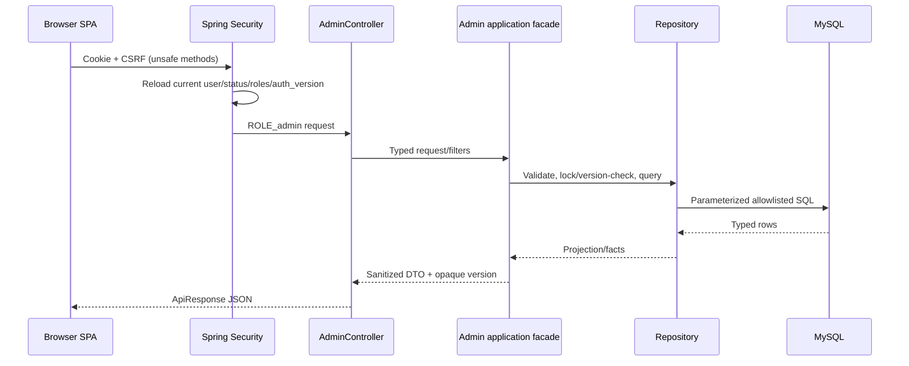

# Admin architecture

## Phạm vi module Admin đang hỗ trợ

- Dashboard;
- sự kiện lịch sử, bao gồm quản lý thumbnail/media;
- người dùng.

Admin không còn cung cấp giao diện duyệt AI candidate. Sinh câu hỏi AI theo chủ đề
tự do vẫn là chức năng Quiz của học sinh; backend candidate/review được giữ lại như
một capability thử nghiệm không được expose trong phạm vi Admin khóa luận.

## Luồng chính

URL authorization là lớp thứ nhất. Các facade API-facing có method security là
`AdminDashboardReadService`, `AdminEventReadService`,
`AdminEventMutationService`, `AdminEventMediaMutationService`,
`AdminEventGeographyMutationService`, `AdminEventPublicationService`,
`AdminUserReadService` và `AdminUserMutationService`. Repository, validator,
canonicalizer và helper thuần không mang annotation authorization.

## Read models và query budget

| Luồng | Budget | Cách tránh N+1 |
| --- | ---: | --- |
| Dashboard aggregate | 4 | Một projection sự kiện dùng completeness chung, user metrics, attention và audit |
| Event list | 3 | Count + page IDs/core + batch facts |
| Event detail | 7 cố định | Các section được batch/fixed-query, không query theo từng row |
| User list | tối đa 3 | Count + page + batch roles |
| User detail | 4 cố định | Account/roles, learning summary, recent activity, audit |

`EventCompletenessFacts` do repository tạo và `EventCompletenessService` ánh xạ
thành issue code dùng chung cho list, detail và Dashboard. Không có completeness
logic riêng cho Dashboard.

## Mutation và transaction

Event mutation theo section: core/grades, media metadata/thumbnail/order,
geography typed payload, và publication/archive/restore. User mutation chỉ thay
tập role được hỗ trợ và status `active|pending|disabled`. Mỗi mutation:

1. authorize;
2. lock/đọc resource và kiểm tra invariant;
3. so sánh exact `updatedAt` opaque;
4. validate/canonicalize payload typed;
5. phát hiện no-op;
6. ghi resource và version trong transaction;
7. ghi bounded audit metadata;
8. reload typed detail;
9. commit.

Exception validation/audit là runtime exception nên rollback cả resource, version
và audit. Stale version trả conflict và không ghi dữ liệu. `users.auth_version`
tăng khi role/status làm credential hiện tại mất hiệu lực; filter luôn đối chiếu
trạng thái, roles và auth version hiện tại từ MySQL.

## Audit và privacy

Audit actions hiện tại:

- `event.draft_created`, `event.core_updated`, `event.grades_replaced`;
- `event.media_added`, `event.media_updated`, `event.media_removed`,
  `event.media_reordered`, `event.thumbnail_selected`;
- `event.geography_updated`, `event.published`, `event.unpublished`,
  `event.archived`, `event.restored`;
- `user.roles_replaced`, `user.status_updated`.

`AdminAuditMetadataPolicy` chỉ nhận JSON object tối đa 2,048 UTF-8 bytes, array
tối đa 64 phần tử và text tối đa 512 ký tự. Policy từ chối recursive sensitive
keys/values, email-like text và `local:`; không truncate. Media reorder lưu count,
moved count và digest thay vì ID list hoặc URL.

## UML cần cho khóa luận

Các participant tối thiểu nên xuất hiện trong sequence diagram khóa luận:
Browser, CSRF bootstrap, `JwtAuthenticationFilter`, URL authorization,
`AdminController`, facade tương ứng, repository, MySQL transaction và audit.
Nên có ba flow riêng: read model, optimistic mutation thành công, và stale/rollback.
