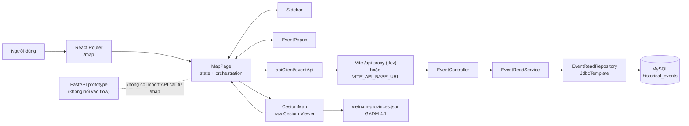
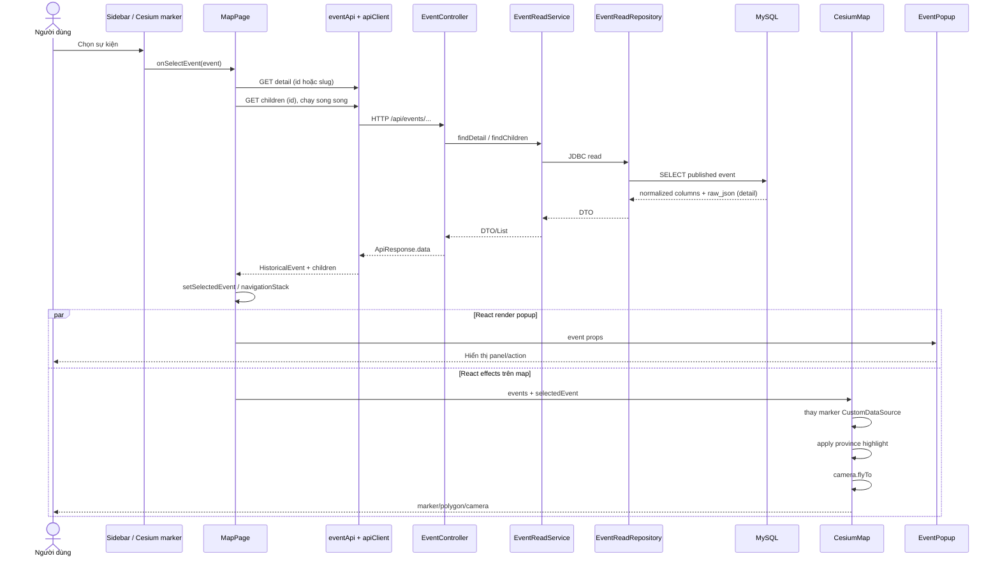

# Kiến trúc runtime hiện tại

## Tổng quan

Route `/map` là một React page local-state orchestration:

- `MapPage` giữ `selectedEvent`, danh sách theo năm/tìm kiếm, navigation stack, loading và hover highlight (`frontend/src/pages/MapPage.tsx:212-235`).
- `Sidebar`, `CesiumMap`, `Timeline` và `EventPopup` nhận state/callback qua props (`frontend/src/pages/MapPage.tsx:623-694`).
- Event data chính đến từ Spring Boot API qua `eventApi.ts`; lỗi list/search hiện bị đổi thành mảng rỗng và chỉ log warning (`frontend/src/services/eventApi.ts:431-466`).
- `CesiumMap` dùng raw Cesium Entity/DataSource API, không dùng Resium (`frontend/src/components/CesiumMap.tsx:3-25`, `frontend/src/components/CesiumMap.tsx:219-315`).
- Ranh giới tỉnh được tải tĩnh từ `/geojson/vietnam-provinces.json` (`frontend/src/components/CesiumMap.tsx:168-186`).
- Backend dùng controller/service/JDBC projection/MySQL, không dùng JPA entity cho event read path (`backend/src/main/java/com/lichsuvn/backend/event/infrastructure/EventReadRepository.java:30-54`).

## Sơ đồ kiến trúc

Bằng chứng: route tại `frontend/src/App.tsx:69-76`; component composition tại `frontend/src/pages/MapPage.tsx:623-694`; base URL/proxy tại `frontend/src/services/apiClient.ts:9-16` và `frontend/vite.config.ts:24-35`; backend chain tại `backend/src/main/java/com/lichsuvn/backend/event/api/EventController.java:17-82`, `backend/src/main/java/com/lichsuvn/backend/event/application/EventReadService.java:39-92`.

## Routing và event identifier

| Luồng | Contract hiện tại | Bằng chứng |
|---|---|---|
| Mở map | `/map` | `frontend/src/App.tsx:69-76` |
| Deep link event trên map | `/map?event=<id-or-slug>` | `frontend/src/pages/MapPage.tsx:232-235`, `frontend/src/components/event-detail/EventLocationCard.tsx:15-18` |
| Detail page | `/events/:slug` | `frontend/src/App.tsx:73-76` |
| Detail API | `/api/events/{idOrSlug}` | `frontend/src/services/eventApi.ts:479-495`, `backend/src/main/java/com/lichsuvn/backend/event/api/EventController.java:69-72` |
| Children API | `/api/events/{eventId}/children` | `frontend/src/services/eventApi.ts:458-466`, `backend/src/main/java/com/lichsuvn/backend/event/api/EventController.java:74-77` |

Backend detail query so khớp cả `e.id` lẫn `e.slug` (`backend/src/main/java/com/lichsuvn/backend/event/infrastructure/EventReadRepository.java:147-168`). Children endpoint chỉ nhận ID của event cha.

## State management hiện tại

Không có global store cho map. `MapPage` giữ state cục bộ và truyền xuống:

| State | Nơi giữ | Dùng bởi |
|---|---|---|
| `selectedEvent` | `MapPage` | Sidebar selection, popup, Cesium camera/highlight |
| `highlightedEventId` | `MapPage` | Hover sidebar → kích thước marker |
| `navigationStack` | `MapPage` | Drill-down cha/con |
| `yearEvents`, `searchResults`, `childrenByParentId` | `MapPage` | Sidebar/map tree |
| `eventsLoading`, `searchLoading` | `MapPage` | UI tải list/search |
| Viewer/entities/handlers/datasources | refs trong `CesiumMap` | Cesium lifecycle |

Bằng chứng: `frontend/src/pages/MapPage.tsx:212-235`, `frontend/src/pages/MapPage.tsx:296-328`, `frontend/src/components/CesiumMap.tsx:52-62`.

`HeaderContext` chỉ nhận breadcrumb/header content; không phải store event (`frontend/src/pages/MapPage.tsx:230-231`, `frontend/src/pages/MapPage.tsx:515-621`).

## Sequence từ chọn event đến Cesium render

`Promise.all` detail + children nằm tại `frontend/src/pages/MapPage.tsx:331-346`. Sau khi merge, `selectedEvent` được cập nhật tại `frontend/src/pages/MapPage.tsx:355-374`. Popup và map cùng nhận một object state tại `frontend/src/pages/MapPage.tsx:652-657`, `frontend/src/pages/MapPage.tsx:685-693`.

## Luồng dữ liệu event

1. Load theo năm: `GET /api/events?year=...&grade=...&limit=1000` (`frontend/src/services/eventApi.ts:431-441`).
2. Backend list chỉ lấy cột summary, `lat/lng`, `province_names`; không select `raw_json` (`backend/src/main/java/com/lichsuvn/backend/event/infrastructure/EventReadRepository.java:73-101`).
3. Khi chọn, detail endpoint lấy thêm `raw_json` và trả dưới tên `sourceJson` (`backend/src/main/java/com/lichsuvn/backend/event/api/dto/EventDetailDto.java:6-44`, `backend/src/main/java/com/lichsuvn/backend/event/infrastructure/EventReadRepository.java:147-170`).
4. Frontend hiện bỏ `sourceJson` khi đổi detail DTO thành `HistoricalEvent`: mapper chỉ giữ `geoType`, một cặp `lat/lng` và `provinceNames` (`frontend/src/services/eventApi.ts:176-204`).
5. Vì vậy arrays `markers`, `gadmRefs` và `focusGeometry` trong JSON nguồn chưa đến `CesiumMap`.

## Đồng bộ/bất đồng bộ và race hiện có

- Fetch list/search/detail/children là bất đồng bộ và có cờ `cancelled` ở các effect (`frontend/src/pages/MapPage.tsx:238-294`, `frontend/src/pages/MapPage.tsx:379-421`).
- Chọn event qua click không có request-version/AbortController. Hai lần chọn nhanh có thể hoàn tất đảo thứ tự và request cũ ghi đè `selectedEvent` mới (`frontend/src/pages/MapPage.tsx:331-377`).
- Province GeoJSON tải bất đồng bộ. Code re-apply highlight khi load xong, nhưng không gọi lại camera bounds; camera effect có thể chạy trước data source rồi fallback (`frontend/src/components/CesiumMap.tsx:168-186`, `frontend/src/components/CesiumMap.tsx:387-417`, `frontend/src/components/CesiumMap.tsx:421-502`).
- Marker datasource được thay toàn bộ khi `events`/hover thay đổi (`frontend/src/components/CesiumMap.tsx:219-315`).

Các race/lifecycle chi tiết và tác động tới terrain mode được phân tích ở `03_MAP_AND_CESIUM_CURRENT_FLOW.md`.
