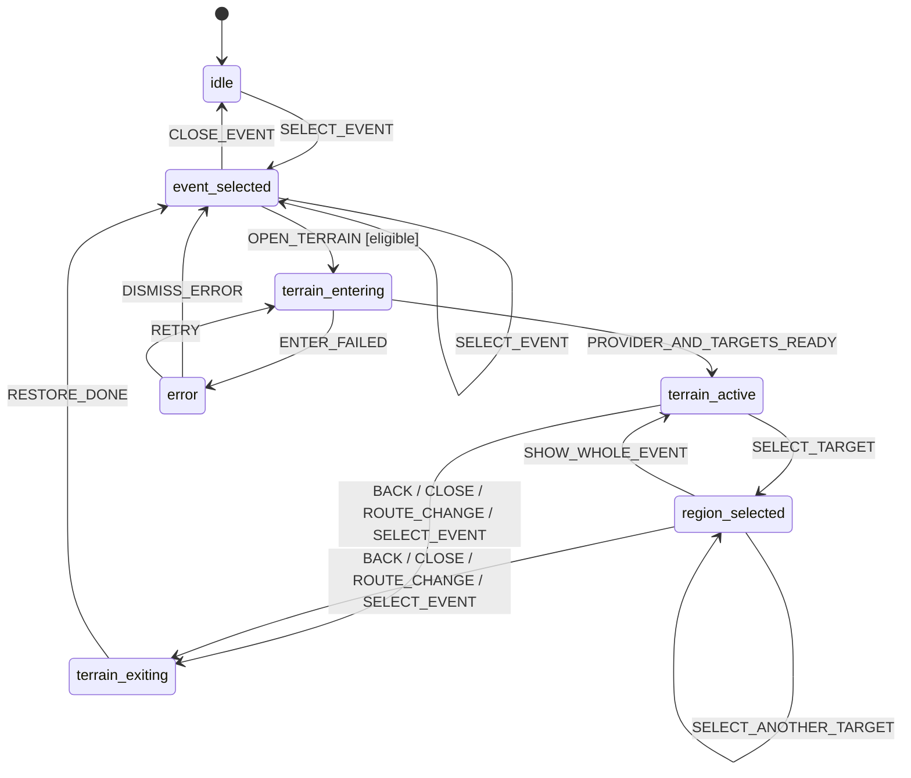

# Kế hoạch triển khai

## Nguyên tắc

1. Chỉ sửa frontend thực tế `frontend/`; không chuyển code sang `MVP_KLTN/` (`frontend/src/App.tsx:69-76`, `MVP_KLTN/src/App.tsx:62-68`).
2. Giữ Cesium imperative pattern hiện tại; không chuyển toàn bộ sang Resium chỉ vì dependency tồn tại (`frontend/src/components/CesiumMap.tsx:3-25`, `frontend/package.json:19-27`).
3. Không thêm package. Cesium/Vitest/TypeScript đã đủ (`frontend/package.json:6-43`).
4. Bảo toàn sáu loại canonical: `point`, `multi_point`, `multi_polygon`, `mixed`, `nationwide`, `no_location`. Không dùng `single_point`/`multi_region` làm contract mới.
5. Không sửa hoặc phụ thuộc vào luồng image review/mapping.
6. Không tạo store/context mới: `MapPage` đã là owner chung của popup/map/sidebar (`frontend/src/pages/MapPage.tsx:212-235`, `frontend/src/pages/MapPage.tsx:623-694`).
7. Geometry event lấy từ detail `sourceJson.mapData`; polygon được resolve qua `gadmRefs`/GADM. Detail API đã trả `sourceJson` nhưng mapper map hiện bỏ nó (`backend/src/main/java/com/lichsuvn/backend/event/api/dto/EventDetailDto.java:6-44`, `frontend/src/services/eventApi.ts:176-204`).

## Hợp đồng target tối thiểu

Một helper thuần, nhỏ và testable nên đổi `sourceJson.mapData` thành:

```ts
type ActualGeoType =
  | 'point'
  | 'multi_point'
  | 'multi_polygon'
  | 'mixed'
  | 'nationwide'
  | 'no_location';

type TerrainTarget =
  | {
      id: string;
      kind: 'point';
      label: string;
      position: { lat: number; lng: number };
      confidence?: string;
    }
  | {
      id: string;
      kind: 'region';
      label: string;
      gadmRef: string;
      provinceName?: string;
    };
```

ID phải deterministic và scoped theo event, ví dụ `<eventId>:point:<index>` hoặc `<eventId>:region:<GID_1>`. Không dùng index đơn lẻ làm identity giữa các event. Source shape được chứng minh tại `crawData/stage4b_curate_tree/output/phase2/core_events.jsonl:10-11`, `crawData/stage4b_curate_tree/output/phase2/core_events.jsonl:51`, `crawData/stage4b_curate_tree/output/phase2/core_events.jsonl:229`.

Quy tắc:

| `geo_type` | Target |
|---|---|
| `point` | một marker hợp lệ |
| `multi_point` | từng phần tử `markers[]`; không giả định coordinates khác nhau |
| `multi_polygon` | zip `gadmRefs[]` với `provinceNames[]`; lookup ưu tiên `GID_1` |
| `mixed` | union có kiểu rõ ràng của point targets và region targets |
| `nationwide` | `[]`, không eligible |
| `no_location` | `[]`, không eligible |

Nếu array lệch độ dài, geometry rỗng hoặc coordinate không finite/out of range: bỏ target lỗi, ghi diagnostic an toàn và chỉ eligible khi còn ít nhất một target.

## State machine tối thiểu



`region_selected` là tên trạng thái theo yêu cầu sản phẩm nhưng target có thể là point hoặc region; code có thể đặt tên trung tính `target-selected`.

### State và vị trí

| State | Vị trí đề xuất | Lý do |
|---|---|---|
| `selectedEvent` | giữ tại `MapPage` | Hiện đã là nguồn chung |
| `terrainMode` | `MapPage` | Popup và map đều cần |
| `selectedTerrainRegion`/`selectedTargetId` | `MapPage` | Popup list và Cesium highlight đồng bộ |
| `availableTerrainTargets` | `useMemo`/state tại `MapPage` | Dẫn xuất từ selected detail; UI cần đọc |
| `terrainLoading`, `terrainError` | `MapPage` | Render accessible status/error |
| `highlightedGeometry` | logical ID tại `MapPage`; Cesium Entity refs tại `CesiumMap` | Không đưa Cesium object vào React state |
| `previousCameraView` | `useRef` trong `CesiumMap` | Cần Viewer trực tiếp, không cần render |
| Viewer/DataSource/Handler/session token | refs trong `CesiumMap` | Resource lifecycle, không phải UI state |

Không cần Context/store/hook lớn. Chỉ tách một pure helper `terrainTargets.ts`; camera helpers có thể ở ngay `CesiumMap.tsx` hoặc một file nhỏ nếu test thuần.

## Camera snapshot và restore

Kiểu dữ liệu đề xuất:

```ts
type Vec3Tuple = readonly [number, number, number];
type Matrix4Tuple = readonly [
  number, number, number, number,
  number, number, number, number,
  number, number, number, number,
  number, number, number, number
];

interface CameraSnapshot {
  positionWC: Vec3Tuple;
  directionWC: Vec3Tuple;
  upWC: Vec3Tuple;
  heading: number;
  pitch: number;
  roll: number;
  transform?: Matrix4Tuple;
}
```

- Lưu `positionWC`, `directionWC`, `upWC` để phục hồi orientation chính xác; vẫn lưu heading/pitch/roll theo yêu cầu và làm fallback/diagnostic.
- Camera hiện không dùng tracked entity/reference frame, nên transform dự kiến identity (`frontend/src/components/CesiumMap.tsx:130-135`, `frontend/src/components/CesiumMap.tsx:421-502`). Dù vậy, lưu transform khi non-identity giúp contract an toàn trong tương lai.
- Chụp **một lần** khi transition `event_selected → terrain_entering`, sau khi Viewer ready và trước fly-to đầu tiên.
- Dùng `snapshotRef.current ??= captureCamera()`; chọn target thứ hai không được ghi đè.
- Người dùng được tự xoay/zoom trong terrain mode; snapshot gốc không thay đổi.
- Restore bằng snapshot world position + direction/up; nếu dùng animation, Promise phải resolve từ `complete`/`cancel` callback. Route/unmount cần fallback `setView` đồng bộ trước cleanup.
- Chỉ clear snapshot sau restore thành công hoặc sau khi xác định camera chưa từng di chuyển.

### Trigger bắt buộc

| Trigger | Hành vi |
|---|---|
| “Quay lại góc nhìn” | restore → clear target/highlight → `event_selected` |
| Đóng popup khi terrain active | restore trước khi set event `null` |
| Chọn event khác | restore session cũ; sau đó mới commit event mới |
| Đổi year/grade | restore rồi xóa selection |
| Route change | cancel async work, restore nếu Viewer còn sống |
| Unmount | restore đồng bộ nếu cần, destroy/remove terrain resources/listeners |
| Provider/target error sau khi camera đã bay | rollback snapshot rồi vào `error` |

## Hành vi nhiều target

1. Khi enter, hiển thị tất cả target của event; target đang chọn nổi bật, target còn lại giảm alpha.
2. `mixed` hiển thị type badge “Điểm”/“Vùng”; không ép thành một geometry.
3. Click point entity dùng metadata `kind='terrain-target'`, `eventId`, `targetId`.
4. Click polygon GADM lấy `GID_1`, tra map `gadmRef → targetId`; không tạo handler thứ hai.
5. Handler hiện tại phải phân biệt `event-marker`, `terrain-target`, cluster và basemap; hiện chỉ kiểm tra ad-hoc `eventData` (`frontend/src/components/CesiumMap.tsx:137-160`, `frontend/src/components/CesiumMap.tsx:300-301`).
6. Chọn target giữ terrain mode, fly tới target, cập nhật tên trong popup.
7. Nên có action “Toàn bộ phạm vi sự kiện” để quay lại overview của event mà **không** thoát terrain; action “Quay lại góc nhìn” mới restore snapshot và exit.
8. Cleanup chỉ remove datasource/metadata/highlight của session hiện tại; không phá province datasource nền.

## Camera theo geometry

- Point: fly đến coordinate; góc pitch nghiêng để thấy relief, không dùng pitch `-90°` như hiện tại (`frontend/src/components/CesiumMap.tsx:471-480`).
- Region/MultiPolygon: lấy feature theo `GID_1`, gom mọi outer-ring positions; Cesium `GeoJsonDataSource` chịu trách nhiệm parse multipolygon/hole. Dùng bounding sphere/rectangle và derive height từ extent thay vì một altitude cố định.
- Mixed/event overview: union point positions và region positions, tính bounds chung; nếu chưa có province datasource thì chờ trong `terrain_entering`, không fallback âm thầm.
- Height nên là hàm của radius/extent với min/max có tên và test được; không tiếp tục phân nhánh 30/500/800/1.500 km theo tên geo cũ (`frontend/src/components/CesiumMap.tsx:461-469`).
- `focusGeometry.center/zoom` dùng làm fallback có kiểm soát, không thay geometry target.

## Kế hoạch 14 phase

| Phase | Mục tiêu và logic | Tệp/function | Tái sử dụng | Dependency | Rủi ro | Tiêu chí hoàn thành | Kiểm thử |
|---:|---|---|---|---|---|---|---|
| 1 | Chuẩn hóa eligibility theo sáu type; giữ `sourceJson.mapData` khi map detail | `types/event.ts`; `services/eventApi.ts` mapper; tùy chọn backend service/importer | `EventDetailDto.sourceJson` hiện có | Không | Type drift giữa list/detail | Không còn quyết định terrain bằng `single_point/multi_region`; nationwide/no_location false | Unit matrix 6 type; typecheck |
| 2 | Chuẩn hóa `TerrainTarget[]`; validate/dedupe marker và GADM ref | mới `utils/terrainTargets.ts`, test tương ứng; có thể mở rộng `eventRegistry.ts` raw type | Source JSON shape + GADM IDs | 1 | Array lệch, duplicate coordinates | Pure function deterministic; invalid input không throw UI | Vitest mẫu 6 type + invalid/empty |
| 3 | Tạo camera snapshot/restore idempotent; không overwrite khi đổi target | `CesiumMap.tsx`: capture/restore helpers + snapshot ref | Viewer ref, camera API hiện có | Viewer ready | Transform/orientation, animation cancel | Restore position/orientation trong tolerance | Unit helper + manual camera round-trip |
| 4 | Thêm terrain mode state machine/session ID; serialize close/select/route transitions | `MapPage.tsx`; props `CesiumMap`/`EventPopup` | Existing local state/callback props | 1-3 | Batched update và stale async | Mọi exit path đi qua một transition; stale session không commit | Reducer/transition table test; rapid-click manual |
| 5 | Thay placeholder bằng CTA có eligibility/loading/error/accessibility | `EventPopup.tsx` action footer | Placeholder tại lines 380-394, message nationwide/no_location | 1,2,4 | Button sai type, focus | CTA chỉ có cho eligible; keyboard/aria đầy đủ | Component/manual matrix |
| 6 | Fly-to point với pitch terrain và height theo config/ground | `CesiumMap.tsx` terrain effect | `camera.flyTo`, finite-coordinate guard | 3,4 + provider ready | Underground/too close | Point target dễ quan sát, cancel an toàn | Unit bounds/height + manual point |
| 7 | Fly-to polygon/multipolygon theo GADM ID và full bounds | `CesiumMap.tsx` province index/bounds | Existing `GeoJsonDataSource`, Rectangle logic | 2-4 | GeoJSON async, islands/holes | Mọi region valid có bounds; không match bằng tên trước ID | MultiPolygon/hole fixtures + manual |
| 8 | Chọn từng target bằng list và click map; giữ session | `EventPopup.tsx`, `MapPage.tsx`, `CesiumMap.tsx` handler metadata | Existing single LEFT_CLICK handler | 4,6,7 | Duplicate handler, event/basemap collision | List/click đồng bộ selected target; không overwrite snapshot | Switch targets, handler-count instrumentation |
| 9 | Highlight all targets + selected target; reset sạch | `CesiumMap.tsx` material/entity styling | Existing marker color/polygon material | 7,8 | Mutate shared GADM material | Selected rõ; exit/event change khôi phục default | Visual/manual + entity count |
| 10 | Nút “Quay lại góc nhìn”; action “Toàn bộ phạm vi” tách nghĩa | `EventPopup.tsx`, `MapPage.tsx`, `CesiumMap.tsx` | Existing action footer/back styling | 3,4,8 | Nhầm với “Quay lại cha” | Restore đúng snapshot; target overview không exit | Given/When/Then camera |
| 11 | Cleanup và lifecycle: provider/GeoJSON promise, datasource, listener, animation, unmount | `CesiumMap.tsx`, `MapPage.tsx` cleanup | Existing refs/remove/destroy | 4-10 | Viewer module-level/StrictMode | Không duplicate handler/entity; no stale update | StrictMode remount, route loop, heap/resource observation |
| 12 | Loading/error UX: provider, target, camera, geometry; rollback | `MapPage.tsx`, `EventPopup.tsx`, `CesiumMap.tsx` | Existing soft map error styling | 4-11 | API currently swallows errors | `role=status`/`alert`; retry/disable rõ; ellipsoid không được báo là terrain | Forced API/provider/GeoJSON errors |
| 13 | Test regression và acceptance matrix | existing/new `*.test.ts`; backend tests nếu sửa backend | Vitest, Maven test stack | 1-12 | Cesium/WebGL khó test headless | Pure logic covered; manual/integration checklist pass | `npm test`, typecheck/lint; selected Maven tests |
| 14 | Documentation/env/runbook; báo cáo limitations | `.env.example`, terrain docs/user docs nếu được duyệt | Vite env convention | 12,13 | Ghi nhầm secret | Chỉ tên env; không token; commands/results recorded | Secret scan + doc review |

## File-by-file

| File | Thay đổi dự kiến | Lý do | Mức độ rủi ro |
|---|---|---|---|
| `frontend/src/types/event.ts` | Dùng sáu `ActualGeoType`; thêm raw map/terrain target shapes hoặc import type nhỏ | Contract hiện chỉ có bốn tên cũ (`frontend/src/types/event.ts:53-96`) | Cao |
| `frontend/src/services/eventApi.ts` | Giữ/parse `sourceJson.mapData` trong selected event; trả lỗi phân biệt được | Mapper hiện bỏ geometry (`frontend/src/services/eventApi.ts:176-204`) | Cao |
| `frontend/src/utils/terrainTargets.ts` (mới) | Pure normalization/validation/dedupe/eligibility | Cô lập logic sáu type để test, không phải abstraction lớn | Trung bình |
| `frontend/src/utils/terrainTargets.test.ts` (mới) | Matrix sáu type + invalid input | Chặn regression contract | Thấp |
| `frontend/src/pages/MapPage.tsx` | State machine, session sequencing, close/select/year/route transition, target state | Owner state hiện tại (`frontend/src/pages/MapPage.tsx:212-235`) | Cao |
| `frontend/src/components/EventPopup.tsx` | CTA, target list, whole-event/back, loading/error, keyboard/ARIA/mobile | Placeholder hiện tại (`frontend/src/components/EventPopup.tsx:346-395`) | Trung bình |
| `frontend/src/components/CesiumMap.tsx` | World terrain bootstrap, readiness, snapshot/restore, target render/pick/fly/highlight/cleanup | Toàn bộ Cesium lifecycle nằm đây | Rất cao |
| `frontend/src/lib/cesium.ts` | Bỏ hard-coded token; factory/provider lấy env; constants camera/target | Token/provider helper hiện không thống nhất với Viewer (`frontend/src/lib/cesium.ts:12-22`) | Cao |
| `frontend/.env.example` | Thêm **tên** `VITE_CESIUM_ION_TOKEN`, không giá trị | Chưa có Cesium env (`frontend/.env.example:1-9`) | Thấp |
| `frontend/src/index.css` | Chỉ nếu cần breakpoint/focus-visible/status layout terrain | Fixed panel widths hiện gây mobile gap | Trung bình |
| `frontend/src/data/eventAdapter.ts` | Bỏ collapse sáu type nếu local registry vẫn là fallback | Hiện gộp type tại `frontend/src/data/eventAdapter.ts:10-28` | Trung bình |
| `frontend/src/data/eventRegistry.ts` | Cập nhật raw mapData typing cho `markers/gadmRefs/focusGeometry` nếu thiếu | Registry là secondary source | Thấp |
| `backend/.../EventReadService.java` | Khuyến nghị: filter chấp nhận sáu type | Hiện allow-list bốn type (`backend/src/main/java/com/lichsuvn/backend/event/application/EventReadService.java:27-30`) | Trung bình |
| `backend/.../EventJsonImportRunner.java` | Khuyến nghị: không collapse actual geo type | Hiện làm mất dữ liệu (`backend/src/main/java/com/lichsuvn/backend/importer/EventJsonImportRunner.java:496-503`) | Cao |
| `backend/.../dto/EventMapDataDto.java` (có thể mới) | Tùy chọn contract typed/lightweight thay `Object sourceJson` | Giảm coupling/overfetch | Trung bình |
| `backend/.../EventReadRepository.java` | Chỉ nếu bổ sung typed location endpoint/DTO | Detail hiện parse full raw JSON | Cao |
| Migration mới | Chỉ khi lưu server-authoritative geometry hoặc loại enum cũ; không sửa migration đã áp dụng | Frontend có thể dùng raw JSON + GADM nên MVP không cần | Rất cao |

## Backend: mức tối thiểu và mức production

- **MVP không đổi schema:** sửa frontend detail mapper để dùng `sourceJson.mapData`; đủ dữ liệu point/multi-point/GADM targets. Đây là đường ít thay đổi nhất.
- **Contract production nên làm cùng hoặc ngay sau:** backend bảo toàn sáu `geo_type`, filter đúng sáu type và trả typed terrain/location payload nhẹ. Không cần trả polygon vertices nếu frontend resolve `gadmRefs`.
- **Migration không mặc định:** chỉ tạo migration mới nếu muốn lưu geometry riêng/loại legacy enum. Remote production đang tắt Flyway (`backend/src/main/resources/application-remote-production.properties:1-3`), nên migration cần quy trình deploy riêng.

## Thứ tự kiểm chứng sau mỗi nhóm phase

1. Phase 1-2: unit test normalization + TypeScript no-emit.
2. Phase 3-4: camera/state tests + manual restore trước khi làm UI.
3. Phase 5-10: targeted tests, lint các file sửa, manual Cesium matrix.
4. Phase 11-12: route/remount/error/rapid-click soak.
5. Phase 13-14: full frontend tests; build theo script đã audit. Lưu ý `npm run build` có `prebuild` sinh data (`frontend/package.json:12-16`), nên phải kiểm tra diff trước/sau và không giữ output ngoài phạm vi.
